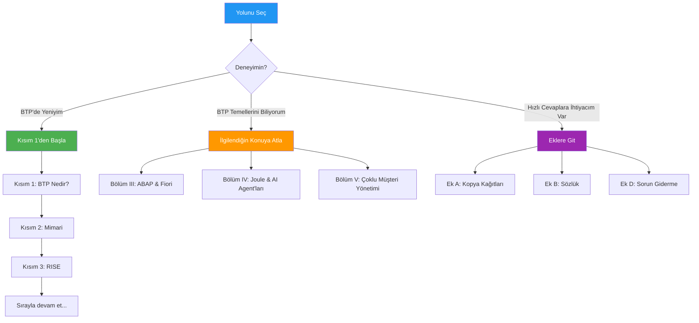
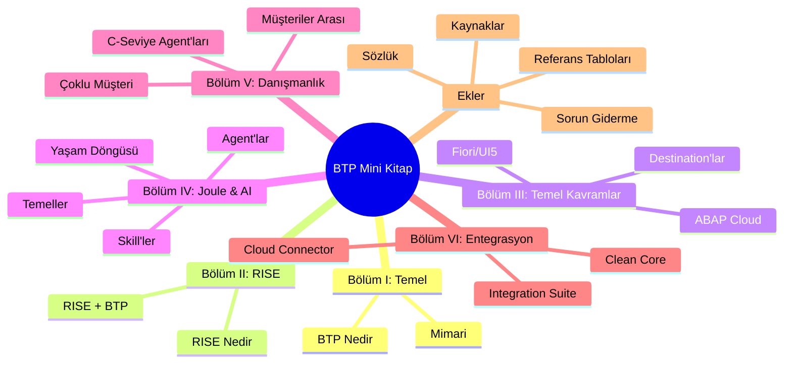

# Önsöz

## Bu Kitap Kimin İçin

Yıllardır ABAP ile çalıştıysanız, SE38 programlarını debug ettiyseniz, user exit'ler ve BADI'ler aracılığıyla SAP sistemlerini genişlettiyseniz veya on-premise launchpad'lere deploy edilen Fiori uygulamaları yaptıysanız—bu kitap sizin için.

Buzzword'leri duydunuz:
- *"RISE'a geçiyoruz"*
- *"BTP üzerinde yap"*
- *"Bunun için Joule kullan"*
- *"Core'u temiz tut"*

Ve muhtemelen şunu düşündünüz: *"Bu gerçekten günlük işim için ne anlama geliyor?"*

Bu mini kitap o soruyu cevaplıyor. Pazarlama sunumları yok. Her şeyi zaten bildiğinizi varsayan 500 sayfalık dokümantasyon yok. Sadece zaten anladıklarınız üzerine inşa edilmiş net açıklamalar.

---

## Feynman Felsefesi

Nobel ödüllü fizikçi Richard Feynman'ın basit bir kuralı vardı:

> *"Bir şeyi basitçe açıklayamıyorsan, yeterince iyi anlamıyorsun demektir."*

İşte buradaki yaklaşım bu. Her kavram sanki birlikte kahve içiyormuşuz gibi açıklanıyor—günlük hayattan benzetmeler kullanarak, zaten bildikleriniz üzerine inşa ederek ve asla jargonun arkasına saklanmadan.

"Destination" dediğimizde, telefonunuzdaki bir kişi kartı gibi olduğunu açıklayacağız.
"Subaccount" dediğimizde, bir binadaki daire gibi olduğunu göstereceğiz.
"Clean Core" dediğimizde, hangi alışkanlıklarınızı değiştirmeniz gerektiği konusunda dürüst olacağız.

---

## Bu Kitabı Nasıl Kullanmalı

### BTP'de Yeniyseniz
Kısım 1'den başlayın. Her kavramı bir öncekinin üzerine inşa ediyoruz, bu yüzden sıra önemli.

### BTP Temellerini Biliyorsanız
İlgilendiğiniz bölüme atlayın:
- **Bölüm III** ABAP ve Fiori detayları için
- **Bölüm IV** Joule ve AI agent'ları için
- **Bölüm V** birden fazla müşteriyle uğraşan bir danışmansanız

### Hızlı Cevaplara Bakıyorsanız
**Ekleri** kontrol edin:
- **Ek A** kopya kağıtları ve karşılaştırma tablolarına sahip
- **Ek B** BTP terimlerini eski tarz SAP'çılar için tercüme ediyor
- **Ek D** yaygın sorunları ve çözümlerini kapsıyor

---

## Kitap Yapısı

---

## Bu Kitap Ne Değildir

- **Sertifikasyon rehberi değil** — Sınav hazırlığına değil, anlamaya odaklanıyoruz
- **Kapsamlı dokümantasyon değil** — Detaylar için SAP Help var
- **Mutlak SAP yeni başlayanlar için değil** — SAP temellerini bildiğinizi varsayıyoruz
- **Statik değil** — Bu gelişen yaşayan bir belge

---

## Zamanlama Hakkında Bir Not

Bu kitap **2026 başı** itibariyle SAP BTP ve Joule'u yansıtıyor. Platform hızla gelişiyor—özellikle Joule Studio ve AI özellikleri. Şüpheniz olduğunda, mevcut yetenekler için en son SAP Help dokümantasyonunu kontrol edin.

Bununla birlikte, buradaki *kavramlar* ve *zihinsel modeller* kalıcı olacak şekilde tasarlandı. Özellikler değişse bile, şeylerin *neden* bu şekilde çalıştığını anlamak adapte olmanıza yardımcı olacak.

---

## Başlayalım

Hazır mısınız? Kahvenizi (ya da çayınızı ☕) alın ve en basit soruyla başlayalım:

**SAP BTP aslında nedir?**

---

*[Sonraki: Kısım 1 – SAP BTP Aslında Nedir?](01-what-is-sap-btp.md)*

*[İçindekilere Dön](../content.md)*

---

**Yazar:** [Beyhan Meyrali](https://www.linkedin.com/in/beyhanmeyrali) — SAP Hikaye Anlatıcısı & Dijital Dönüşüm Savunucusu

*Dünya genelindeki SAP öğrencileri için ❤️ ile oluşturuldu*
