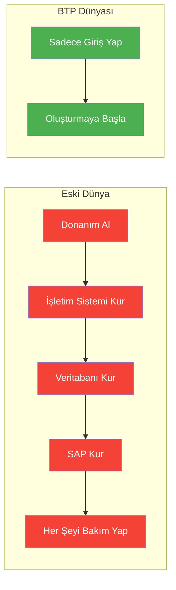
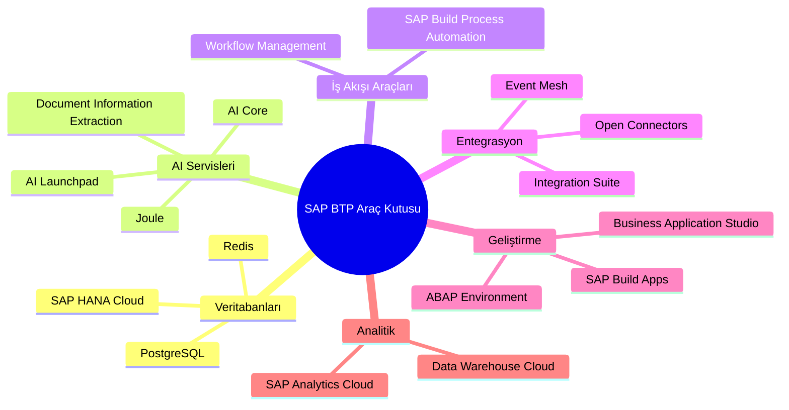
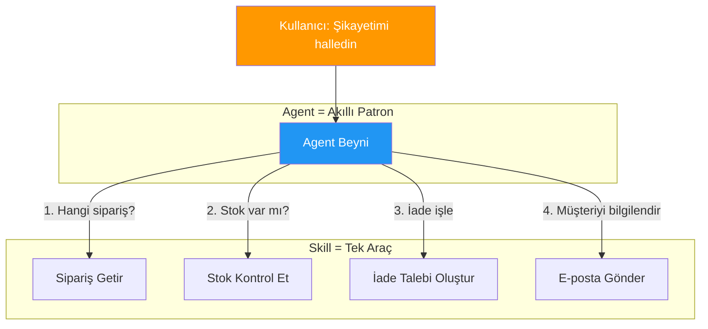
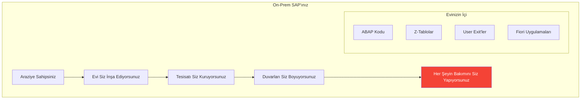
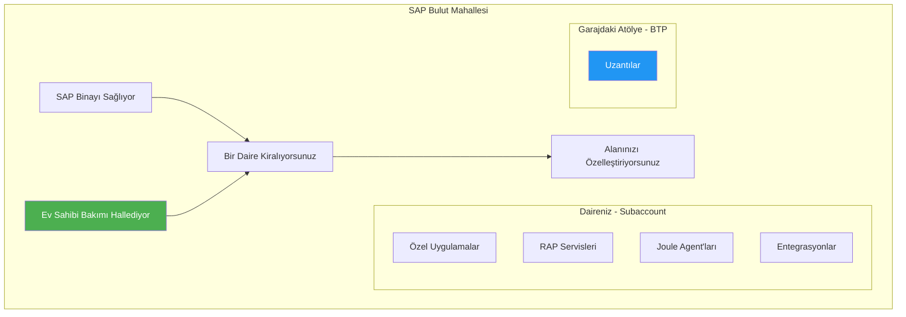
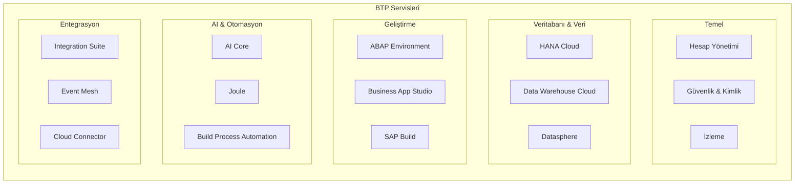

# Kısım 1: SAP BTP Aslında Nedir?

> *Büyük Resim – Süper Basit*

---

## 1.1 Bulut Araç Kutusu Kavramı

SAP BTP'yi şirketlerin 50 sunucu satın almadan modern uygulamalar oluşturabileceği, çalıştırabileceği ve bağlayabileceği **devasa bir bulut araç kutusu** olarak hayal edin.

Eski dünyada SAP'ı genişletmek mi istiyordunuz? Şunlara ihtiyacınız vardı:
- Donanım (sunucular, depolama, ağ)
- İşletim sistemleri
- Veritabanı lisansları
- Her şeyi bakım yapacak bir ekip
- Kurulum için haftalar veya aylar

BTP ile SAP diyor ki: *"İşte kullanıma hazır bir bulut platformu. Sadece giriş yap ve oluşturmaya başla."*

Aradaki fark şuna benziyor:
- **Eski yol**: Arazi almak, mimar tutmak, sıfırdan ev inşa etmek
- **BTP yolu**: İyi yönetilen bir binada tam mobilyalı bir daire kiralamak

*Ne* inşa etmek istediğinize odaklanırsınız, *nasıl* altyapı kuracağınıza değil.

---

## 1.2 İçinde Ne Var: Veritabanları, AI, İş Akışları ve Entegrasyonlar

Bu araç kutusunun içinde şunları bulursunuz:

| Kategori | Ne İçeriyor | Eski Dünya Karşılığı |
|----------|-------------|---------------------|
| **Veritabanları** | SAP HANA Cloud, PostgreSQL | On-prem HANA veya Oracle'ınız |
| **AI Servisleri** | AI Core, AI Launchpad, Joule | Karşılaştırılabilir bir şey yok! |
| **İş Akışı Araçları** | SAP Build Process Automation | S/4'teki Workflow |
| **Entegrasyon** | Integration Suite, Event Mesh | PI/PO, CPI |
| **Geliştirme** | ABAP Environment, BAS | SE80, Eclipse |
| **Analitik** | SAP Analytics Cloud | BW, BOBJ |

Her şeyi kullanmak zorunda değilsiniz. Araç kutusundan araç seçer gibi ihtiyacınız olanı seçin.

---

## 1.3 Joule Nerede Duruyor – SAP'ın AI Asistanı

**Joule** SAP'ın AI asistanı—şirketlere özel bir ChatGPT + Copilot olarak düşünün:

- SAP uygulamalarının içinde yaşar (S/4HANA, SuccessFactors, Ariba, vb.)
- SAP verilerini ve süreçlerini anlar
- Özel **skill'ler** ve **agent'lar** ile genişletilebilir

### Skill'ler vs. Agent'lar: Hızlı Önizleme

| Kavram | Nedir | Örnek |
|--------|-------|-------|
| **Skill** | Tek bir süper güç | "Satış siparişi durumuna bak" |
| **Agent** | Hangi skill'leri kullanacağına karar veren akıllı patron | "Müşteri şikayetimi çöz" → birden fazla skill kullanır |

Bir agent şunları yapabilir:
1. Siparişe bak (Skill A)
2. Stok kontrol et (Skill B)
3. İade talebi oluştur (Skill C)
4. Özür e-postası gönder (Skill D)

Önce skill'leri oluşturursunuz, sonra bir agent'a verirsiniz ki akıl yürütebilsin ve zincirleyebilsin.

*Bölüm IV'te Joule'a derinlemesine dalacağız.*

---

## 1.4 Eski Ev vs. Yeni Mahalle

İşte ABAP geliştiricilerinin zihniyet değişimini anlamasına yardımcı olan bir benzetme:

### Eski Ev: Klasik On-Prem SAP

- Siz (veya müşteri) **araziye sahipsiniz**
- **Evi siz inşa ediyorsunuz** (donanım)
- **Tesisat/elektrik kuruyorsunuz** (altyapı)
- **Duvarları boyuyorsunuz** (destek paketleri uyguluyorsunuz)
- **Her şeyin bakımını yapıyorsunuz** (basis ekibi yükseltmeleri, yedeklemeleri, izlemeyi çalıştırır)
- ABAP kodunuz **ev duvarlarının içinde yaşıyor** (modifikasyonlar, user exit'ler)
- Fiori uygulamaları sonradan eklenen **şık pencereler** gibi

**Sorunlar**: Yavaş yükseltmeler, donanım maliyetleri, bakım için kesinti süreleri.

### Yeni Mahalle: BTP Bulut

- SAP **tamamen inşa edilmiş binayı** sağlıyor
- Bir **daire kiralıyorsunuz** (subaccount)
- Bakım **ev sahibi tarafından hallediliyor** (SAP altyapıyı yönetiyor)
- **Dairenizi özelleştirebilirsiniz** (uygulamalar, uzantılar oluşturun)
- Ama **taşıyıcı duvarları yıkamazsınız** (Clean Core konsepti)
- **Garaja bir atölye ekliyorsunuz** (core'u değiştirmek yerine uzantılar için BTP)

**Faydalar**: Daha hızlı inovasyon, altyapı endişesi yok, zorunlu en iyi uygulamalar.

---

## 1.5 BTP Servis Kategorileri

---

## Temel Çıkarımlar

1. **BTP bir bulut platformu** — Tek bir ürün değil, bir araç kutusu
2. **Altyapı işini değiştiriyor** — Sunucu bakımı değil, inşa etmeye odaklanıyorsunuz
3. **Joule AI katmanı** — Akıllı otomasyon için Skill'ler + Agent'lar
4. **Zihniyet değişimi gerekli** — Her şeye sahip olmaktan kiralama ve genişletmeye

---

## Sırada Ne Var?

Artık BTP'nin *ne* olduğunu biliyorsunuz, *nasıl organize edildiğine* bakalım. Bir sonraki kısımda, apartman binası benzetmesini kullanarak BTP mimarisini keşfedeceğiz.

---

*[Önceki: Önsöz](00-preface.md) | [Sonraki: Kısım 2 – BTP Mimarisi](02-btp-architecture.md)*

*[İçindekilere Dön](../content.md)*

---

**Yazar:** [Beyhan Meyrali](https://www.linkedin.com/in/beyhanmeyrali) — SAP Hikaye Anlatıcısı & Dijital Dönüşüm Savunucusu

*Dünya genelindeki SAP öğrencileri için ❤️ ile oluşturuldu*
