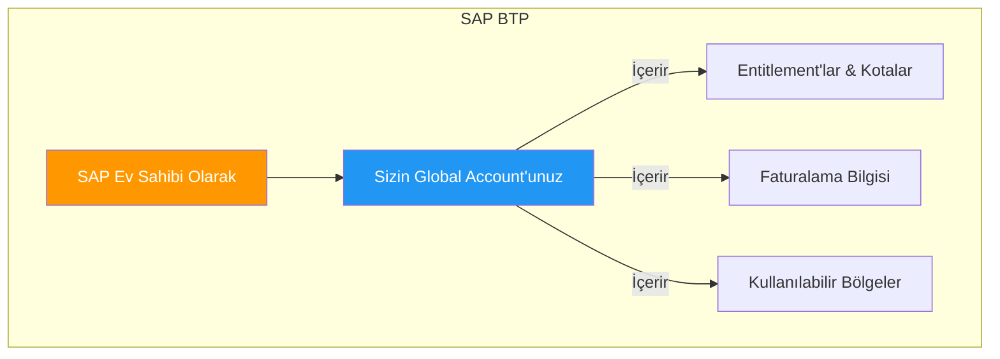
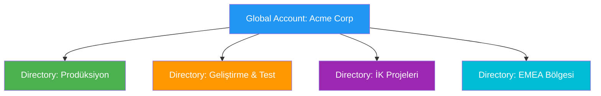
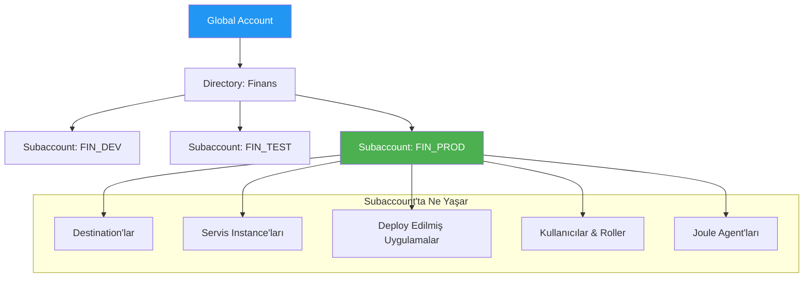
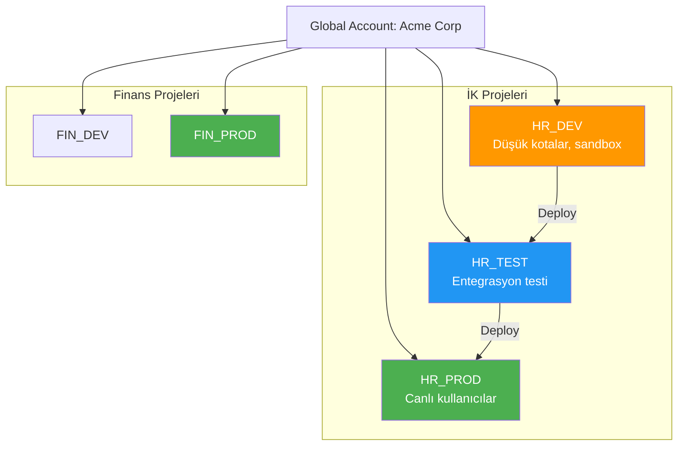
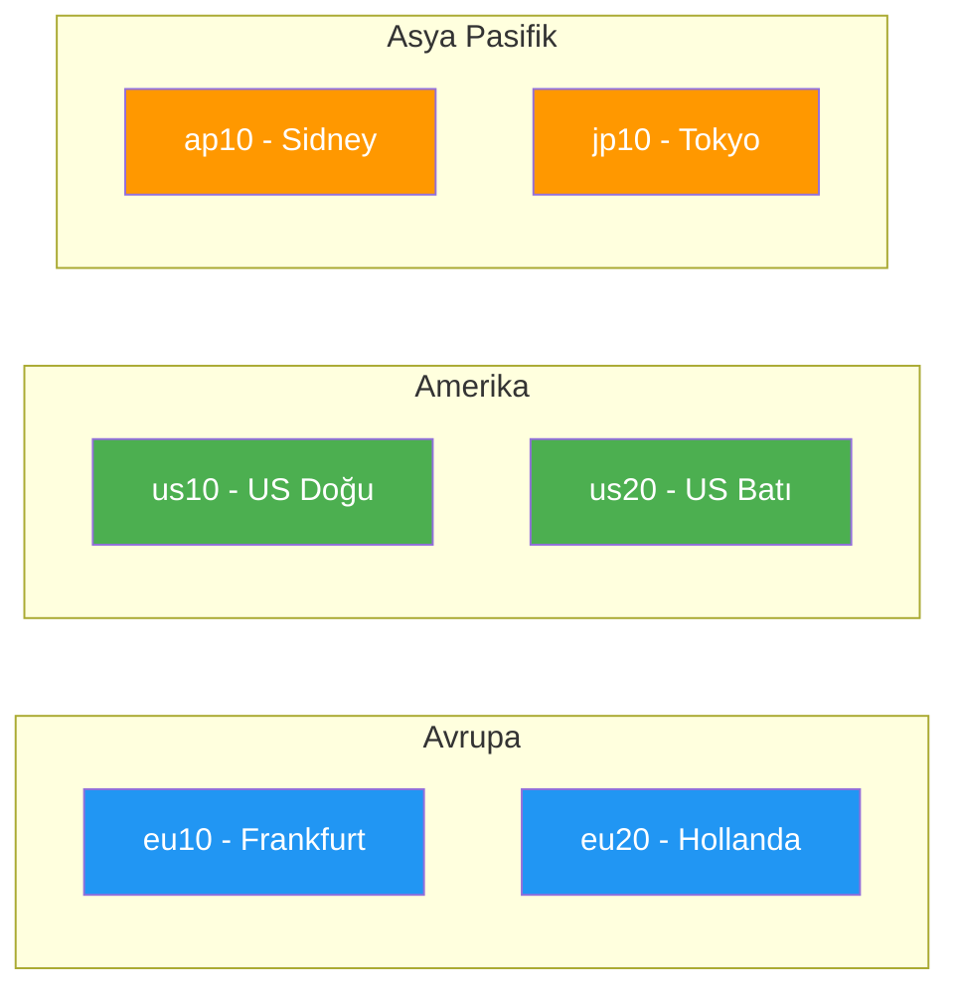
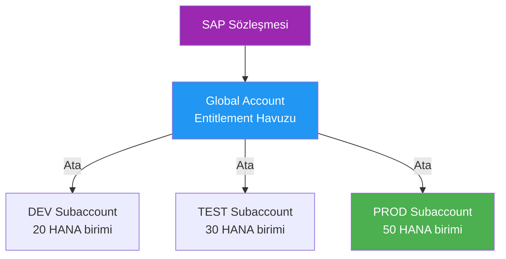
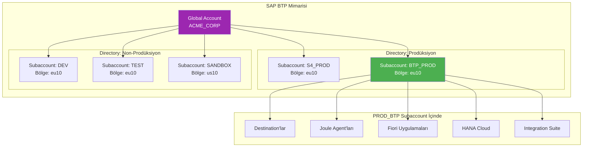
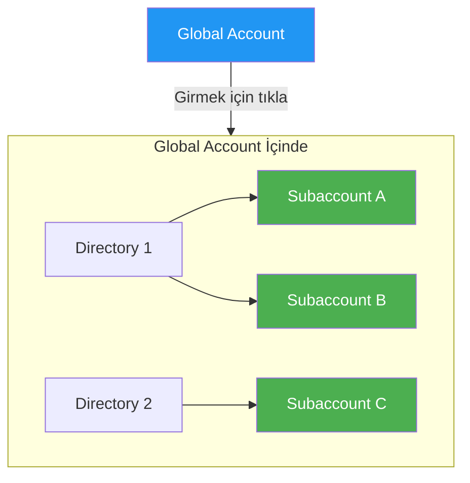

# Kısım 2: BTP Mimarisi

> *Yeni Apartman Binanız*

---

SAP BTP'nin SAP'a ait **devasa bir apartman binası** olduğunu hayal edin. Siz (veya şirketiniz) içinde alan kiralıyorsunuz. Her seviyeyi keşfedelim.

---

## 2.1 Global Account – SAP ile Kira Sözleşmeniz

SAP BTP'ye kaydolduğunuzda (deneme veya ücretli), SAP size bir **Global Account** verir.



Bu temelde **binanın kira sözleşmesindeki adınız**. Şunları bilir:

- ✅ Ne kadar kullanmanıza izin verildiği (kotalar, entitlement'lar)
- ✅ Nasıl faturalandırıldığınız
- ✅ Hangi bölgeleri (veri merkezleri) kullanabileceğiniz

Normalde **şirket başına tek bir global account** olur (çok büyük organizasyonlar veya ayrı sözleşmeler için bazen daha fazla).

> **Düşünün**: *"Bu, Acme Corp'un SAP ile resmi sözleşme dosyası."*

### BTP Cockpit'te

Giriş yaptığınızda, Global Account'unuzu en üst seviyede görürsünüz. Diğer her şey onun içinde yuvalanmıştır.

**URL Kalıbı:** `https://cockpit.btp.cloud.sap/cockpit/?idp=...`

---

## 2.2 Directory'ler – Katları Düzenleme (Opsiyonel)

Şeyleri mantıksal olarak düzenlemek için global account'unuzun içinde **Directory'ler** oluşturabilirsiniz.



Örnekler:
- **"Prodüksiyon"** adlı bir directory
- **"Geliştirme & Test"** adlı biri
- **"İK Projeleri"** adlı biri
- **"EMEA Bölgesi"** adlı biri

Directory'ler subaccount'ları gruplamak için **sadece klasörler**. Opsiyoneldirler—atlayabilir ve her şeyi doğrudan global account altına koyabilirsiniz.

> **Benzetme**: Binada amaç veya takıma göre etiketlenmiş katlar.

---

## 2.3 Subaccount'lar – Asıl Daireleriniz

İşte gerçek iş burada oluyor!



Bir **Subaccount** gerçekten bir şeyler yaptığınız yerdir:

- ✅ Uygulama oluşturma
- ✅ Servisleri etkinleştirme (Joule, destination'lar, veritabanları, AI Core, vb.)
- ✅ Skill'leri, agent'ları, destination'ları deploy etme
- ✅ Kullanıcıları & rolleri yönetme
- ✅ Bölge seçme (örn., Avrupa Frankfurt, US East)
- ✅ Ayrı kotalar alma

### Kilit Nokta: İzolasyon

Her subaccount, aynı global account altında olsalar bile, diğerlerinden **neredeyse tamamen izole**dir.

Bu şunlar için güçlü:

| Kullanım Durumu | İzolasyon Neden Yardımcı Olur |
|-----------------|-------------------------------|
| **Dev vs Test vs Prod** | Bozuk bir test uygulaması prodüksiyonu çökertmez |
| **Farklı takımlar/projeler** | İK ekibi yanlışlıkla Finans'ı karıştırmaz |
| **Farklı bölgeler** | AB verisi AB'de kalır (GDPR uyumu) |
| **Maliyet kontrolü** | Her projenin ne tükettiğini tam olarak görün |
| **Güvenlik** | Diğerlerini etkilemeden bir subaccount'a erişimi iptal edin |

---

## 2.4 İzolasyon Neden Önemli: Dev vs. Test vs. Prod

Klasik SAP'ta, aralarında transport yolları olan ayrı sistemleriniz vardı (geliştirme, kalite, prodüksiyon).

BTP'de, **subaccount'lar benzer bir amaca hizmet eder**:



Her subaccount'un kendine ait:
- Destination'ları (farklı backend'lere işaret eden)
- Kullanıcı atamaları
- Servis instance'ları
- Deploy edilmiş uygulamaları

---

## 2.5 Bölgeler, Uyumluluk ve Veri Yerleşimi

Bir subaccount oluşturduğunuzda, bir **bölge** (veri merkezi konumu) **seçersiniz**:



| Bölge | Konum | Yaygın Kullanım |
|-------|-------|-----------------|
| `eu10` | Frankfurt, Almanya | AB müşterileri, GDPR |
| `eu20` | Hollanda | AB yedek |
| `us10` | US Doğu (Virginia) | US müşterileri |
| `ap10` | Sidney | APAC müşterileri |
| `jp10` | Tokyo | Japonya müşterileri |

**Bu neden önemli**:
- GDPR, AB vatandaşı verilerinin AB'de kalmasını gerektirir
- Bazı endüstrilerin veri yerleşimi gereksinimleri var
- Ağ gecikme süresi değerlendirmeleri

---

## 2.6 Entitlement'lar & Kotalar – Ne Kadar Kullanabilirsiniz

**Entitlement'lar** = Hangi servisleri kullanmanıza *izin verildiği*
**Kotalar** = Her servisten *ne kadar* kullanabileceğiniz



Açık büfe gibi düşünün:
- **Entitlement'lar**: Hangi yemekleri almanıza izin verildiği (planınıza dahil)
- **Kotalar**: Her yemekten kaç tabak (limitler)

### Entitlement'lar Nasıl Akar

```
SAP Sözleşmesi → Global Account (entitlement havuzu)
                    ↓
              Subaccount'lara Ata
                    ↓
              Her subaccount bir pay alır
```

Örneğin:
- Global Account'ta 100 HANA birimi var
- DEV subaccount 20 birim alır
- TEST subaccount 30 birim alır
- PROD subaccount 50 birim alır

### Entitlement'ları Görüntüleme

BTP Cockpit'te:
1. Global Account'unuza gidin
2. **Entitlements** → **Entity Assignments**'a tıklayın
3. Neyin nereye atandığını görün

---

## 2.7 Tam Resim



---

## Hızlı Bina Benzetmesi Özeti

| BTP Kavramı | Bina Benzetmesi |
|-------------|-----------------|
| **Global Account** | Kira / mülkiyet belgeleri |
| **Directory** | Etiketlenmiş bir kat (opsiyonel düzenleyici) |
| **Subaccount** | Gerçek bir daire |
| **Region** | Hangi bina konumu (şehir) |
| **Entitlement'lar** | Hangi aletlere sahip olmanıza izin verildiği |
| **Kotalar** | Her aletten kaç tane |

---

## BTP Cockpit Görünümü



**Zamanınızın çoğu** (%95+) bir subaccount içinde geçer—aksiyon orada olur:
- Destination oluşturma
- Skill oluşturma
- Agent deploy etme
- Kullanıcı yönetme

---

## Gerçek Dünya Örneği: BTP Cockpit'e Erişim

```
1. Tarayıcı aç
2. Şuraya git: https://cockpit.btp.cloud.sap
3. SAP Universal ID'nizle giriş yapın
4. Global Account'unuzu seçin
5. Subaccount'unuza gidin
6. İçeridesiniz!
```

---

## Temel Çıkarımlar

1. **Global Account** = SAP ile sözleşmeniz (genellikle şirket başına bir tane)
2. **Directory'ler** = Düzenlemek için opsiyonel klasörler (takım, bölge, amaç bazlı)
3. **Subaccount'lar** = Gerçekten çalıştığınız yer (izole ortamlar)
4. **Bölgeler** = Veri merkezi konumu (uyumluluk + performans)
5. **Entitlement'lar/Kotalar** = Ne kullanabileceğiniz ve ne kadar

---

## Sırada Ne Var?

Artık BTP yapısını anlıyorsunuz. Ama bu **RISE with SAP** ile nasıl ilişkili? Eski okul SAP'çıların kafasını karıştıran da bu. Hadi açıklayalım.

---

*[Önceki: Kısım 1 – SAP BTP Nedir?](01-what-is-sap-btp.md) | [Sonraki: Kısım 3 – RISE with SAP Açıklandı](03-rise-with-sap.md)*

*[İçindekilere Dön](../content.md)*

---

**Yazar:** [Beyhan Meyrali](https://www.linkedin.com/in/beyhanmeyrali) — SAP Hikaye Anlatıcısı & Dijital Dönüşüm Savunucusu

*Dünya genelindeki SAP öğrencileri için ❤️ ile oluşturuldu*
