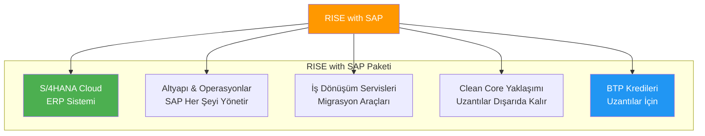
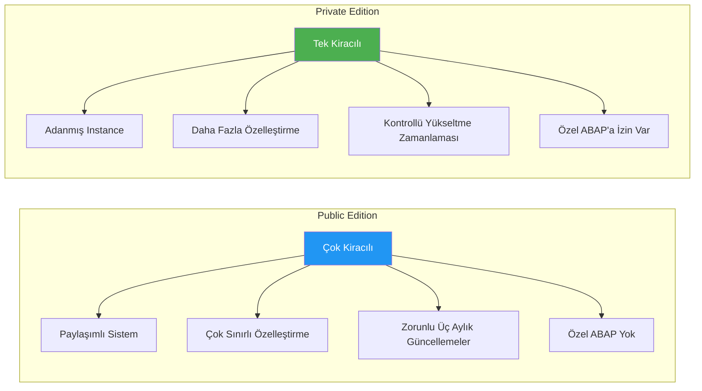
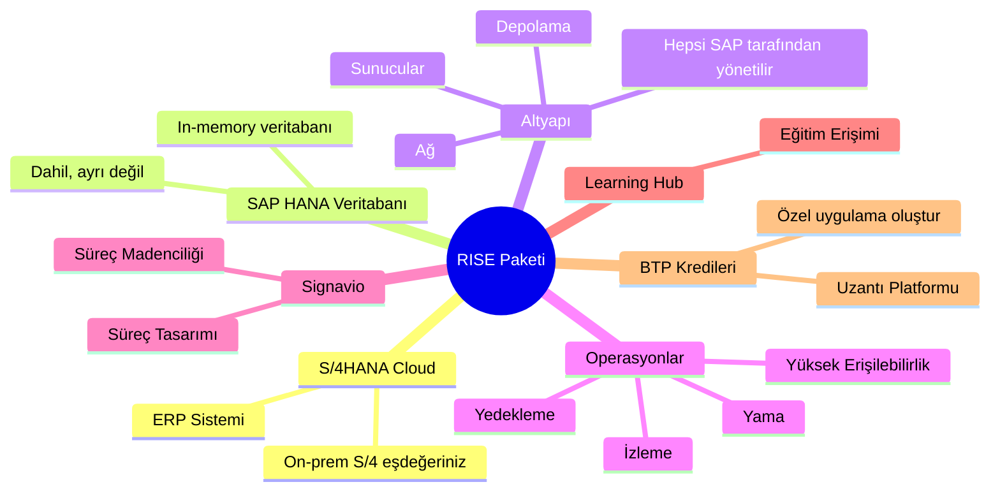
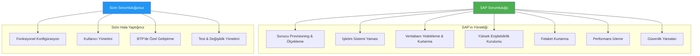
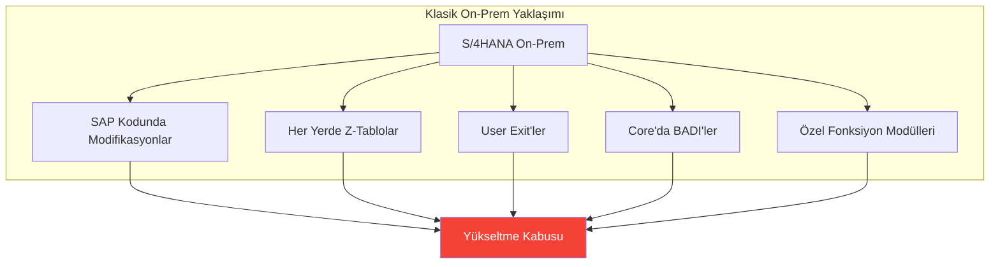
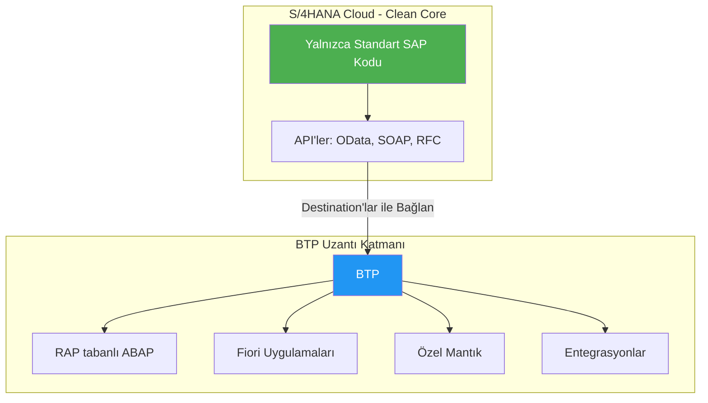
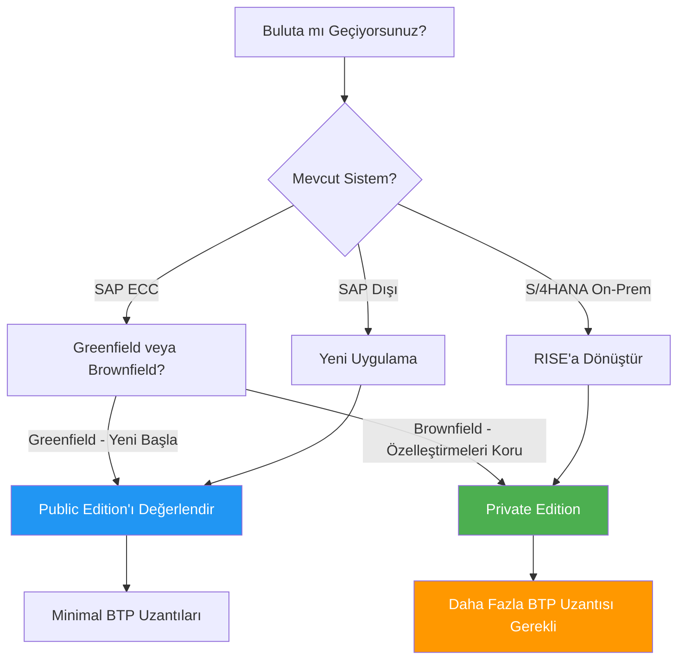

# Kısım 3: RISE with SAP Açıklandı

> *Bir Ürün Değil—Bir Paket!*

---

Bu, en çok ABAP geliştiricisinin kafasını karıştıran kavram. Net bir şekilde açıklayalım.

---

## 3.1 RISE Aslında Nedir (Bir Ürün Değil!)

**RISE with SAP** ayrı bir ürün veya platform DEĞİLDİR.

**S/4HANA'yı temel alan** işinizi buluta taşımanıza yardımcı olan SAP'tan **komple bir paket teklifi**—bir "dönüşüm paketi"dir.

> **RISE'ı şöyle düşünün**: SAP'ın, *"Evi inşa etme ve bakımıyla uğraşmayı bırak. Sana tamamen bizim tarafımızdan yönetilen hazır, modern bir bulut evi (S/4HANA Cloud) ve onu akıllıca yenileme araçları vereceğiz."* demesi.

### RISE Neleri İçerir

1. **SAP S/4HANA Cloud** (ERP sisteminin kendisi)
2. **Altyapı & Operasyonlar** (SAP her şeyi yönetir)
3. **İş Dönüşüm Servisleri** (migrasyona yardımcı araçlar)
4. **Clean Core Yaklaşımı** (uzantılar core dışında kalır)
5. **BTP Kredileri** (uzantılar oluşturmak için)

---

## 3.2 S/4HANA Cloud Private Edition vs. Public Edition

Eski ABAP'çıların kafasının karıştığı yer burası. İki çeşit var:

### Public Edition (Çok Kiracılı)

- SAP büyük bir sistem çalıştırır, siz bir "dilim" (tenant) alırsınız
- Çok sınırlı özelleştirme
- Üç aylık güncellemeler size zorla yüklenir
- Şunlar için iyi: Standart süreçler, küçük şirketler

### Private Edition (Tek Kiracılı)

- Kendi adanmış S/4HANA instance'ınızı alırsınız
- Daha fazla özelleştirme mümkün (on-prem'e daha yakın hissettiriyor)
- Yükseltme zamanlamasını siz kontrol edersiniz (sınırlar dahilinde)
- Özel ABAP kodu çalışabilir (kısıtlamalarla)
- Şunlar için iyi: Özel ihtiyaçları olan büyük kurumsal şirketler

> **ABAP geliştiricileri için**: Private Edition genellikle RISE projelerinde karşılaşacağınız şeydir çünkü daha fazla özelleştirmeye izin verir.

### Karşılaştırma Tablosu

| Özellik | Public Edition | Private Edition |
|---------|---------------|-----------------|
| Kiracılık | Çok kiracılı (paylaşımlı) | Tek kiracılı (adanmış) |
| Özelleştirme | Çok sınırlı | Daha esnek |
| Özel ABAP | Yok | İzin var (kurallarla) |
| Yükseltmeler | Zorunlu üç aylık | Kontrollü zamanlama |
| Tipik müşteri | KOBİ, greenfield | Büyük kurumsal, brownfield |

---

## 3.3 RISE Paketi: Neler Dahil

Bir müşteri RISE sözleşmesi imzaladığında, şunları alır:

| Bileşen | Nedir | Eski Dünya Karşılığı |
|---------|-------|---------------------|
| **S/4HANA Cloud** | ERP sistemi | On-prem S/4 veya ECC'niz |
| **SAP HANA Veritabanı** | In-memory veritabanı | HANA/Oracle/DB2'niz |
| **Altyapı** | Sunucular, depolama, ağ | Veri merkeziniz |
| **Operasyonlar** | Yama, yedekleme, izleme | Basis ekibiniz |
| **Signavio** | Süreç madenciliği & tasarım | Yok |
| **Learning Hub** | Eğitim erişimi | Yok |
| **BTP Kredileri** | Uzantı platformu | Daha önce ayrı satın alma |

---

## 3.4 Altyapı & Operasyonlar – Basis Endişelerine Veda

Eski SAP dükkanları için en büyük değişikliklerden biri:

### RISE'ta SAP'ın Yönettiği

- ✅ Sunucu provisioning ve ölçekleme
- ✅ İşletim sistemi yaması
- ✅ Veritabanı yedekleme ve kurtarma
- ✅ Yüksek erişilebilirlik kurulumu
- ✅ Felaket kurtarma
- ✅ Performans izleme
- ✅ Güvenlik yamaları

### Sizin Hala Yaptığınız

- ✅ Fonksiyonel konfigürasyon (işlemler, master data)
- ✅ Kullanıcı yönetimi
- ✅ Özel geliştirme (BTP'de, core'da değil)
- ✅ Test ve değişiklik yönetimi

> **Basis ekipleri için**: Rolünüz "sunucuları çalışır tutma"dan "mimari ve yönetişim"e kayar.

---

## 3.5 Clean Core Sözü

Bu temel zihniyet değişimi:

### Eski Dünya: Her Şeyi Değiştir

Sorunlar:
- Yükseltmeler kabusa dönüşüyor
- Destek karmaşıklaşıyor
- Test sonsuza kadar sürüyor

### RISE Dünyası: Core'u Temiz Tut

### "Clean Core" Pratikte Ne Anlama Geliyor

| İzin Verilen | İzin Verilmeyen |
|--------------|-----------------|
| Released API'leri kullanma | Standart kodu değiştirme |
| Key User genişletilebilirliği | S/4'te özel dictionary objeleri |
| Yan yana uzantılar (BTP) | Released olmayan fonksiyon modülleri |
| Özel CDS view'lar (released objeler) | Doğrudan tablo değişiklikleri |

Clean Core etkilerini Kısım 17'de daha derinlemesine inceleyeceğiz.

---

## 3.6 RISE Karar Akış Şeması

---

## Temel Çıkarımlar

1. **RISE bir paket, ürün değil** — S/4HANA + altyapı + servisler + BTP kredileri
2. **Private Edition** özelleştirmeye ihtiyaç duyan kurumsal şirketler için
3. **SAP altyapıyı yönetir** — Basis rolünüz değişir
4. **Clean Core zorunlu** — uzantılar S/4 core'a değil BTP'ye gider
5. **BTP kredileri dahil** — özel geliştirme için kullanın

---

## Sırada Ne Var?

Şimdi RISE ve BTP'nin tam olarak nasıl bağlandığını görelim. Geliştirme yaparken "BTP uzantı kanadı" gerçekte neye benziyor?

---

*[Önceki: Kısım 2 – BTP Mimarisi](02-btp-architecture.md) | [Sonraki: Kısım 4 – RISE ve BTP Nasıl Birlikte Çalışır](04-rise-and-btp.md)*

*[İçindekilere Dön](../content.md)*

---

**Yazar:** [Beyhan Meyrali](https://www.linkedin.com/in/beyhanmeyrali) — SAP Hikaye Anlatıcısı & Dijital Dönüşüm Savunucusu

*Dünya genelindeki SAP öğrencileri için ❤️ ile oluşturuldu*
