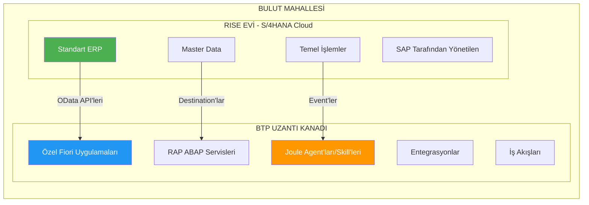
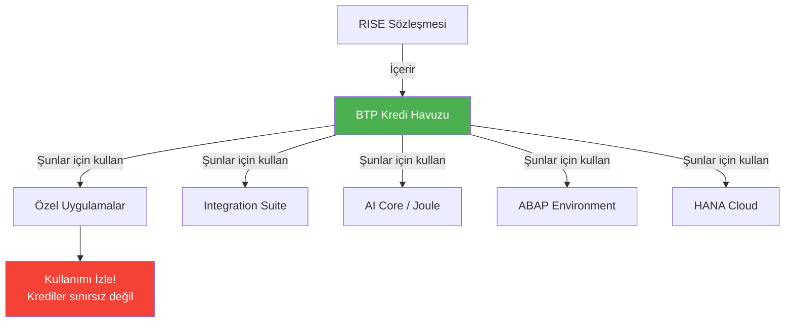
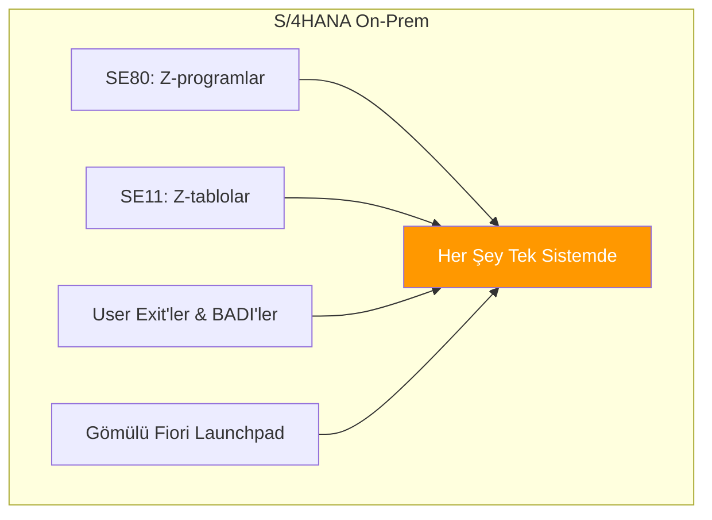
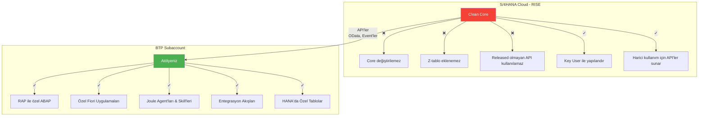
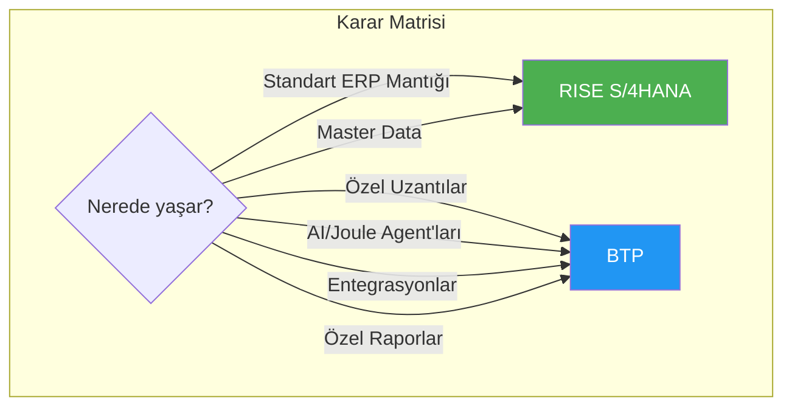
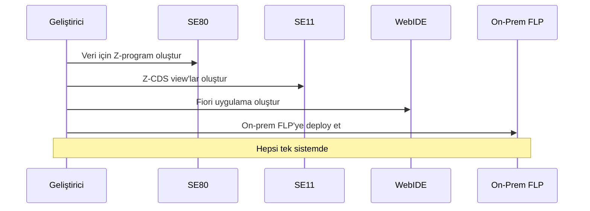
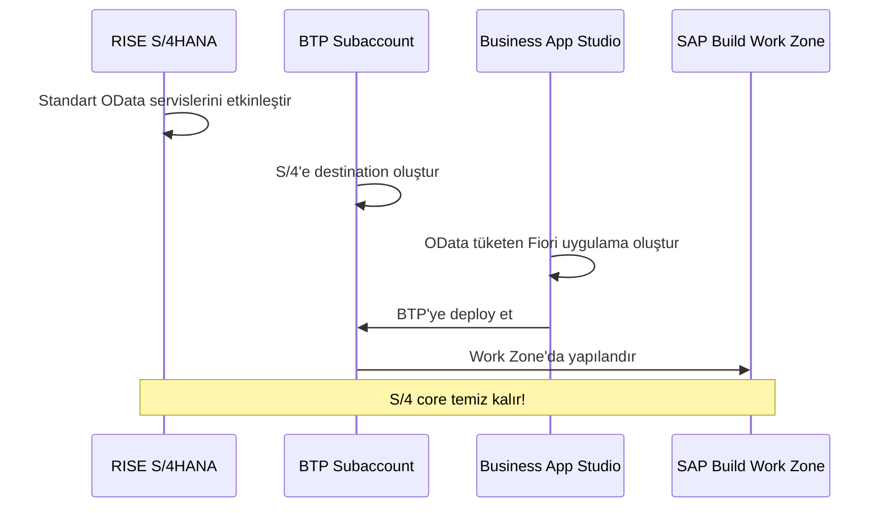
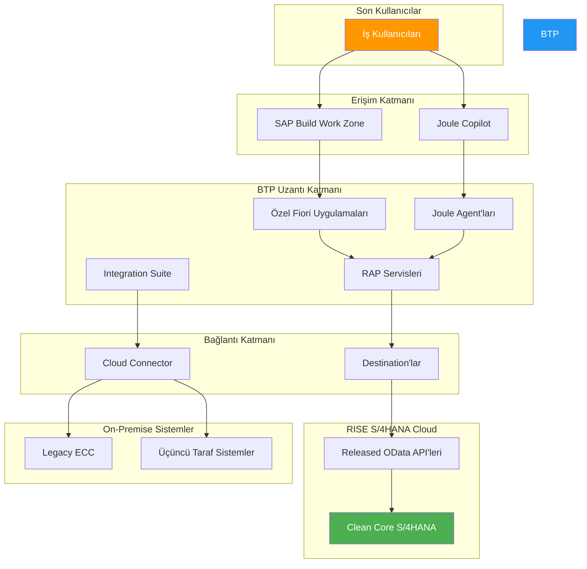

# Kısım 4: RISE ve BTP Nasıl Birlikte Çalışır

> *Mahalle Görünümü*

---

## 4.1 Mahalle Görünümü: RISE Evi + BTP Uzantı Kanadı

İşte tıklamasını sağlayan resim:

- **RISE** = Tamamen yönetilen S/4HANA bulut evi (ERP çekirdeği)
- **BTP** = Esnek uzantı kanadı/garaj/atölye
- **Destination'lar** = Onları birbirine bağlayan köprü

**Sıkı sıkıya birlikte çalışmak üzere tasarlandılar**:
- BTP'deki özel Fiori uygulaması OData aracılığıyla S/4'ten veri çeker
- Joule skill'i RISE S/4'ten satış siparişlerini okur
- BTP'deki entegrasyon akışı RISE'ı harici sistemlere bağlar

---

## 4.2 RISE Sözleşmelerinde BTP Kredileri

İşte çoğunun fark etmediği bir şey:

> Her RISE sözleşmesi, uzantılar oluşturmak için **BTP kredileri** (ücretsiz yakıt kuponları gibi) içerir.

### Ne Alırsınız

- Özel bir BTP subaccount'u (genellikle "BTP for RISE" olarak adlandırılır)
- Yaygın servisler için entitlement'lar (sözleşmeye bağlı)
- BTP servislerini tüketmek için krediler

### Tipik Dahil Edilen Servisler

| Servis | Ne İçin |
|--------|---------|
| SAP Build (Work Zone, Apps, PA) | Low-code geliştirme |
| Integration Suite | Sistemleri bağlama |
| ABAP Environment | Bulut ABAP geliştirme |
| AI Core / Joule | AI yetenekleri |
| HANA Cloud | Ek veritabanları |

### Dikkat!

Krediler sınırsız değil. Yüksek tüketimli servisler (AI ve büyük HANA instance'ları gibi) kredileri hızlıca tüketebilir. Kullanımı izleyin!

---

## 4.3 ABAP/Fiori Geliştiricileri İçin Yeni Gerçeklik

Ne değiştiğini somutlaştıralım:

### Eski Dünya (On-Prem S/4)

### RISE Dünyası

### Bu Günlük Olarak Ne Anlama Geliyor

| Görev | Eski Yol | RISE + BTP Yolu |
|-------|----------|-----------------|
| Özel alan ekle | SE11'de append structure | Key User genişletilebilirliği veya BTP |
| Özel rapor | SE38 programı | BTP ABAP Env'de RAP → Fiori uygulama |
| Özel tablo | S/4'te SE11 | BTP'de HANA Cloud tablosu |
| Karmaşık mantık | Core'da fonksiyon modülü | BTP'de servis, API ile çağır |
| Fiori uzantısı | WebIDE'de genişlet, FLP'ye deploy et | BAS'ta genişlet, BTP'ye deploy et |

---

## 4.4 Karşılaştırma Tablosu: Klasik On-Prem vs. RISE vs. BTP

| Özellik | Klasik On-Prem | RISE (S/4 Cloud) | BTP (Uzantılar) |
|---------|----------------|------------------|-----------------|
| **Altyapıyı kim yönetiyor?** | Basis ekibiniz | SAP | SAP |
| **S/4HANA versiyonu** | Siz kontrol edersiniz | SAP güncelleme yapar | Yok |
| **Özel ABAP** | Tam özgürlük (riskli) | Sadece Clean Core | ABAP Env'de RAP |
| **Fiori uygulamaları** | On-prem FLP'ye deploy | Gömülü FLP | BAS'ta oluştur/deploy et |
| **Uzantı konumu** | S/4 içinde | Dışarıda (BTP) | BTP budur! |
| **Maliyet modeli** | Donanım + lisanslar | Abonelik | Kredi/tüketim |
| **Tipik kullanım** | Legacy SAP mağazaları | Bulut dönüşümü | Tüm özel işler |

---

## 4.5 Pratik Örnek: Müşteri Özel Dashboard İstiyor

### Eski Yol (On-Prem)

### RISE + BTP Yolu

Dashboard kullanıcılara **aynı görünür**, ama mimari temelden farklıdır.

---

## 4.6 Tam Mimari Resim

---

## 4.7 Gerçek Dünya URL Örnekleri

RISE + BTP ile çalışırken şu URL kalıplarıyla karşılaşacaksınız:

| Sistem | URL Kalıbı | Örnek |
|--------|------------|-------|
| **BTP Cockpit** | `cockpit.btp.cloud.sap` | `https://cockpit.btp.cloud.sap/cockpit/?idp=...` |
| **S/4HANA Cloud** | `my{numara}.s4hana.ondemand.com` | `https://my300001.s4hana.ondemand.com` |
| **Business App Studio** | `{bölge}.applicationstudio.cloud.sap` | `https://eu10.applicationstudio.cloud.sap` |
| **Joule Studio** | `joule-studio-{bölge}.cfapps.{bölge}.hana.ondemand.com` | `https://joule-studio-eu10.cfapps.eu10.hana.ondemand.com` |
| **OData Servisi** | `{s4_url}/sap/opu/odata/sap/{servis}` | `https://my300001.s4hana.ondemand.com/sap/opu/odata/sap/API_SALES_ORDER_SRV` |

---

## Temel Çıkarımlar

1. **RISE yönetilen ERP çekirdeği** — SAP altyapıyı yöneten S/4HANA
2. **BTP uzantı platformu** — özel işlerinizin yaşadığı yer
3. **API'ler aracılığıyla bağlanırlar** — Destination'lar ikisini köprüler
4. **RISE BTP kredileri içerir** — uzantılar için kullanın
5. **Becerileriniz transfer olur** — ABAP hala ABAP, sadece yeni bir konumda

---

## Sırada Ne Var?

RISE + BTP'nin büyük resmini anlıyorsunuz. Şimdi pratik olalım. Bölüm III'te, günlük kullanacağınız temel BTP kavramlarına dalacağız, **Destination'lar**—sistemler arasındaki kritik köprü—ile başlayarak.

---

*[Önceki: Kısım 3 – RISE with SAP](03-rise-with-sap.md) | [Sonraki: Kısım 5 – Destination'lar](05-destinations.md)*

*[İçindekilere Dön](../content.md)*

---

**Yazar:** [Beyhan Meyrali](https://www.linkedin.com/in/beyhanmeyrali) — SAP Hikaye Anlatıcısı & Dijital Dönüşüm Savunucusu

*Dünya genelindeki SAP öğrencileri için ❤️ ile oluşturuldu*
