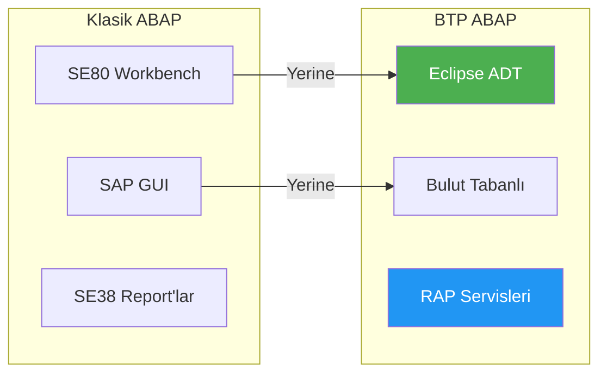
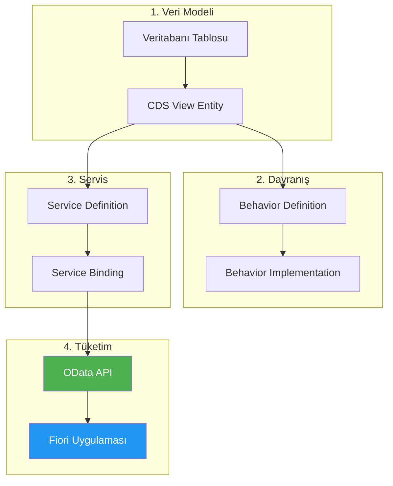
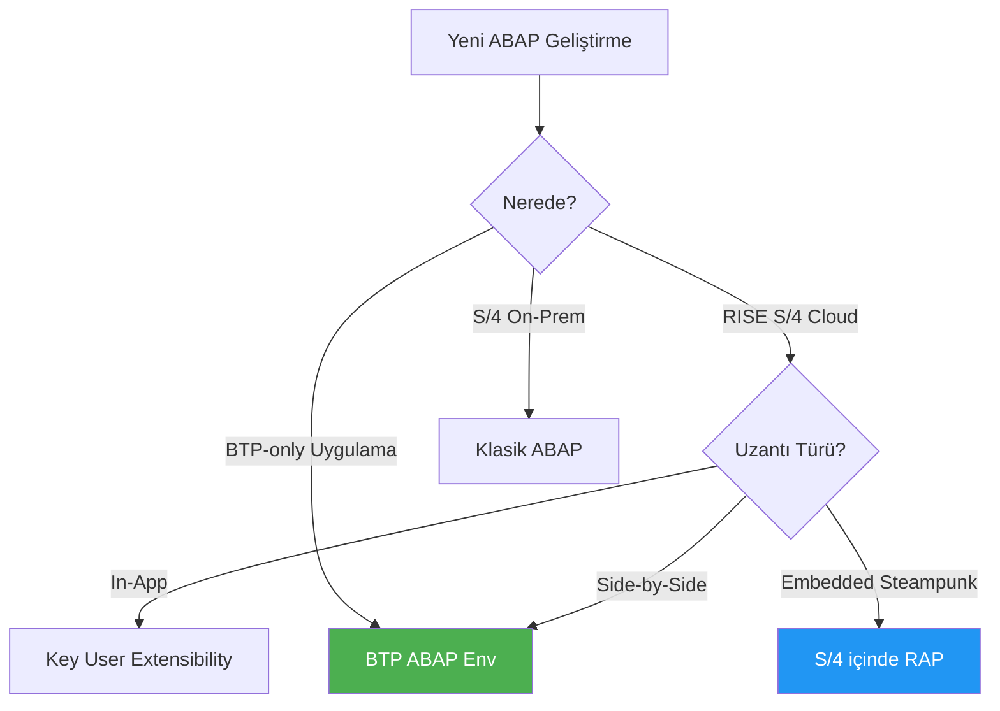
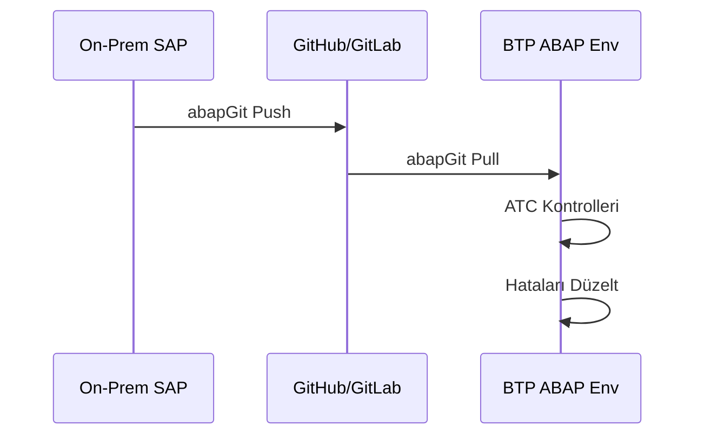

# Kısım 6: Bulutta ABAP – ABAP Environment

> *Becerileriniz Transfer Oluyor—Bazı Yeni Kurallarla*

---

Bu kısım, "Bulutta hala ABAP yazabilir miyim?" diye merak eden her ABAP geliştiricisi için. Cevap evet—ama önemli farklarla.

---

## 6.1 BTP ABAP Environment Genel Bakış

**BTP ABAP Environment**, modern ABAP kodu yazabileceğiniz bulut tabanlı bir ABAP runtime'dır.

### Nedir

- Bulutta çalışan **tamamen yönetilen ABAP sistemi**
- **Bulut-native geliştirme** için tasarlanmış
- **ABAP RESTful Application Programming Model (RAP)** kullanır
- Fiori uygulamaları için **OData** aracılığıyla servisler expose eder
- **SAP HANA Cloud** veritabanında çalışır

### Ne DEĞİLDİR

- ❌ On-prem sisteminizin bir kopyası **DEĞİL**
- ❌ ALV ile SE38 report'ları çalıştıracak bir yer **DEĞİL**
- ❌ Tüm klasik ABAP koduyla uyumlu **DEĞİL**
- ❌ Tüm Z-kodları için migrasyon hedefi **DEĞİL**

### Ne Zaman Kullanılmalı

| Kullanım Durumu | BTP ABAP Environment |
|-----------------|----------------------|
| RISE S/4 için yeni uzantı | ✅ Mükemmel |
| Greenfield bulut projesi | ✅ İdeal |
| Özel OData servisleri | ✅ Evet |
| Side-by-side uzantılar | ✅ Bunun için tasarlandı |
| Legacy report'ları çalıştırma | ❌ Uygun değil |
| Ağır modifikasyonlar | ❌ On-prem kullanın |

---

## 6.2 Klasik On-Prem ABAP'tan Farkları

### Geliştirme Ortamı



| Özellik | Klasik ABAP | BTP ABAP |
|---------|-------------|----------|
| **IDE** | SE80, SAP GUI | Eclipse ADT (ZORUNLU) |
| **Veritabanı** | Herhangi (HANA, Oracle, vb.) | Sadece SAP HANA Cloud |
| **Programlama Modeli** | Her şeye izin verilir | Sadece RAP |
| **Çıktı** | Raporlar, ALV, Dynpro | OData Servisleri |
| **Paket Yönetimi** | SE80 paketleri | abapGit, gCTS |

### Mevcut Olmayan Transaction'lar

```
❌ SE80 - Object Navigator
❌ SE38 - ABAP Editor
❌ SE11 - DDIC
❌ SE37 - Fonksiyon Modülleri
❌ SM30 - Tablo Bakımı
❌ SMOD/CMOD - Enhancement'lar
```

### Mevcut Olan

```
✅ Eclipse ADT - Tüm Geliştirme
✅ CDS View Editörü
✅ RAP Behavior Editörü
✅ ABAP Unit Test Framework
✅ ABAP Test Cockpit (ATC)
✅ abapGit Entegrasyonu
```

---

## 6.3 RAP (RESTful ABAP Programming) Temelleri

RAP, BTP ABAP'ta oluşturmanız gereken HER ŞEY için programlama modelidir.

### RAP Stack



### Tam RAP Örneği: Ürün Yönetimi

**1. Veritabanı Tablosu**

```abap
@EndUserText.label: 'Ürünler'
@AbapCatalog.enhancement.category: #NOT_EXTENSIBLE
@AbapCatalog.tableCategory: #TRANSPARENT
@AbapCatalog.deliveryClass: #A
define table zproducts {
  key client         : abap.clnt not null;
  key product_uuid   : sysuuid_x16 not null;
  product_id         : abap.char(10);
  product_name       : abap.char(100);
  description        : abap.string(256);
  price              : abap.dec(15,2);
  currency_code      : abap.cuky;
  category           : abap.char(20);
  stock_quantity     : abap.int4;
  created_by         : abp_creation_user;
  created_at         : abp_creation_tstmpl;
  last_changed_by    : abp_locinst_lastchange_user;
  last_changed_at    : abp_locinst_lastchange_tstmpl;
}
```

**2. CDS View Entity**

```abap
@AccessControl.authorizationCheck: #CHECK
@EndUserText.label: 'Ürünler'
define root view entity ZI_Products
  as select from zproducts
{
  key product_uuid    as ProductUUID,
      product_id      as ProductID,
      product_name    as ProductName,
      description     as Description,
      @Semantics.amount.currencyCode: 'CurrencyCode'
      price           as Price,
      currency_code   as CurrencyCode,
      category        as Category,
      stock_quantity  as StockQuantity,

      // Admin alanları
      @Semantics.user.createdBy: true
      created_by      as CreatedBy,
      @Semantics.systemDateTime.createdAt: true
      created_at      as CreatedAt,
      @Semantics.user.lastChangedBy: true
      last_changed_by as LastChangedBy,
      @Semantics.systemDateTime.lastChangedAt: true
      last_changed_at as LocalLastChangedAt
}
```

**3. Behavior Definition**

```abap
managed implementation in class zbp_i_products unique;
strict ( 2 );
with draft;

define behavior for ZI_Products alias Product
persistent table zproducts
draft table zdraft_products
lock master total etag LocalLastChangedAt
authorization master ( instance )
etag master LocalLastChangedAt
{
  // Standart Operasyonlar
  create;
  update;
  delete;

  // Draft Desteği
  draft action Edit;
  draft action Activate optimized;
  draft action Discard;
  draft action Resume;
  draft determine action Prepare;

  // Alan Kontrolleri
  field ( readonly ) ProductUUID, CreatedBy, CreatedAt, LastChangedBy, LocalLastChangedAt;
  field ( mandatory ) ProductName, Price;

  // Validasyonlar
  validation validatePrice on save { create; update; field Price; }
  validation validateProductID on save { create; field ProductID; }

  // Determinasyonlar
  determination setProductUUID on save { create; }

  // Aksiyonlar
  action ( features : instance ) reduceStock parameter ZA_ReduceStock result [1] $self;

  // Alan Eşleştirme
  mapping for zproducts
  {
    ProductUUID = product_uuid;
    ProductID = product_id;
    ProductName = product_name;
    Description = description;
    Price = price;
    CurrencyCode = currency_code;
    Category = category;
    StockQuantity = stock_quantity;
    CreatedBy = created_by;
    CreatedAt = created_at;
    LastChangedBy = last_changed_by;
    LocalLastChangedAt = last_changed_at;
  }
}
```

**4. Behavior Implementation**

```abap
CLASS lhc_product DEFINITION INHERITING FROM cl_abap_behavior_handler.
  PRIVATE SECTION.
    METHODS validatePrice FOR VALIDATE ON SAVE
      IMPORTING keys FOR Product~validatePrice.

    METHODS validateProductID FOR VALIDATE ON SAVE
      IMPORTING keys FOR Product~validateProductID.

    METHODS setProductUUID FOR DETERMINE ON SAVE
      IMPORTING keys FOR Product~setProductUUID.

    METHODS reduceStock FOR MODIFY
      IMPORTING keys FOR ACTION Product~reduceStock RESULT result.

    METHODS get_instance_features FOR INSTANCE FEATURES
      IMPORTING keys REQUEST requested_features FOR Product RESULT result.
ENDCLASS.

CLASS lhc_product IMPLEMENTATION.

  METHOD validatePrice.
    READ ENTITIES OF ZI_Products IN LOCAL MODE
      ENTITY Product
      FIELDS ( Price )
      WITH CORRESPONDING #( keys )
      RESULT DATA(products).

    LOOP AT products INTO DATA(product).
      IF product-Price <= 0.
        APPEND VALUE #( %tky = product-%tky ) TO failed-product.
        APPEND VALUE #(
          %tky = product-%tky
          %msg = new_message_with_text(
            severity = if_abap_behv_message=>severity-error
            text = 'Fiyat sıfırdan büyük olmalıdır' )
          %element-Price = if_abap_behv=>mk-on
        ) TO reported-product.
      ENDIF.
    ENDLOOP.
  ENDMETHOD.

  METHOD setProductUUID.
    READ ENTITIES OF ZI_Products IN LOCAL MODE
      ENTITY Product
      FIELDS ( ProductUUID )
      WITH CORRESPONDING #( keys )
      RESULT DATA(products).

    LOOP AT products INTO DATA(product) WHERE ProductUUID IS INITIAL.
      DATA(new_uuid) = cl_system_uuid=>create_uuid_x16_static( ).

      MODIFY ENTITIES OF ZI_Products IN LOCAL MODE
        ENTITY Product
        UPDATE FIELDS ( ProductUUID )
        WITH VALUE #( (
          %tky = product-%tky
          ProductUUID = new_uuid
        ) ).
    ENDLOOP.
  ENDMETHOD.

  METHOD reduceStock.
    READ ENTITIES OF ZI_Products IN LOCAL MODE
      ENTITY Product
      ALL FIELDS
      WITH CORRESPONDING #( keys )
      RESULT DATA(products).

    LOOP AT products ASSIGNING FIELD-SYMBOL(<product>).
      DATA(quantity_to_reduce) = keys[ KEY entity %tky = <product>-%tky ]-%param-Quantity.

      IF <product>-StockQuantity >= quantity_to_reduce.
        <product>-StockQuantity = <product>-StockQuantity - quantity_to_reduce.

        MODIFY ENTITIES OF ZI_Products IN LOCAL MODE
          ENTITY Product
          UPDATE FIELDS ( StockQuantity )
          WITH VALUE #( (
            %tky = <product>-%tky
            StockQuantity = <product>-StockQuantity
          ) ).

        APPEND VALUE #( %tky = <product>-%tky %param = <product> ) TO result.
      ELSE.
        APPEND VALUE #( %tky = <product>-%tky ) TO failed-product.
        APPEND VALUE #(
          %tky = <product>-%tky
          %msg = new_message_with_text(
            severity = if_abap_behv_message=>severity-error
            text = 'Yetersiz stok' )
        ) TO reported-product.
      ENDIF.
    ENDLOOP.
  ENDMETHOD.

ENDCLASS.
```

**5. Service Definition**

```abap
@EndUserText.label: 'Ürün Servisi'
define service ZUI_Products {
  expose ZI_Products as Products;
}
```

**6. Service Binding**

Eclipse ADT'de:
1. Service Definition'a sağ tıkla
2. "New Service Binding" seç
3. Binding türünü seç (OData V2 veya V4)
4. Publish et

---

## 6.4 BTP ABAP vs. Klasik ABAP Ne Zaman Kullanılmalı



---

## 6.5 Migrasyon Yolu: On-Prem'den Kod Taşıma

### Adım 1: Bulut Uyumluluğunu Kontrol Et

ABAP Test Cockpit (ATC) kullanın:

```
Kontrol Varyantı: ABAP_CLOUD_DEVELOPMENT
```

ATC size şunları söyleyecek:
- Hangi API'ler kullanılamaz
- Hangi statement'lar desteklenmiyor
- Neyin refactor edilmesi gerekiyor

### Adım 2: abapGit ile Taşı



### Yaygın Migrasyon Sorunları

| Sorun | Çözüm |
|-------|-------|
| `READ TABLE ... INDEX` | Hash veya sorted table kullan |
| Fonksiyon modülleri | Sınıflara dönüştür |
| `WRITE` statement'ları | Kaldır, API döndür |
| Doğrudan tablo erişimi | CDS view kullan |
| `CALL TRANSACTION` | Desteklenmiyor, yeniden tasarla |
| `AUTHORITY-CHECK` | RAP auth master kullan |

---

## Temel Çıkarımlar

1. **BTP ABAP Environment** bulutta modern ABAP
2. **Eclipse ADT zorunlu** — SE80 yok
3. **RAP her şey** — tüm geliştirme bu model
4. **OData çıktı** — report yok, servis var
5. **Tüm Z-kod taşınmaz** — dikkatli analiz gerekli

---

## Sırada Ne Var?

Artık bulutta ABAP servisler oluşturmayı biliyorsunuz. Bir sonraki kısımda, bu servisleri tüketen Fiori uygulamalarını BTP'de nasıl oluşturacağınızı göreceğiz.

---

*[Önceki: Kısım 5 – Destination'lar](05-destinations.md) | [Sonraki: Kısım 7 – BTP'de Fiori & UI5](07-fiori-ui5-btp.md)*

*[İçindekilere Dön](../content.md)*

---

**Yazar:** [Beyhan Meyrali](https://www.linkedin.com/in/beyhanmeyrali) — SAP Hikaye Anlatıcısı & Dijital Dönüşüm Savunucusu

*Dünya genelindeki SAP öğrencileri için ❤️ ile oluşturuldu*
