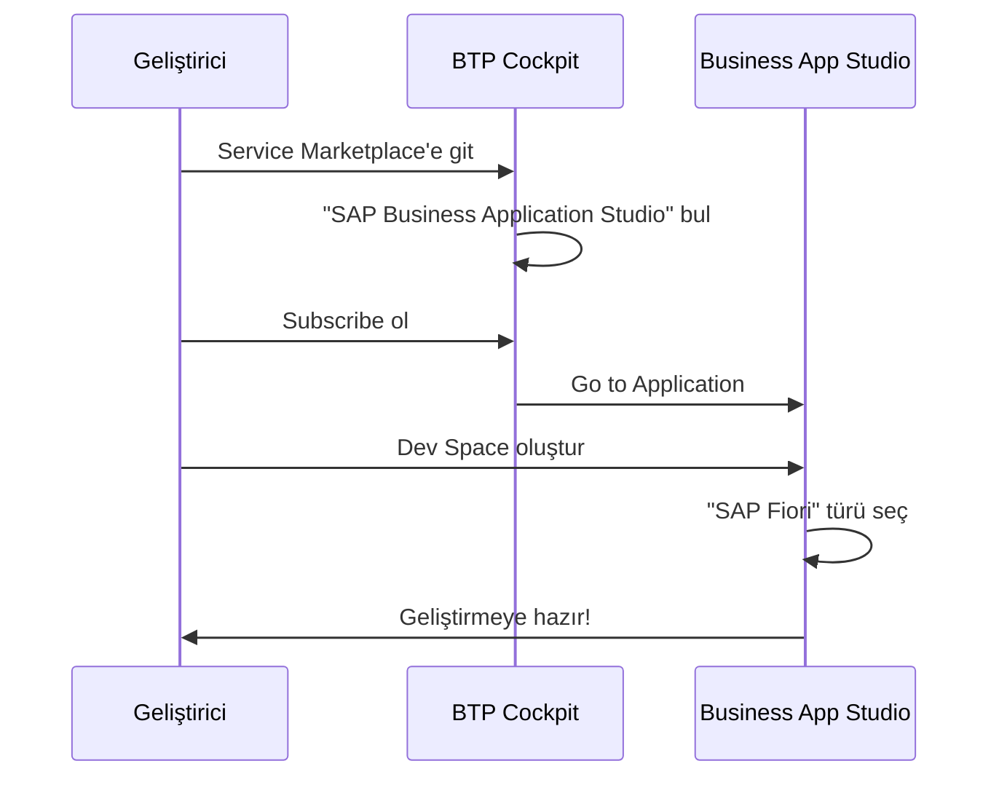
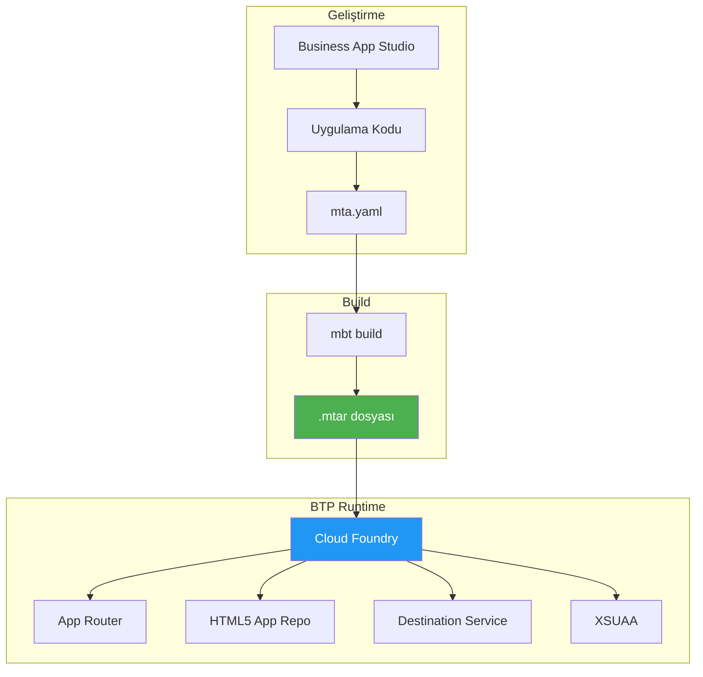
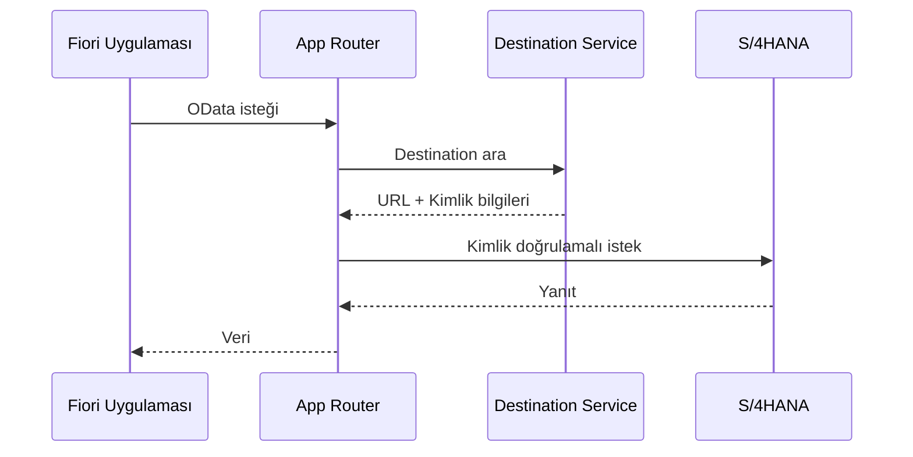
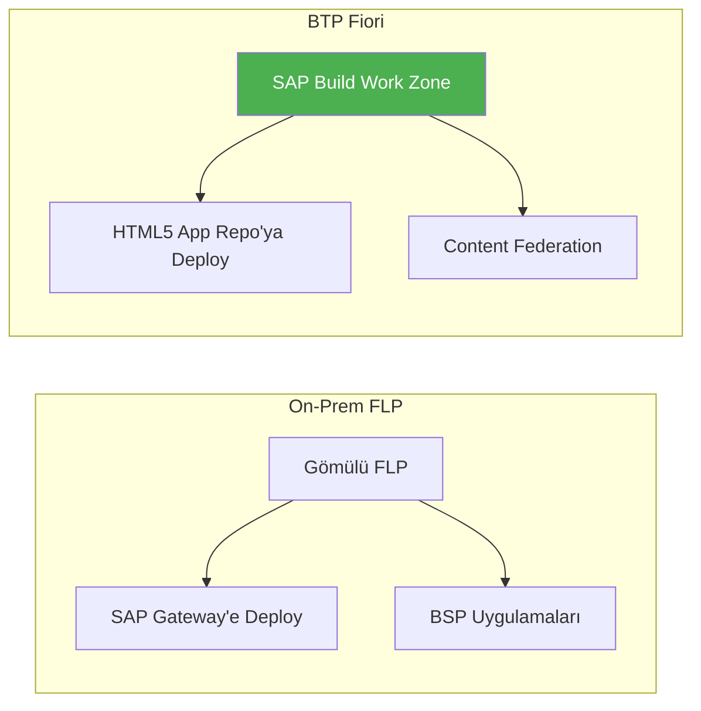
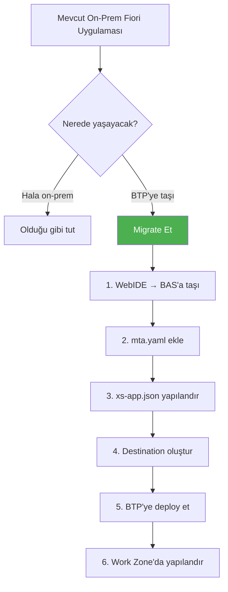
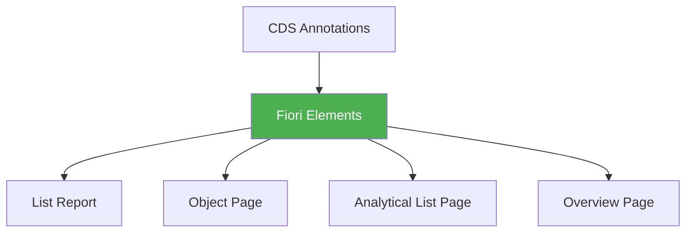
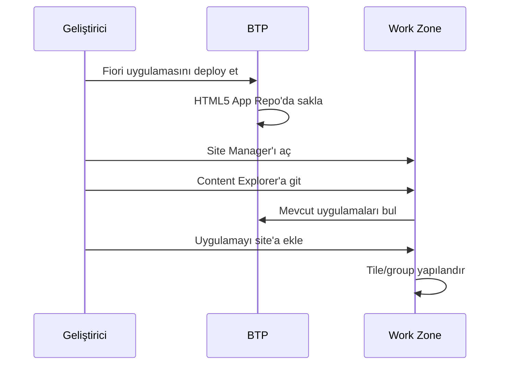

# Kısım 7: BTP'de Fiori & UI5

> *WebIDE'den Business Application Studio'ya*

---

Fiori geliştiricileri için bulut geçişi yeni araçlar, yeni deployment hedefleri ve yeni mimariler anlamına geliyor. Bu kısım BTP'de Fiori uygulamaları oluşturmak ve deploy etmek için bilmeniz gereken her şeyi kapsıyor.

---

## 7.1 SAP Business Application Studio (BAS)

**SAP Business Application Studio (BAS)**, şunların yerini alan bulut IDE'sidir:
- SAP Web IDE (kullanımdan kaldırıldı)
- Fiori geliştirme için Eclipse
- Yerel VS Code kurulumları (bunları hala kullanabilirsiniz)

### BAS Ne Sağlar

| Özellik | Açıklama |
|---------|----------|
| **Tarayıcı tabanlı** | Yerel kurulum gerektirmez |
| **Dev Space'ler** | Farklı proje türleri için önceden yapılandırılmış ortamlar |
| **Tam UI5 araçları** | Yeoman generator'lar, Fiori araçları, UI5 CLI |
| **Git entegrasyonu** | Yerleşik versiyon kontrolü |
| **Doğrudan BTP deployment** | IDE'den ayrılmadan deploy |
| **Extension'lar** | VS Code uyumlu extension'lar |

### Dev Space Türleri

Dev Space oluştururken doğru türü seçin:

| Dev Space Türü | Ne İçin Kullanılır |
|----------------|-------------------|
| **SAP Fiori** | Fiori Elements, freestyle SAPUI5, extension'lar |
| **Full Stack Cloud Application** | CAP projeleri, Node.js, Java |
| **SAP HANA Native** | Native HANA geliştirme |
| **Basic** | Genel geliştirme |

### BAS'ı Kurma



1. **BAS'a Erişim**
   - BTP Cockpit → Subaccount → Service Marketplace
   - "SAP Business Application Studio"yu bulun
   - Subscribe olun (genellikle BTP entitlement'larına dahil)
   - "Go to Application"a tıklayın

2. **Dev Space Oluşturma**
   - "Create Dev Space"e tıklayın
   - Ad: `fiori-development`
   - Tür: **SAP Fiori**
   - Ek Extension'lar: CDS Language Support, Fiori Tools

---

## 7.2 Fiori Uygulamalarını BTP'ye Deploy Etme

### Deployment Mimarisi



### Temel Dosyalar

**1. manifest.json** - UI5 uygulama yapılandırması
```json
{
  "sap.app": {
    "id": "com.acme.salesorders",
    "type": "application",
    "title": "Satış Siparişleri",
    "dataSources": {
      "mainService": {
        "uri": "/sap/opu/odata/sap/API_SALES_ORDER_SRV/",
        "type": "OData",
        "settings": {
          "odataVersion": "2.0"
        }
      }
    }
  },
  "sap.ui5": {
    "dependencies": {
      "minUI5Version": "1.120.0",
      "libs": {
        "sap.m": {},
        "sap.ui.core": {},
        "sap.f": {},
        "sap.uxap": {}
      }
    }
  }
}
```

**2. xs-app.json** - App Router yapılandırması
```json
{
  "welcomeFile": "/index.html",
  "authenticationMethod": "route",
  "routes": [
    {
      "source": "^/sap/opu/odata/sap/(.*)$",
      "target": "/sap/opu/odata/sap/$1",
      "destination": "S4HANA_BACKEND",
      "authenticationType": "xsuaa"
    },
    {
      "source": "^(.*)$",
      "target": "$1",
      "service": "html5-apps-repo-rt",
      "authenticationType": "xsuaa"
    }
  ]
}
```

**3. mta.yaml** - Multi-Target Application tanımlayıcısı
```yaml
_schema-version: "3.2"
ID: com.acme.salesorders
version: 1.0.0

modules:
  - name: salesorders-app
    type: html5
    path: webapp
    build-parameters:
      builder: custom
      commands:
        - npm run build
    requires:
      - name: salesorders-destination
      - name: salesorders-uaa

  - name: salesorders-approuter
    type: approuter.nodejs
    path: approuter
    requires:
      - name: salesorders-uaa
      - name: salesorders-destination
      - name: salesorders-html5-repo-runtime

resources:
  - name: salesorders-uaa
    type: org.cloudfoundry.managed-service
    parameters:
      service: xsuaa
      service-plan: application
      config:
        xsappname: salesorders-${org}-${space}
        tenant-mode: dedicated

  - name: salesorders-destination
    type: org.cloudfoundry.managed-service
    parameters:
      service: destination
      service-plan: lite

  - name: salesorders-html5-repo-runtime
    type: org.cloudfoundry.managed-service
    parameters:
      service: html5-apps-repo
      service-plan: app-runtime
```

### Deployment Adımları

```bash
# 1. MTA build et
mbt build

# 2. Cloud Foundry'ye login ol
cf login -a https://api.cf.eu10.hana.ondemand.com

# 3. Deploy et
cf deploy mta_archives/com.acme.salesorders_1.0.0.mtar

# 4. Durumu kontrol et
cf apps
cf services
```

---

## 7.3 Backend Sistemlerine Bağlanma

### Destination Kullanımı



### xs-app.json'da Route Yapılandırması

```json
{
  "routes": [
    {
      "source": "^/sap/opu/odata/sap/(.*)$",
      "target": "/sap/opu/odata/sap/$1",
      "destination": "S4HANA_BACKEND",
      "authenticationType": "xsuaa",
      "csrfProtection": true
    }
  ]
}
```

### Destination Gereksinimleri

| Özellik | Değer | Açıklama |
|---------|-------|----------|
| `HTML5.DynamicDestination` | true | HTML5 uygulamaları için gerekli |
| `WebIDEEnabled` | true | BAS'ta geliştirme için |
| `WebIDEUsage` | odata_abap | OData servis türü |

---

## 7.4 On-Prem Fiori Launchpad'den Farklar



### Karşılaştırma Tablosu

| Özellik | On-Prem FLP | BTP Work Zone |
|---------|-------------|---------------|
| **Deployment hedefi** | SAP Gateway / BSP | HTML5 App Repository |
| **IDE** | Web IDE (eski) | Business App Studio |
| **Launchpad** | Embedded FLP | SAP Build Work Zone |
| **Catalog yönetimi** | PFCG / LPD_CUST | Site Manager |
| **Backend bağlantısı** | Doğrudan | Destination aracılığıyla |
| **Authentication** | SAML/SSO | XSUAA / IAS |

### Migrasyon Yolu



---

## 7.5 Fiori Elements vs. Freestyle

### Fiori Elements (Önerilen)



**Avantajları:**
- ✅ Daha az kod, daha hızlı geliştirme
- ✅ Otomatik UX uyumu
- ✅ Yerleşik özellikler (filtreleme, sıralama, export)
- ✅ SAP tarafından bakım

**Kullanım durumu:** Standart CRUD uygulamaları

### Freestyle SAPUI5

**Avantajları:**
- ✅ Tam özelleştirme kontrolü
- ✅ Karmaşık UI gereksinimleri
- ✅ Özel bileşenler

**Kullanım durumu:** Özel dashboard'lar, özelleştirilmiş UX

---

## 7.6 BAS'ta Fiori Projesi Oluşturma

### Adım Adım

1. **BAS'ı açın** ve Dev Space'inizi başlatın

2. **Yeni proje oluşturun:**
   - View → Command Palette (Ctrl+Shift+P)
   - "Fiori: Open Application Generator" yazın

3. **Şablon seçin:**
   - List Report Page
   - Worklist
   - Object Page
   - Freestyle (boş)

4. **Data source'u seçin:**
   - Connect to a System → Destination seçin
   - Use a Local Cap Project
   - Upload metadata file

5. **Entity seçin ve generate edin**

6. **Yerel olarak çalıştırın:**
   ```bash
   npm start
   ```

7. **Build ve deploy edin:**
   ```bash
   npm run build
   cf deploy mta_archives/*.mtar
   ```

---

## 7.7 SAP Build Work Zone Entegrasyonu

SAP Build Work Zone, BTP'deki modern Fiori launchpad'dir.

### Uygulama Ekleme



### Work Zone Site Yapılandırması

1. **Work Zone'a erişin**
2. **Site oluşturun veya açın**
3. **Content Explorer'a gidin**
4. **HTML5 Apps'ten uygulamanızı bulun**
5. **Site'a ekleyin**
6. **Tile'ı yapılandırın** (başlık, ikon, hedef)

---

## Temel Çıkarımlar

1. **BAS**, Web IDE'nin yerini alan bulut IDE'dir
2. **MTA (Multi-Target Application)** BTP deployment standardıdır
3. **Destination'lar** backend bağlantısı için zorunludur
4. **xs-app.json** route'ları ve auth'u kontrol eder
5. **SAP Build Work Zone** modern Fiori launchpad'dir
6. **Fiori Elements** standart uygulamalar için tercih edilir

---

## Sırada Ne Var?

Artık BTP'de Fiori uygulamaları oluşturmayı biliyorsunuz. Bir sonraki bölümde (Bölüm IV), SAP'ın AI asistanı Joule'u ve nasıl genişletileceğini öğreneceğiz.

---

*[Önceki: Kısım 6 – Bulutta ABAP](06-abap-cloud.md) | [Sonraki: Kısım 8 – Joule Temelleri](08-joule-fundamentals.md)*

*[İçindekilere Dön](../content.md)*

---

**Yazar:** [Beyhan Meyrali](https://www.linkedin.com/in/beyhanmeyrali) — SAP Hikaye Anlatıcısı & Dijital Dönüşüm Savunucusu

*Dünya genelindeki SAP öğrencileri için ❤️ ile oluşturuldu*
