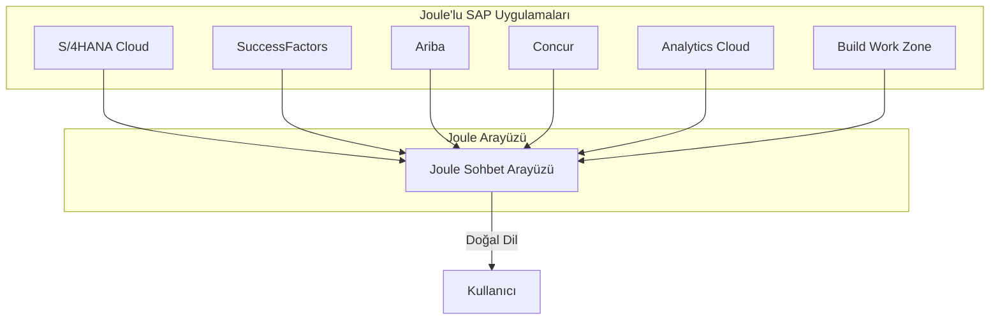
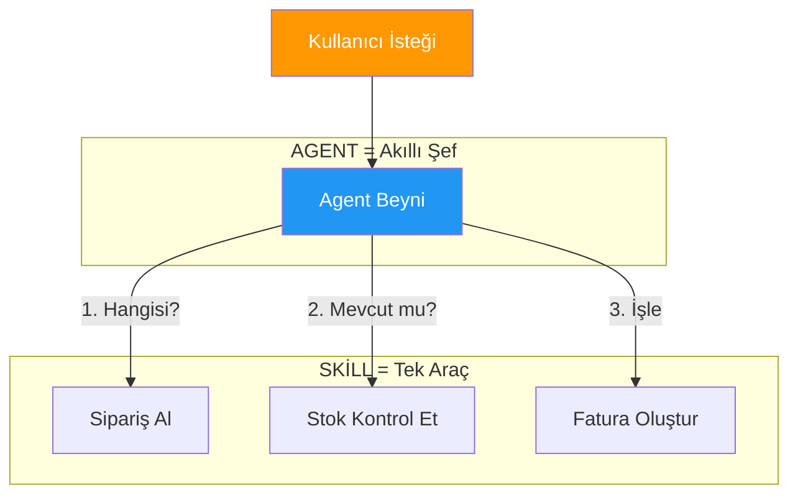
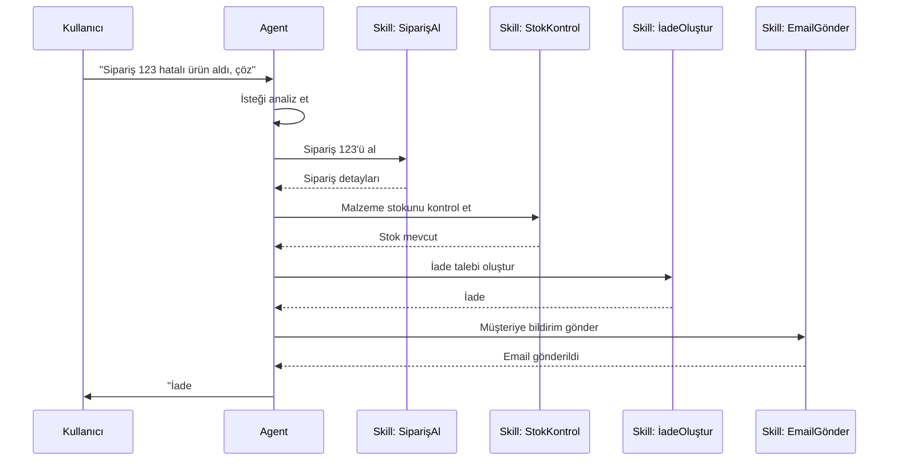
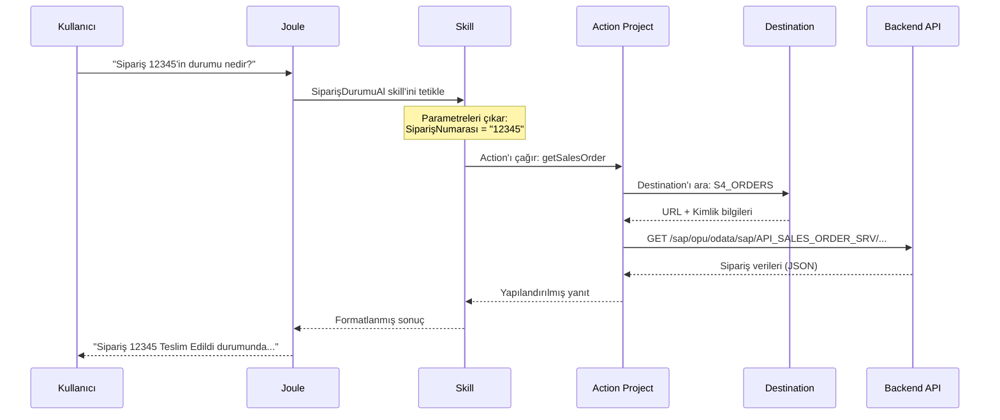
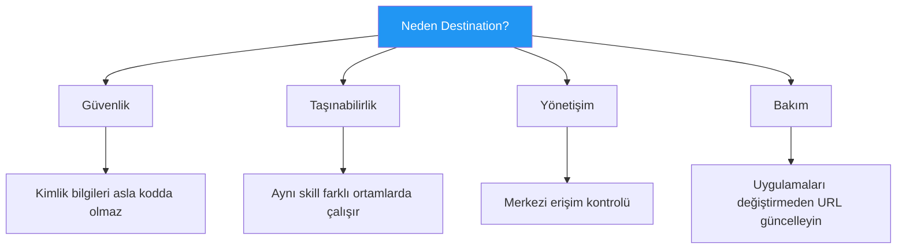
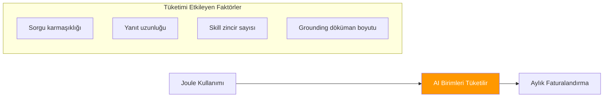

# Kısım 8: Joule Temelleri

> *SAP'ın AI Copilot'u Açıklandı*

---

Bölüm IV'e hoş geldiniz. İşler burada heyecanlı hale geliyor. Joule, SAP'ın AI asistanıdır—kullanıcıların SAP sistemleriyle etkileşim şeklini dönüştürecek üretken AI copilot. Hadi düzgünce anlayalım.

---

## 8.1 Joule Nedir? (SAP AI Copilot)

**Joule** (İngilizce "jewel" gibi telaffuz edilir) SAP'ın üretken AI asistanıdır:

- SAP uygulamalarının içinde yaşar (S/4HANA, SuccessFactors, Ariba, Concur, vb.)
- SAP verilerini, süreçlerini ve iş bağlamını anlar
- Özel **skill'ler** ve **agent'larla** genişletilebilir
- Kullanıcılarla etkileşim kurmak için doğal dil kullanır

> **Şöyle düşünün**: SAP ortamınızı bilen ve sadece soruları yanıtlamakla kalmayıp gerçekten bir şeyler YAPABİLEN şirkete özel bir ChatGPT.

### Joule Nerede Görünür



### Gerçek Dünya Joule Konuşmaları

**Örnek 1: SuccessFactors'ta İK Yöneticisi**
```
Kullanıcı: "Deneme süresi bu ay biten çalışanları göster"
Joule: "Ocak 2026'da deneme süresi biten 12 çalışan buldum..."
       [İsimler, departmanlar, bitiş tarihleriyle liste gösterir]
       "Yöneticilerine hatırlatma göndermemi ister misiniz?"
```

**Örnek 2: Ariba'da Satın Alma**
```
Kullanıcı: "PO 4500012345'in durumu nedir?"
Joule: "Satın Alma Siparişi 4500012345:
        - Satıcı: ABC Electronics GmbH
        - Toplam: €45.000
        - Durum: Kısmen Teslim Edildi (5 kalemden 3'ü alındı)
        - Kalan kalemlerin beklenen teslimi: 15 Şubat 2026"
```

**Örnek 3: S/4HANA'da Finans**
```
Kullanıcı: "Acme Corp müşterisi için 100 adet FG-1000 malzemeden satış siparişi oluştur"
Joule: "O satış siparişini oluşturacağım:
        - Müşteri: Acme Corp (1000234)
        - Malzeme: FG-1000 (Mamul Widget)
        - Miktar: 100 AD
        - Fiyat: Her biri €50,00 = Toplam €5.000,00

        Devam edeyim mi?"
Kullanıcı: "Evet"
Joule: "Satış Siparişi 12345678 başarıyla oluşturuldu."
```

---

## 8.2 Skill'ler vs. Agent'lar: Temel Fark

Bu kısım çok önemli. SAP bu terimleri spesifik anlamlarla kullanıyor:



### Skill = Tek Süper Güç

Bir **skill** belirli bir şey yapan tekil bir fonksiyondur:

| Skill Örneği | Ne Yapar |
|--------------|----------|
| SatışSiparişiAl | Bir satış siparişinin detaylarını alır |
| MalzemeStokuKontrolEt | Mevcut stok seviyelerini kontrol eder |
| İadeTalebiOluştur | Bir iade talebi oluşturur |
| MüşteriBakiyesiAl | Müşteri bakiye detaylarını getirir |

**Skill özellikleri:**
- Tek, iyi tanımlanmış operasyon
- Spesifik girdiler alır (örn., sipariş numarası)
- Spesifik çıktılar döndürür (örn., sipariş detayları)
- Kendi başına karar veremez
- Bir Action Project ile desteklenmeli

### Agent = Birden Fazla Skill'li Akıllı Orkestratör

Bir **agent** hangi skill'lerin ne zaman kullanılacağına karar verebilen daha yüksek seviyeli bir varlıktır:



**Agent özellikleri:**
- Birden fazla skill içerir
- Hangi skill'lerin kullanılacağına karar verir
- Çok adımlı süreçleri zincirleyebilir
- Kullanıcıyla doğal dilde konuşur
- Talimatlarla yapılandırılır (kişiliği, kuralları)

### Karşılaştırma Tablosu

| Özellik | Skill | Agent |
|---------|-------|-------|
| **Amaç** | Tek aksiyon | Birden fazla aksiyonu orkestre et |
| **Karmaşıklık** | Basit, odaklı | Akıl yürütebilir |
| **İçerir** | Bir aksiyon | Birden fazla skill |
| **Örnek** | "Sipariş durumunu al" | "Şikayeti yönet" |
| **Oluşturma sırası** | Önce | Skill'ler olduktan sonra |
| **Girdi** | Spesifik parametreler | Doğal dil |
| **Çıktı** | Yapılandırılmış veri | Formatlanmış yanıt |

---

## 8.3 Skill'ler Nasıl "İş Yapar" (Action Akışı)

Bir skill'in perde arkasında ne olduğunu anlayalım:



### Bileşen Açıklaması

1. **Joule**: Kullanıcıyla konuşan AI arayüzü
2. **Skill**: "SatışSiparişineDurumuAl" gibi belirli bir yeteneğin konfigürasyonu
3. **Action Project**: Gerçek API çağrısını içeren SAP Build projesi
4. **Destination**: API'ye nasıl bağlanılacağı (URL, kimlik doğrulama)
5. **Backend API**: Gerçek OData/REST servisi (S/4HANA, üçüncü taraf, vb.)

### Skill Başarısızlık Noktaları

Bir skill başarısız olduğunda, genellikle şu noktalardan birinde:

| Başarısızlık Noktası | Yaygın Nedenler |
|----------------------|-----------------|
| Destination | Yanlış URL, süresi dolmuş kimlik bilgileri, ağ sorunu |
| Action Project | Yanlış API path, eksik parametreler |
| Backend API | Servis kapalı, yetki hatası, veri bulunamadı |
| Skill Config | Yanlış eşleme, eksik gerekli alanlar |

---

## 8.4 Skill'ler İçin Destination'lar Neden Gerekli

Skill'ler doğrudan URL'leri hardcode edemez. Destination kullanmak **zorunludur**.

### Nedenleri



### Örnek 1: Satış Siparişi Durum Sorgusu

**Senaryo:** Kullanıcılar "X siparişinin durumu nedir?" diye soruyor

**Destination:**
```yaml
Name:        ACME_S4_PROD_SALES
Type:        HTTP
URL:         https://my300001.s4hana.ondemand.com
Proxy Type:  Internet
Auth:        OAuth2ClientCredentials
Client ID:   sb-xsuaa-acme-sales!t12345
Secret:      ********
Token URL:   https://my300001.authentication.eu10.hana.ondemand.com/oauth/token
```

**Action Project API:**
```yaml
paths:
  /sap/opu/odata/sap/API_SALES_ORDER_SRV/A_SalesOrder('{SalesOrder}'):
    get:
      operationId: getSalesOrder
      parameters:
        - name: SalesOrder
          in: path
          required: true
          schema:
            type: string
```

**Skill Konfigürasyonu:**
- Ad: `SatışSiparişiDurumuAl`
- Action: Action Project'ten `getSalesOrder`
- Girdi: `SalesOrder` (string)
- Çıktı: Sipariş detayları (kullanıcı için formatlanmış)

---

## 8.5 Joule Studio'ya Giriş

**Joule Studio**, skill'ler ve agent'lar oluşturup yönettiğiniz yerdir.

### Erişim

```
URL: https://joule-studio-{bölge}.cfapps.{bölge}.hana.ondemand.com
Örnek: https://joule-studio-eu10.cfapps.eu10.hana.ondemand.com
```

### Ne Yapabilirsiniz

| Özellik | Açıklama |
|---------|----------|
| Skill'ler Oluştur | Yeni skill'ler tanımla |
| Agent'lar Oluştur | Agent'ları skill'lerle yapılandır |
| Test Et | Chatbot arayüzüyle etkileşimli test |
| Deploy Et | Prodüksiyona yayınla |
| İzle | Kullanım ve hataları görüntüle |

---

## 8.6 AI Birim Tüketimi

Joule, **AI Birimleri** tüketir—SAP'ın AI kullanımı için faturalandırma birimi.



### Tüketim İpuçları

- ✅ Grounding dökümanlarını kısa ve öz tutun
- ✅ Gereksiz skill zincirlemelerinden kaçının
- ✅ Üretken yanıtları optimize edin
- ❌ Dev/test'te aşırı kullanmaktan kaçının

---

## Temel Çıkarımlar

1. **Joule** SAP'ın AI copilot'udur—sorgudan aksiyona
2. **Skill'ler** tek eylemlerdir, **Agent'lar** birden fazla skill'i orkestre eder
3. **Action Project'ler** skill'lerin arkasındaki gerçek API çağrısıdır
4. **Destination'lar zorunludur**—skill'lerde hardcode URL olmaz
5. **Joule Studio** oluşturma ve yönetim merkezidir
6. **AI Birimleri** faturalandırma birimidir—tüketimi izleyin

---

## Sırada Ne Var?

Joule kavramlarını anladınız. Şimdi ilk skill'inizi adım adım oluşturalım.

---

*[Önceki: Kısım 7 – BTP'de Fiori & UI5](07-fiori-ui5-btp.md) | [Sonraki: Kısım 9 – İlk Joule Skill'inizi Oluşturma](09-first-joule-skill.md)*

*[İçindekilere Dön](../content.md)*

---

**Yazar:** [Beyhan Meyrali](https://www.linkedin.com/in/beyhanmeyrali) — SAP Hikaye Anlatıcısı & Dijital Dönüşüm Savunucusu

*Dünya genelindeki SAP öğrencileri için ❤️ ile oluşturuldu*
