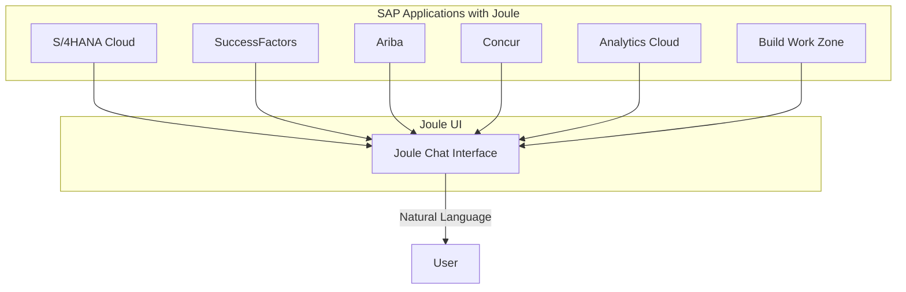
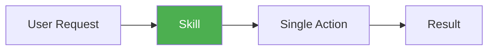
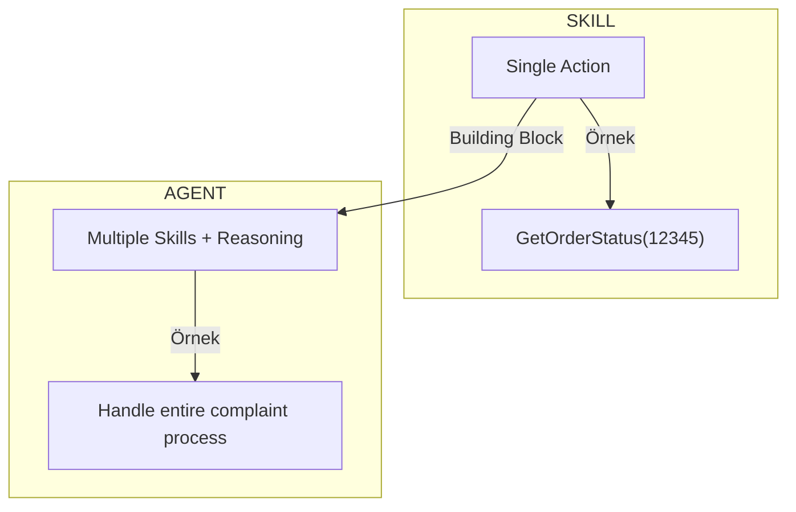
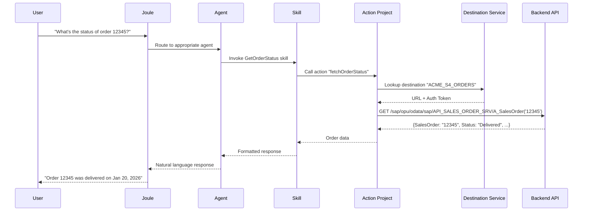
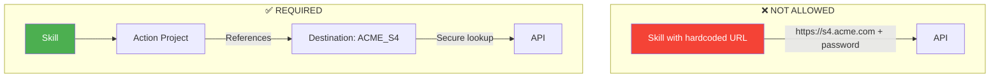
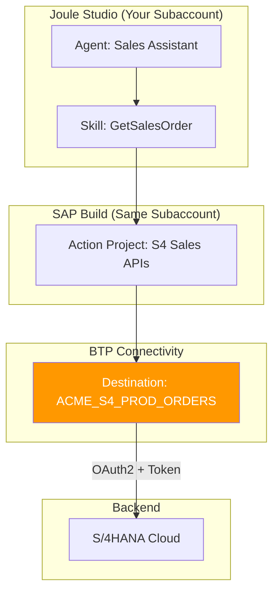
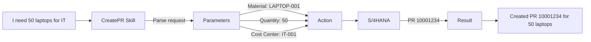
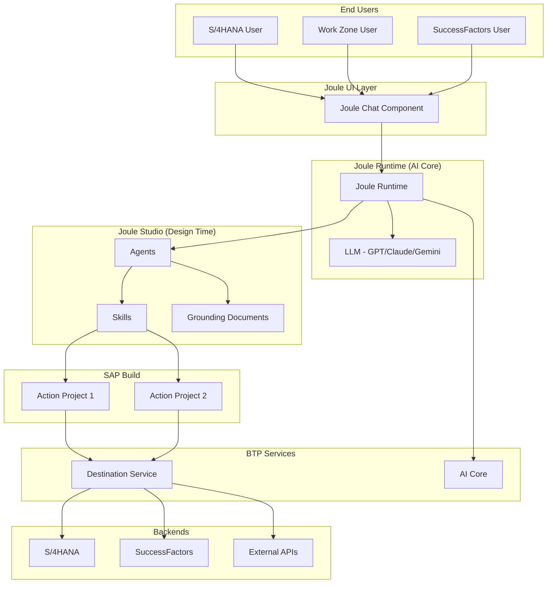
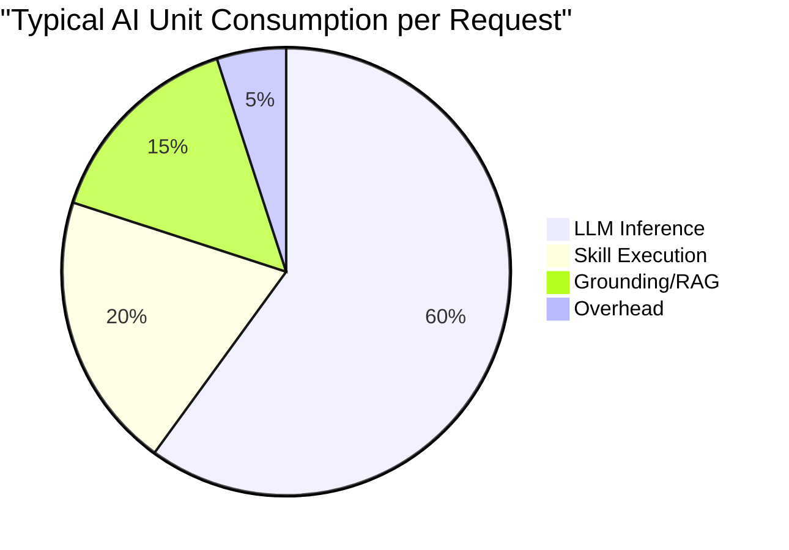
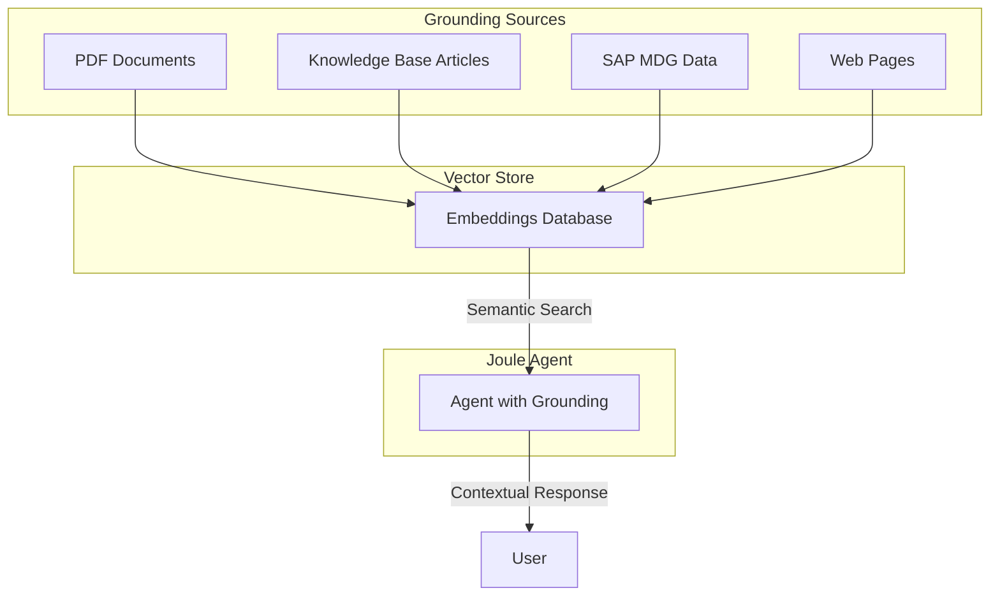

# Kısım 8: Joule Fundamentals

> *SAP's AI Copilot Explained*

---

Welcome to Part IV. This is where things get exciting. Joule is SAP's AI assistant—the generative AI copilot that will transform how users interact with SAP systems. Let's understand it properly.

---

## 8.1 What Is Joule? (The SAP AI Copilot)

**Joule** (pronounced "jewel") is SAP's generative AI assistant that:

- Lives inside SAP applications (S/4HANA, SuccessFactors, Ariba, Concur, etc.)
- Understands SAP data, processes, and business context
- Can be extended with custom **skills** and **agents**
- Uses natural language to interact with users

> **Think of it as**: A company-specific ChatGPT that knows your SAP landscape and can actually DO things—not just answer questions.

### Where Joule Appears



### Real-World Joule Conversations

**Örnek 1: HR Manager in SuccessFactors**
```
User: "Show me employees whose probation ends this month"
Joule: "I found 12 employees with probation ending in January 2026..."
       [Displays list with names, departments, end dates]
       "Would you like me to send a reminder to their managers?"
```

**Örnek 2: Procurement in Ariba**
```
User: "What's the status of PO 4500012345?"
Joule: "Purchase Order 4500012345:
        - Vendor: ABC Electronics GmbH
        - Total: €45,000
        - Status: Partially Delivered (3 of 5 items received)
        - Expected delivery of remaining items: Feb 15, 2026"
```

**Örnek 3: Finance in S/4HANA**
```
User: "Create a sales order for customer Acme Corp, 100 units of material FG-1000"
Joule: "I'll create that sales order:
        - Customer: Acme Corp (1000234)
        - Material: FG-1000 (Finished Goods Widget)
        - Quantity: 100 EA
        - Price: €50.00 each = €5,000.00 total

        Should I proceed?"
User: "Yes"
Joule: "Sales Order 12345678 created successfully."
```

---

## 8.2 Skills vs. Agents: The Key Difference

This is the most important concept. Let's get it crystal clear.

### Skill = One Superpower

A **skill** is a single, specific capability:



**Skill Örneks:**
| Skill Name | What It Does | Input | Output |
|------------|--------------|-------|--------|
| `GetSalesOrderStatus` | Looks up order status | Order Number | Status, dates, amounts |
| `CalculateDeliveryDate` | Estimates delivery | Material, Quantity, Location | Estimated date |
| `CreatePurchaseRequisition` | Creates PR | Material, Qty, Cost Center | PR Number |
| `SendTeamsMessage` | Posts to MS Teams | Channel, Message | Confirmation |
| `LookupCustomerCredit` | Checks credit limit | Customer ID | Credit info |

### Agent = Smart Orchestrator

An **agent** decides which skills to use and chains them together:

```mermaid
graph TD
    U[User: "Handle complaint for order 12345"] --> AG[Agent]

    AG --> |Step 1| S1[GetSalesOrderStatus]
    S1 --> |"Order found, status: Delayed"| AG

    AG --> |Step 2| S2[CheckInventoryAvailability]
    S2 --> |"Item in stock"| AG

    AG --> |Step 3| S3[CreateReturnOrder]
    S3 --> |"Return RO-789 created"| AG

    AG --> |Step 4| S4[SendApologyEmail]
    S4 --> |"Email sent"| AG

    AG --> R[Response to User]

    style AG fill:#2196F3,color:white
    style S1 fill:#4CAF50,color:white
    style S2 fill:#4CAF50,color:white
    style S3 fill:#4CAF50,color:white
    style S4 fill:#4CAF50,color:white
```

**The Agent's Internal Reasoning:**
```
User wants to handle a complaint about order 12345.

Step 1: I need to understand the order situation.
        → Using skill: GetSalesOrderStatus(12345)
        → Result: Order is delayed by 2 weeks

Step 2: Can we offer immediate replacement?
        → Using skill: CheckInventoryAvailability(material: FG-1000)
        → Result: Yes, 50 units in stock

Step 3: Create the return/exchange
        → Using skill: CreateReturnOrder(originalOrder: 12345, reason: "Delay compensation")
        → Result: Return order RO-789 created

Step 4: Notify the customer
        → Using skill: SendApologyEmail(customer: Acme Corp, context: delay + replacement)
        → Result: Email sent successfully

Response: "I've handled the complaint for order 12345. Created return order RO-789
          and sent an apology email to Acme Corp with replacement shipment details."
```

### Comparison Summary



| Aspect | Skill | Agent |
|--------|-------|-------|
| **Purpose** | Do ONE specific thing | Orchestrate MANY things |
| **Complexity** | Simple, predictable | Can reason and adapt |
| **Contains** | Single action or API call | Multiple skills + logic |
| **Örnek** | "Get order status" | "Handle customer complaint" |
| **When to build** | First (agents need skills) | After skills exist |
| **User interaction** | Usually invisible | The "face" users talk to |

---

## 8.3 How Skills "Do" Things (The Action Flow)

When Joule needs to actually DO something (not just chat), it uses this flow:



### The Components Explained

| Component | Nedir | Where It Lives |
|-----------|------------|----------------|
| **Joule** | The AI chat interface | SAP apps, Work Zone |
| **Agent** | The "brain" that decides what to do | Joule Studio |
| **Skill** | A specific capability | Joule Studio |
| **Action Project** | API wrapper (SAP Build) | SAP Build lobby |
| **Destination** | Connection configuration | BTP subaccount |
| **Backend API** | The actual service | S/4HANA, external API |

---

## 8.4 Why Destinations Are Required for Skills

This connects back to Kısım 5. Here's why you cannot skip destinations:

### Security Requirements



### What Would Go Wrong Without Destinations

| Issue | Impact |
|-------|--------|
| **Passwords in code** | Security breach if skill is exported |
| **URL changes** | Must rebuild and redeploy skill |
| **No password rotation** | Can't change creds without touching skills |
| **No audit trail** | Can't track who calls what |
| **Dev/Prod confusion** | Risk of calling wrong environment |

### The Proper Architecture



---

## 8.5 Real-World Skill Örneks

### Örnek 1: Sales Order Status Lookup

**Scenario:** Users ask "What's the status of order X?"

**Destination:**
```
Name:        ACME_S4_PROD_SALES
Type:        HTTP
URL:         https://my300001.s4hana.ondemand.com
Proxy Type:  Internet
Auth:        OAuth2ClientCredentials
Client ID:   sb-xsuaa-acme-sales!t12345
Secret:      ********
Token URL:   https://my300001.authentication.eu10.hana.ondemand.com/oauth/token
```

**Action Project API:**
```yaml
# OpenAPI spec used in Action Project
paths:
  /sap/opu/odata/sap/API_SALES_ORDER_SRV/A_SalesOrder('{SalesOrder}'):
    get:
      operationId: getSalesOrder
      parameters:
        - name: SalesOrder
          in: path
          required: true
          schema:
            type: string
```

**Skill Configuration:**
- Name: `GetSalesOrderStatus`
- Action: `getSalesOrder` from Action Project
- Input: `SalesOrder` (string)
- Output: Order details (formatted for user)

---

### Örnek 2: Create Purchase Requisition

**Scenario:** Users say "I need 50 laptops for IT department"

**Destination:**
```
Name:        ACME_S4_PROD_PROCUREMENT
Type:        HTTP
URL:         https://my300001.s4hana.ondemand.com
Proxy Type:  Internet
Auth:        OAuth2SAMLBearerAssertion
Client ID:   sb-xsuaa-acme-proc!t12346
Secret:      ********
Token URL:   https://my300001.authentication.eu10.hana.ondemand.com/oauth/token
```

**Why SAMLBearer?** Because we need the user's identity to flow to S/4—the PR should be created by the actual requesting user, not a technical user.

**Action Project API:**
```yaml
paths:
  /sap/opu/odata/sap/API_PURCHASEREQ_PROCESS_SRV/A_PurchaseRequisitionHeader:
    post:
      operationId: createPurchaseRequisition
      requestBody:
        content:
          application/json:
            schema:
              $ref: '#/components/schemas/PurchaseRequisition'
```

**Skill Flow:**


---

### Örnek 3: External Weather API for Logistics

**Scenario:** Logistics planner asks "What's the weather at our Frankfurt warehouse?"

**Destination:**
```
Name:        EXTERNAL_WEATHER_API
Type:        HTTP
URL:         https://api.openweathermap.org/data/2.5
Proxy Type:  Internet
Auth:        NoAuthentication

Additional Properties:
URL.headers.x-api-key: abc123def456
```

**Skill Configuration:**
- Name: `GetWarehouseWeather`
- Maps warehouse code → city coordinates
- Calls weather API
- Returns formatted weather info

**Why is this useful?** The agent can factor weather into delivery promises:
```
User: "Can we deliver to Munich today?"
Agent:
  1. Check inventory (Skill A)
  2. Check weather at Munich warehouse (Skill B)
  3. Weather shows heavy snow → delay likely
  4. Response: "We have stock, but heavy snow in Munich may delay delivery by 1 day"
```

---

## 8.6 The Joule Architecture Overview



---

## 8.7 Joule Entitlements and Licensing

### What You Need

| Entitlement | Purpose | Where to Enable |
|-------------|---------|-----------------|
| **Joule** | Core Joule capability | BTP Cockpit → Entitlements |
| **AI Core** | LLM runtime | BTP Cockpit → Entitlements |
| **AI Launchpad** | Manage AI deployments | BTP Cockpit → Entitlements |
| **Joule Studio** | Build skills/agents | SAP Build lobby |

### AI Units Consumption

Joule consumes **AI Units** (credits):



**Factors affecting consumption:**
- Complexity of request
- Number of skills chained
- Grounding document size
- LLM model used (GPT-4 > GPT-3.5)

### Enabling Joule in Your Subaccount

1. **Check Entitlements**
   - BTP Cockpit → Global Account → Entitlements
   - Search for "Joule" and "AI Core"
   - Add to your subaccount

2. **Run the Joule Booster**
   - BTP Cockpit → Boosters → Search "Joule"
   - Run "Set Up Joule"
   - This creates required service instances

3. **Access Joule Studio**
   - SAP Build lobby → Joule Studio
   - Or: BTP Cockpit → Instances → Joule Studio

---

## 8.8 Grounding: Teaching Joule Your Context

**Grounding** = giving the agent specific knowledge about your company.

### Without Grounding
```
User: "What's our return policy?"
Joule: "I don't have information about your specific return policy.
        Generally, return policies vary by company..."
```

### With Grounding
```
User: "What's our return policy?"
Joule: "According to ACME Corp's return policy document:
        - Returns accepted within 30 days
        - Original receipt required
        - Restocking fee of 15% for opened items
        - No returns on custom orders"
```

### Types of Grounding



### Setting Up Grounding

1. **Upload documents** to Joule Studio grounding section
2. **Process** (creates embeddings)
3. **Assign** to agent

---

## Temel Çıkarımlar

1. **Joule is SAP's AI copilot** — Lives in SAP apps, understands SAP context
2. **Skills are single actions** — One capability, one API call
3. **Agents orchestrate skills** — Chain multiple skills with reasoning
4. **Destinations are mandatory** — No hardcoded URLs/passwords
5. **Action Projects bridge** — SAP Build connects skills to destinations
6. **Grounding adds context** — Teach Joule your company specifics
7. **AI Units = cost** — Monitor consumption

---

## Sırada Ne Var?

Now that you understand the fundamentals, let's build your first Joule skill step by step—from destination to deployed skill.

---

*[Önceki: Kısım 7 – Fiori & UI5 in BTP](07-fiori-ui5-btp.md) | [Sonraki: Kısım 9 – Building Your First Joule Skill](09-first-joule-skill.md)*

*[İçindekilere Dön](../content.md)*

---

**Yazar:** [Beyhan Meyrali](https://www.linkedin.com/in/beyhanmeyrali) — SAP Storyteller & Digital Transformation Advocate

*Oluşturuldu ❤️ dünya genelindeki SAP öğrencileri için*
