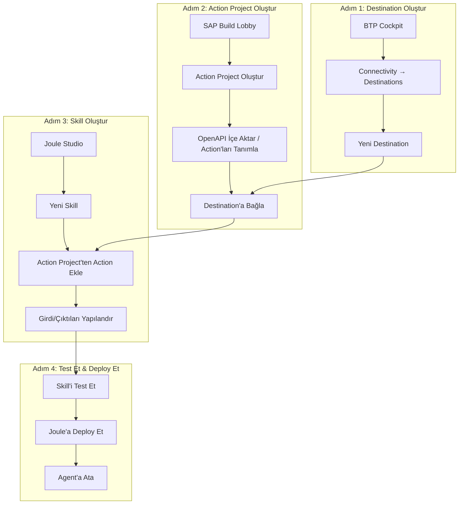
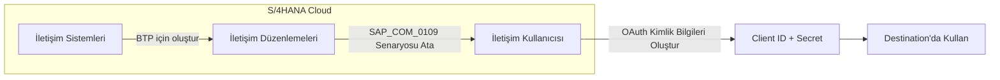
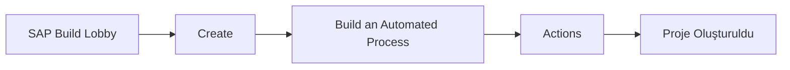
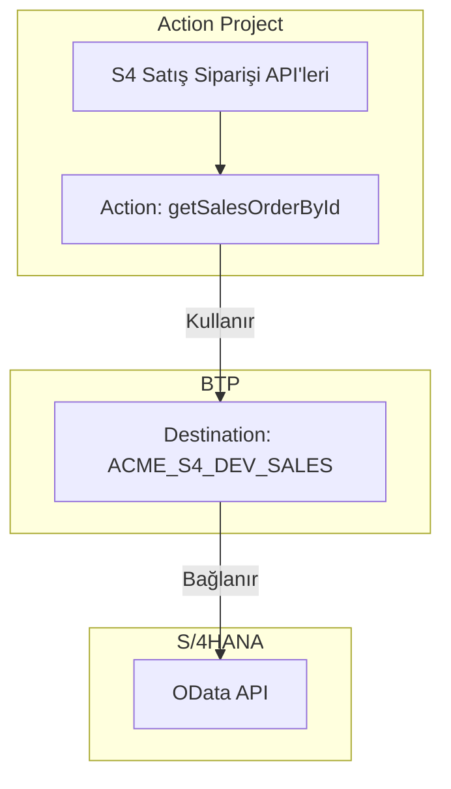
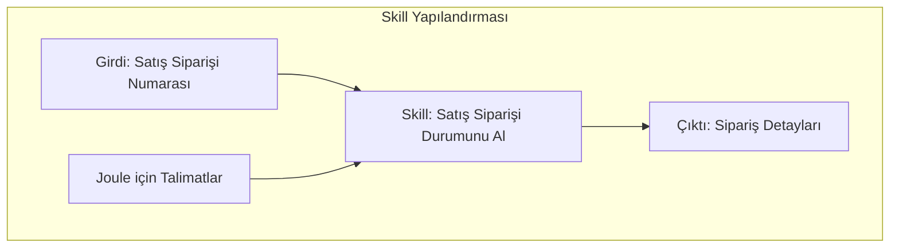
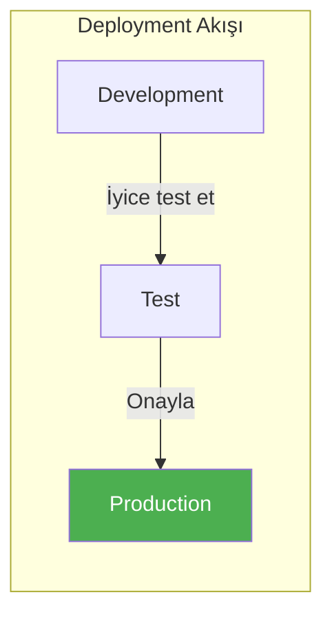
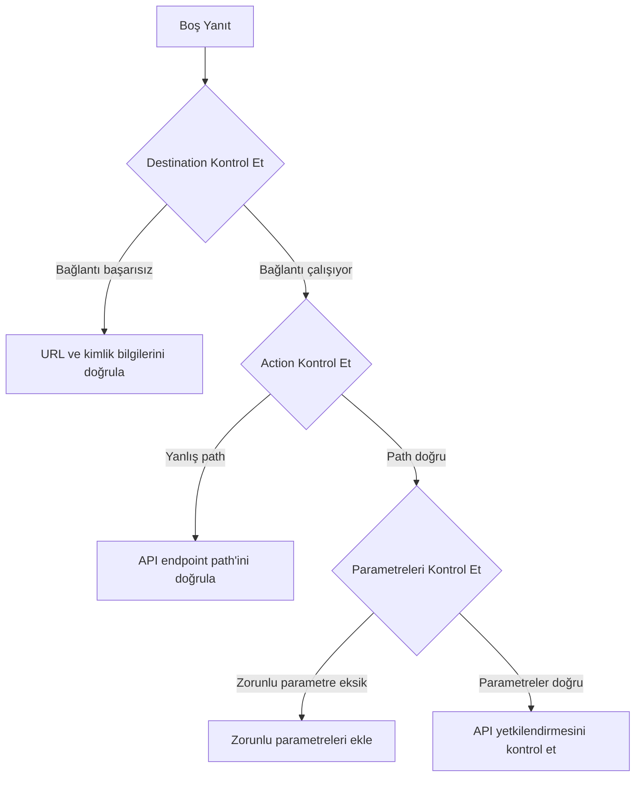

# Kısım 9: İlk Joule Skill'inizi Oluşturma

> *Adım Adım Kılavuz*

---

Bu bölüm tam bir uygulamalı rehberdir. Sonunda, gerçek bir API'yi çağıran çalışan bir Joule skill'iniz olacak. Teori yok—sadece uygulama.

---

## 9.1 Uçtan Uca Akış Genel Bakış

Başlamadan önce, ne oluşturacağımızın tam resmi:



**Örnek Senaryomuz:**
> S/4HANA Cloud'dan satış siparişi durumunu sorgulayan bir skill oluşturun.
> Kullanıcılar şöyle soracak: "12345 numaralı siparişin durumu nedir?"

---

## 9.2 Adım 1: Destination Oluşturma

### Destination'lara Gitme

1. BTP Cockpit'i açın: `https://cockpit.eu10.hana.ondemand.com`
2. **Global Account**'unuzu seçin
3. **Subaccount**'unuzu seçin (örn., `ACME-DEV`)
4. Sol menü: **Connectivity → Destinations**
5. **New Destination**'a tıklayın

### Destination Detaylarını Doldurma

S/4HANA Cloud bağlantısı için:

```yaml
# Destination Yapılandırması
Name: ACME_S4_DEV_SALES
Type: HTTP
Description: ACME S/4HANA DEV - Satış Siparişi API'leri
URL: https://my300001-api.s4hana.ondemand.com
Proxy Type: Internet
Authentication: OAuth2ClientCredentials

# OAuth2 Ayarları
Client ID: sb-xsuaa-sales-api!t54321
Client Secret: aBcDeFgHiJkLmNoPqRsTuVwXyZ123456=
Token Service URL Type: Dedicated
Token Service URL: https://my300001.authentication.eu10.hana.ondemand.com/oauth/token

# Ek Özellikler ("New Property"ye tıklayın)
sap-client: 100
URL.headers.Content-Type: application/json
```

### Bu Değerleri Nasıl Alırsınız

**S/4HANA Cloud'dan:**



1. S/4HANA Cloud'da: **İletişim Yönetimi → İletişim Düzenlemeleri**
2. `SAP_COM_0109` (Satış Siparişi Entegrasyonu) için düzenleme bulun veya oluşturun
3. OAuth 2.0 kimlik bilgileriyle **İletişim Kullanıcısı** oluşturun
4. Client ID, Secret ve Token URL'yi kopyalayın

### Destination'ı Test Etme

**Check Connection**'a tıklayın

Beklenen sonuç:
```
✅ "ACME_S4_DEV_SALES" bağlantısı kuruldu.
Yanıt: 200 OK
```

Hata alırsanız, sorun giderme için Ek D'ye bakın.

---

## 9.3 Adım 2: SAP Build'de Action Project Oluşturma

### SAP Build'e Erişim

1. BTP Cockpit → **Instances and Subscriptions**
2. **SAP Build**'i bulun → **Go to Application**'a tıklayın
3. Artık SAP Build Lobby'desiniz

### Yeni Action Project Oluşturma

1. **Create**'e tıklayın
2. **Build an Automated Process** seçin
3. **Actions** seçin
4. Proje adı: `S4 Satış Siparişi API'leri`
5. **Create**'e tıklayın



### Action Project'e API Ekleme

**Seçenek A: OpenAPI Spesifikasyonunu İçe Aktarma (Önerilen)**

1. **Add API**'ye tıklayın
2. **Upload API Specification** seçin
3. Satış Siparişi API'si için OpenAPI/Swagger dosyasını yükleyin

OpenAPI spec'i nereden alabilirsiniz:
- **SAP Business Accelerator Hub**: `https://api.sap.com`
- Arayın: `Sales Order (A2X)`
- OpenAPI 3.0 JSON/YAML indirin

**Örnek OpenAPI Spec (basitleştirilmiş):**
```yaml
openapi: 3.0.0
info:
  title: Satış Siparişi API
  version: 1.0.0

servers:
  - url: https://my300001-api.s4hana.ondemand.com

paths:
  /sap/opu/odata/sap/API_SALES_ORDER_SRV/A_SalesOrder('{SalesOrder}'):
    get:
      summary: ID ile Satış Siparişi Al
      operationId: getSalesOrderById
      parameters:
        - name: SalesOrder
          in: path
          required: true
          schema:
            type: string
          description: Satış Siparişi Numarası (örn., "12345")
        - name: $select
          in: query
          schema:
            type: string
          description: Döndürülecek alanlar
        - name: $expand
          in: query
          schema:
            type: string
          description: Dahil edilecek ilişkili varlıklar
      responses:
        '200':
          description: Satış Siparişi Detayları
          content:
            application/json:
              schema:
                $ref: '#/components/schemas/SalesOrder'

  /sap/opu/odata/sap/API_SALES_ORDER_SRV/A_SalesOrder:
    get:
      summary: Satış Siparişleri Listesini Al
      operationId: getSalesOrders
      parameters:
        - name: $filter
          in: query
          schema:
            type: string
        - name: $top
          in: query
          schema:
            type: integer
      responses:
        '200':
          description: Satış Siparişleri Listesi

components:
  schemas:
    SalesOrder:
      type: object
      properties:
        SalesOrder:
          type: string
        SalesOrderType:
          type: string
        SalesOrganization:
          type: string
        SoldToParty:
          type: string
        TotalNetAmount:
          type: string
        TransactionCurrency:
          type: string
        OverallDeliveryStatus:
          type: string
        CreationDate:
          type: string
```

**Seçenek B: Action'ları Manuel Tanımlama**

1. **Add API**'ye tıklayın
2. **Create from Scratch** seçin
3. Endpoint'i tanımlayın:

```yaml
Action Adı: Satış Siparişi Durumunu Al
HTTP Method: GET
Path: /sap/opu/odata/sap/API_SALES_ORDER_SRV/A_SalesOrder('{SalesOrder}')
```

4. Parametre ekleyin:
   - Ad: `SalesOrder`
   - Tür: String
   - Zorunlu: Evet

5. Yanıt eşlemesini tanımlayın

### Destination'a Bağlanma

1. Action Project'te **Settings**'e (dişli simgesi) tıklayın
2. **Destinations** seçin
3. Listeden **ACME_S4_DEV_SALES**'ı seçin
4. **Save**'e tıklayın



### Action'ı Test Etme

1. `getSalesOrderById` action'ına tıklayın
2. **Test** sekmesine tıklayın
3. Test verisini girin:
   ```
   SalesOrder: 1
   ```
4. **Execute**'a tıklayın

Beklenen yanıt:
```json
{
  "d": {
    "SalesOrder": "1",
    "SalesOrderType": "OR",
    "SalesOrganization": "1710",
    "SoldToParty": "17100001",
    "TotalNetAmount": "52750.00",
    "TransactionCurrency": "USD",
    "OverallDeliveryStatus": "C",
    "CreationDate": "/Date(1704067200000)/"
  }
}
```

### Action Project'i Yayınlama

1. **Release**'e tıklayın
2. Versiyon notu ekleyin: "İlk sürüm - Satış Siparişi sorgusu"
3. **Release**'e tıklayın
4. **Publish to Library**'ye tıklayın

---

## 9.4 Adım 3: Joule Studio'da Skill Oluşturma

### Joule Studio'ya Erişim

1. SAP Build Lobby → **Joule Studio** (sol menü)
2. Veya: BTP Cockpit → Instances → Joule Studio

### Yeni Skill Oluşturma

1. **Create Skill**'e tıklayın
2. Detayları doldurun:

```yaml
Skill Adı: Satış Siparişi Durumunu Al
Açıklama: Sipariş numarasına göre satış siparişinin güncel durumunu alır
Kategori: Satış
```



### Skill'e Action Ekleme

1. Skill editöründe **Add Action**'a tıklayın
2. **From Action Project** seçin
3. Projenizi bulun: `S4 Satış Siparişi API'leri`
4. Action'ı seçin: `getSalesOrderById`
5. **Add**'e tıklayın

### Girdi Parametrelerini Yapılandırma

Kullanıcı girdisini API parametrelerine eşleyin:

```yaml
Skill Girdisi:
  - Ad: salesOrderNumber
    Tür: String
    Açıklama: Sorgulanacak satış siparişi numarası
    Zorunlu: Evet
    Örnek: "12345"

Action Eşlemesi:
  - Action Parametresi: SalesOrder
    Eşlenir: salesOrderNumber
```

### Çıktıyı Yapılandırma

Skill'in ne döndüreceğini tanımlayın:

```yaml
Çıktı Alanları:
  - Alan: orderNumber
    Kaynak: response.d.SalesOrder
    Tür: String

  - Alan: customer
    Kaynak: response.d.SoldToParty
    Tür: String

  - Alan: amount
    Kaynak: response.d.TotalNetAmount
    Tür: Number

  - Alan: currency
    Kaynak: response.d.TransactionCurrency
    Tür: String

  - Alan: deliveryStatus
    Kaynak: response.d.OverallDeliveryStatus
    Tür: String

  - Alan: createdOn
    Kaynak: response.d.CreationDate
    Tür: Date
```

### Skill Talimatları Ekleme

Joule'a bu skill'i ne zaman ve nasıl kullanacağını söyleyin:

```markdown
## Ne Zaman Kullanılır
Bu skill'i kullanıcı şunları sorduğunda kullanın:
- Satış siparişi durumu
- Sipariş detayları
- Siparişin teslimat durumu
- Belirli bir sipariş numarası hakkında bilgi

## Örnek Kullanıcı Sorguları
- "12345 numaralı siparişin durumu nedir?"
- "67890 numaralı siparişi göster"
- "11111 numaralı sipariş teslim edildi mi?"
- "54321 satış siparişini kontrol et"

## Yanıt Kuralları
Sonuçları sunarken:
- Her zaman sipariş numarasını belirtin
- Varsa müşteri adını gösterin
- Para birimi ile toplam tutarı dahil edin
- Teslimat durumunu anlaşılır dilde açıklayın:
  - "A" = Henüz teslim edilmedi
  - "B" = Kısmen teslim edildi
  - "C" = Tamamen teslim edildi
```

---

## 9.5 Adım 4: Test Etme ve Deploy Etme

### Skill'i Test Etme

1. Joule Studio'da **Test**'e tıklayın
2. Test girdisi girin:
   ```
   salesOrderNumber: 1
   ```
3. **Run Test**'e tıklayın

**Beklenen Test Sonucu:**
```json
{
  "orderNumber": "1",
  "customer": "17100001",
  "amount": 52750.00,
  "currency": "USD",
  "deliveryStatus": "C",
  "createdOn": "2024-01-01"
}
```

### Etkileşimli Test

Doğal dil testi için **Chat Test**'e tıklayın:

```
Siz: 1 numaralı siparişin durumu nedir?

Joule: Satış Siparişi 1:
       - Müşteri: 17100001
       - Toplam Tutar: $52,750.00 USD
       - Teslimat Durumu: Tamamen teslim edildi
       - Oluşturulma: 1 Ocak 2024
```

### Skill'i Deploy Etme

1. **Deploy**'a tıklayın
2. Deployment hedefini seçin:
   - Test için **Development**
   - Canlı kullanım için **Production**
3. **Deploy**'a tıklayın



---

## 9.6 Tam Örnek: Hava Durumu Destekli Lojistik Skill

Harici API ile daha karmaşık bir örnek oluşturalım.

### Senaryo

> Lojistik planlayıcıları soruyor: "Münih depomuzda hava durumu nasıl?"
> Skill, teslimat risklerini değerlendirmek için hava koşullarını kontrol etmeli.

### Adım 1: Hava Durumu API Destination'ı Oluşturma

```yaml
Name: EXTERNAL_OPENWEATHER
Type: HTTP
URL: https://api.openweathermap.org/data/2.5
Proxy Type: Internet
Authentication: NoAuthentication

Ek Özellikler:
URL.headers.Accept: application/json
URL.queries.appid: sizin_api_anahtariniz
URL.queries.units: metric
```

### Adım 2: Action Project Oluşturma

**Hava Durumu için OpenAPI Spec:**
```yaml
openapi: 3.0.0
info:
  title: OpenWeather API
  version: 1.0.0

servers:
  - url: https://api.openweathermap.org/data/2.5

paths:
  /weather:
    get:
      summary: Güncel Hava Durumunu Al
      operationId: getCurrentWeather
      parameters:
        - name: q
          in: query
          required: true
          schema:
            type: string
          description: Şehir adı (örn., "Munich,DE")
      responses:
        '200':
          description: Hava durumu verisi
          content:
            application/json:
              schema:
                $ref: '#/components/schemas/WeatherResponse'

components:
  schemas:
    WeatherResponse:
      type: object
      properties:
        name:
          type: string
        main:
          type: object
          properties:
            temp:
              type: number
            humidity:
              type: number
        weather:
          type: array
          items:
            type: object
            properties:
              main:
                type: string
              description:
                type: string
        wind:
          type: object
          properties:
            speed:
              type: number
```

### Adım 3: Depo Eşlemeli Skill Oluşturma

**Skill: Depo Hava Durumunu Al**

```yaml
Skill Adı: Depo Hava Durumunu Al
Açıklama: Şirket depolarındaki hava koşullarını kontrol eder

Girdi Parametreleri:
  - Ad: warehouseCode
    Tür: String
    Açıklama: Depo kodu (örn., MUC, FRA, BER)
    Zorunlu: Evet

Dahili Mantık:
  # Depo kodlarını şehirlere eşle
  warehouseMapping:
    MUC: "Munich,DE"
    FRA: "Frankfurt,DE"
    BER: "Berlin,DE"
    HAM: "Hamburg,DE"
    VIE: "Vienna,AT"

Çıktı:
  - location: Şehir adı
  - temperature: Celsius cinsinden güncel sıcaklık
  - condition: Hava koşulu (Açık, Yağmur, Kar, vb.)
  - windSpeed: m/s cinsinden rüzgar hızı
  - deliveryRisk: Hesaplanan risk seviyesi (Düşük, Orta, Yüksek)
```

**Skill Talimatları:**
```markdown
## Ne Zaman Kullanılır
- Kullanıcı bir depodaki hava durumunu sorar
- Kullanıcı teslimat koşullarını sorar
- Kullanıcı havanın lojistiği etkileyip etkilemeyeceğini bilmek ister

## Depo Kodları
- MUC = Münih
- FRA = Frankfurt
- BER = Berlin
- HAM = Hamburg
- VIE = Viyana

## Risk Hesaplama
- Kar veya Buz: Yüksek risk
- Yağmur + Rüzgar > 10 m/s: Orta risk
- Açık hava: Düşük risk

## Örnek Yanıtlar
"Münih depomuzda (MUC) şu anki hava durumu:
- Sıcaklık: 5°C
- Koşul: Hafif kar
- Rüzgar: 12 m/s
- Teslimat Riski: YÜKSEK - Kar koşulları sevkiyatları geciktirebilir"
```

### Adım 4: Tam Akışı Test Etme

```
Kullanıcı: "MUC deposunda hava durumu nasıl?"

Joule: Münih depomuzun hava durumunu kontrol ediyorum.

       Münih Deposu (MUC) Hava Durumu:
       🌡️ Sıcaklık: 2°C
       🌨️ Koşul: Hafif Kar
       💨 Rüzgar: 8 m/s

       ⚠️ Teslimat Riski: YÜKSEK
       Kar koşulları gecikmelere neden olabilir.
       Müşterileri olası gecikmeler konusunda bilgilendirmeyi düşünün.
```

---

## 9.7 Yaygın Sorunları Ayıklama

### Sorun: Action Boş Yanıt Döndürüyor



**Kontrol Listesi:**
1. ✅ Destination "Check Connection" başarılı
2. ✅ Action Project doğru destination'a bağlı
3. ✅ API path'i gerçek endpoint ile eşleşiyor
4. ✅ Tüm zorunlu parametreler eşlenmiş
5. ✅ API kullanıcısının doğru yetkileri var

### Sorun: Skill Joule'da Görünmüyor

**Olası nedenler:**
- Skill deploy edilmemiş
- Yanlış ortama deployment
- Kullanıcı skill'e atanmamış

**Çözüm:**
1. Joule Studio'da deployment durumunu kontrol edin
2. Subaccount'un doğru olduğunu doğrulayın
3. Skill izinlerini kontrol edin

### Sorun: "Action Not Found" Hatası

```
Hata: "getSalesOrderById" action'ı bulunamadı
```

**Nedenler:**
1. Action Project yayınlanmamış
2. Yanlış action adı referansı
3. Action Project farklı subaccount'ta

**Çözüm:**
1. Action Project'i yayınlayın
2. Skill'de action'ı yeniden bağlayın
3. Doğru subaccount'ta olduğunuzu doğrulayın

---

## 9.8 Prodüksiyon Skill'leri için En İyi Uygulamalar

### 1. Hata Yönetimi

API başarısız olduğunda ne olacağını tanımlayın:

```yaml
Hata Yönetimi:
  onError:
    - type: API_ERROR
      response: "Sipariş bilgilerini alamadım. Lütfen tekrar deneyin veya destekle iletişime geçin."

    - type: NOT_FOUND
      response: "{orderNumber} numaralı sipariş bulunamadı. Lütfen sipariş numarasını kontrol edip tekrar deneyin."

    - type: UNAUTHORIZED
      response: "Bu siparişe erişim yetkim yok. Lütfen yöneticinizle iletişime geçin."
```

### 2. Girdi Doğrulama

API'leri çağırmadan önce girdileri doğrulayın:

```yaml
Doğrulama Kuralları:
  salesOrderNumber:
    - pattern: "^[0-9]{1,10}$"
      message: "Sipariş numarası 1-10 rakam olmalıdır"
    - required: true
      message: "Lütfen bir sipariş numarası girin"
```

### 3. Yanıt Formatlama

Yanıtları kullanıcı dostu yapın:

```yaml
Yanıt Şablonu: |
  📦 **Satış Siparişi {orderNumber}**

  | Alan | Değer |
  |------|-------|
  | Müşteri | {customerName} |
  | Tutar | {amount} {currency} |
  | Durum | {deliveryStatusText} |
  | Oluşturulma | {createdDate} |

  {additionalNotes}
```

### 4. Loglama ve İzleme

Skill kullanımını takip edin:
- Joule Studio'da loglamayı etkinleştirin
- API çağrı hacimlerini izleyin
- Hata oranlarını takip edin
- Kullanıcı geri bildirimlerini inceleyin

---

## Temel Çıkarımlar

1. **Dört adımlı süreç**: Destination → Action Project → Skill → Deploy
2. **Önce destination'lar**: Her şeyden önce destination'ı oluşturup test edin
3. **OpenAPI spec'leri yardımcı olur**: Manuel tanımlama yerine API spec'lerini içe aktarın
4. **Her adımda test edin**: İlerlemeden önce her bileşenin çalıştığını doğrulayın
5. **İyi talimatlar önemli**: Açık skill talimatları Joule'un skill'leri doğru kullanmasına yardımcı olur
6. **Hataları zarif yönetin**: İşler başarısız olduğunda kullanıcılar faydalı mesajlar almalı

---

## Sırada Ne Var?

Bir skill oluşturdunuz. Şimdi birden fazla skill'i birlikte kullanabilen ve karmaşık istekler hakkında akıl yürütebilen bir agent oluşturalım.

---

*[Önceki: Kısım 8 – Joule Temelleri](08-joule-fundamentals.md) | [Sonraki: Kısım 10 – Joule Agent'ları Oluşturma](10-building-agents.md)*

*[İçindekilere Dön](../content.md)*

---

**Yazar:** [Beyhan Meyrali](https://www.linkedin.com/in/beyhanmeyrali) — SAP Hikaye Anlatıcısı & Dijital Dönüşüm Savunucusu

*Dünya genelindeki SAP öğrencileri için ❤️ ile oluşturuldu*
