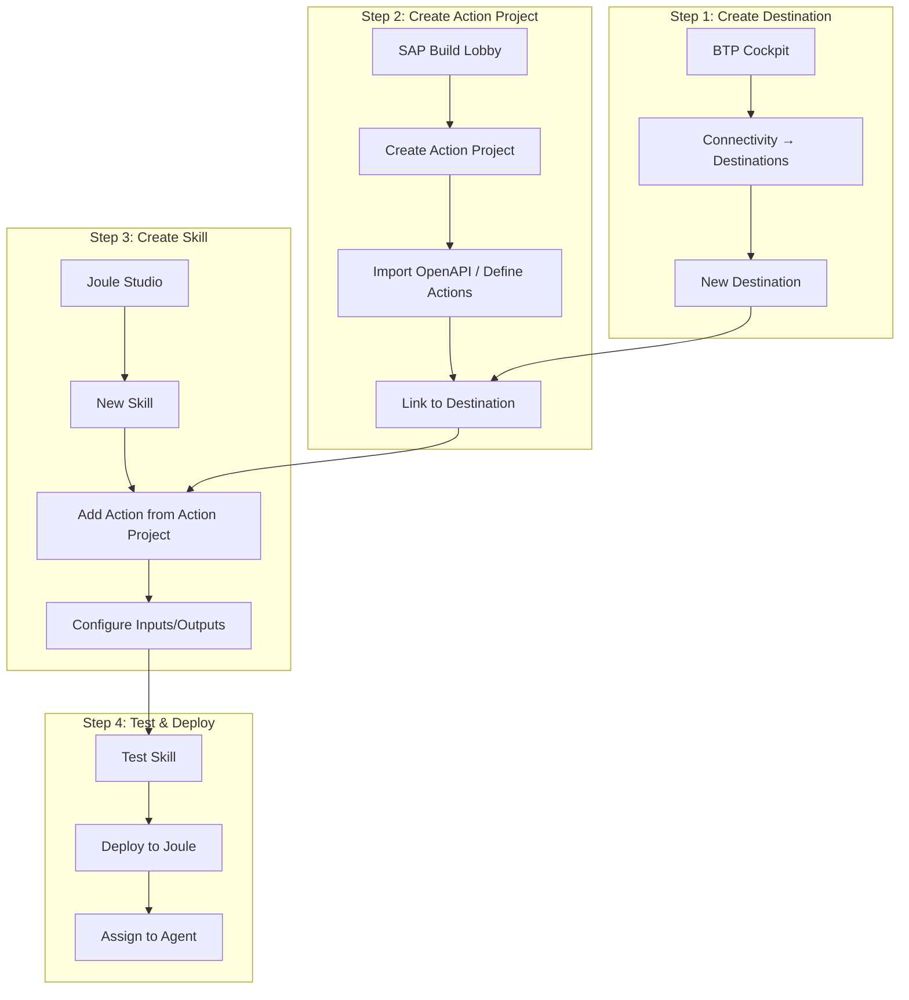
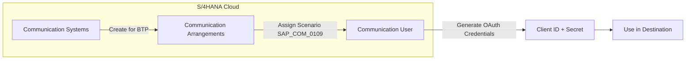
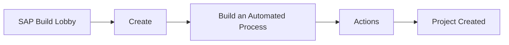
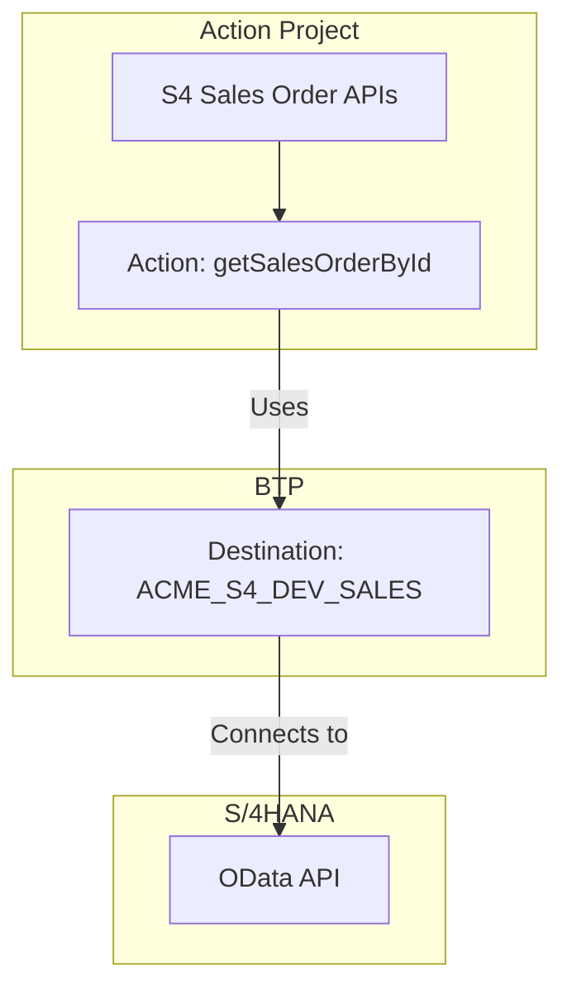
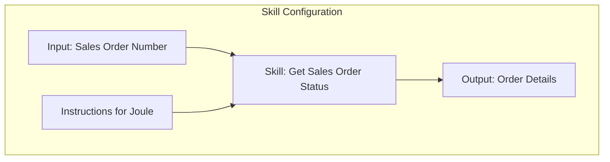
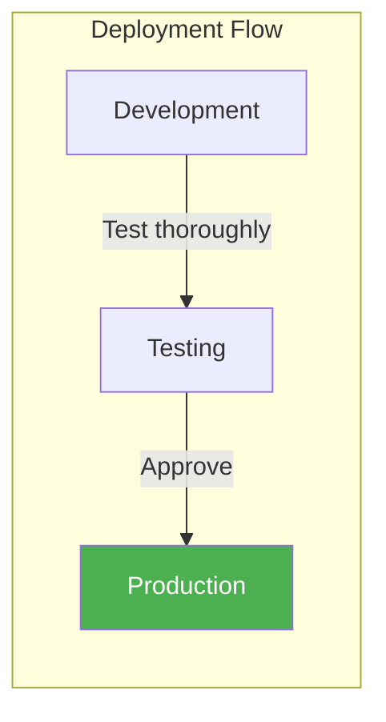
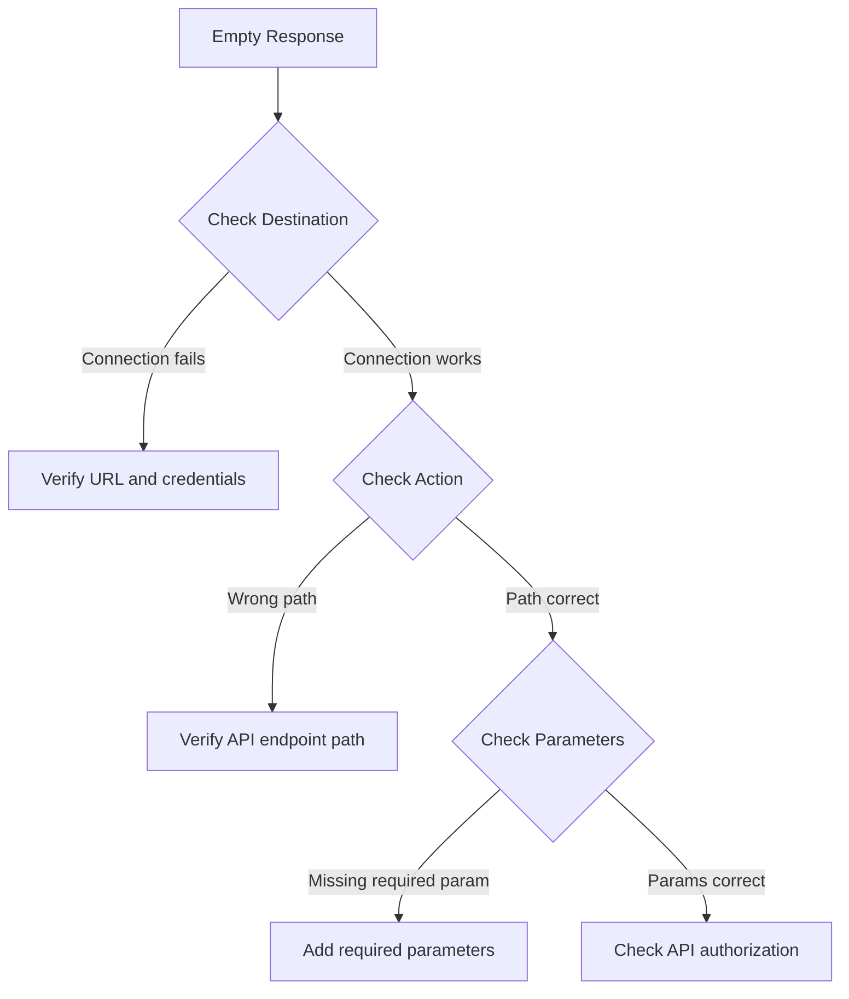

# Kısım 9: Building Your First Joule Skill

> *Step-by-Step Walkthrough*

---

This chapter is a complete hands-on guide. By the end, you'll have a working Joule skill that calls a real API. No theory—just doing.

---

## 9.1 The End-to-End Flow Overview

Before we start, here's the complete picture of what we're building:



**Our Örnek Scenario:**
> Build a skill that looks up sales order status from S/4HANA Cloud.
> Users will say: "What's the status of order 12345?"

---

## 9.2 Step 1: Create a Destination

### Navigate to Destinations

1. Open BTP Cockpit: `https://cockpit.eu10.hana.ondemand.com`
2. Select your **Global Account**
3. Select your **Subaccount** (e.g., `ACME-DEV`)
4. Left menu: **Connectivity → Destinations**
5. Click **New Destination**

### Fill in Destination Details

For S/4HANA Cloud connection:

```yaml
# Destination Configuration
Name: ACME_S4_DEV_SALES
Type: HTTP
Description: ACME S/4HANA DEV - Sales Order APIs
URL: https://my300001-api.s4hana.ondemand.com
Proxy Type: Internet
Authentication: OAuth2ClientCredentials

# OAuth2 Settings
Client ID: sb-xsuaa-sales-api!t54321
Client Secret: aBcDeFgHiJkLmNoPqRsTuVwXyZ123456=
Token Service URL Type: Dedicated
Token Service URL: https://my300001.authentication.eu10.hana.ondemand.com/oauth/token

# Additional Properties (click "New Property")
sap-client: 100
URL.headers.Content-Type: application/json
```

### How to Get These Values

**From S/4HANA Cloud:**



1. In S/4HANA Cloud: **Communication Management → Communication Arrangements**
2. Find or create arrangement for `SAP_COM_0109` (Sales Order Integration)
3. Create **Communication User** with OAuth 2.0 credentials
4. Copy the Client ID, Secret, and Token URL

### Test the Destination

Click **Check Connection**

Expected result:
```
✅ Connection to "ACME_S4_DEV_SALES" established.
Response: 200 OK
```

If you get errors, see Ek D for troubleshooting.

---

## 9.3 Step 2: Create an Action Project in SAP Build

### Access SAP Build

1. BTP Cockpit → **Instances and Subscriptions**
2. Find **SAP Build** → Click **Go to Application**
3. You're now in the SAP Build Lobby

### Create New Action Project

1. Click **Create**
2. Select **Build an Automated Process**
3. Choose **Actions**
4. Project name: `S4 Sales Order APIs`
5. Click **Create**



### Add API to Action Project

**Option A: Import OpenAPI Specification (Recommended)**

1. Click **Add API**
2. Select **Upload API Specification**
3. Upload the OpenAPI/Swagger file for Sales Order API

Where to get the OpenAPI spec:
- **SAP Business Accelerator Hub**: `https://api.sap.com`
- Search for: `Sales Order (A2X)`
- Download the OpenAPI 3.0 JSON/YAML

**Sample OpenAPI Spec (simplified):**
```yaml
openapi: 3.0.0
info:
  title: Sales Order API
  version: 1.0.0

servers:
  - url: https://my300001-api.s4hana.ondemand.com

paths:
  /sap/opu/odata/sap/API_SALES_ORDER_SRV/A_SalesOrder('{SalesOrder}'):
    get:
      summary: Get Sales Order by ID
      operationId: getSalesOrderById
      parameters:
        - name: SalesOrder
          in: path
          required: true
          schema:
            type: string
          description: Sales Order Number (e.g., "12345")
        - name: $select
          in: query
          schema:
            type: string
          description: Fields to return
        - name: $expand
          in: query
          schema:
            type: string
          description: Related entities to include
      responses:
        '200':
          description: Sales Order Details
          content:
            application/json:
              schema:
                $ref: '#/components/schemas/SalesOrder'

  /sap/opu/odata/sap/API_SALES_ORDER_SRV/A_SalesOrder:
    get:
      summary: Get Sales Orders List
      operationId: getSalesOrders
      parameters:
        - name: $filter
          in: query
          schema:
            type: string
        - name: $top
          in: query
          schema:
            type: integer
      responses:
        '200':
          description: List of Sales Orders

components:
  schemas:
    SalesOrder:
      type: object
      properties:
        SalesOrder:
          type: string
        SalesOrderType:
          type: string
        SalesOrganization:
          type: string
        SoldToParty:
          type: string
        TotalNetAmount:
          type: string
        TransactionCurrency:
          type: string
        OverallDeliveryStatus:
          type: string
        CreationDate:
          type: string
```

**Option B: Define Actions Manually**

1. Click **Add API**
2. Select **Create from Scratch**
3. Define the endpoint:

```yaml
Action Name: Get Sales Order Status
HTTP Method: GET
Path: /sap/opu/odata/sap/API_SALES_ORDER_SRV/A_SalesOrder('{SalesOrder}')
```

4. Add parameter:
   - Name: `SalesOrder`
   - Type: String
   - Required: Yes

5. Define response mapping

### Connect to Destination

1. In Action Project, click **Settings** (gear icon)
2. Select **Destinations**
3. Choose **ACME_S4_DEV_SALES** from the list
4. Click **Save**



### Test the Action

1. Click on the action `getSalesOrderById`
2. Click **Test** tab
3. Enter test data:
   ```
   SalesOrder: 1
   ```
4. Click **Execute**

Expected response:
```json
{
  "d": {
    "SalesOrder": "1",
    "SalesOrderType": "OR",
    "SalesOrganization": "1710",
    "SoldToParty": "17100001",
    "TotalNetAmount": "52750.00",
    "TransactionCurrency": "USD",
    "OverallDeliveryStatus": "C",
    "CreationDate": "/Date(1704067200000)/"
  }
}
```

### Publish the Action Project

1. Click **Release**
2. Add version note: "Initial release - Sales Order lookup"
3. Click **Release**
4. Click **Publish to Library**

---

## 9.4 Step 3: Create a Skill in Joule Studio

### Access Joule Studio

1. SAP Build Lobby → **Joule Studio** (left menu)
2. Or: BTP Cockpit → Instances → Joule Studio

### Create New Skill

1. Click **Create Skill**
2. Fill in details:

```yaml
Skill Name: Get Sales Order Status
Description: Retrieves the current status of a sales order by its number
Category: Sales
```



### Add Action to Skill

1. In the skill editor, click **Add Action**
2. Select **From Action Project**
3. Find your project: `S4 Sales Order APIs`
4. Select action: `getSalesOrderById`
5. Click **Add**

### Configure Input Parameters

Map user input to API parameters:

```yaml
Skill Input:
  - Name: salesOrderNumber
    Type: String
    Description: The sales order number to look up
    Required: Yes
    Örnek: "12345"

Action Mapping:
  - Action Parameter: SalesOrder
    Maps to: salesOrderNumber
```

### Configure Output

Define what the skill returns:

```yaml
Output Fields:
  - Field: orderNumber
    Source: response.d.SalesOrder
    Type: String

  - Field: customer
    Source: response.d.SoldToParty
    Type: String

  - Field: amount
    Source: response.d.TotalNetAmount
    Type: Number

  - Field: currency
    Source: response.d.TransactionCurrency
    Type: String

  - Field: deliveryStatus
    Source: response.d.OverallDeliveryStatus
    Type: String

  - Field: createdOn
    Source: response.d.CreationDate
    Type: Date
```

### Add Skill Instructions

Tell Joule when and how to use this skill:

```markdown
## Ne Zaman Kullanılır
Use this skill when the user asks about:
- Sales order status
- Order details
- Delivery status of an order
- Information about a specific order number

## Örnek User Queries
- "What's the status of order 12345?"
- "Show me order number 67890"
- "Has order 11111 been delivered?"
- "Check sales order 54321"

## Response Guidelines
When presenting results:
- Always mention the order number
- Show the customer name if available
- Include the total amount with currency
- Explain the delivery status in plain language:
  - "A" = Not yet delivered
  - "B" = Partially delivered
  - "C" = Completely delivered
```

---

## 9.5 Step 4: Test and Deploy

### Test the Skill

1. In Joule Studio, click **Test**
2. Enter test input:
   ```
   salesOrderNumber: 1
   ```
3. Click **Run Test**

**Expected Test Result:**
```json
{
  "orderNumber": "1",
  "customer": "17100001",
  "amount": 52750.00,
  "currency": "USD",
  "deliveryStatus": "C",
  "createdOn": "2024-01-01"
}
```

### Interactive Testing

Click **Chat Test** to test natural language:

```
You: What's the status of order 1?

Joule: Sales Order 1:
       - Customer: 17100001
       - Total Amount: $52,750.00 USD
       - Delivery Status: Completely delivered
       - Created: January 1, 2024
```

### Deploy the Skill

1. Click **Deploy**
2. Select deployment target:
   - **Development** for testing
   - **Production** for live use
3. Click **Deploy**



---

## 9.6 Complete Örnek: Weather-Enhanced Logistics Skill

Let's build a more complex example with an external API.

### Scenario

> Logistics planners ask: "What's the weather at our Munich warehouse?"
> The skill should check weather conditions to assess delivery risks.

### Step 1: Create Weather API Destination

```yaml
Name: EXTERNAL_OPENWEATHER
Type: HTTP
URL: https://api.openweathermap.org/data/2.5
Proxy Type: Internet
Authentication: NoAuthentication

Additional Properties:
URL.headers.Accept: application/json
URL.queries.appid: your_api_key_here
URL.queries.units: metric
```

### Step 2: Create Action Project

**OpenAPI Spec for Weather:**
```yaml
openapi: 3.0.0
info:
  title: OpenWeather API
  version: 1.0.0

servers:
  - url: https://api.openweathermap.org/data/2.5

paths:
  /weather:
    get:
      summary: Get Current Weather
      operationId: getCurrentWeather
      parameters:
        - name: q
          in: query
          required: true
          schema:
            type: string
          description: City name (e.g., "Munich,DE")
      responses:
        '200':
          description: Weather data
          content:
            application/json:
              schema:
                $ref: '#/components/schemas/WeatherResponse'

components:
  schemas:
    WeatherResponse:
      type: object
      properties:
        name:
          type: string
        main:
          type: object
          properties:
            temp:
              type: number
            humidity:
              type: number
        weather:
          type: array
          items:
            type: object
            properties:
              main:
                type: string
              description:
                type: string
        wind:
          type: object
          properties:
            speed:
              type: number
```

### Step 3: Create Skill with Warehouse Mapping

**Skill: Get Warehouse Weather**

```yaml
Skill Name: Get Warehouse Weather
Description: Checks weather conditions at company warehouses

Input Parameters:
  - Name: warehouseCode
    Type: String
    Description: Warehouse code (e.g., MUC, FRA, BER)
    Required: Yes

Internal Logic:
  # Map warehouse codes to cities
  warehouseMapping:
    MUC: "Munich,DE"
    FRA: "Frankfurt,DE"
    BER: "Berlin,DE"
    HAM: "Hamburg,DE"
    VIE: "Vienna,AT"

Output:
  - location: City name
  - temperature: Current temperature in Celsius
  - condition: Weather condition (Clear, Rain, Snow, etc.)
  - windSpeed: Wind speed in m/s
  - deliveryRisk: Calculated risk level (Low, Medium, High)
```

**Skill Instructions:**
```markdown
## Ne Zaman Kullanılır
- User asks about weather at a warehouse
- User asks about delivery conditions
- User wants to know if weather will affect logistics

## Warehouse Codes
- MUC = Munich
- FRA = Frankfurt
- BER = Berlin
- HAM = Hamburg
- VIE = Vienna

## Risk Calculation
- Snow or Ice: High risk
- Rain + Wind > 10 m/s: Medium risk
- Clear weather: Low risk

## Örnek Responses
"The weather at our Munich warehouse (MUC) is currently:
- Temperature: 5°C
- Condition: Light snow
- Wind: 12 m/s
- Delivery Risk: HIGH - Snow conditions may delay shipments"
```

### Step 4: Test Complete Flow

```
User: "What's the weather at warehouse MUC?"

Joule: I'll check the weather at our Munich warehouse.

       Munich Warehouse (MUC) Weather:
       🌡️ Temperature: 2°C
       🌨️ Condition: Light Snow
       💨 Wind: 8 m/s

       ⚠️ Delivery Risk: HIGH
       Snow conditions may cause delays.
       Consider notifying customers of potential delays.
```

---

## 9.7 Debugging Yaygın Sorunlar

### Issue: Action Returns Empty Response



**Checklist:**
1. ✅ Destination "Check Connection" succeeds
2. ✅ Action Project linked to correct destination
3. ✅ API path matches actual endpoint
4. ✅ All required parameters mapped
5. ✅ API user has correct authorizations

### Issue: Skill Not Appearing in Joule

**Possible causes:**
- Skill not deployed
- Deployment to wrong environment
- User not assigned to skill

**Fix:**
1. Check deployment status in Joule Studio
2. Verify subaccount is correct
3. Check skill permissions

### Issue: "Action Not Found" Error

```
Error: The action "getSalesOrderById" could not be found
```

**Causes:**
1. Action Project not published
2. Wrong action name reference
3. Action Project in different subaccount

**Fix:**
1. Publish the Action Project
2. Re-link action in skill
3. Verify you're in the correct subaccount

---

## 9.8 En İyi Uygulamalar for Production Skills

### 1. Error Handling

Define what happens when the API fails:

```yaml
Error Handling:
  onError:
    - type: API_ERROR
      response: "I couldn't retrieve the order information. Please try again or contact support."

    - type: NOT_FOUND
      response: "Order {orderNumber} was not found. Please check the order number and try again."

    - type: UNAUTHORIZED
      response: "I don't have access to this order. Please contact your administrator."
```

### 2. Input Validation

Validate inputs before calling APIs:

```yaml
Validation Rules:
  salesOrderNumber:
    - pattern: "^[0-9]{1,10}$"
      message: "Order number must be 1-10 digits"
    - required: true
      message: "Please provide an order number"
```

### 3. Response Formatting

Make responses user-friendly:

```yaml
Response Template: |
  📦 **Sales Order {orderNumber}**

  | Field | Value |
  |-------|-------|
  | Customer | {customerName} |
  | Amount | {amount} {currency} |
  | Status | {deliveryStatusText} |
  | Created | {createdDate} |

  {additionalNotes}
```

### 4. Logging and Monitoring

Track skill usage:
- Enable logging in Joule Studio
- Monitor API call volumes
- Track error rates
- Review user feedback

---

## Temel Çıkarımlar

1. **Four-step process**: Destination → Action Project → Skill → Deploy
2. **Destinations first**: Always create and test destination before anything else
3. **OpenAPI specs help**: Import API specs instead of manual definition
4. **Test at each step**: Verify each component works before moving on
5. **Good instructions matter**: Clear skill instructions help Joule use skills correctly
6. **Handle errors gracefully**: Users should get helpful messages when things fail

---

## Sırada Ne Var?

You've built a skill. Now let's build an agent that can use multiple skills together and reason about complex requests.

---

*[Önceki: Kısım 8 – Joule Fundamentals](08-joule-fundamentals.md) | [Sonraki: Kısım 10 – Building Joule Agents](10-building-agents.md)*

*[İçindekilere Dön](../content.md)*

---

**Yazar:** [Beyhan Meyrali](https://www.linkedin.com/in/beyhanmeyrali) — SAP Storyteller & Digital Transformation Advocate

*Oluşturuldu ❤️ dünya genelindeki SAP öğrencileri için*
