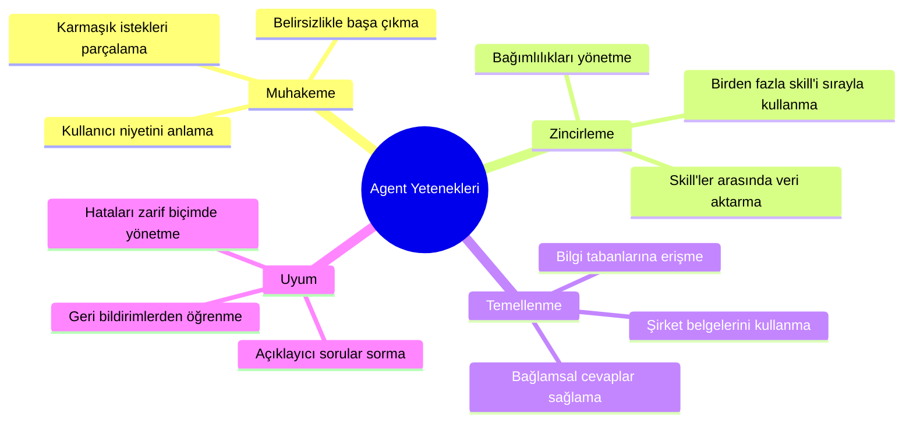
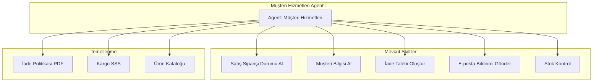
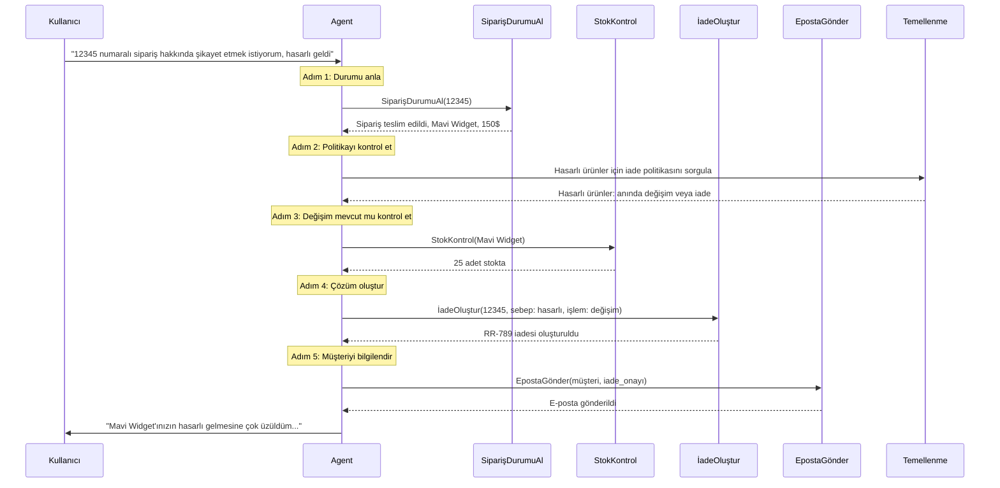
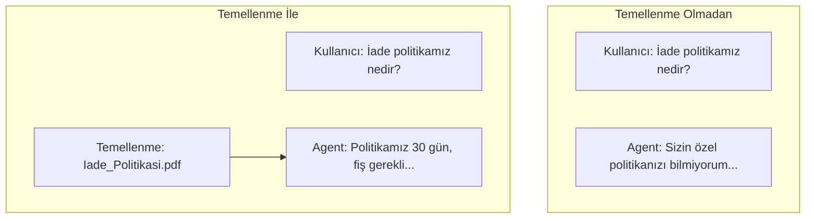
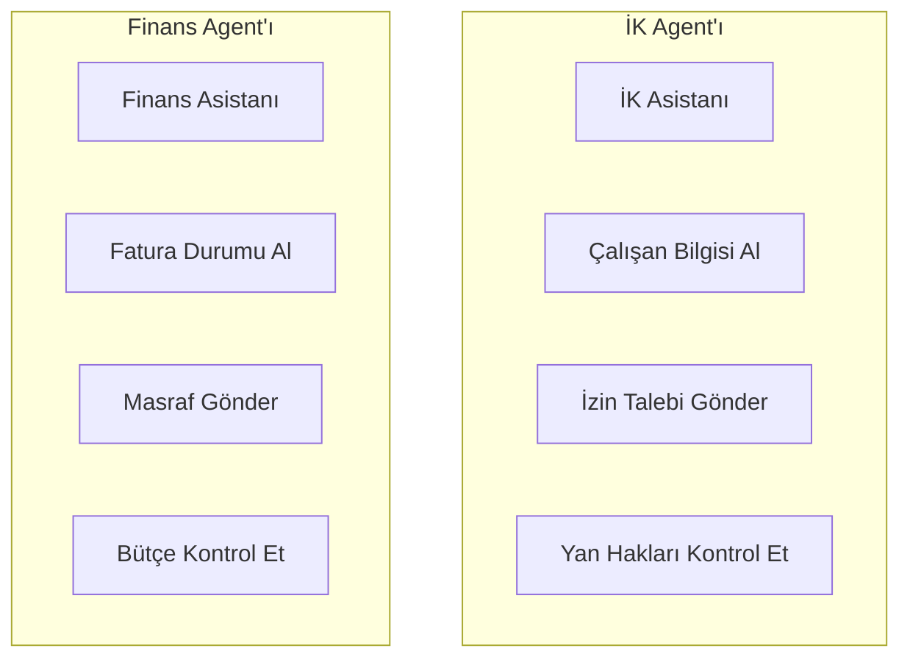
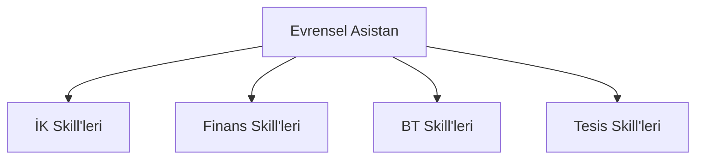
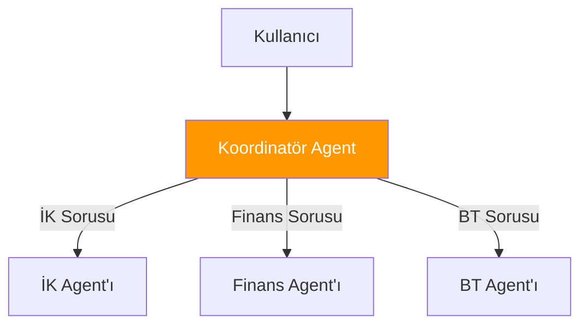
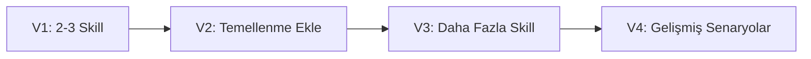

# Kısım 10: Joule Agent'ları Oluşturma

> *Skill'leri Zincirleyen Akıllı Şef*

---

Skill'lerinizi oluşturdunuz. Şimdi bunları orkestra eden bir agent oluşturalım—hangi skill'lerin ne zaman kullanılacağı konusunda akıllı kararlar veren bir yapı.

---

## 10.1 Bir Agent'ı "Akıllı" Yapan Nedir

Bir agent, skill koleksiyonundan fazlasıdır. Şunları yapabilir:



### Agent vs. Basit Chatbot

| Özellik | Basit Chatbot | Joule Agent |
|---------|---------------|-------------|
| **Anlama** | Anahtar kelime eşleştirme | Semantik anlama |
| **Eylemler** | Önceden tanımlanmış akışlar | Dinamik skill seçimi |
| **Çok Adımlı** | Sabit kodlanmış diziler | Muhakeme tabanlı zincirleme |
| **Bağlam** | Yalnızca oturum | Belgelere dayalı |
| **Hatalar** | Genel mesajlar | Akıllı kurtarma |

---

## 10.2 İlk Agent'ınızı Oluşturma

### Senaryo: Müşteri Hizmetleri Agent'ı

Siparişler hakkındaki müşteri sorularını yanıtlayan bir agent oluşturacağız:



### Adım 1: Joule Studio'da Agent Oluşturma

1. **Joule Studio**'yu açın
2. **Create Agent** (Agent Oluştur) tıklayın
3. Detayları doldurun:

```yaml
Agent Name: Müşteri Hizmetleri Asistanı
Description: Siparişler, iadeler ve kargo hakkındaki müşteri sorularını yanıtlar

Agent Purpose: |
  Siz ACME Corp için bir müşteri hizmetleri asistanısınız.
  Müşterilere şu konularda yardımcı olun:
  - Sipariş durumu sorguları
  - İade ve değişim talepleri
  - Kargo soruları
  - Ürün mevcudiyeti

Tone: Samimi, profesyonel, yardımsever
```

### Adım 2: Agent'a Skill Atama

1. **Skills** sekmesine gidin
2. **Add Skill** (Skill Ekle) tıklayın
3. Bu skill'leri ekleyin:

| Skill | Ne Zaman Kullanılır |
|-------|---------------------|
| Satış Siparişi Durumu Al | Müşteri sipariş durumunu sorduğunda |
| Müşteri Bilgisi Al | Bağlam için müşteri detayları gerektiğinde |
| İade Talebi Oluştur | Müşteri iade/değişim istediğinde |
| E-posta Bildirimi Gönder | Onay göndermek gerektiğinde |
| Stok Kontrol | Müşteri mevcudiyet sorduğunda |

### Adım 3: Agent Talimatlarını Yazma

Bu en önemli kısım—agent'a NASIL davranacağını öğretmek:

```markdown
# Müşteri Hizmetleri Agent Talimatları

## Rolünüz
Siz ACME Corp için bir müşteri hizmetleri temsilcisisiniz.
Her zaman yardımsever, nazik ve çözüm odaklı olun.

## Karar Verme

### Müşteri sipariş hakkında sorduğunda:
1. Sipariş numarası verilmediyse isteyin
2. "Satış Siparişi Durumu Al" skill'ini kullanın
3. Durumu samimi bir dille sunun:
   - "A" (Teslim edilmedi) → "Siparişiniz kargoya hazırlanıyor"
   - "B" (Kısmi) → "Siparişinizin bir kısmı gönderildi"
   - "C" (Tamamlandı) → "Siparişiniz teslim edildi"

### Müşteri iade istediğinde:
1. Önce siparişi arayın
2. İade politikası temellenme belgesini kontrol edin
3. Uygunsa, "İade Talebi Oluştur" skill'ini kullanın
4. "E-posta Bildirimi Gönder" ile onay e-postası gönderin

### Müşteri mevcudiyet sorduğunda:
1. "Stok Kontrol" skill'ini kullanın
2. Stokta varsa, mevcudiyeti onaylayın
3. Stokta yoksa, tahmini yeniden stoklama tarihini bildirin

## Yanıt Kuralları

### Her zaman:
- Müşterinin endişesini kabul ederek başlayın
- Tarihler, numaralar, takip bilgileri konusunda spesifik olun
- Sonraki adımlar veya alternatifler sunun
- "Yardımcı olabileceğim başka bir konu var mı?" ile bitirin

### Asla:
- Tutamayacağınız sözler vermeyin
- Diğer müşterilerin bilgilerini paylaşmayın
- Bilmiyorsanız tahmin etmeyin—açıklama isteyin

## Örnek Konuşmalar

### Örnek 1: Sipariş Durumu
Müşteri: "Siparişim nerede?"
Siz: "Siparişinizi takip etmenize yardımcı olmaktan memnuniyet duyarım. Sipariş numaranızı paylaşır mısınız?"
Müşteri: "12345"
[Satış Siparişi Durumu Al skill'ini kullan]
Siz: "#12345 numaralı siparişinizi buldum. İyi haberler—20 Ocak'ta 123 Ana Cadde adresine teslim edildi. Takip bilgisi J. Smith tarafından imzalandığını gösteriyor. Yardımcı olabileceğim başka bir konu var mı?"

### Örnek 2: İade Talebi
Müşteri: "67890 numaralı siparişimi iade etmek istiyorum"
[Önce Satış Siparişi Durumu Al skill'ini kullan]
Siz: "#67890 siparişinin 5 gün önce teslim edilen bir Mavi Widget olduğunu görüyorum. İade politikamız 30 gün içinde iadelere izin veriyor, yani uygunsunuz! İade işleminizi başlatayım."
[İade Talebi Oluştur skill'ini kullan]
Siz: "Tamam! RR-456 numaralı iade talebini oluşturdum. Bir saat içinde ön ödemeli kargo etiketi içeren bir e-posta alacaksınız. Herhangi bir UPS noktasına bırakmanız yeterli. Başka bir şey var mı?"
```

---

## 10.3 Çok Adımlı Muhakeme ve Zincirleme

Agent'ın karmaşık istekler için skill'leri nasıl zincirlediği:

### Örnek: "12345 numaralı sipariş için şikayeti ele al"



### Agent'ın İç Muhakemesi

```
Kullanıcı: "12345 numaralı sipariş hakkında şikayet etmek istiyorum, hasarlı geldi"

ANALİZ:
- Niyet: Hasarlı ürün şikayeti
- Sipariş numarası: 12345
- Sorun: Taşıma sırasında hasar

PLAN:
1. Ne sipariş edildiğini anlamak için sipariş detaylarına bak
2. Hasarlı ürünlerle ilgili politikamızı kontrol et
3. Çözüm seçeneklerini belirle
4. En iyi çözümü uygula
5. Müşteriyle onaylat

UYGULAMA:
Adım 1: SiparişDurumuAl(12345)
  Sonuç: Mavi Widget, 150$, 20 Ocak teslim

Adım 2: Temellenme kontrol - hasarlı ürün politikası
  Sonuç: "Hasarlı ürünler anında değişim veya tam iade için uygundur"

Adım 3: StokKontrol(Mavi Widget)
  Sonuç: 25 adet stokta - değişim mevcut

Adım 4: İadeOluştur(sipariş: 12345, sebep: "hasarlı", işlem: "değişim")
  Sonuç: RR-789 iadesi oluşturuldu, değişim bugün kargolanıyor

Adım 5: EpostaGönder(tip: "hasar_çözümü", alıcı: müşteri)
  Sonuç: E-posta gönderildi

YANIT:
"Mavi Widget'ınızın hasarlı gelmesine çok üzüldüm. Sizin için bunu hallettim:
- Hasarlı ürün için RR-789 iadesi oluşturuldu
- Yeni bir Mavi Widget bugün kargolanıyor
- Hasarlı ürünü geri göndermek için ön ödemeli etiket alacaksınız

Yeni ürününüzü 2-3 iş günü içinde almanız gerekiyor.
Yardımcı olabileceğim başka bir konu var mı?"
```

---

## 10.4 Agent'ları Şirket Belgelerine Dayandırma

### Temellenme Nedir?

Temellenme, agent'a şirketiniz hakkında özel bilgi verir:



### Temellenme Kurulumu

1. Joule Studio'da agent'ınıza gidin
2. **Grounding** sekmesine tıklayın
3. **Add Document** (Belge Ekle) tıklayın

**Desteklenen formatlar:**
- PDF dosyaları
- Word belgeleri
- Metin dosyaları
- Web URL'leri

### Örnek Temellenme Belgeleri

**İade Politikası (Iade_Politikasi.pdf):**
```markdown
# ACME Corp İade Politikası

## Standart İadeler
- Teslimattan itibaren 30 gün içinde iadeler kabul edilir
- Orijinal fiş veya sipariş onayı gereklidir
- Ürünler kullanılmamış ve orijinal ambalajında olmalıdır
- 5-7 iş günü içinde orijinal ödeme yöntemine iade

## Hasarlı Ürünler
- Teslimattan sonra 48 saat içinde bildirin
- Fotoğraf kanıtı yardımcı olur ama zorunlu değil
- Anında değişim veya tam iade sunulur
- Müşteriye iade kargo ücreti yok

## İade Edilemeyen Ürünler
- Özel veya kişiselleştirilmiş ürünler
- "Son Satış" olarak işaretlenmiş indirimli ürünler
- Kullanılmış veya orijinal ambalajı eksik ürünler

## Süreç
1. Müşteri destekle iletişime geçer
2. İade yetkisi oluşturulur
3. Ön ödemeli kargo etiketi sağlanır
4. Ürün alındıktan sonra 48 saat içinde iade işlenir
```

**Kargo SSS (Kargo_SSS.pdf):**
```markdown
# Kargo Bilgileri

## Teslimat Süreleri
- Standart: 5-7 iş günü
- Ekspres: 2-3 iş günü
- Ertesi Gün: Ertesi iş günü için saat 14:00'a kadar sipariş verin

## Kargo Ücretleri
- 50$ üzeri siparişlerde ücretsiz standart kargo
- Ekspres: 9.99$
- Ertesi Gün: 19.99$

## Takip
- Tüm siparişler takip içerir
- Sipariş kargoya verildiğinde takip e-postası gönderilir
- Takip: tracking.acme.com

## Uluslararası
- Yalnızca ABD ve Kanada'ya gönderim yapıyoruz
- Uluslararası siparişler: 10-14 iş günü
- Gümrük ücretleri müşteri sorumluluğundadır
```

### Temellenmeyi Agent Talimatlarında Kullanma

```markdown
## Bilgi Tabanınızı Kullanma

Politika sorularını yanıtlarken:
1. HER ZAMAN önce temellenme belgelerini kontrol edin
2. İlgili olduğunda belirli politikaları alıntılayın
3. Bilgi belgelerde yoksa, tahmin etmek yerine "Bunu kontrol edeyim" deyin

Örnek:
Kullanıcı: "Bir şeyi iade etmek için ne kadar sürem var?"
[Iade_Politikasi.pdf kontrol et]
Siz: "Ürünleri iade etmek için teslimattan itibaren 30 gününüz var. Kullanılmamış ve orijinal ambalajında olmaları gerekiyor. İade başlatmak ister misiniz?"
```

---

## 10.5 Agent Tasarım Kalıpları

### Kalıp 1: Uzman

Bir agent, bir alan:



**Artıları:** Odaklı, eğitmesi kolay, sınırlar net
**Eksileri:** Kullanıcıların hangi agent'ı kullanacağını bilmesi gerekiyor

### Kalıp 2: Genelci

Bir agent, birden fazla alan:



**Artıları:** Tek giriş noktası, yönlendirmeyi yönetir
**Eksileri:** Daha karmaşık talimatlar, potansiyel karışıklık

### Kalıp 3: Koordinatör

Ana agent uzman agent'lara yönlendirir:



**Artıları:** Temiz ayrım, uzmanlaşmış işleme
**Eksileri:** Daha karmaşık kurulum

---

## 10.6 Agent'ınızı Test Etme

### Test Senaryoları Kontrol Listesi

Şunları kapsayan test senaryoları oluşturun:

```yaml
Test Senaryoları:
  Mutlu Yol:
    - Basit sipariş durumu sorgusu
    - Düz iade talebi
    - Ürün mevcudiyet kontrolü

  Uç Durumlar:
    - Sipariş numarası mevcut değil
    - İade politikası istisnası (son satış ürünü)
    - Stokta yok durumu

  Belirsiz İstekler:
    - "Siparişimle ilgili bir sorunum var"
    - "Yardım"
    - "Memnun değilim"

  Çok Adımlı:
    - Karmaşık şikayet yönetimi
    - Sipariş + iade + kargo sorusu
    - Aynı müşteri için birden fazla sipariş

  Hata Yönetimi:
    - Backend API çalışmıyor
    - Gerekli bilgi eksik
    - Kullanıcı geçersiz girdi sağlıyor
```

### Test Betiği Örneği

```markdown
## Test Vakası: TC-001 Sipariş Durumu Mutlu Yol

**Girdi:** "12345 numaralı siparişin durumu nedir?"

**Beklenen Davranış:**
1. Agent sipariş durumu niyetini tanır
2. "12345" ile SiparişDurumuAl skill'ini çağırır
3. Yanıtı teslimat durumuyla formatlar
4. Ek yardım önerir

**Beklenen Yanıt Kalıbı:**
"#12345 numaralı sipariş... [durum detayları]... Başka bir şey var mı?"

**Geçme Kriterleri:**
- Doğru skill çağrıldı
- Sipariş detayları doğru
- Samimi ton
- Ek yardım önerisi
```

---

## 10.7 Agent En İyi Uygulamaları

### 1. Basit Başlayın, Kademeli Genişletin



### 2. Net Skill Sınırları

Her skill'in amacını belirgin yapın:

| Skill | Net Amaç | Örtüşmeyen |
|-------|----------|------------|
| SiparişDurumuAl | Sipariş bilgisi getir | İade de oluşturma |
| İadeOluştur | İade oluştur | E-posta da gönderme |
| EpostaGönder | Bildirim gönder | Veri de arama |

### 3. Açık Talimatlar

```markdown
# İyi
Müşteri sipariş hakkında sorduğunda:
1. Sipariş numarası verilmediyse isteyin
2. Sipariş numarasıyla SiparişDurumuAl çağırın
3. Durum "C" ise, "teslim edildi" deyin
4. Durum "A" ise, "hazırlanıyor" deyin

# Kötü
Sipariş sorularını uygun şekilde ele alın.
```

### 4. Hataları Zarif Biçimde Yönetin

```markdown
## Hata Yönetimi

SiparişDurumuAl başarısız olursa:
- Söyleyin: "Şu anda o siparişi aramakta sorun yaşıyorum.
       Bir dakika içinde tekrar deneyeyim."
- Bir kez yeniden deneyin
- Hala başarısızsa: "Özür dilerim, sipariş sistemimiz sorun yaşıyor.
       Lütfen birkaç dakika içinde tekrar deneyin veya 1-800-ACME'yi arayın."

Sipariş bulunamazsa:
- Söyleyin: "#[numara] siparişini bulamadım. Numarayı tekrar kontrol eder misiniz?
       5-10 haneli olmalı."
```

---

## Temel Çıkarımlar

1. **Agent'lar skill'leri orkestra eder** — Ne yapılacağına ve ne zaman yapılacağına karar verirler
2. **Talimatlar kritiktir** — Detaylı talimatlar = daha iyi davranış
3. **Temellenme bilgi ekler** — Şirkete özel bağlam önemlidir
4. **Kapsamlı test edin** — Mutlu yol + uç durumlar + hatalar
5. **Basit başlayın** — Karmaşıklığı kademeli ekleyin
6. **Net sınırlar** — Her skill bir şeyi iyi yapmalı

---

## Sırada Ne Var?

Agent'ınız hazır. Şimdi onu geliştirmeden üretime kadar ortamlar arasında dağıtalım ve yaşam döngüsünü yönetelim.

---

*[Önceki: Kısım 9 - İlk Joule Skill'inizi Oluşturma](09-first-joule-skill.md) | [Sonraki: Kısım 11 - Agent Yaşam Döngüsü ve Dağıtım](11-agent-lifecycle.md)*

*[İçindekilere Dön](../content.md)*

---

**Yazar:** [Beyhan Meyrali](https://www.linkedin.com/in/beyhanmeyrali) — SAP Hikaye Anlatıcısı & Dijital Dönüşüm Savunucusu

*Dünya genelindeki SAP öğrencileri için ❤️ ile oluşturuldu*
