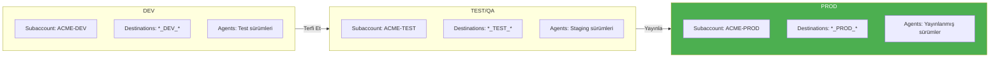
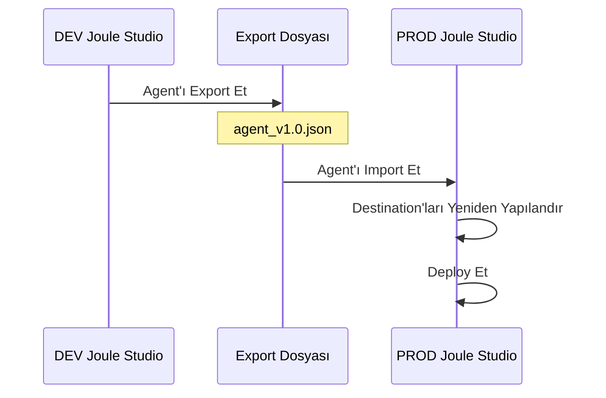
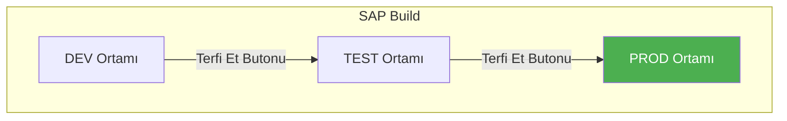
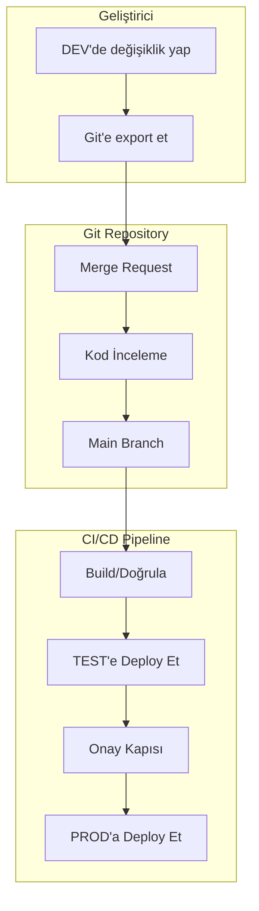
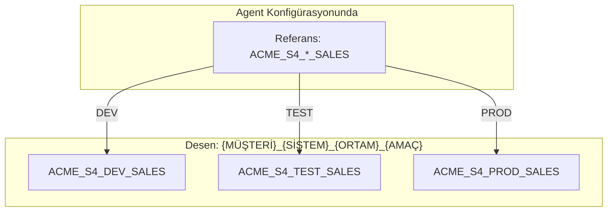
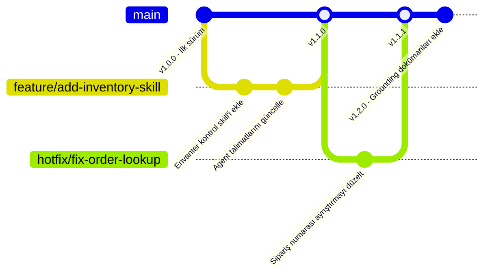
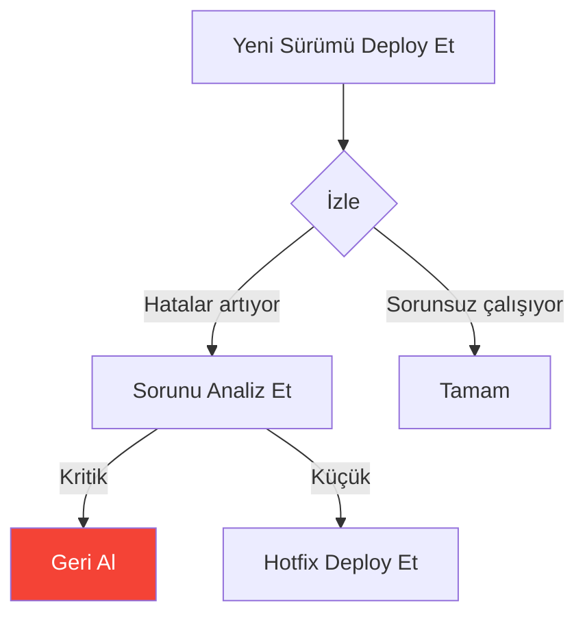
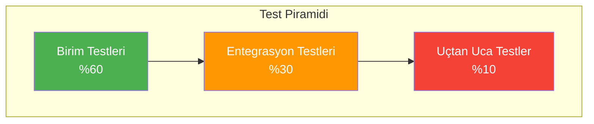
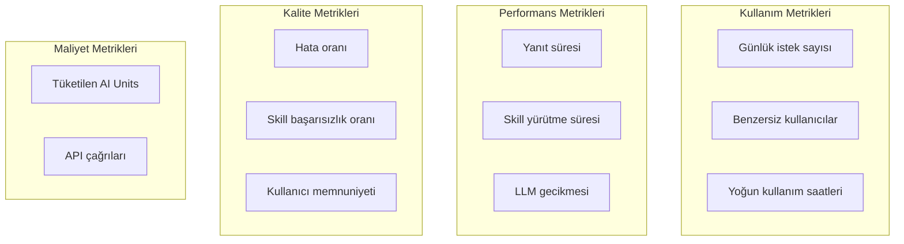

# Kısım 11: Agent Yaşam Döngüsü & Deployment

> *DEV'den PROD'a—Doğru Yoldan*

---

Agent'ınız geliştirme ortamında çalışıyor. Şimdi onu ortamlar arasında düzgün bir şekilde taşıyalım—production'da bir şeyleri bozmadan.

---

## 11.1 Ortam Yapısı

### Standart Üç Katmanlı Kurulum



### Ortama Göre Değişenler

| Bileşen | DEV | TEST | PROD |
|---------|-----|------|------|
| **Destinations** | `ACME_S4_DEV_SALES` | `ACME_S4_TEST_SALES` | `ACME_S4_PROD_SALES` |
| **Backend URL'leri** | dev.s4hana.com | test.s4hana.com | prod.s4hana.com |
| **AI Modeli** | Daha küçük/ucuz | PROD ile aynı | Production modeli |
| **Grounding Dokümanları** | Test dokümanları | Gerçek dokümanlar (anonimleştirilmiş) | Production dokümanları |
| **Kullanıcılar** | Geliştiriciler | QA testçileri | Son kullanıcılar |
| **Veri** | Mock/sandbox verisi | Test verisi | Gerçek veri |

---

## 11.2 Deployment Yöntemleri

### Yöntem 1: Export/Import (Manuel)

En uygun: Küçük ekipler, ilk deploymentlar



**Adım adım:**

1. **DEV'den Export Et:**
   - Joule Studio → Agent'ınız → Export
   - JSON paketini kaydedin

2. **PROD'a Import Et:**
   - PROD Joule Studio → Import → Dosya seç
   - Agent aynı yapıyla görünür

3. **Yeniden Yapılandır:**
   - Destination referanslarını güncelleyin
   - Ortama özel ayarları düzenleyin

4. **Test Et ve Deploy Et:**
   - Production destination'larıyla test edin
   - Hazır olduğunda deploy edin

### Yöntem 2: SAP Build Terfi Özelliği

En uygun: SAP Build formasyonlarını kullanan kuruluşlar



**Gereksinimler:**
- Subaccount'lar arasında formasyonlar yapılandırılmış
- Hedef ortamda uygun entitlement'lar
- Ortamlar arasında tutarlı destination isimleri

### Yöntem 3: Git + CI/CD (Kurumsal İçin Önerilen)

En uygun: Büyük ekipler, sık güncellemeler, denetim gereksinimleri



**Git Repository Yapısı:**
```
joule-agents/
├── agents/
│   ├── customer-service/
│   │   ├── agent.json
│   │   ├── skills/
│   │   │   ├── get-order-status.json
│   │   │   └── create-return.json
│   │   └── grounding/
│   │       ├── return-policy.pdf
│   │       └── shipping-faq.pdf
│   └── finance-assistant/
│       └── ...
├── config/
│   ├── dev.env
│   ├── test.env
│   └── prod.env
└── pipelines/
    └── deploy.yml
```

**CI/CD Pipeline Örneği (Azure DevOps):**
```yaml
trigger:
  branches:
    include:
      - main

stages:
  - stage: ValidateExport
    jobs:
      - job: Validate
        steps:
          - script: |
              # JSON yapısını doğrula
              python validate_agent.py agents/

  - stage: DeployToTest
    dependsOn: ValidateExport
    jobs:
      - job: Deploy
        steps:
          - script: |
              # API kullanarak TEST'e deploy et
              ./deploy.sh --env test --agent customer-service

  - stage: DeployToProduction
    dependsOn: DeployToTest
    condition: succeeded()
    jobs:
      - deployment: Production
        environment: production  # Onay gerektirir
        steps:
          - script: |
              ./deploy.sh --env prod --agent customer-service
```

---

## 11.3 Konfigürasyon Yönetimi

### Ortam Değişkenleri Deseni

Ortama göre değiştirilen placeholder'lar kullanın:

**agent.json (şablon):**
```json
{
  "name": "Customer Service Agent",
  "skills": [
    {
      "name": "GetOrderStatus",
      "destination": "${DESTINATION_S4_SALES}"
    }
  ]
}
```

**dev.env:**
```
DESTINATION_S4_SALES=ACME_S4_DEV_SALES
AI_MODEL=gpt-35-turbo
```

**prod.env:**
```
DESTINATION_S4_SALES=ACME_S4_PROD_SALES
AI_MODEL=gpt-4
```

### Destination İsimlendirme Stratejisi

Ortamlar arasında tutarlı isimlendirme kullanın:



---

## 11.4 Agent'lar İçin Versiyon Kontrolü

### Versiyonlama Stratejisi



### Versiyon İsimlendirme

| Versiyon | Anlamı |
|----------|--------|
| 1.0.0 | İlk production sürümü |
| 1.1.0 | Yeni özellik (geriye uyumlu) |
| 1.1.1 | Hata düzeltme |
| 2.0.0 | Bozucu değişiklik |

### Değişiklik Günlüğü

Bir CHANGELOG.md dosyası tutun:

```markdown
# Customer Service Agent - Değişiklik Günlüğü

## [1.2.0] - 2026-01-24
### Eklenenler
- İade politikası için grounding dokümanları
- Yeni skill: CheckInventory
### Değişenler
- GetOrderStatus'ta hata yönetimi iyileştirildi

## [1.1.1] - 2026-01-20
### Düzeltilenler
- 10 haneli siparişler için sipariş numarası ayrıştırma

## [1.1.0] - 2026-01-15
### Eklenenler
- Skill: CreateReturn
- E-posta bildirim özelliği
```

---

## 11.5 Geri Alma Prosedürleri

### Ne Zaman Geri Alınmalı



### Geri Alma Adımları

**Seçenek A: Önceki Sürümü Yeniden Deploy Et**

1. Önceki sürümü Git'te veya export arşivinde bulun
2. Önceki sürümü import edin
3. Hemen deploy edin
4. İşlevselliği doğrulayın

**Seçenek B: Hızlı Devre Dışı Bırakma**

Agent sorun çıkarıyorsa:

1. Joule Studio → Agent → Ayarlar
2. Agent'ı geçici olarak devre dışı bırakın
3. Kullanıcılar standart yardıma yönlendirilir
4. Düzeltin ve yeniden deploy edin

### Geri Alma Kontrol Listesi

```yaml
Geri Alma Kontrol Listesi:
  - [ ] Sorunlu sürümü belirle
  - [ ] Önceki kararlı sürümü bul
  - [ ] Önceki sürümü import et/deploy et
  - [ ] Kritik yolları test et
  - [ ] Gerekirse kullanıcıları bilgilendir
  - [ ] Olayı belgele
  - [ ] Kök neden analizi yap
```

---

## 11.6 Test Stratejisi

### Agent'lar İçin Test Piramidi



### Birim Testleri: Bireysel Skill'ler

Her skill'i izole olarak test edin:

```yaml
Test: GetOrderStatus Skill
  Girdi: { orderNumber: "12345" }
  Mock: S4 API sipariş detaylarını döndürür
  Beklenen: Formatlanmış sipariş yanıtı

Test: GetOrderStatus - Bulunamadı
  Girdi: { orderNumber: "99999" }
  Mock: S4 API 404 döndürür
  Beklenen: Kullanıcı dostu "bulunamadı" mesajı
```

### Entegrasyon Testleri: Skill + Destination

Skill'leri gerçek (veya gerçekçi) backend'lerle test edin:

```yaml
Test: TEST ortamıyla GetOrderStatus
  Ortam: TEST
  Destination: ACME_S4_TEST_SALES
  Girdi: { orderNumber: "1" }  # Bilinen test siparişi
  Beklenen: Gerçek sipariş verisi döner
```

### Uçtan Uca Testler: Tam Agent Akışı

Tam kullanıcı senaryolarını test edin:

```yaml
Test: Müşteri Şikayet Akışı
  Adımlar:
    1. Kullanıcı: "12345 numaralı sipariş hasarlı geldi"
    2. Agent: Siparişi arar
    3. Agent: Politikayı kontrol eder
    4. Agent: İade oluşturur
    5. Agent: E-posta gönderir
  Beklenen: İade oluşturuldu, e-posta gönderildi
```

---

## 11.7 Production'da İzleme

### Takip Edilecek Temel Metrikler



### Uyarı Kuralları

```yaml
Uyarılar:
  Kritik:
    - 5 dakika boyunca hata oranı > %10
    - Tüm skill'ler başarısız
    - AI Core erişilemez

  Uyarı:
    - Hata oranı > %5
    - Yanıt süresi > 10 saniye
    - AI Units tüketiminde ani artış

  Bilgi:
    - Yeni yoğunluk zirvesi
    - Olağandışı sorgu kalıpları
```

### Günlükleme En İyi Uygulamaları

```json
{
  "timestamp": "2026-01-24T10:30:00Z",
  "level": "INFO",
  "agent": "customer-service",
  "sessionId": "sess-abc123",
  "userId": "user@acme.com",
  "action": "skill_invocation",
  "skill": "GetOrderStatus",
  "input": { "orderNumber": "12345" },
  "duration_ms": 450,
  "success": true
}
```

---

## Temel Çıkarımlar

1. **Minimum üç ortam** — DEV, TEST, PROD
2. **Deployment'ları otomatikleştirin** — Tutarlılık için CI/CD
3. **Her şeyi versiyonlayın** — Agent'lar, skill'ler, konfigürasyonlar
4. **Her seviyede test edin** — Birim, entegrasyon, uçtan uca
5. **Geri alma planı yapın** — Hızlı kurtarmayı bilin
6. **Sürekli izleyin** — Metrikleri takip edin ve sorunlarda uyarı verin

---

## Sırada Ne Var?

Artık agent'ları deploy edebildiğinize göre, birden fazla müşteriyi yönetmeye bakalım—danışmanlar ve iş ortakları için yaygın bir senaryo.

---

*[Önceki: Kısım 10 – Joule Agent'ları Oluşturma](10-building-agents.md) | [Sonraki: Kısım 12 – Çoklu Müşteri Yönetimi](12-multi-client-management.md)*

*[İçindekilere Dön](../content.md)*

---

**Yazar:** [Beyhan Meyrali](https://www.linkedin.com/in/beyhanmeyrali) — SAP Hikaye Anlatıcısı & Dijital Dönüşüm Savunucusu

*Dünya genelindeki SAP öğrencileri için ❤️ ile oluşturuldu*
