# Kısım 12: BTP'de Çoklu Müşteri Yönetimi

> *Danışmanın Hayatta Kalma Rehberi*

---

Eğer bir danışman, iş ortağı veya paylaşılan hizmetler ekibinde çalışıyorsanız, birden fazla müşteri için BTP'yi yöneteceksiniz. Bu bölüm, aklınızı kaybetmeden bunu nasıl yapacağınızı gösterir.

---

## 12.1 Klasik Tuzak: Her Şey Tek Subaccount'ta

### İnsanların Yanlış Yaptığı Şey

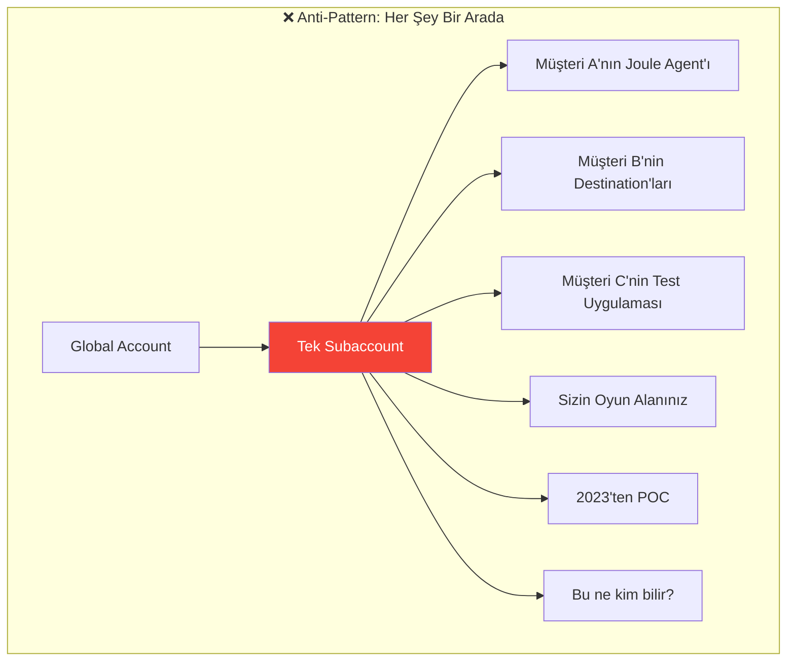

### Bunun Yarattığı Sorunlar

| Sorun | Etkisi |
|-------|--------|
| **Yetkilendirme kaos** | Kimin hangi kotayı kullandığı anlaşılamıyor |
| **Güvenlik kabusu** | Müşteri A, Müşteri B'nin destination'larını görebiliyor |
| **İsim çakışmaları** | `S4_ORDERS` — kimin S4'ü? |
| **Faturalandırma imkansız** | Müşteri başına maliyet aktarılamıyor |
| **Devir sorunları** | "İşte her şeye erişim" |
| **Temizlik felci** | Bir şeyi silmekten korkuluyor |

---

## 12.2 En İyi Uygulama: Müşteri Başına Bir Subaccount

### Önerilen Yapı

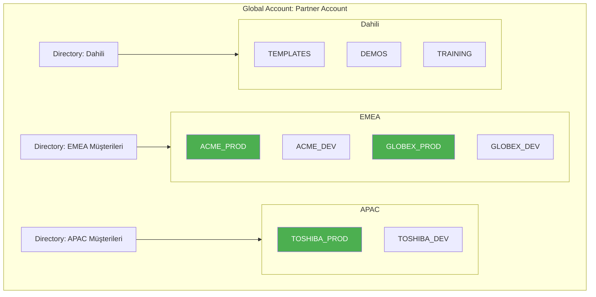

### Faydaları

| Fayda | Açıklama |
|-------|----------|
| **İzolasyon** | Müşteriler birbirlerinin verilerini göremez |
| **Net faturalandırma** | Kullanım subaccount başına takip edilir |
| **Kolay devir** | Tüm subaccount müşteriye aktarılabilir |
| **Temiz isimlendirme** | Subaccount içinde önek gerekmiyor |
| **Daha basit güvenlik** | Subaccount başına rol atama |

---

## 12.3 Ölçeklenen İsimlendirme Kuralları

### Subaccount İsimlendirme

**Kalıp:** `{BÖLGE}_{MÜŞTERİ}_{ORTAM}`

```
Örnekler:
TR_ACME_PROD       → Türkiye, Acme Corp, Üretim
TR_ACME_DEV        → Türkiye, Acme Corp, Geliştirme
EU_GLOBEX_PROD     → Avrupa, Globex Inc, Üretim
US_INITECH_POC     → ABD, Initech, Kavram Kanıtı
```

### Destination İsimlendirme

Müşteri subaccount'u içinde daha basit isimler çalışır:

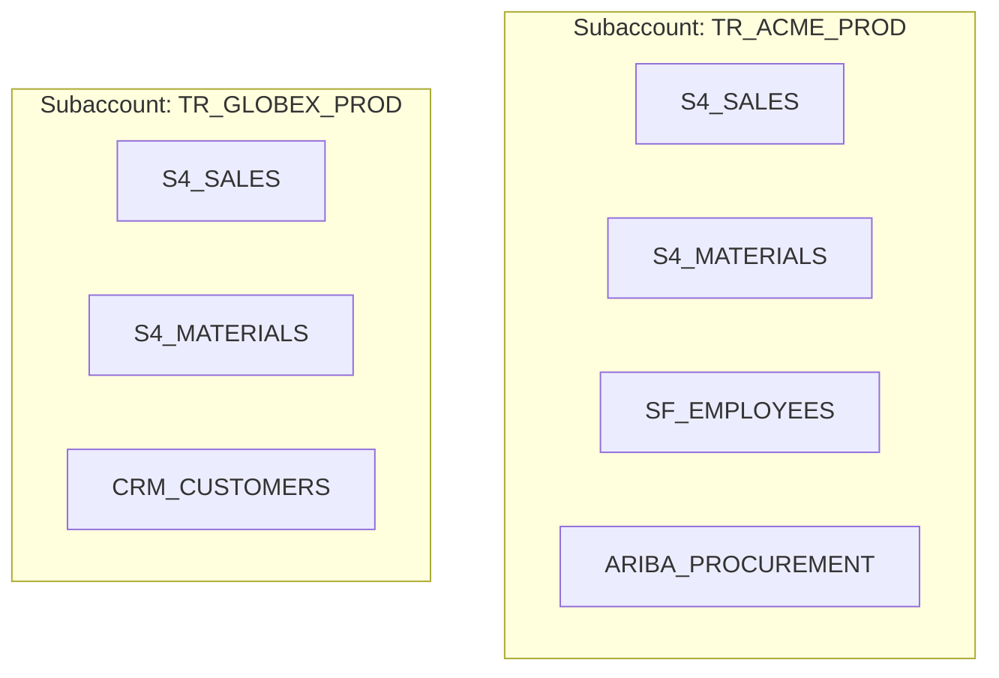

**Bunun neden işe yaradığı:**
- ACME'nin subaccount'u içinde `S4_SALES` belirsizlik yaratmaz
- GLOBEX'in `S4_SALES` ile çakışma yok (farklı subaccount)

### Paylaşılan Subaccount'lar İçin (mecbur kalırsanız)

Paylaşılan bir subaccount'unuz varsa, tam önek kullanın:

```
ACME_S4_PROD_SALES
GLOBEX_S4_PROD_SALES
INITECH_S4_DEV_ORDERS
```

---

## 12.4 Güvenlik ve Erişim Yönetimi

### Kimlik Sağlayıcı Kurulumu

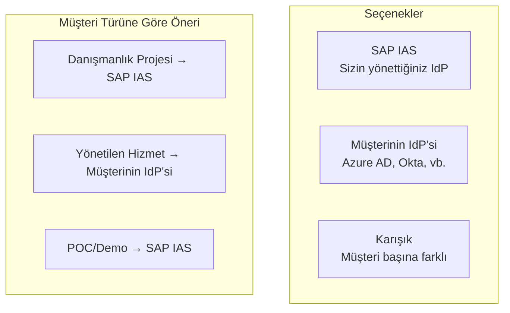

### Rol Atamaları

**Ekibiniz (Danışmanlar):**
```yaml
Global Account Seviyesi:
  - Global Account Administrator (siz)
  - Directory Administrator (ekip liderleri)

Subaccount Seviyesi (müşteri başına):
  - Subaccount Administrator
  - Cloud Foundry Space Developer
  - Destination Administrator
```

**Müşteri Ekibi:**
```yaml
Subaccount Seviyesi (sadece kendi subaccount'ları):
  - Subaccount Viewer (salt okunur) veya
  - Subaccount Administrator (tam kontrol)
  - Uygulamalarına özgü roller
```

### Müşteri Devir Erişim Kalıbı

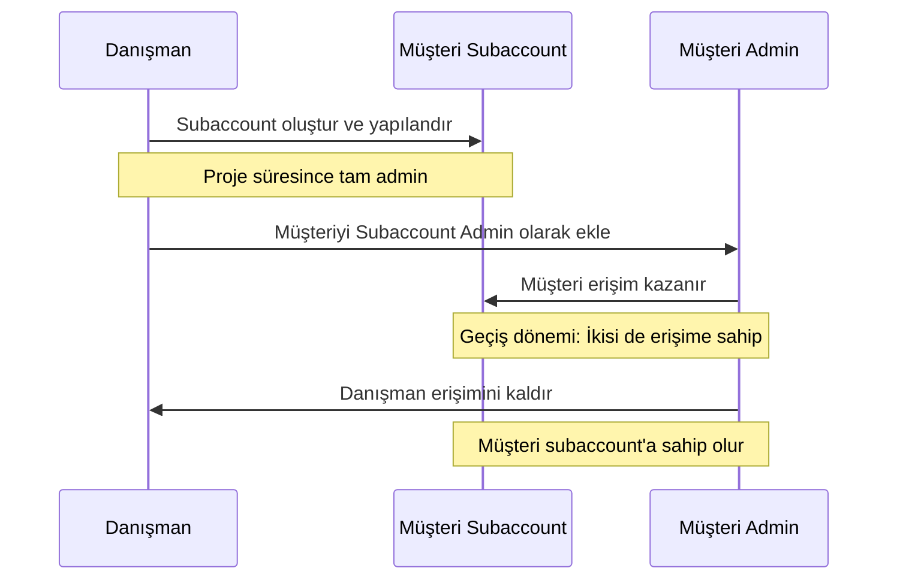

---

## 12.5 Yetkilendirme Dağıtımı

### Yetkilendirmeleri Görselleştirme

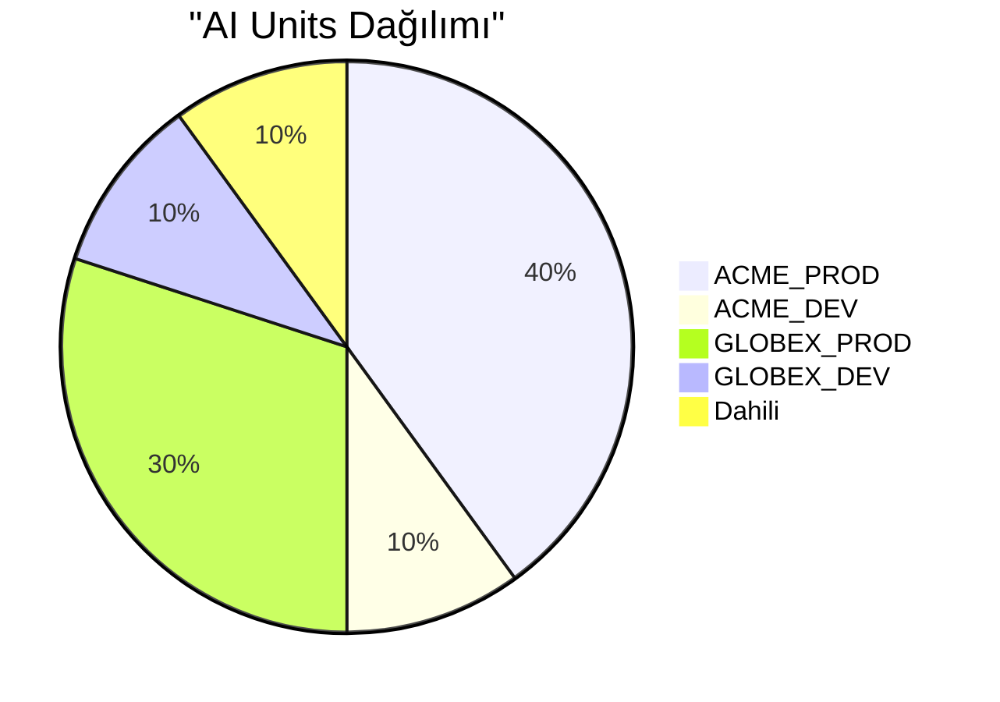

### Kotaları Yönetme

BTP Cockpit'te:

1. **Global Account → Entitlements**
2. **Entity Assignments** (eski adıyla "Manage Quota")
3. Subaccount'lara dağıtın:

```yaml
AI Core (AI Units):
  Toplam: 1000 ünite/ay
  Dağılım:
    - ACME_PROD: 400
    - ACME_DEV: 100
    - GLOBEX_PROD: 300
    - GLOBEX_DEV: 100
    - Dahili: 100

Cloud Foundry Runtime:
  Toplam: 16 GB
  Dağılım:
    - ACME_PROD: 4 GB
    - ACME_DEV: 2 GB
    - GLOBEX_PROD: 4 GB
    - GLOBEX_DEV: 2 GB
    - Dahili: 4 GB
```

---

## 12.6 Maliyet Tahsisi ve Geri Yükleme

### Müşteri Başına Maliyetleri Takip Etme

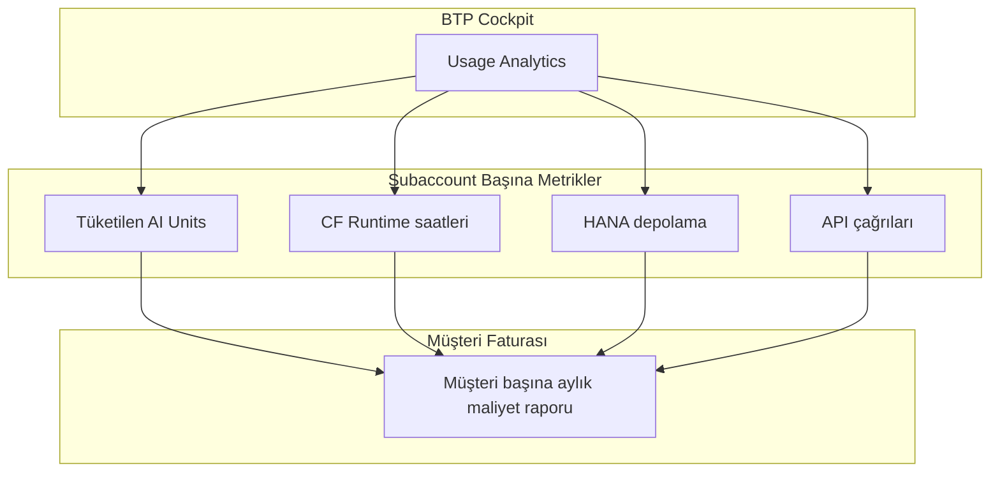

### Dışa Aktarma ve Raporlama

1. **BTP Cockpit → Usage Analytics**
2. **Subaccount seçin** (veya directory)
3. **CSV'ye dışa aktar**
4. **Müşteri başına aylık raporlar oluşturun**

### Örnek Maliyet Raporu Yapısı

```markdown
# Aylık BTP Maliyet Raporu - ACME Corp

Dönem: Ocak 2026

| Hizmet | Kullanım | Birim Maliyet | Toplam |
|--------|----------|---------------|--------|
| AI Core | 350 AI Units | €0.10 | €35.00 |
| CF Runtime | 720 GB-saat | €0.05 | €36.00 |
| HANA Cloud | 50 GB | €2.00 | €100.00 |
| Destination Service | 10,000 çağrı | €0.001 | €10.00 |
| **Toplam** | | | **€181.00** |
```

---

## 12.7 Şablon Tabanlı Kurulum

### Altın Şablon Yaklaşımı

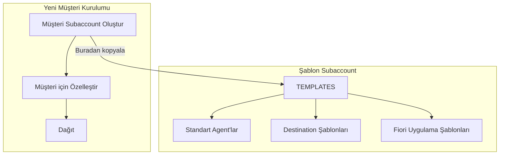

### Standart Kurulum Kontrol Listesi

Yeni bir müşteri entegre ederken:

```yaml
Müşteri Entegrasyon Kontrol Listesi:
  Subaccount:
    - [ ] İsimlendirme kuralına uygun subaccount oluştur
    - [ ] Cloud Foundry'yi etkinleştir
    - [ ] Yetkilendirmeleri ata

  Bağlantı:
    - [ ] S/4HANA'ya destination oluştur
    - [ ] SuccessFactors'a destination oluştur (gerekirse)
    - [ ] Cloud Connector kur (on-prem ise)

  Kimlik:
    - [ ] IdP ile güven yapılandır
    - [ ] İlk kullanıcıları oluştur
    - [ ] Rol koleksiyonlarını ayarla

  Hizmetler:
    - [ ] Standart Fiori uygulamalarını dağıt
    - [ ] Şablondan Joule agent'larını kur
    - [ ] Work Zone'u yapılandır

  Dokümantasyon:
    - [ ] Subaccount detaylarını belgele
    - [ ] Kimlik bilgilerini belgele (güvenli depolama)
    - [ ] Devir paketi oluştur
```

---

## 12.8 Çoklu Müşteri Joule Agent'ları

### Seçenek 1: Müşteri Başına Ayrı Agent'lar

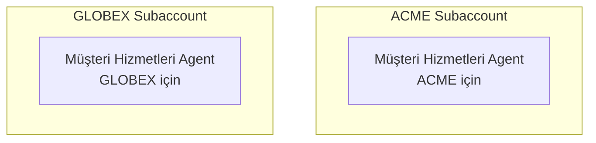

**Artıları:** Tam izolasyon, müşteriye özel özelleştirme
**Eksileri:** Daha fazla bakım, değişiklikler manuel olarak tekrarlanır

### Seçenek 2: Paylaşılan Agent Şablonu

Bir kez oluştur, her birine dağıt:

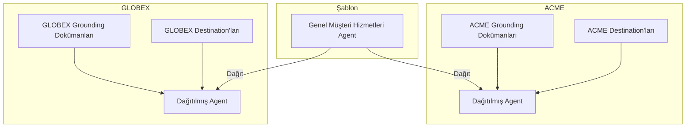

---

## 12.9 Felaket Kurtarma Hususları

### Müşteri Başına Yedekleme Stratejisi

```yaml
Yedekleme Sıklığı:
  Destination'lar: Haftalık dışa aktarma
  Agent'lar: Her değişiklikten sonra
  Fiori Uygulamaları: Git deposu
  Yapılandırmalar: Belgeleme + dışa aktarma

Depolama:
  Konum: Güvenli şirket depolaması
  Format: JSON dışa aktarımları + dokümantasyon
  Saklama: Minimum 90 gün
```

### Hızlı Kurtarma Planı

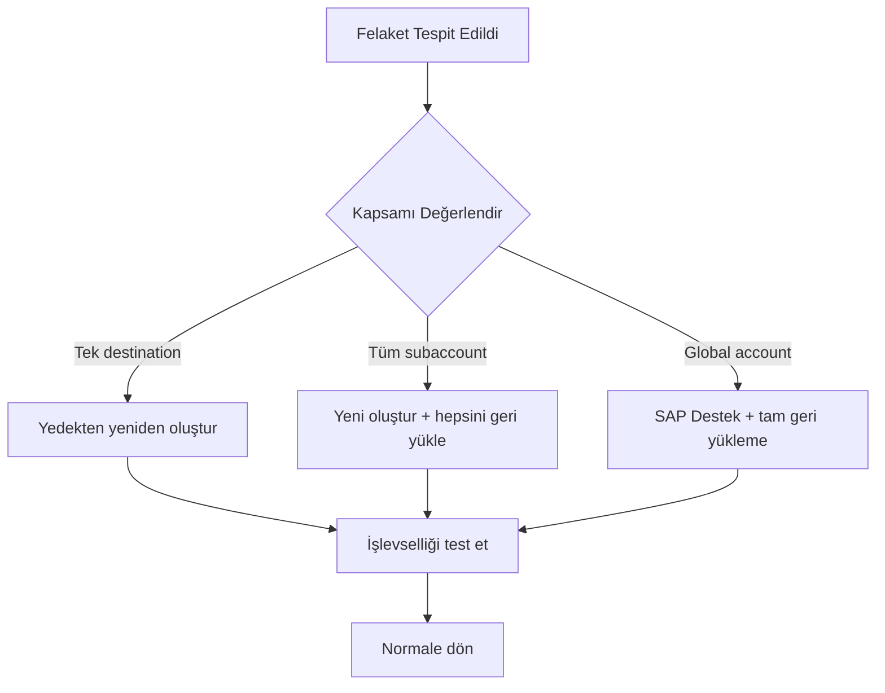

---

## Temel Çıkarımlar

1. **Müşteri başına bir subaccount** — İzolasyon için şart
2. **İsimlendirme kuralları** — `{BÖLGE}_{MÜŞTERİ}_{ORTAM}`
3. **Net yetkilendirme dağıtımı** — Müşteri başına kotaları takip edin
4. **Doğru erişim kontrolü** — Danışmanlar vs. müşteri rolleri
5. **Şablon yaklaşımı** — Standartlaştırın ve çoğaltın
6. **Maliyet takibi** — Geri yüklemeyi etkinleştirin

---

## Sırada Ne Var?

Şimdi aynı çözümü birden fazla müşteriye dağıtmaya bakalım—şablon tabanlı vs. çok kiracılı yaklaşımlar.

---

*[Önceki: Kısım 11 – Agent Yaşam Döngüsü ve Dağıtım](11-agent-lifecycle.md) | [Sonraki: Kısım 13 – Müşteriler Arası Dağıtımlar](13-cross-customer-deployments.md)*

*[İçindekilere Dön](../content.md)*

---

**Yazar:** [Beyhan Meyrali](https://www.linkedin.com/in/beyhanmeyrali) — SAP Hikaye Anlatıcısı & Dijital Dönüşüm Savunucusu

*Dünya genelindeki SAP öğrencileri için ❤️ ile oluşturuldu*
