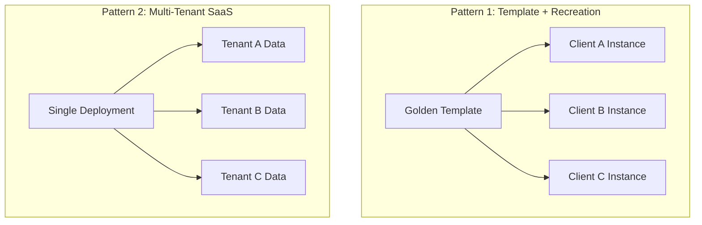
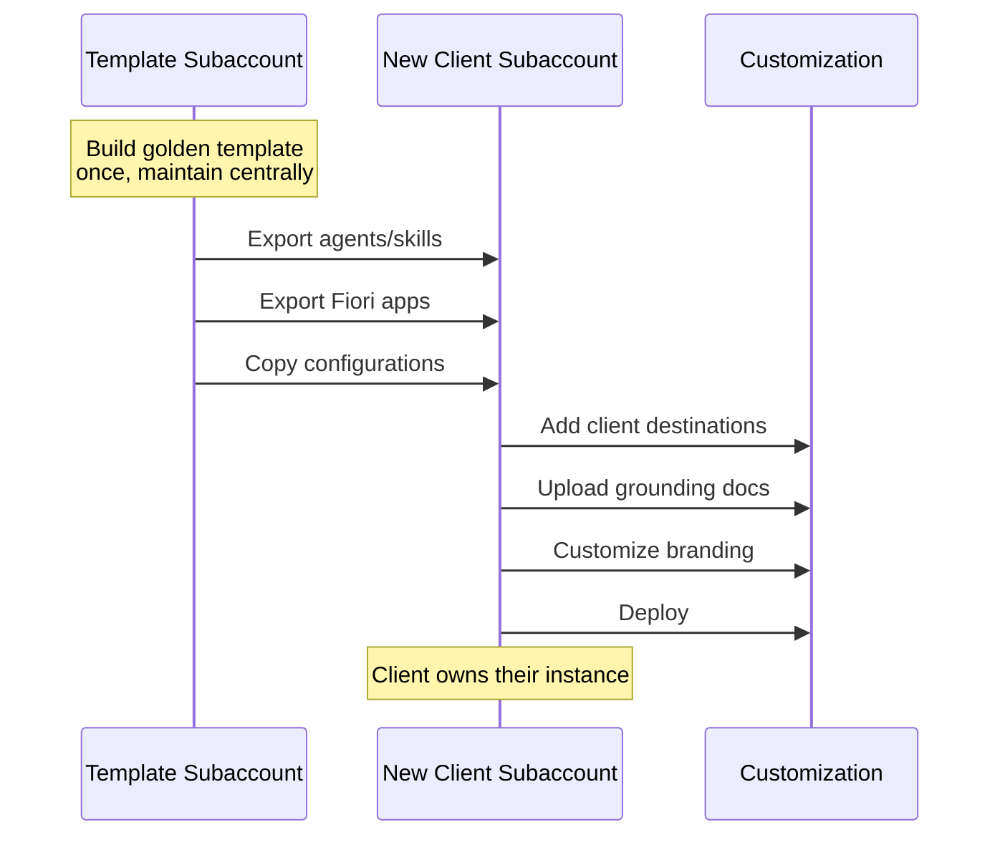
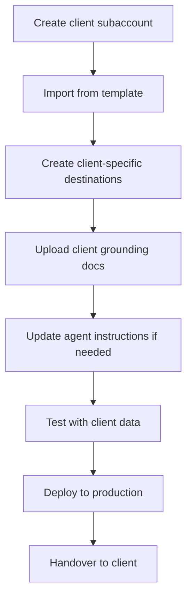
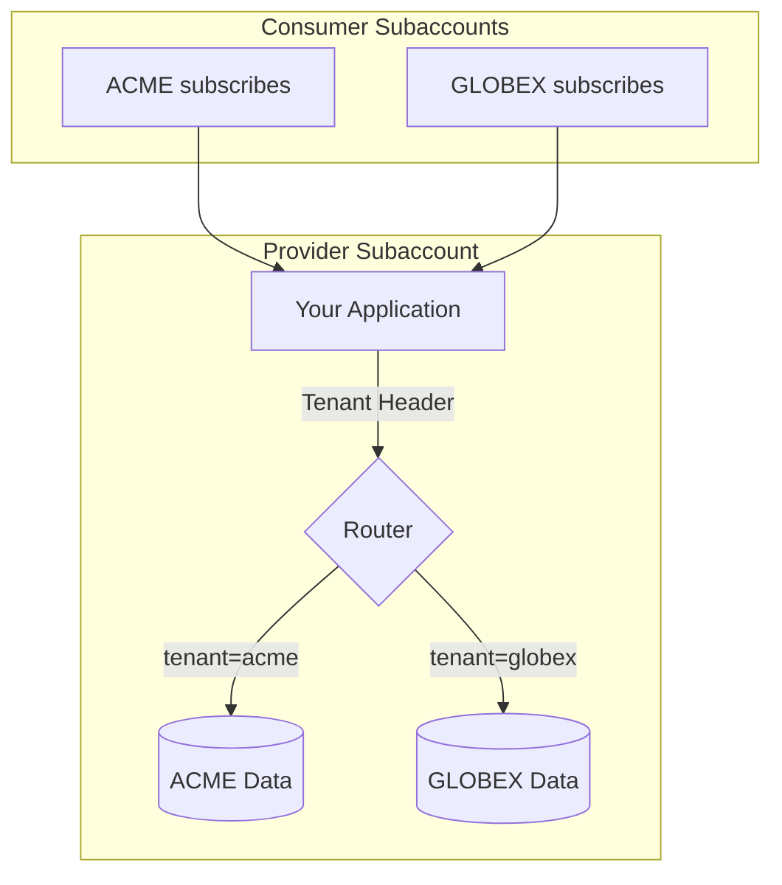
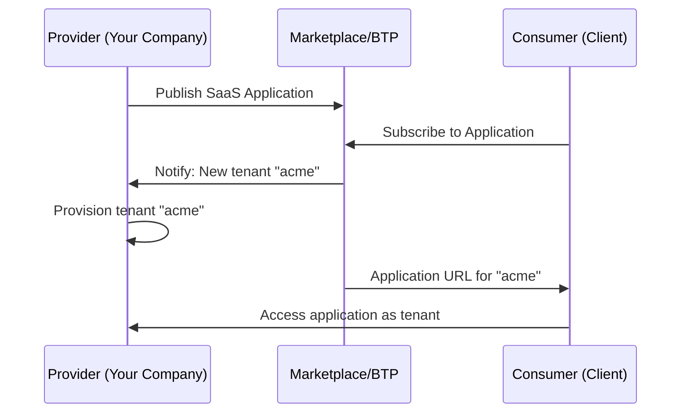
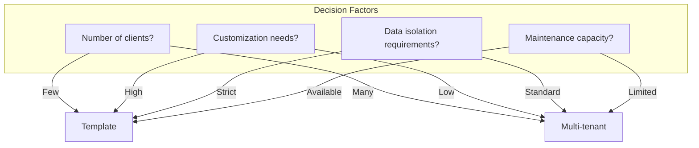
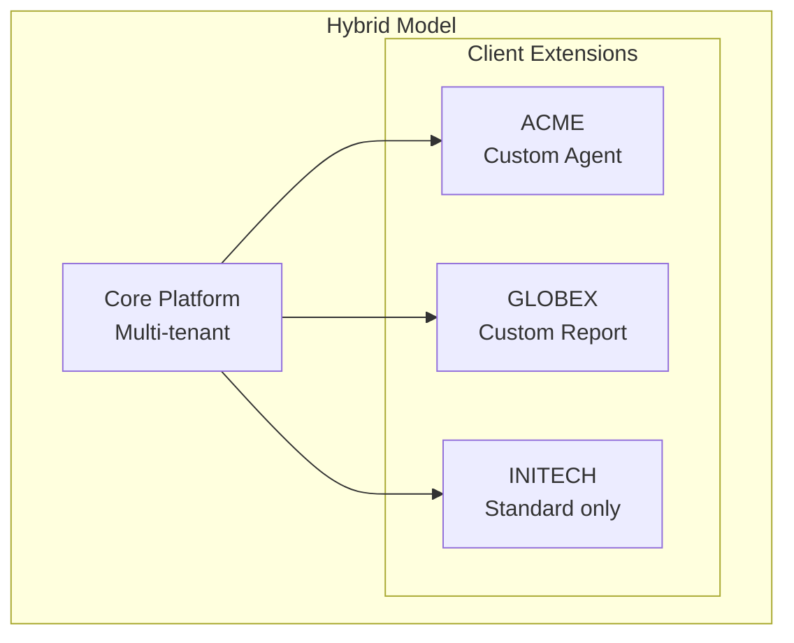
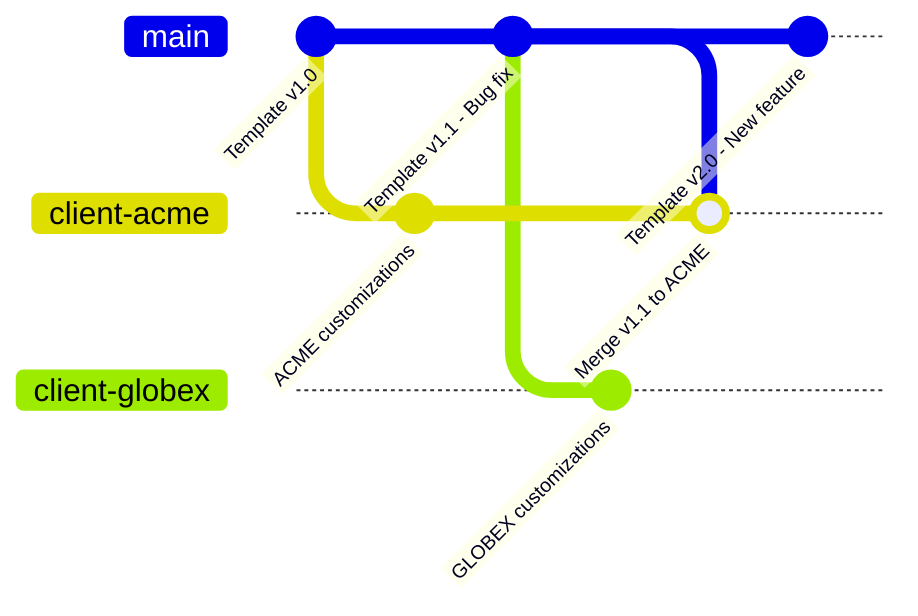

# Kısım 13: Cross-Customer Deployments

> *Same Solution, Different Clients*

---

You've built a great solution. Now you want to deploy it to multiple clients without reinventing the wheel each time. This chapter covers the patterns and trade-offs.

---

## 13.1 Deployment Patterns Overview



| Pattern | Best For | Effort per Client | Initial Setup |
|---------|----------|------------------|---------------|
| **Template + Recreation** | Consulting projects | Medium | Low |
| **Multi-Tenant SaaS** | Productized solutions | Low | High |

---

## 13.2 Pattern 1: Template + Per-Client Recreation

### Nasıl Çalışır



### Step-by-Step Process

**1. Build the Template:**
```yaml
Template Subaccount Contents:
  Agents:
    - Customer Service Agent (generic)
    - Finance Assistant (generic)

  Skills:
    - Get Order Status
    - Create Return
    - Check Inventory

  Fiori Apps:
    - Sales Dashboard
    - Order Management

  Documentation:
    - Setup guide
    - Customization guide
    - Destination configuration template
```

**2. For Each New Client:**



### Örnek: Customer Service Agent Deployment

**Template Agent Instructions:**
```markdown
You are a customer service assistant for {COMPANY_NAME}.
Help customers with order inquiries, returns, and shipping questions.

When looking up orders, use the GetOrderStatus skill.
When creating returns, check the return policy document first.
```

**Client A Customization:**
```markdown
You are a customer service assistant for ACME Electronics.
Help customers with order inquiries, returns, and shipping questions.
ACME offers a 45-day return policy (extended from standard 30 days).
```

**Client B Customization:**
```markdown
You are a customer service assistant for Global Widgets Inc.
Help customers with order inquiries, returns, and shipping questions.
Global Widgets requires RMA numbers for all returns.
```

### Pros and Cons

| Aspect | Pros | Cons |
|--------|------|------|
| **Isolation** | ✅ Complete client separation | |
| **Customization** | ✅ Full flexibility per client | |
| **Handover** | ✅ Client owns everything | |
| **Updates** | | ❌ Manual propagation of changes |
| **Effort** | | ❌ Setup work per client |

---

## 13.3 Pattern 2: Multi-Tenant SaaS Mode

### Architecture Overview



### How Multi-Tenancy Works in BTP

**CAP (Cloud Application Programming) Multi-Tenant:**

```javascript
// srv/service.js
module.exports = cds.service.impl(async function() {
  this.on('READ', 'Orders', async (req) => {
    // CDS automatically filters by tenant
    const tenant = req.tenant;  // Comes from subscription
    // Each tenant sees only their data
    return SELECT.from('Orders').where({ tenant });
  });
});
```

**BTP ABAP Environment Multi-Tenant:**

```abap
" ABAP multi-tenant access
DATA: lv_tenant TYPE /iwxbe/cl_runtime_context=>ty_tenant.
lv_tenant = cl_rap_xco_auth_runtime=>get_tenant_id( ).

" Data is automatically filtered by tenant
SELECT * FROM zorders WHERE tenant = @lv_tenant INTO TABLE @lt_orders.
```

### Subscription Model



### Ne Zaman Kullanılır Multi-Tenant

| Scenario | Recommendation |
|----------|----------------|
| Selling a packaged product | ✅ Multi-tenant |
| Many small clients, same solution | ✅ Multi-tenant |
| Consulting project, full customization | ❌ Use template |
| Client requires data isolation (compliance) | ❌ Use template |
| Quick POC | ❌ Use template |

---

## 13.4 Comparison Table



| Aspect | Template + Recreation | Multi-Tenant SaaS |
|--------|----------------------|-------------------|
| **Initial setup effort** | Low | High |
| **Per-client effort** | Medium | Low |
| **Customization flexibility** | Very High | Limited |
| **Data isolation** | Complete | Logical |
| **Code maintenance** | Per instance | Single codebase |
| **Update propagation** | Manual | Automatic |
| **Client handover** | Easy | Complex |
| **Scaling to 100+ clients** | Difficult | Easy |

---

## 13.5 Hybrid Approach

For many situations, a hybrid works best:



**How it works:**
- Core application is multi-tenant
- Client-specific extensions deployed separately
- Best of both worlds

---

## 13.6 Version Management Across Clients

### Template Pattern Version Strategy



### Tracking What's Deployed Where

```yaml
Deployment Registry:
  Template Version: 2.1.0

  Clients:
    ACME:
      Base Version: 2.1.0
      Customizations: ACME-specific return policy
      Deployed: 2026-01-20
      Status: Current

    GLOBEX:
      Base Version: 2.0.0  # Behind!
      Customizations: RMA workflow
      Deployed: 2026-01-10
      Status: Update available

    INITECH:
      Base Version: 2.1.0
      Customizations: None
      Deployed: 2026-01-22
      Status: Current
```

---

## 13.7 Client Onboarding Automation

### Automated Setup Script

```bash
#!/bin/bash
# new_client_setup.sh

CLIENT_NAME=$1
REGION=$2
ENV=$3

# Create subaccount
btp create account/subaccount \
  --display-name "${REGION}_${CLIENT_NAME}_${ENV}" \
  --region eu10

# Assign entitlements
btp assign account/entitlement \
  --to-subaccount "${REGION}_${CLIENT_NAME}_${ENV}" \
  --plan free --amount 1 --service aicore

# Import template agents
joule import --file template_agents.json \
  --subaccount "${REGION}_${CLIENT_NAME}_${ENV}"

# Deploy standard apps
cf push -f manifest.yml \
  --var client=${CLIENT_NAME} \
  --var env=${ENV}

echo "Setup complete for ${CLIENT_NAME}"
```

### Checklist Automation

```yaml
Automated Steps:
  - [x] Create subaccount
  - [x] Assign entitlements
  - [x] Enable Cloud Foundry
  - [x] Import template agents
  - [x] Deploy standard apps

Manual Steps Required:
  - [ ] Create client-specific destinations
  - [ ] Upload grounding documents
  - [ ] Configure IdP trust
  - [ ] Client acceptance testing
```

---

## Temel Çıkarımlar

1. **Two main patterns** — Template recreation vs. Multi-tenant
2. **Template for consulting** — Full customization, easy handover
3. **Multi-tenant for products** — Scale efficiently, single codebase
4. **Hybrid often best** — Core platform + client extensions
5. **Track versions** — Know what's deployed where
6. **Automate onboarding** — Reduce manual errors

---

## Sırada Ne Var?

Now let's explore a special use case: building agents for executives—C-level agents that provide strategic insights.

---

*[Önceki: Kısım 12 – Managing Multiple Clients](12-multi-client-management.md) | [Sonraki: Kısım 14 – C-Level Agents](14-c-level-agents.md)*

*[İçindekilere Dön](../content.md)*

---

**Yazar:** [Beyhan Meyrali](https://www.linkedin.com/in/beyhanmeyrali) — SAP Storyteller & Digital Transformation Advocate

*Oluşturuldu ❤️ dünya genelindeki SAP öğrencileri için*
