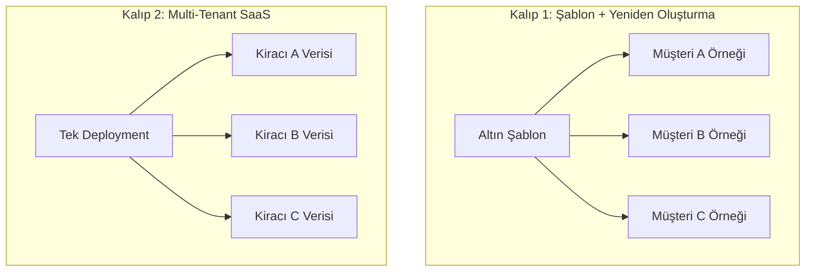
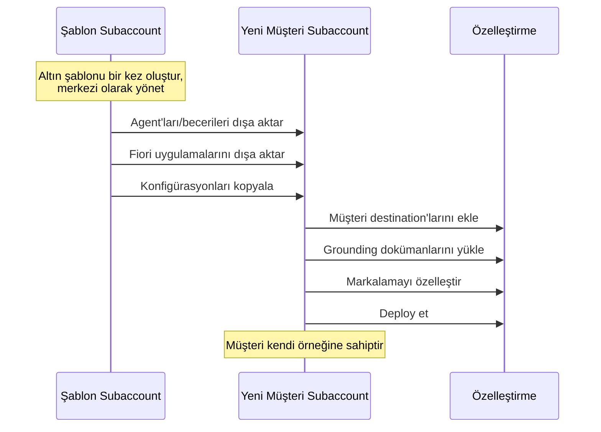
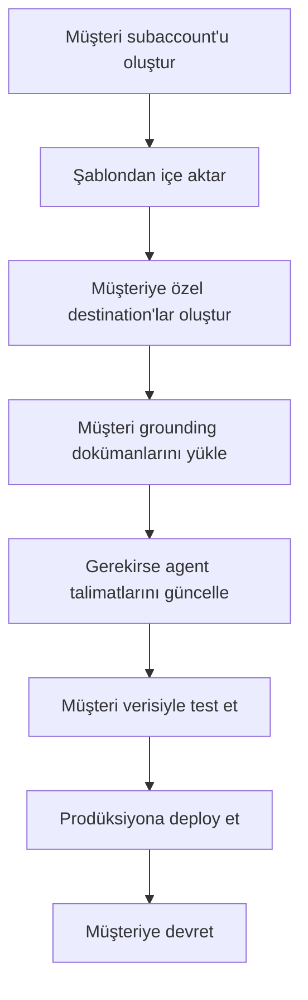
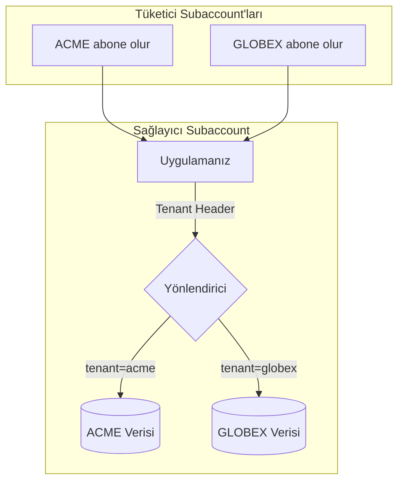
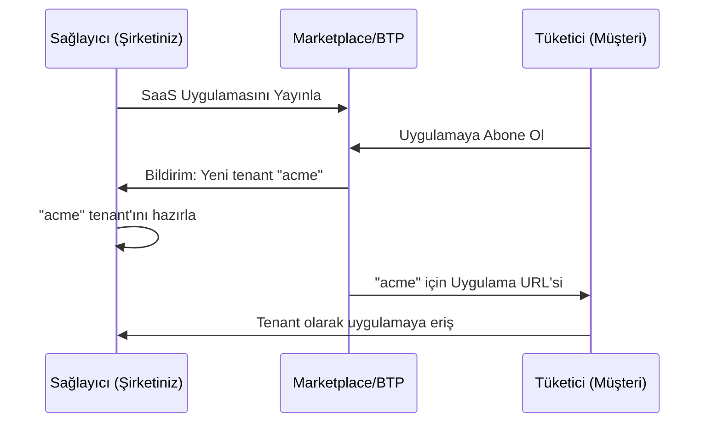
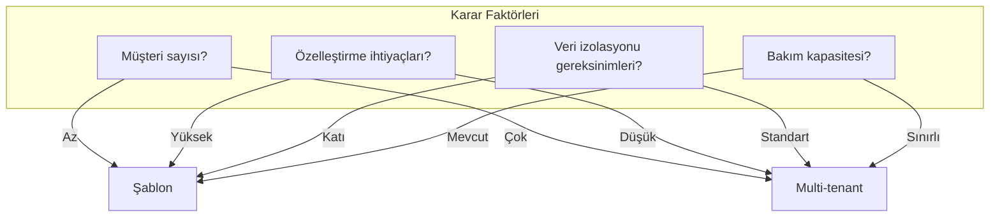
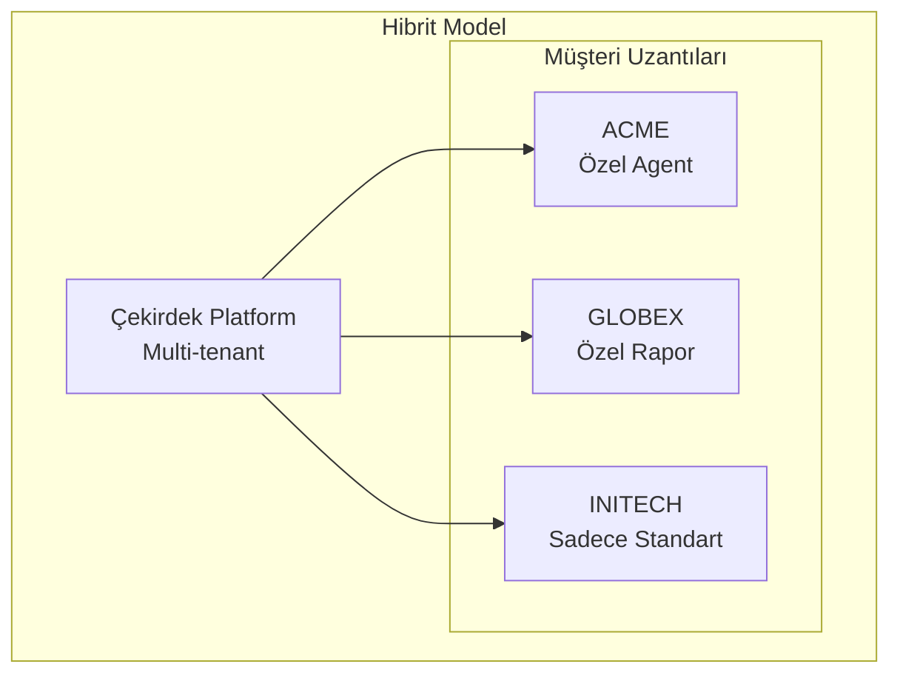
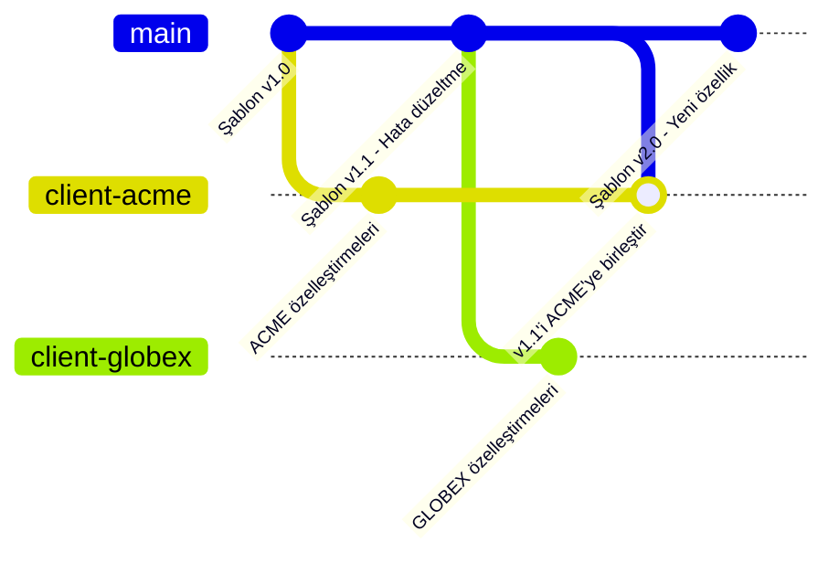

# Kısım 13: Müşteriler Arası Deployment'lar

> *Aynı Çözüm, Farklı Müşteriler*

---

Harika bir çözüm geliştirdiniz. Şimdi bunu her seferinde sıfırdan başlamadan birden fazla müşteriye dağıtmak istiyorsunuz. Bu bölüm, bu süreçteki kalıpları ve ödünleşimleri ele alır.

---

## 13.1 Deployment Kalıplarına Genel Bakış



| Kalıp | En Uygun Olduğu Durum | Müşteri Başına Efor | Başlangıç Kurulumu |
|-------|----------------------|--------------------|--------------------|
| **Şablon + Yeniden Oluşturma** | Danışmanlık projeleri | Orta | Düşük |
| **Multi-Tenant SaaS** | Ürünleştirilmiş çözümler | Düşük | Yüksek |

---

## 13.2 Kalıp 1: Şablon + Müşteri Başına Yeniden Oluşturma

### Nasıl Çalışır



### Adım Adım Süreç

**1. Şablonu Oluşturun:**
```yaml
Şablon Subaccount İçeriği:
  Agent'lar:
    - Müşteri Hizmetleri Agent'ı (genel)
    - Finans Asistanı (genel)

  Beceriler:
    - Sipariş Durumu Getir
    - İade Oluştur
    - Stok Kontrol Et

  Fiori Uygulamaları:
    - Satış Dashboard'u
    - Sipariş Yönetimi

  Dokümantasyon:
    - Kurulum kılavuzu
    - Özelleştirme kılavuzu
    - Destination konfigürasyon şablonu
```

**2. Her Yeni Müşteri İçin:**



### Örnek: Müşteri Hizmetleri Agent'ı Deployment'ı

**Şablon Agent Talimatları:**
```markdown
{COMPANY_NAME} için bir müşteri hizmetleri asistanısınız.
Müşterilere sipariş sorguları, iadeler ve kargo sorularında yardımcı olun.

Siparişleri sorgularken GetOrderStatus becerisini kullanın.
İade oluştururken önce iade politikası dokümanını kontrol edin.
```

**Müşteri A Özelleştirmesi:**
```markdown
ACME Electronics için bir müşteri hizmetleri asistanısınız.
Müşterilere sipariş sorguları, iadeler ve kargo sorularında yardımcı olun.
ACME, standart 30 günden uzatılmış 45 günlük iade politikası sunar.
```

**Müşteri B Özelleştirmesi:**
```markdown
Global Widgets Inc. için bir müşteri hizmetleri asistanısınız.
Müşterilere sipariş sorguları, iadeler ve kargo sorularında yardımcı olun.
Global Widgets, tüm iadeler için RMA numarası gerektirir.
```

### Artılar ve Eksiler

| Boyut | Artılar | Eksiler |
|-------|---------|---------|
| **İzolasyon** | ✅ Tam müşteri ayrımı | |
| **Özelleştirme** | ✅ Müşteri başına tam esneklik | |
| **Devir** | ✅ Müşteri her şeyin sahibi | |
| **Güncellemeler** | | ❌ Değişikliklerin manuel yayılması |
| **Efor** | | ❌ Müşteri başına kurulum işi |

---

## 13.3 Kalıp 2: Multi-Tenant SaaS Modu

### Mimari Genel Bakış



### BTP'de Multi-Tenancy Nasıl Çalışır

**CAP (Cloud Application Programming) Multi-Tenant:**

```javascript
// srv/service.js
module.exports = cds.service.impl(async function() {
  this.on('READ', 'Orders', async (req) => {
    // CDS otomatik olarak tenant'a göre filtreler
    const tenant = req.tenant;  // Abonelikten gelir
    // Her tenant sadece kendi verisini görür
    return SELECT.from('Orders').where({ tenant });
  });
});
```

**BTP ABAP Environment Multi-Tenant:**

```abap
" ABAP multi-tenant erişimi
DATA: lv_tenant TYPE /iwxbe/cl_runtime_context=>ty_tenant.
lv_tenant = cl_rap_xco_auth_runtime=>get_tenant_id( ).

" Veri otomatik olarak tenant'a göre filtrelenir
SELECT * FROM zorders WHERE tenant = @lv_tenant INTO TABLE @lt_orders.
```

### Abonelik Modeli



### Ne Zaman Multi-Tenant Kullanılır

| Senaryo | Öneri |
|---------|-------|
| Paketlenmiş bir ürün satışı | ✅ Multi-tenant |
| Çok sayıda küçük müşteri, aynı çözüm | ✅ Multi-tenant |
| Danışmanlık projesi, tam özelleştirme | ❌ Şablon kullanın |
| Müşteri veri izolasyonu gerektiriyor (uyumluluk) | ❌ Şablon kullanın |
| Hızlı POC | ❌ Şablon kullanın |

---

## 13.4 Karşılaştırma Tablosu



| Boyut | Şablon + Yeniden Oluşturma | Multi-Tenant SaaS |
|-------|---------------------------|-------------------|
| **Başlangıç kurulum eforu** | Düşük | Yüksek |
| **Müşteri başına efor** | Orta | Düşük |
| **Özelleştirme esnekliği** | Çok Yüksek | Sınırlı |
| **Veri izolasyonu** | Tam | Mantıksal |
| **Kod bakımı** | Örnek başına | Tek kod tabanı |
| **Güncelleme yayılımı** | Manuel | Otomatik |
| **Müşteri devri** | Kolay | Karmaşık |
| **100+ müşteriye ölçekleme** | Zor | Kolay |

---

## 13.5 Hibrit Yaklaşım

Birçok durumda, hibrit yaklaşım en iyi sonucu verir:



**Nasıl Çalışır:**
- Çekirdek uygulama multi-tenant
- Müşteriye özel uzantılar ayrı olarak deploy edilir
- Her iki dünyanın en iyisi

---

## 13.6 Müşteriler Arasında Versiyon Yönetimi

### Şablon Kalıbı Versiyon Stratejisi



### Nerede Neyin Deploy Edildiğini Takip Etme

```yaml
Deployment Kaydı:
  Şablon Versiyonu: 2.1.0

  Müşteriler:
    ACME:
      Temel Versiyon: 2.1.0
      Özelleştirmeler: ACME'ye özel iade politikası
      Deploy Tarihi: 2026-01-20
      Durum: Güncel

    GLOBEX:
      Temel Versiyon: 2.0.0  # Geride!
      Özelleştirmeler: RMA iş akışı
      Deploy Tarihi: 2026-01-10
      Durum: Güncelleme mevcut

    INITECH:
      Temel Versiyon: 2.1.0
      Özelleştirmeler: Yok
      Deploy Tarihi: 2026-01-22
      Durum: Güncel
```

---

## 13.7 Müşteri Onboarding Otomasyonu

### Otomatik Kurulum Scripti

```bash
#!/bin/bash
# new_client_setup.sh

CLIENT_NAME=$1
REGION=$2
ENV=$3

# Subaccount oluştur
btp create account/subaccount \
  --display-name "${REGION}_${CLIENT_NAME}_${ENV}" \
  --region eu10

# Yetkilendirmeleri ata
btp assign account/entitlement \
  --to-subaccount "${REGION}_${CLIENT_NAME}_${ENV}" \
  --plan free --amount 1 --service aicore

# Şablon agent'ları içe aktar
joule import --file template_agents.json \
  --subaccount "${REGION}_${CLIENT_NAME}_${ENV}"

# Standart uygulamaları deploy et
cf push -f manifest.yml \
  --var client=${CLIENT_NAME} \
  --var env=${ENV}

echo "${CLIENT_NAME} için kurulum tamamlandı"
```

### Kontrol Listesi Otomasyonu

```yaml
Otomatik Adımlar:
  - [x] Subaccount oluştur
  - [x] Yetkilendirmeleri ata
  - [x] Cloud Foundry'yi etkinleştir
  - [x] Şablon agent'ları içe aktar
  - [x] Standart uygulamaları deploy et

Gereken Manuel Adımlar:
  - [ ] Müşteriye özel destination'lar oluştur
  - [ ] Grounding dokümanlarını yükle
  - [ ] IdP güvenini yapılandır
  - [ ] Müşteri kabul testi
```

---

## Temel Çıkarımlar

1. **İki ana kalıp** — Şablon yeniden oluşturma vs. Multi-tenant
2. **Danışmanlık için şablon** — Tam özelleştirme, kolay devir
3. **Ürünler için multi-tenant** — Verimli ölçekleme, tek kod tabanı
4. **Hibrit genellikle en iyisi** — Çekirdek platform + müşteri uzantıları
5. **Versiyonları takip edin** — Nerede neyin deploy edildiğini bilin
6. **Onboarding'i otomatikleştirin** — Manuel hataları azaltın

---

## Sırada Ne Var?

Şimdi özel bir kullanım senaryosunu inceleyelim: yöneticiler için agent'lar oluşturma—stratejik içgörüler sağlayan C-seviyesi agent'lar.

---

*[Önceki: Kısım 12 – Çoklu Müşteri Yönetimi](12-multi-client-management.md) | [Sonraki: Kısım 14 – C-Seviyesi Agent'lar](14-c-level-agents.md)*

*[İçindekilere Dön](../content.md)*

---

**Yazar:** [Beyhan Meyrali](https://www.linkedin.com/in/beyhanmeyrali) — SAP Hikaye Anlatıcısı & Dijital Dönüşüm Savunucusu

*Dünya genelindeki SAP öğrencileri için ❤️ ile oluşturuldu*
