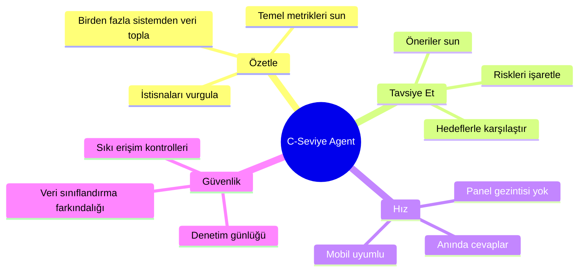
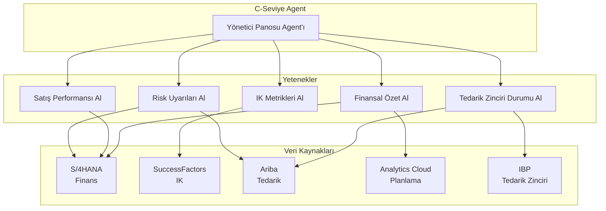
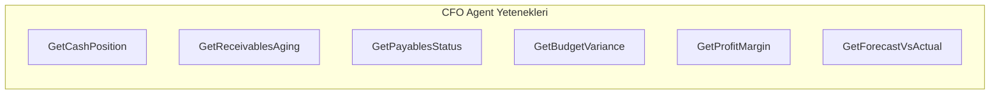
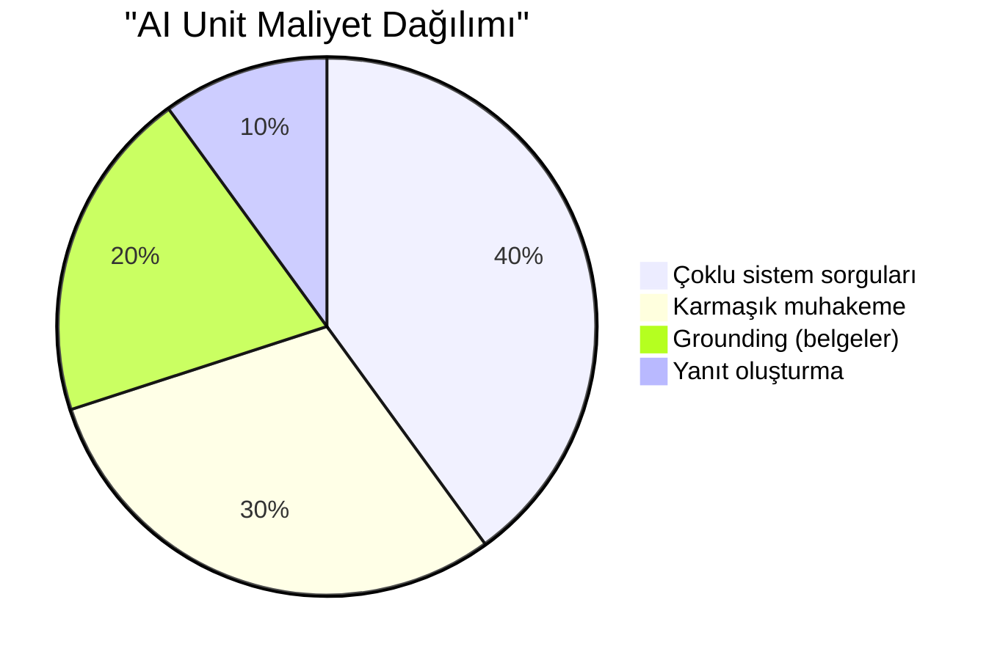
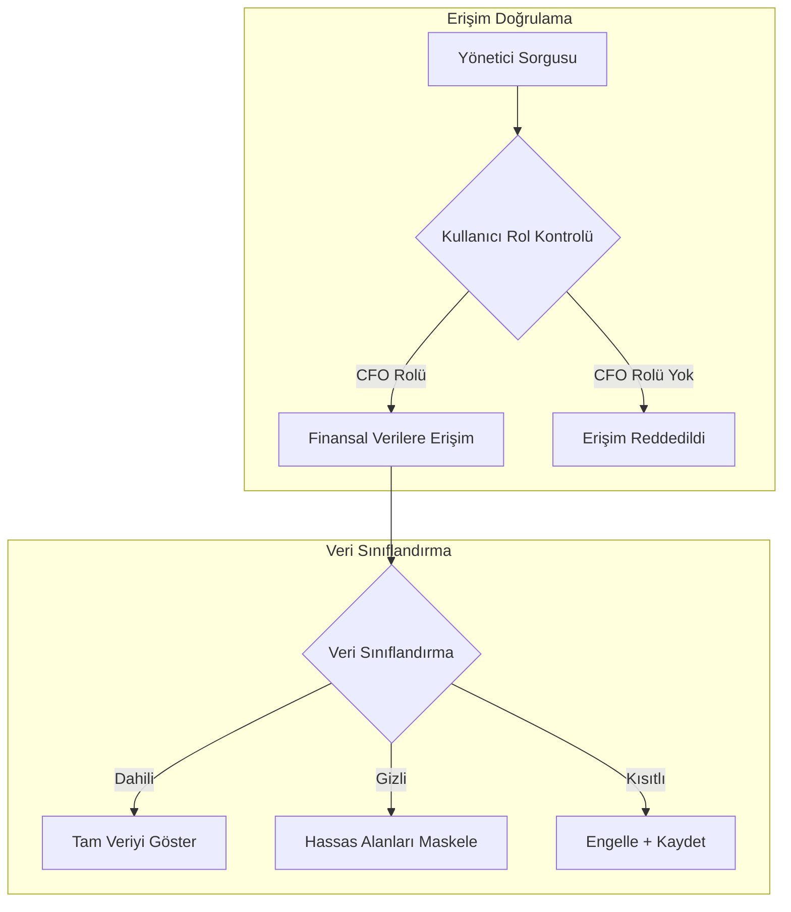
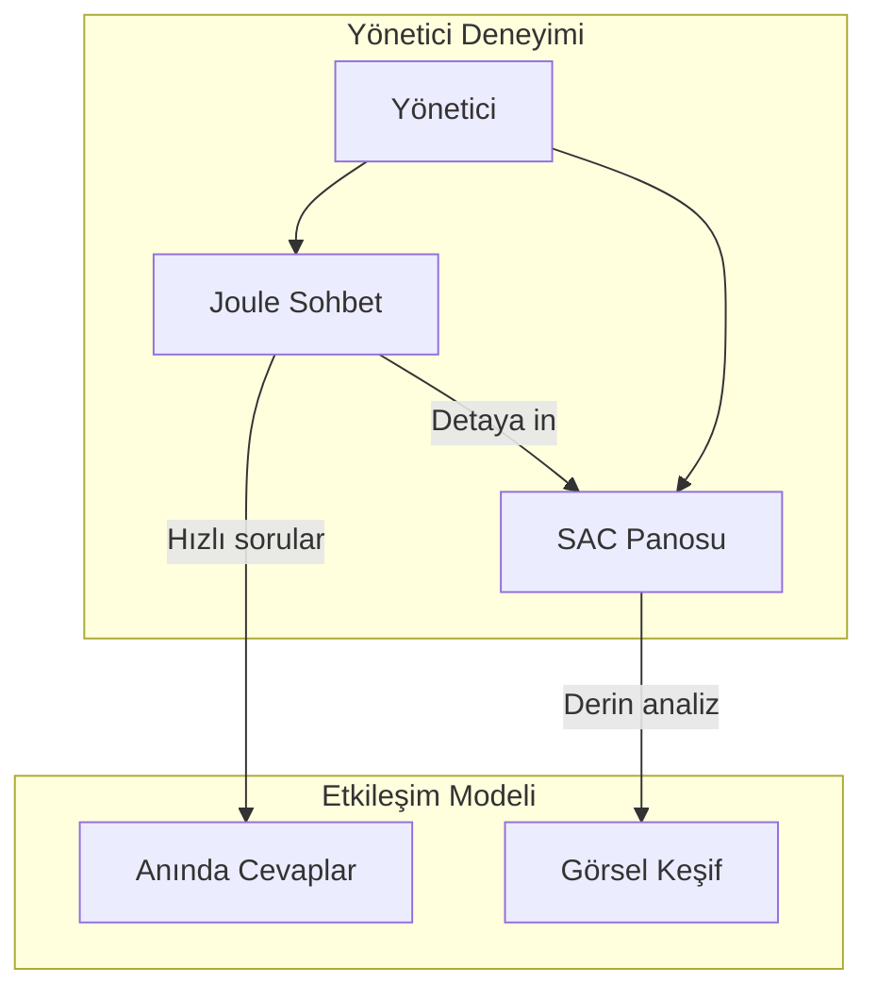
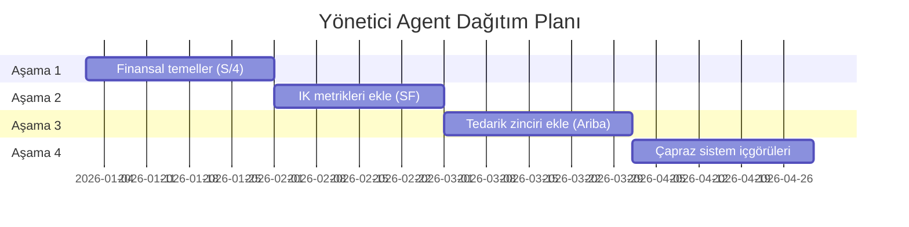

# Kısım 14: C-Seviye Agent'lar Oluşturma

> *Yönetici Özet Agent'ları ve Stratejik İçgörüler*

---

C-seviye yöneticiler karmaşık panolarda gezinmek istemezler. Soru sormak ve cevap almak isterler. Bu bölüm, üst yönetime hizmet eden agent'ları nasıl oluşturacağınızı gösterir.

---

## 14.1 C-Seviye Agent'ı Farklı Kılan Nedir



### Hedef Kullanıcılar

| Rol | Sordukları Sorular |
|------|-------------------|
| **CEO** | "Bu çeyrekte nasıl performans gösteriyoruz?" |
| **CFO** | "Nakit durumumuz ne? Vadesi geçmiş alacak var mı?" |
| **COO** | "Bilmem gereken tedarik zinciri riskleri var mı?" |
| **CHRO** | "Plana göre mevcut çalışan sayımız ne?" |
| **CIO** | "Kritik sistem sorunları var mı?" |

---

## 14.2 Mimari: Çapraz Sistem Orkestrasyonu

C-Seviye agent'lar genellikle birden fazla SAP sisteminden veri çeker:



### Çoklu Sistem Erişimi için Destination Kurulumu

```yaml
# CFO Agent için Destination'lar:
Destinations for CFO Agent:
  S4_FINANCIALS:
    URL: https://s4.acme.com/sap/opu/odata/sap/API_FINANCIAL_STATEMENT
    Auth: OAuth2SAMLBearerAssertion
    Scope: Read financial data  # Finansal verileri oku

  SAC_PLANNING:
    URL: https://acme.eu10.sapanalytics.cloud/api/v1
    Auth: OAuth2ClientCredentials
    Scope: Read planning data  # Planlama verilerini oku

  ARIBA_ANALYTICS:
    URL: https://s1.ariba.com/api/analytics
    Auth: OAuth2ClientCredentials
    Scope: Procurement analytics  # Tedarik analitiği
```

---

## 14.3 Örnek: CFO Agent

### Gerekli Yetenekler



### Yetenek 1: Nakit Durumu

**API:** S/4HANA Cash Management

```yaml
Skill: GetCashPosition
Description: Returns current cash balance across all bank accounts  # Tüm banka hesaplarındaki mevcut nakit bakiyesini döndürür

Destination: S4_FINANCIALS
Endpoint: /sap/opu/odata/sap/API_CASH_MANAGEMENT_SRV/BankAccounts

Parameters:
  - companyCode (optional, defaults to all)  # isteğe bağlı, varsayılan olarak tümü
  - currency (optional, defaults to company currency)  # isteğe bağlı, varsayılan olarak şirket para birimi

Output:
  - totalCash: number  # toplam nakit
  - currency: string  # para birimi
  - accountBreakdown: array  # hesap dökümü
```

### Yetenek 2: Alacak Yaşlandırma

**API:** S/4HANA Accounts Receivable

```yaml
Skill: GetReceivablesAging
Description: Returns receivables aging summary  # Alacak yaşlandırma özetini döndürür

Destination: S4_FINANCIALS
Endpoint: /sap/opu/odata/sap/API_OPLACCTGDOCITEMCUBE_SRV/

Output:
  - totalReceivables: number  # toplam alacaklar
  - current: number (0-30 days)  # güncel (0-30 gün)
  - overdue30: number (31-60 days)  # 30 gün gecikmiş (31-60 gün)
  - overdue60: number (61-90 days)  # 60 gün gecikmiş (61-90 gün)
  - overdue90Plus: number (>90 days)  # 90+ gün gecikmiş (>90 gün)
  - topOverdueCustomers: array  # en çok gecikmiş müşteriler
```

### Agent Talimatları

```markdown
# CFO Yönetici Agent Talimatları

## Rolünüz
ACME Corp'un CFO'su için finansal yönetici asistanısınız.
Hızlı, doğru finansal özetler ve içgörüler sunun.

## Yanıt Tarzı
- En önemli sayı ile başlayın
- Net, teknik olmayan bir dil kullanın
- Her zaman karşılaştırma ekleyin (geçen aya göre, hedefe göre)
- Sorunları proaktif olarak işaretleyin
- Detay istenmediği sürece yanıtları 100 kelimenin altında tutun

## Örnek Etkileşimler

### Nakit Durumu Sorgusu
Kullanıcı: "Nakit durumumuz ne?"
Siz: "Mevcut nakit: $12.5M USD

Bu, geçen aya göre $1.2M daha yüksek (+%10.6).
$10M minimum eşiğimizin üzerindeyiz.

En büyük hesap: Deutsche Bank Ana - $8.2M
İkinci: JPMorgan Operasyonel - $3.1M

Tam dökümü veya tahmini görmek ister misiniz?"

### Alacak Sorgusu
Kullanıcı: "Endişelenmem gereken vadesi geçmiş alacak var mı?"
Siz: "Toplam vadesi geçmiş: $2.1M (alacakların %15'i)

⚠️ Dikkat gerektiren:
- GlobalTech Inc: $450K, 95 gün gecikmiş
- Acme Partners: $380K, 75 gün gecikmiş

Tahsilat ekibi her ikisiyle de iletişime geçti.
Tam yaşlandırma raporunu göstereyim mi?"

### Proaktif Uyarılar
Kullanıcı "Herhangi bir finansal sorun var mı?" gibi genel bir soru sorduğunda:
Siz: "Üç konu dikkatinizi gerektiriyor:

1. 🔴 GlobalTech ödemesi 95 gün gecikmiş ($450K)
2. 🟡 Nakit tahmini Mart'ta potansiyel açık gösteriyor
3. 🟡 Q1 giderleri bütçenin %8 üzerinde seyrediyor

Bunlardan herhangi biri hakkında detay ister misiniz?"
```

---

## 14.4 AI Unit Tüketimini Yönetme

### C-Seviye Agent'lar Neden Pahalıdır



**Maliyet faktörleri:**
- Soru başına birden fazla yetenek çağrısı
- Karmaşık toplama mantığı
- Finansal raporlar üzerinde grounding
- Doğruluk için yüksek kaliteli model gereksinimi

### Optimizasyon Stratejileri

| Strateji | Uygulama |
|----------|----------------|
| **Önbellekleme** | Sık istenen metrikleri önbelleğe al (5 dakika TTL) |
| **Ön-toplama** | Özetleri hazırlamak için gece işleri çalıştır |
| **Akıllı yönlendirme** | Basit sorular → daha küçük model |
| **Hız sınırlama** | Yönetici başına günde maksimum 50 sorgu |

### Kullanım İzleme

```yaml
# CFO Agent Kullanımı (Ocak 2026):
CFO Agent Usage (January 2026):
  Total Queries: 342  # Toplam Sorgular
  AI Units Used: 4,560  # Kullanılan AI Unit
  Average per Query: 13.3 units  # Sorgu Başına Ortalama

  Peak Usage: Monday 8-9 AM (weekly review)  # En Yoğun Kullanım: Pazartesi 8-9 (haftalık değerlendirme)
  Top Questions:  # En Çok Sorulan Sorular
    - Cash position (87 queries)  # Nakit durumu (87 sorgu)
    - Receivables aging (64 queries)  # Alacak yaşlandırma (64 sorgu)
    - Budget variance (52 queries)  # Bütçe sapması (52 sorgu)
```

---

## 14.5 Güvenlik Hususları

### Veri Erişim Kontrolleri



### Denetim Günlüğü

Her sorgu kaydedilmelidir:

```json
{
  "timestamp": "2026-01-24T08:15:00Z",
  "user": "cfo@acme.com",
  "agent": "cfo-executive-agent",
  "query": "What's our cash position?",
  "skills_invoked": ["GetCashPosition"],
  "data_accessed": ["BankAccounts", "CashForecast"],
  "response_summary": "Returned cash position $12.5M",
  "ai_units_consumed": 12
}
```

### Hassas Bilgi İşleme

```yaml
# Hassas Veri Kuralları
Sensitive Data Rules:
  # Yanıtlarda asla gösterme
  Blocked:
    - Individual salaries  # Bireysel maaşlar
    - Pending M&A details  # Bekleyen birleşme/devralma detayları
    - Legal case specifics  # Hukuki dava ayrıntıları

  # Sadece toplu
  Aggregated:
    - Compensation data (show totals, not individuals)  # Ücret verileri (toplamları göster, bireyleri değil)
    - Performance ratings (show distributions)  # Performans değerlendirmeleri (dağılımları göster)

  # Onay gerektirir
  Confirmation Required:
    - Forecasts marked "draft"  # "Taslak" olarak işaretlenmiş tahminler
    - Data older than 24 hours  # 24 saatten eski veriler
```

---

## 14.6 Agent'larla Yönetici Panoları Oluşturma

### Joule'u SAP Analytics Cloud ile Birleştirme



### Agent Destekli Pano Navigasyonu

```markdown
Kullanıcı: "Bölgeye göre satışları göster"

Agent: "İşte Q4 bölgeye göre satış dökümü:

| Bölge | Satışlar | Hedefe Göre |
|--------|-------|------------|
| EMEA | $5.2M | +%12 |
| Americas | $4.8M | +%3 |
| APAC | $2.1M | -%8 |

APAC düşük performans gösteriyor.
APAC analizi için detaylı SAC panosunu açmamı ister misiniz?"

Kullanıcı: "Evet"

Agent: [APAC bölgesine filtrelenmiş SAC panosunu açar]
```

---

## 14.7 Yönetici Agent'ları için Pratik İpuçları

### 1. Tek Sistemle Başlayın, Kademeli Olarak Genişletin



### 2. Yönetici Desteğini Erken Alın

- Gerçek (anonimleştirilmiş) verilerle demo yapın
- Güvenlik endişelerini önceden ele alın
- Zaman tasarrufunu gösterin
- Yanıt formatı hakkında geri bildirim alın

### 3. Yanıtları Yönetici Dostu Tutun

```markdown
# Kötü ❌
"AR_OPEN_ITEMS tablosu, ZFBDT < 20260101 olan BELNR değerlerinde
toplam 2,145,678.00 EUR tutarında 847 kayıt göstermektedir."

# İyi ✅
"847 faturadan $2.1M vadesi geçmiş alacağınız var.
En eskisi 95 gün gecikmiş."
```

### 4. "Bilmiyorum" Durumlarını Zarif Bir Şekilde Ele Alın

```markdown
Veri mevcut değilse:
"Şu anda [belirli veri]'ye erişimim yok.
Bu şunlardan kaynaklanıyor olabilir:
- Sistem güncelleniyor
- Veri bağlı sistemlerimde bulunmuyor

Bu veri için bir talep oluşturmamı ister misiniz?"
```

---

## Temel Çıkarımlar

1. **Çoklu sistem entegrasyonu** — Yöneticilerin her yerden veriye ihtiyacı var
2. **Detay verme, özetle** — Anahtar sayı ile başla
3. **Sorunları proaktif olarak işaretle** — Sorulmasını bekleme
4. **AI maliyetlerini izle** — Önbelleğe al ve optimize et
5. **Önce güvenlik** — Her şeyi kaydet, erişimi kontrol et
6. **Yönetici dostu dil** — Teknik jargon yok

---

## Sırada Ne Var?

Şimdi vites değiştirelim ve entegrasyon kalıplarına bakalım—SAP Integration Suite kullanarak BTP'yi harici sistemlerle nasıl bağlayacağımızı görelim.

---

*[Önceki: Kısım 13 – Müşteriler Arası Dağıtımlar](13-cross-customer-deployments.md) | [Sonraki: Kısım 15 – SAP Integration Suite](15-integration-suite.md)*

*[İçindekilere Dön](../content.md)*

---

**Yazar:** [Beyhan Meyrali](https://www.linkedin.com/in/beyhanmeyrali) — SAP Hikaye Anlatıcısı & Dijital Dönüşüm Savunucusu

*Dünya genelindeki SAP öğrencileri için ❤️ ile oluşturuldu*
