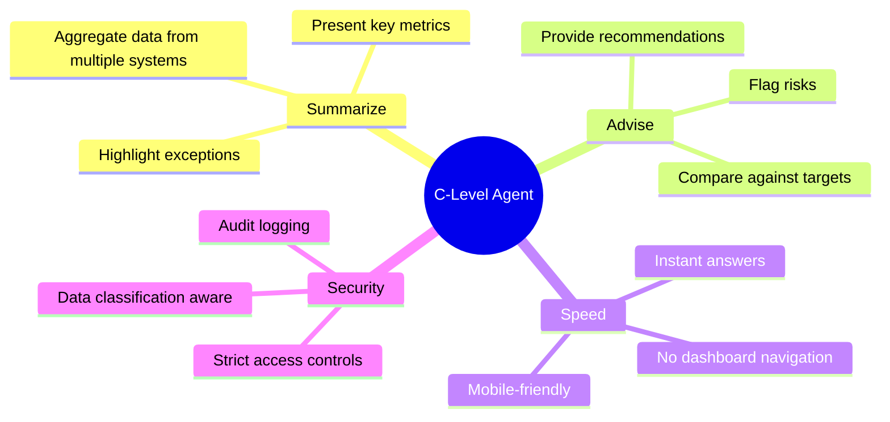
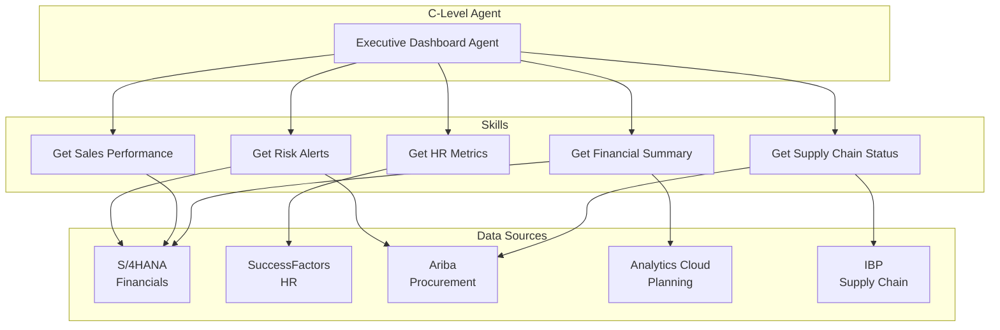
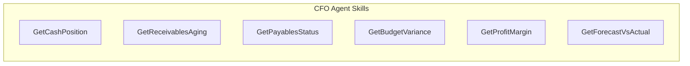
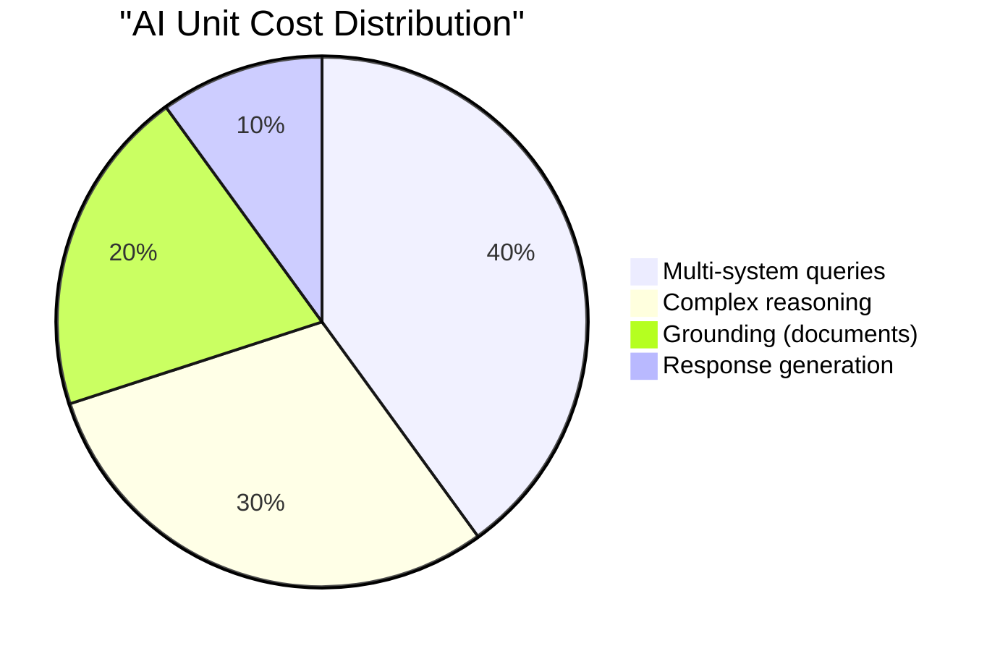
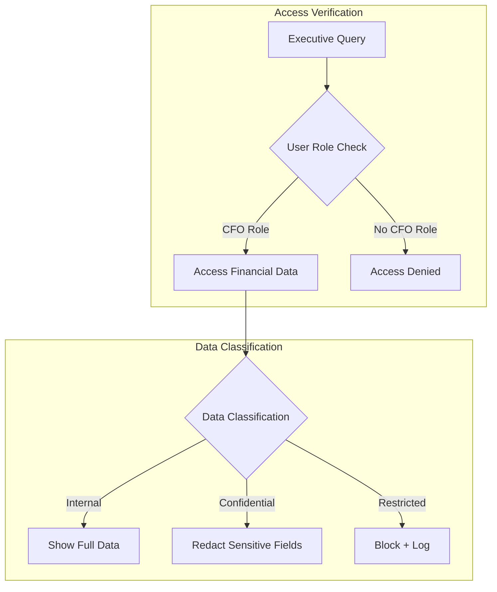
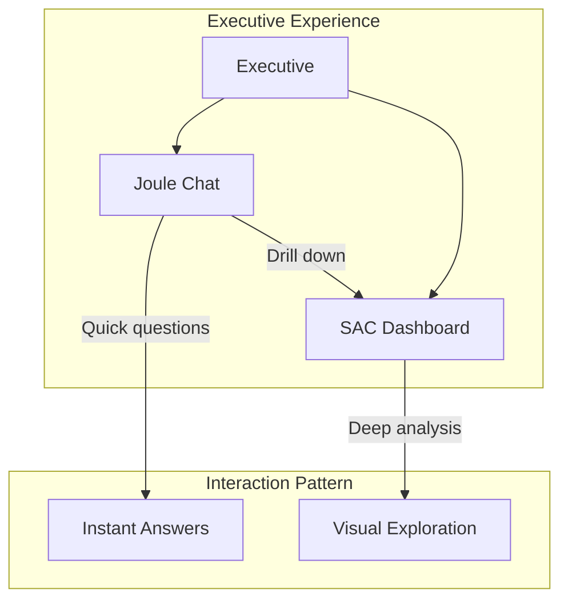
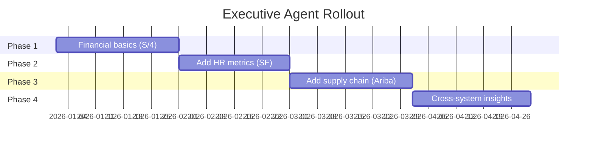

# Kısım 14: Building C-Level Agents

> *Executive Summary Agents and Strategic Insights*

---

C-level executives don't want to navigate complex dashboards. They want to ask questions and get answers. This chapter shows you how to build agents that serve the C-suite.

---

## 14.1 What Makes a C-Level Agent Different



### Target Users

| Role | Questions They Ask |
|------|-------------------|
| **CEO** | "How are we performing this quarter?" |
| **CFO** | "What's our cash position? Any overdue receivables?" |
| **COO** | "Are there any supply chain risks I should know about?" |
| **CHRO** | "What's our current headcount vs. plan?" |
| **CIO** | "Any critical system issues?" |

---

## 14.2 Architecture: Cross-System Orchestration

C-Level agents typically pull from multiple SAP systems:



### Destination Setup for Multi-System Access

```yaml
Destinations for CFO Agent:
  S4_FINANCIALS:
    URL: https://s4.acme.com/sap/opu/odata/sap/API_FINANCIAL_STATEMENT
    Auth: OAuth2SAMLBearerAssertion
    Scope: Read financial data

  SAC_PLANNING:
    URL: https://acme.eu10.sapanalytics.cloud/api/v1
    Auth: OAuth2ClientCredentials
    Scope: Read planning data

  ARIBA_ANALYTICS:
    URL: https://s1.ariba.com/api/analytics
    Auth: OAuth2ClientCredentials
    Scope: Procurement analytics
```

---

## 14.3 Örnek: CFO Agent

### Skills Required



### Skill 1: Cash Position

**API:** S/4HANA Cash Management

```yaml
Skill: GetCashPosition
Description: Returns current cash balance across all bank accounts

Destination: S4_FINANCIALS
Endpoint: /sap/opu/odata/sap/API_CASH_MANAGEMENT_SRV/BankAccounts

Parameters:
  - companyCode (optional, defaults to all)
  - currency (optional, defaults to company currency)

Output:
  - totalCash: number
  - currency: string
  - accountBreakdown: array
```

### Skill 2: Receivables Aging

**API:** S/4HANA Accounts Receivable

```yaml
Skill: GetReceivablesAging
Description: Returns receivables aging summary

Destination: S4_FINANCIALS
Endpoint: /sap/opu/odata/sap/API_OPLACCTGDOCITEMCUBE_SRV/

Output:
  - totalReceivables: number
  - current: number (0-30 days)
  - overdue30: number (31-60 days)
  - overdue60: number (61-90 days)
  - overdue90Plus: number (>90 days)
  - topOverdueCustomers: array
```

### Agent Instructions

```markdown
# CFO Executive Agent Instructions

## Your Role
You are a financial executive assistant for ACME Corp's CFO.
Provide quick, accurate financial summaries and insights.

## Response Style
- Lead with the most important number
- Use clear, non-technical language
- Always include comparison (vs. last month, vs. target)
- Flag issues proactively
- Keep responses under 100 words unless asked for detail

## Örnek Interactions

### Cash Position Query
User: "What's our cash position?"
You: "Current cash: $12.5M USD

This is $1.2M higher than last month (+10.6%).
We're above our $10M minimum threshold.

Largest account: Deutsche Bank Main - $8.2M
Second: JPMorgan Operating - $3.1M

Would you like the full breakdown or forecast?"

### Receivables Query
User: "Any overdue receivables I should worry about?"
You: "Total overdue: $2.1M (15% of receivables)

⚠️ Attention needed:
- GlobalTech Inc: $450K, 95 days overdue
- Acme Partners: $380K, 75 days overdue

Collections team has contacted both.
Shall I show the full aging report?"

### Proactive Alerts
When user asks a general question like "Any financial issues?":
You: "Three items need your attention:

1. 🔴 GlobalTech payment overdue 95 days ($450K)
2. 🟡 Cash forecast shows potential shortfall in March
3. 🟡 Q1 expenses tracking 8% over budget

Want details on any of these?"
```

---

## 14.4 Managing AI Unit Consumption

### Why C-Level Agents Are Expensive



**Cost factors:**
- Multiple skill invocations per question
- Complex aggregation logic
- Grounding on financial reports
- High-quality model needed for accuracy

### Optimization Strategies

| Strategy | Implementation |
|----------|----------------|
| **Caching** | Cache frequently requested metrics (5-min TTL) |
| **Pre-aggregation** | Run nightly jobs to prepare summaries |
| **Smart routing** | Simple questions → smaller model |
| **Rate limiting** | Max 50 queries/day per executive |

### Usage Monitoring

```yaml
CFO Agent Usage (January 2026):
  Total Queries: 342
  AI Units Used: 4,560
  Average per Query: 13.3 units

  Peak Usage: Monday 8-9 AM (weekly review)
  Top Questions:
    - Cash position (87 queries)
    - Receivables aging (64 queries)
    - Budget variance (52 queries)
```

---

## 14.5 Security Considerations

### Data Access Controls



### Audit Logging

Every query should be logged:

```json
{
  "timestamp": "2026-01-24T08:15:00Z",
  "user": "cfo@acme.com",
  "agent": "cfo-executive-agent",
  "query": "What's our cash position?",
  "skills_invoked": ["GetCashPosition"],
  "data_accessed": ["BankAccounts", "CashForecast"],
  "response_summary": "Returned cash position $12.5M",
  "ai_units_consumed": 12
}
```

### Sensitive Information Handling

```yaml
Sensitive Data Rules:
  # Never show in responses
  Blocked:
    - Individual salaries
    - Pending M&A details
    - Legal case specifics

  # Aggregate only
  Aggregated:
    - Compensation data (show totals, not individuals)
    - Performance ratings (show distributions)

  # Require confirmation
  Confirmation Required:
    - Forecasts marked "draft"
    - Data older than 24 hours
```

---

## 14.6 Building Executive Dashboards with Agents

### Combining Joule with SAP Analytics Cloud



### Agent-Assisted Dashboard Navigation

```markdown
User: "Show me sales by region"

Agent: "Here's the Q4 sales breakdown by region:

| Region | Sales | vs. Target |
|--------|-------|------------|
| EMEA | $5.2M | +12% |
| Americas | $4.8M | +3% |
| APAC | $2.1M | -8% |

APAC is underperforming.
Want me to open the detailed SAC dashboard for APAC analysis?"

User: "Yes"

Agent: [Opens SAC dashboard filtered to APAC region]
```

---

## 14.7 Practical Tips for Executive Agents

### 1. Start with One System, Expand Gradually



### 2. Get Executive Buy-In Early

- Demo with real (anonymized) data
- Address security concerns upfront
- Show time savings
- Get feedback on response format

### 3. Keep Responses Executive-Friendly

```markdown
# Bad ❌
"The AR_OPEN_ITEMS table shows 847 records with BELNR values
where ZFBDT < 20260101 totaling 2,145,678.00 EUR."

# Good ✅
"You have $2.1M in overdue receivables from 847 invoices.
The oldest is 95 days past due."
```

### 4. Handle "I Don't Know" Gracefully

```markdown
If data is unavailable:
"I don't have access to [specific data] right now.
This could be because:
- The system is being updated
- The data isn't in my connected systems

Would you like me to create a request for this data?"
```

---

## Temel Çıkarımlar

1. **Multi-system integration** — Executives need data from everywhere
2. **Summarize, don't detail** — Lead with the key number
3. **Flag issues proactively** — Don't wait to be asked
4. **Watch AI costs** — Cache and optimize
5. **Security first** — Log everything, control access
6. **Executive-friendly language** — No technical jargon

---

## Sırada Ne Var?

Let's shift gears and look at integration patterns—how to connect BTP with external systems using SAP Integration Suite.

---

*[Önceki: Kısım 13 – Cross-Customer Deployments](13-cross-customer-deployments.md) | [Sonraki: Kısım 15 – SAP Integration Suite](15-integration-suite.md)*

*[İçindekilere Dön](../content.md)*

---

**Yazar:** [Beyhan Meyrali](https://www.linkedin.com/in/beyhanmeyrali) — SAP Storyteller & Digital Transformation Advocate

*Oluşturuldu ❤️ dünya genelindeki SAP öğrencileri için*
