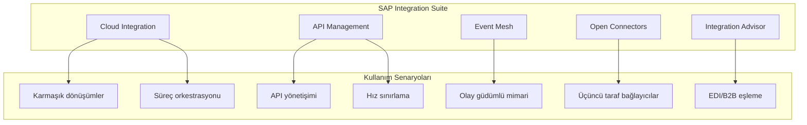
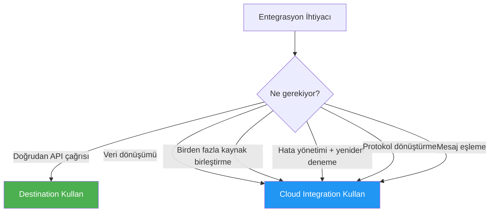
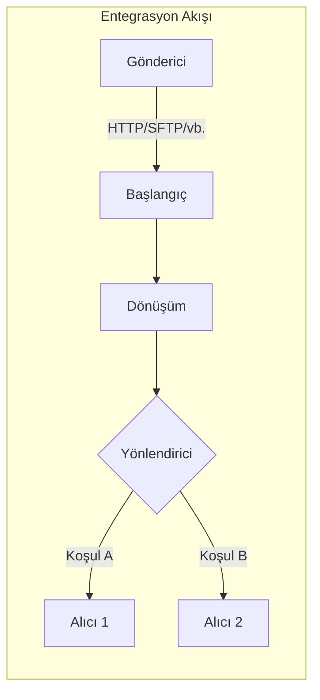
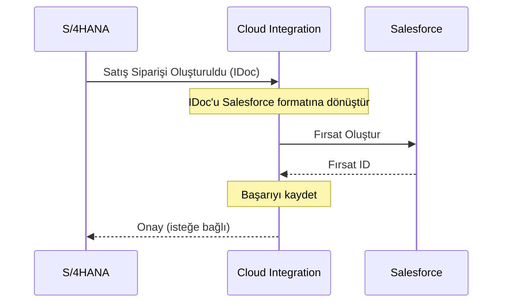
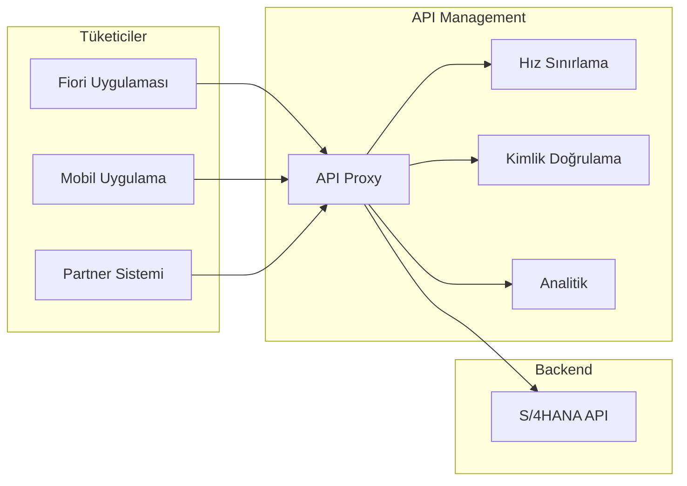
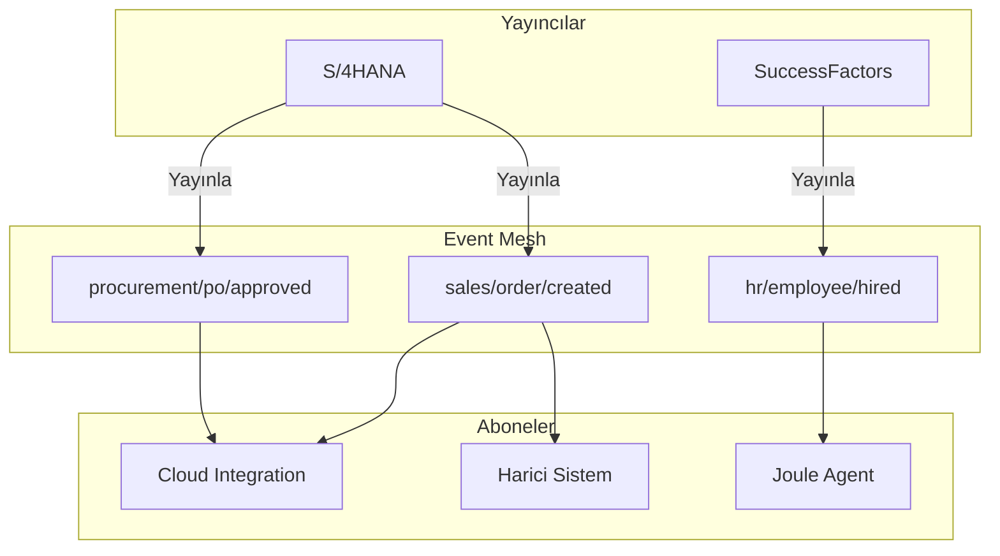
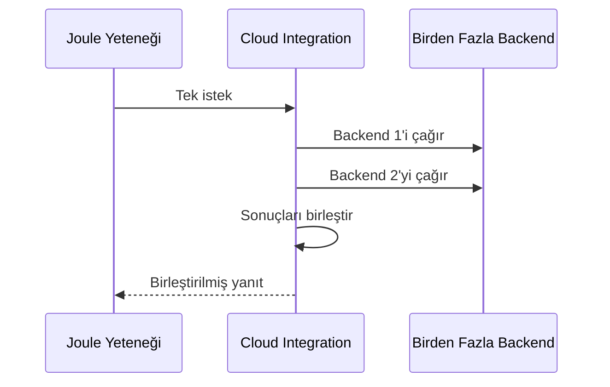
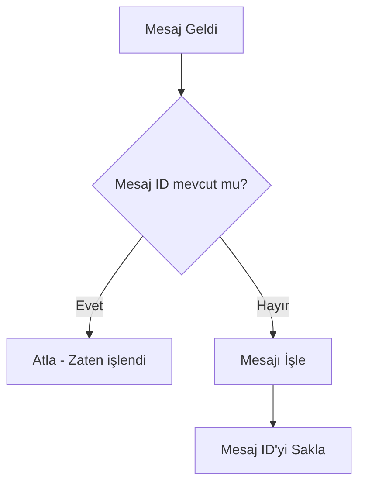

# Kısım 15: SAP Integration Suite

> *Her Şeyi Her Şeye Bağlamak*

---

SAP Integration Suite, BTP'nin entegrasyon omurgasıdır. Destination'lar yeterli olmadığında ve karmaşık dönüşümler, yönlendirme veya B2B entegrasyonuna ihtiyaç duyduğunuzda, kullanacağınız araç budur.

---

## 15.1 SAP Integration Suite Nedir?



### Bileşenlere Genel Bakış

| Bileşen | Amaç | Ne Zaman Kullanılır |
|---------|------|---------------------|
| **Cloud Integration** | Entegrasyon akışları oluşturma | Karmaşık dönüşümler, orkestrasyon |
| **API Management** | API'leri yönetme ve yönetişim | API güvenliği, analitik, para kazanma |
| **Event Mesh** | Olay güdümlü entegrasyon | Asenkron iletişim, bağımsızlaştırma |
| **Open Connectors** | Hazır üçüncü taraf bağlayıcılar | Salesforce, Workday vb. |
| **Integration Advisor** | B2B mesaj eşleme | EDI, IDoc, endüstri standartları |

---

## 15.2 Cloud Integration (CPI) Temelleri

### Cloud Integration vs. Destination: Ne Zaman Kullanılır



### Entegrasyon Akışı Mimarisi



### Örnek: S/4'ten Üçüncü Taraf CRM'e Sipariş Replikasyonu

**Senaryo:** S/4HANA'da bir satış siparişi oluşturulduğunda, bunu Salesforce CRM'e replike edin.



### Entegrasyon Akışını Oluşturma

**Adım 1: Gönderici Adaptörünü Yapılandırma**
```yaml
Adapter: IDoc
System: S4_PROD
IDoc Type: ORDERS05
```

**Adım 2: Mesaj Eşleme Ekleme**
```xml
<!-- Kaynak: IDoc ORDERS05 -->
<IDOC>
  <E1EDK01>
    <BELNR>0000012345</BELNR>
    <CURCY>USD</CURCY>
  </E1EDK01>
  <E1EDKA1>
    <PARVW>AG</PARVW>
    <NAME1>Acme Corp</NAME1>
  </E1EDKA1>
</IDOC>

<!-- Hedef: Salesforce Opportunity -->
<Opportunity>
  <Name>Order 12345 - Acme Corp</Name>
  <Amount>50000</Amount>
  <Currency>USD</Currency>
  <AccountName>Acme Corp</AccountName>
</Opportunity>
```

**Adım 3: Alıcı Adaptörünü Yapılandırma**
```yaml
Adapter: HTTP
Endpoint: https://acme.my.salesforce.com/services/data/v54.0/sobjects/Opportunity
Auth: OAuth2
Method: POST
```

---

## 15.3 API Management

### API Proxy Deseni



### Neden API Management Kullanılmalı?

| API Management Olmadan | API Management ile |
|------------------------|-------------------|
| Doğrudan API çağrıları | Gateway üzerinden proxy |
| Hız sınırlama yok | Yapılandırılabilir kısıtlama |
| Sınırlı görünürlük | Tam analitik |
| Her uygulama kendi kimlik doğrulamasını yönetir | Merkezi güvenlik |
| API'leri kullanımdan kaldırmak zor | API versiyonlama |

### API Proxy Oluşturma

**Adım 1: API'yi İçe Aktarma**
```yaml
Name: Sales-Order-API
Base Path: /sales/v1
Target URL: https://s4.acme.com/sap/opu/odata/sap/API_SALES_ORDER_SRV
```

**Adım 2: Politikalar Ekleme**

**Hız Sınırlama Politikası:**
```xml
<SpikeArrest>
  <Rate>100pm</Rate>  <!-- Dakikada 100 istek -->
</SpikeArrest>
```

**OAuth Doğrulama:**
```xml
<OAuthV2>
  <Operation>VerifyAccessToken</Operation>
</OAuthV2>
```

---

## 15.4 Asenkron İletişim için Event Mesh

### Olay Güdümlü Mimari



### Event Mesh Ne Zaman Kullanılır

| Senaryo | Event Mesh Kullanılsın mı? |
|---------|---------------------------|
| Gerçek zamanlı senkronizasyon gerekli | Evet |
| Gönder-ve-unut deseni | Evet |
| Sistemleri bağımsızlaştırma | Evet |
| İstek-yanıt gerekli | REST Kullan |

### Event Mesh Kurulumu

```json
{
  "specversion": "1.0",
  "type": "sap.s4.order.created",
  "source": "/s4hana/acme-prod",
  "id": "evt-001",
  "time": "2026-01-24T10:00:00Z",
  "data": {
    "orderNumber": "12345",
    "customer": "ACME Corp",
    "amount": 50000
  }
}
```

---

## 15.5 Joule Yetenekleri için Entegrasyon Desenleri

### Yetenek Çağrıları Entegrasyon Akışı



**Ne zaman kullanılır:**
- Yetenek birden fazla kaynaktan veriye ihtiyaç duyduğunda
- Joule'a döndürmeden önce dönüşüm gerektiğinde
- Joule'u backend karmaşıklığından korumak istediğinizde

**Entegrasyon Akışı için Destination:**
```yaml
Name: CPI_ORDER_AGGREGATOR
Type: HTTP
URL: https://acme.it-cpi.cfapps.eu10.hana.ondemand.com/http/getOrderComplete
Auth: OAuth2ClientCredentials
```

---

## 15.6 En İyi Uygulamalar

### 1. Hataya Karşı Tasarım

```yaml
Hata Yönetimi:
  - Try-catch blokları kullanın
  - Hataları harici monitöre kaydedin
  - Üstel geri çekilme ile yeniden deneme uygulayın

Yeniden Deneme Politikası:
  retryCount: 3
  retryInterval: 30s
  backoffMultiplier: 2
```

### 2. Dışsallaştırılmış Yapılandırma Kullanın

```xml
<!-- İyi -->
<http:address uri="{{salesforce.api.url}}"/>

<!-- Kötü - sabit kodlanmış -->
<http:address uri="https://acme.salesforce.com/api"/>
```

### 3. Idempotency Uygulayın



---

## Temel Çıkarımlar

1. **Integration Suite = Tam entegrasyon platformu** — Sadece Cloud Integration değil
2. **Karmaşık senaryolarda CPI kullanın** — Dönüşümler, orkestrasyon, hata yönetimi
3. **Yönetişim için API Management** — Hız sınırlama, analitik, güvenlik
4. **Asenkron için Event Mesh** — Sistemleri bağımsızlaştırma, gerçek zamanlı olaylar
5. **Hataya karşı tasarım** — Yeniden deneme, idempotency, izleme

---

*[Önceki: Kısım 14 – C-Level Agents](14-c-level-agents.md) | [Sonraki: Kısım 16 – Cloud Connector](16-cloud-connector.md)*

*[İçindekilere Dön](../content.md)*

---

**Yazar:** [Beyhan Meyrali](https://www.linkedin.com/in/beyhanmeyrali) — SAP Hikaye Anlatıcısı & Dijital Dönüşüm Savunucusu

*Dünya genelindeki SAP öğrencileri için ❤️ ile oluşturuldu*
