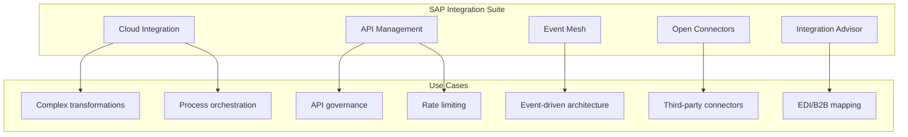
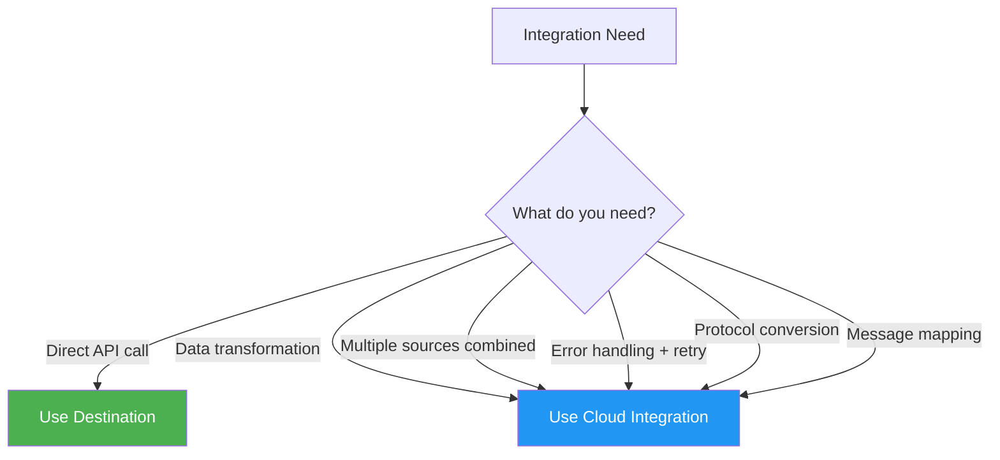
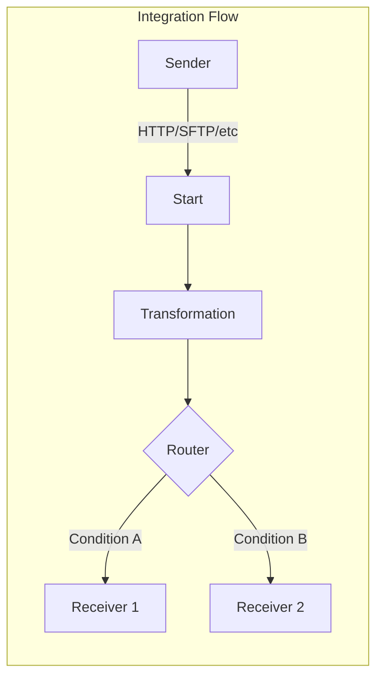
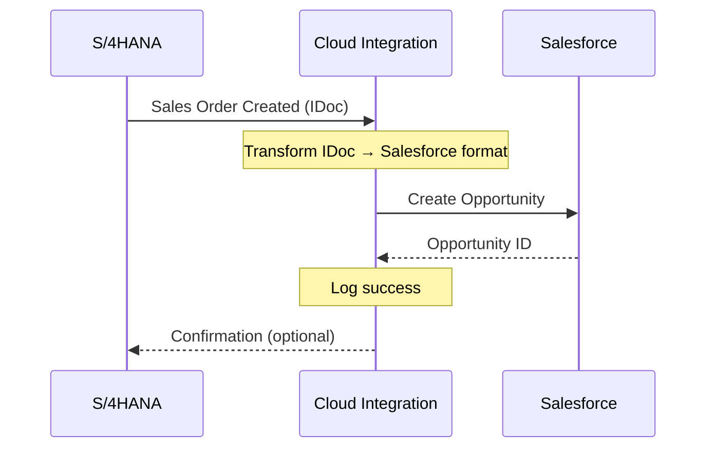
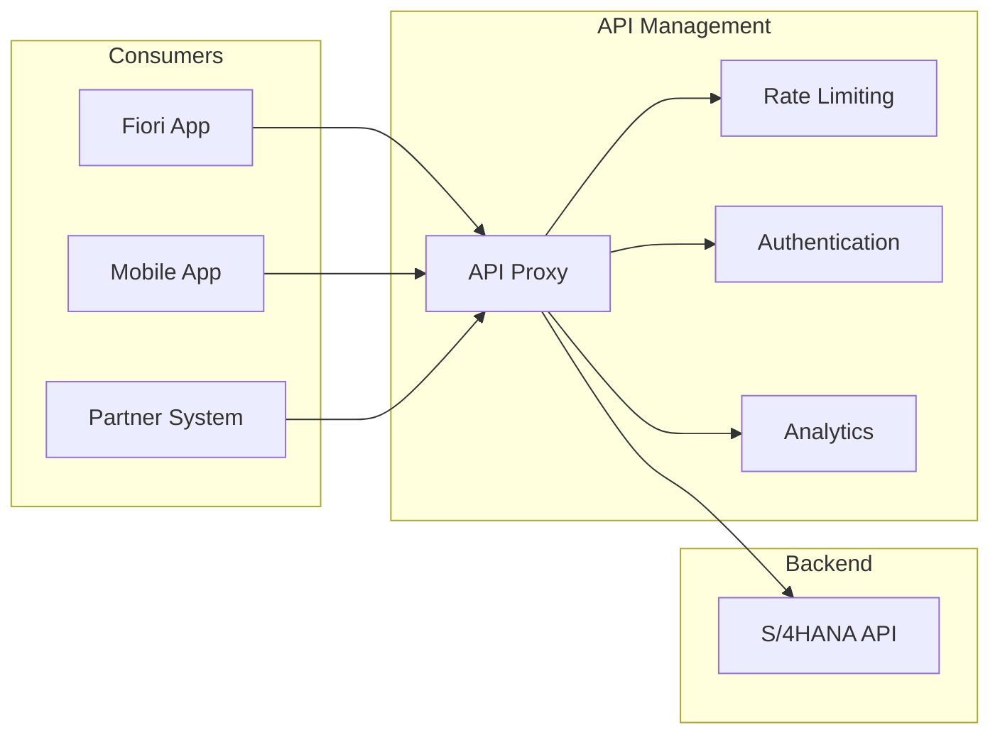
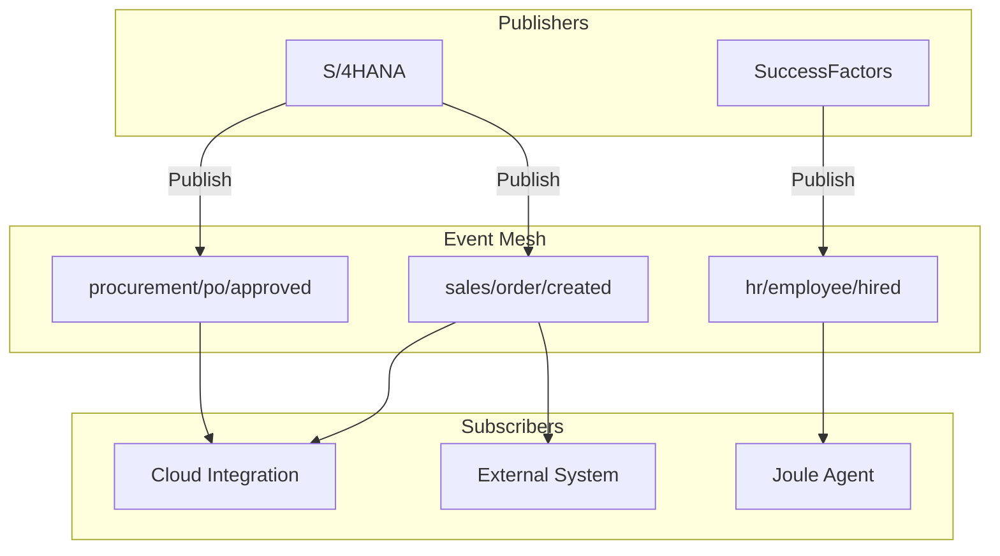
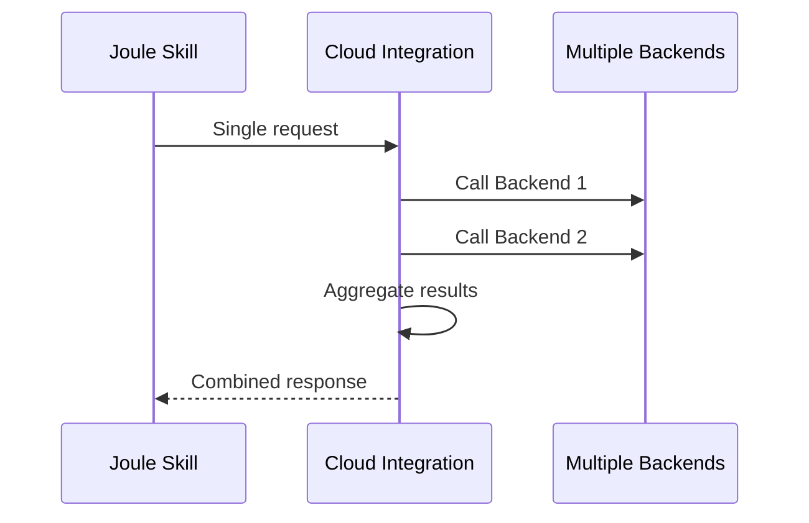
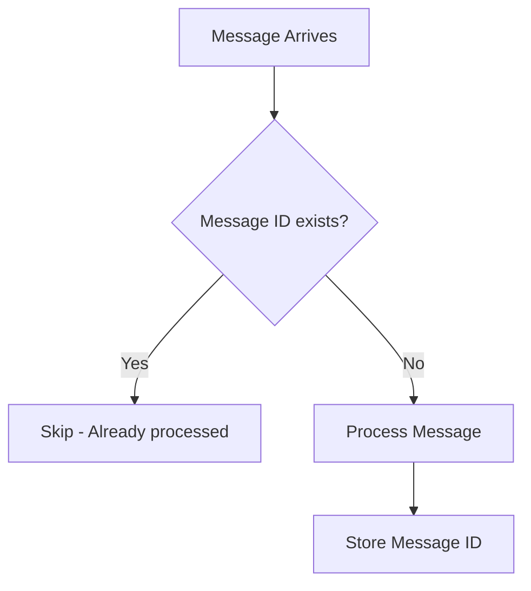

# Kısım 15: SAP Integration Suite

> *Connecting Everything to Everything*

---

SAP Integration Suite is the integration backbone of BTP. When destinations aren't enough and you need complex transformations, routing, or B2B integration, this is your tool.

---

## 15.1 What Is SAP Integration Suite?



### Components at a Glance

| Component | Purpose | Ne Zaman Kullanılır |
|-----------|---------|-------------|
| **Cloud Integration** | Build integration flows | Complex transformations, orchestration |
| **API Management** | Manage and govern APIs | API security, analytics, monetization |
| **Event Mesh** | Event-driven integration | Async communication, decoupling |
| **Open Connectors** | Pre-built 3rd party connectors | Salesforce, Workday, etc. |
| **Integration Advisor** | B2B message mapping | EDI, IDoc, industry standards |

---

## 15.2 Cloud Integration (CPI) Basics

### Ne Zaman Kullanılır Cloud Integration vs. Destinations



### Integration Flow Architecture



### Örnek: Order Replication S/4 to Third-Party CRM

**Scenario:** When a sales order is created in S/4HANA, replicate it to Salesforce CRM.



### Building the Integration Flow

**Step 1: Configure Sender Adapter**
```yaml
Adapter: IDoc
System: S4_PROD
IDoc Type: ORDERS05
```

**Step 2: Add Message Mapping**
```xml
<!-- Source: IDoc ORDERS05 -->
<IDOC>
  <E1EDK01>
    <BELNR>0000012345</BELNR>
    <CURCY>USD</CURCY>
  </E1EDK01>
  <E1EDKA1>
    <PARVW>AG</PARVW>
    <NAME1>Acme Corp</NAME1>
  </E1EDKA1>
</IDOC>

<!-- Target: Salesforce Opportunity -->
<Opportunity>
  <Name>Order 12345 - Acme Corp</Name>
  <Amount>50000</Amount>
  <Currency>USD</Currency>
  <AccountName>Acme Corp</AccountName>
</Opportunity>
```

**Step 3: Configure Receiver Adapter**
```yaml
Adapter: HTTP
Endpoint: https://acme.my.salesforce.com/services/data/v54.0/sobjects/Opportunity
Auth: OAuth2
Method: POST
```

---

## 15.3 API Management

### The API Proxy Pattern



### Why Use API Management?

| Without API Management | With API Management |
|----------------------|---------------------|
| Direct API calls | Proxied through gateway |
| No rate limiting | Configurable throttling |
| Limited visibility | Full analytics |
| Each app manages auth | Centralized security |
| Hard to deprecate APIs | API versioning |

### Creating an API Proxy

**Step 1: Import API**
```yaml
Name: Sales-Order-API
Base Path: /sales/v1
Target URL: https://s4.acme.com/sap/opu/odata/sap/API_SALES_ORDER_SRV
```

**Step 2: Add Policies**

**Rate Limiting Policy:**
```xml
<SpikeArrest>
  <Rate>100pm</Rate>  <!-- 100 per minute -->
</SpikeArrest>
```

**OAuth Verification:**
```xml
<OAuthV2>
  <Operation>VerifyAccessToken</Operation>
</OAuthV2>
```

---

## 15.4 Event Mesh for Async Communication

### Event-Driven Architecture



### Ne Zaman Kullanılır Event Mesh

| Scenario | Use Event Mesh? |
|----------|-----------------|
| Real-time sync needed | Yes |
| Fire-and-forget pattern | Yes |
| Decouple systems | Yes |
| Request-response needed | Use REST |

### Setting Up Event Mesh

```json
{
  "specversion": "1.0",
  "type": "sap.s4.order.created",
  "source": "/s4hana/acme-prod",
  "id": "evt-001",
  "time": "2026-01-24T10:00:00Z",
  "data": {
    "orderNumber": "12345",
    "customer": "ACME Corp",
    "amount": 50000
  }
}
```

---

## 15.5 Integration Patterns for Joule Skills

### Skill Calls Integration Flow



**Use when:**
- Skill needs data from multiple sources
- Need transformation before returning to Joule
- Want to shield Joule from backend complexity

**Destination for Integration Flow:**
```yaml
Name: CPI_ORDER_AGGREGATOR
Type: HTTP
URL: https://acme.it-cpi.cfapps.eu10.hana.ondemand.com/http/getOrderComplete
Auth: OAuth2ClientCredentials
```

---

## 15.6 En İyi Uygulamalar

### 1. Design for Failure

```yaml
Error Handling:
  - Use try-catch blocks
  - Log errors to external monitor
  - Implement retry with exponential backoff

Retry Policy:
  retryCount: 3
  retryInterval: 30s
  backoffMultiplier: 2
```

### 2. Use Externalized Configuration

```xml
<!-- Good -->
<http:address uri="{{salesforce.api.url}}"/>

<!-- Bad - hardcoded -->
<http:address uri="https://acme.salesforce.com/api"/>
```

### 3. Implement Idempotency



---

## Temel Çıkarımlar

1. **Integration Suite = Full integration platform** — Not just Cloud Integration
2. **Use CPI for complex scenarios** — Transformations, orchestration, error handling
3. **API Management for governance** — Rate limiting, analytics, security
4. **Event Mesh for async** — Decouple systems, real-time events
5. **Design for failure** — Retry, idempotency, monitoring

---

*[Önceki: Kısım 14 – C-Level Agents](14-c-level-agents.md) | [Sonraki: Kısım 16 – Cloud Connector](16-cloud-connector.md)*

*[İçindekilere Dön](../content.md)*

---

**Yazar:** [Beyhan Meyrali](https://www.linkedin.com/in/beyhanmeyrali) — SAP Storyteller & Digital Transformation Advocate

*Oluşturuldu ❤️ dünya genelindeki SAP öğrencileri için*
