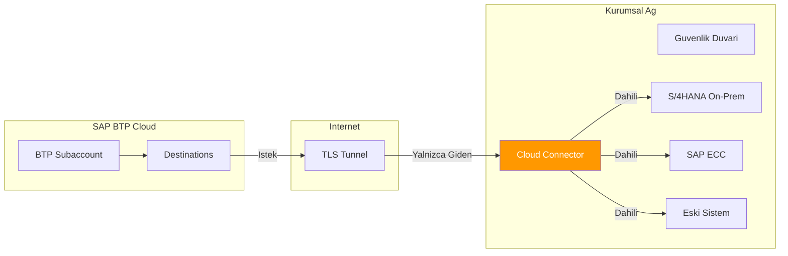
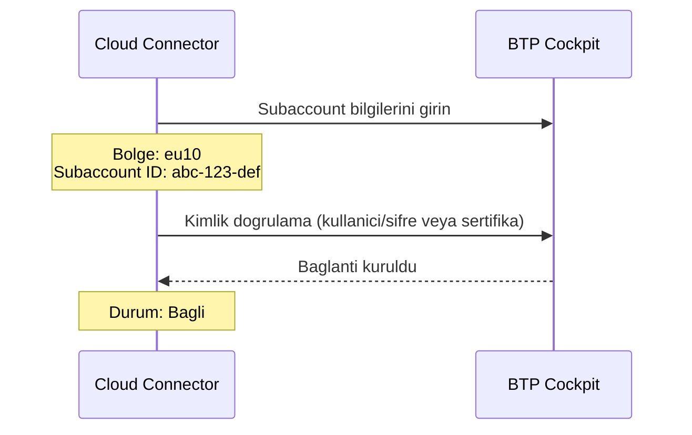
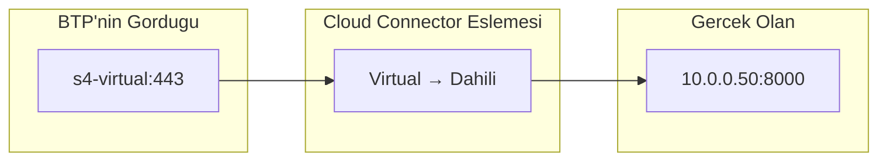
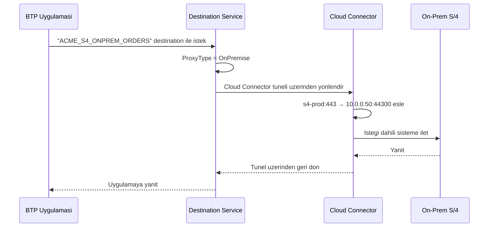
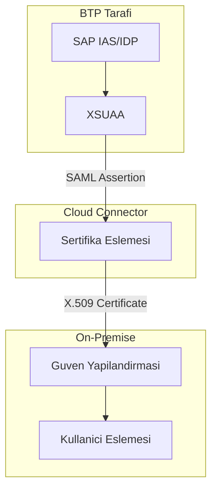
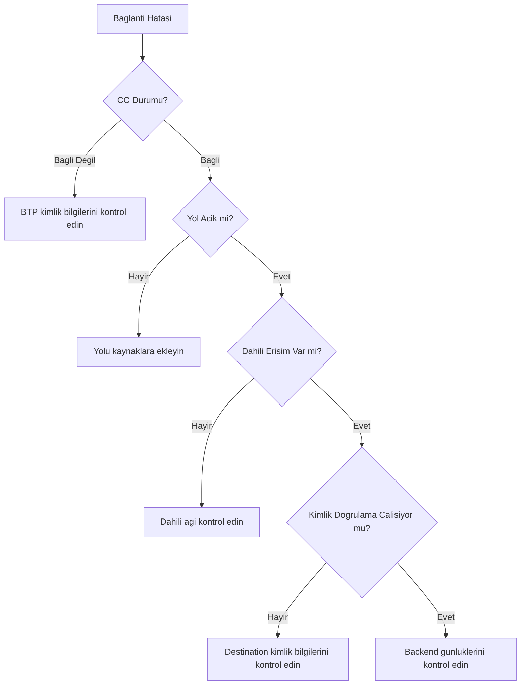

# Kısım 16: On-Premise Erişim için Cloud Connector

> *Veri Merkezinize Güvenli Tünel*

---

Kurumsal firmalarin cogu hala on-premise sistemler kullaniyor. Cloud Connector bu bosluğu kapatir — BTP'yi guvenlik duvarinizin arkasindaki sistemlere guvenli bir sekilde bağlar.

---

## 16.1 Cloud Connector Nedir?

Cloud Connector, ağiniza kurulan ve BTP'ye **guvenli, yalnizca giden bir tunel** olusturan hafif bir yazilim ajanidir.



### Temel Faydalar

| Ozellik | Fayda |
|---------|-------|
| **Yalnizca giden** | Gelen guvenlik duvari kurallarina gerek yok |
| **Virtual Host'lar** | Gercek dahili adresleri gizler |
| **Yol kontrolu** | Yalnizca ihtiyaciniz olani aciga cikarir |
| **Denetim gunlugu** | Tum erisimleri takip eder |
| **Yuksek erisilebilirlik** | Master-shadow kurulumu |

---

## 16.2 Kurulum ve Yapilandirma

### Sistem Gereksinimleri

```yaml
Isletim Sistemi: Windows Server 2016+ veya Linux (SLES, RHEL, Ubuntu)
Bellek: Minimum 4 GB (8 GB onerilen)
Disk: Minimum 20 GB
Ag: BTP'ye giden HTTPS (443)
Java: Kurulum paketine dahil SAP JVM
```

### Adim Adim Kurulum

**1. Indirme**
- SAP Support Portal → Software Downloads
- Arama: "Cloud Connector"
- Tasinabilir surum veya kurulum programini indirin

**2. Kurulum (Windows)**
```bash
# C:\SAP\CloudConnector dizinine cikartin
# Yonetici olarak calistirin:
C:\SAP\CloudConnector\go.bat

# Servis kurulumu:
C:\SAP\CloudConnector\sccservice.bat install
```

**3. Yonetim Arayuzune Erisim**
```
URL: https://localhost:8443
Varsayilan kullanici: Administrator
Varsayilan sifre: manage

(Hemen degistirin!)
```

**4. BTP Subaccount'a Baglanti**



**Doldurulacaklar:**
```yaml
Region Host: cf.eu10.hana.ondemand.com
Subaccount: abc123-def456-...  # BTP Cockpit'ten
Display Name: ACME Uretim CC
User: sizin.email@acme.com
Password: ********
```

---

## 16.3 Virtual Host Eslemesi

En onemli kavram! Virtual Host'lar gercek dahili adreslerinizi gizler.

### Nasil Calisir



### Virtual Host Olusturma

**Cloud Connector Yonetim Arayuzunde:**

1. Cloud To On-Premise → Access Control
2. Sistem Eslemesi Ekle (+)

```yaml
Back-end Type: ABAP System (veya HTTP)
Protocol: HTTPS (onerilen) veya HTTP
Internal Host: 10.0.0.50
Internal Port: 44300
Virtual Host: s4-prod
Virtual Port: 443
Principal Type: X.509 Certificate (veya None)
```

### Virtual Host'lar Neden Onemli

| Gercek Dahili | Virtual Harici | Fayda |
|---------------|----------------|-------|
| `10.0.0.50:8000` | `s4-prod:443` | Dahili IP'leri gizler |
| `SAP-ECC-PRD:44300` | `ecc-legacy:443` | Portlari standartlastirir |
| `server1.acme.local` | `erp:443` | Basit isimler |

---

## 16.4 Yol Acma (Guvenlik!)

**Kritik:** Yalnizca gercekten ihtiyaciniz olan yollari aciga cikarin.

### Iyi ve Kotu Ornekler

```mermaid
graph TD
    subgraph "❌ KOTU: Her Sey Acik"
        BAD["/"]
        BAD --> B1[/sap/bc/gui/*]
        BAD --> B2[/sap/bc/adt/*]
        BAD --> B3[/sap/opu/odata/*]
        BAD --> B4[/irj/*]
    end

    subgraph "✅ IYI: Yalnizca Gerekenler"
        GOOD[Belirli Yollar]
        GOOD --> G1[/sap/opu/odata/sap/API_SALES_ORDER_SRV]
        GOOD --> G2[/sap/opu/odata/sap/API_MATERIAL_SRV]
    end

    style BAD fill:#f44336,color:white
    style GOOD fill:#4CAF50,color:white
```

### Yol Kaynaklari Ekleme

1. Sistem eslemenizi secin
2. "Resources" (+) tiklayin
3. Belirli yollari ekleyin:

```yaml
# OData cagiran Joule yetenekleri icin
Path: /sap/opu/odata/sap/API_SALES_ORDER_SRV
Access Policy: Path And All Sub-Paths
Enabled: Yes

# ABAP Development Tools icin
Path: /sap/bc/adt
Access Policy: Path And All Sub-Paths
Enabled: Yes (yalnizca gerekirse)
```

### Erisim Politikasi Secenekleri

| Secenek | Anlami |
|---------|--------|
| **Path Only** | Yalnizca tam yol |
| **Path And All Sub-Paths** | Yol ve altindaki her sey |

---

## 16.5 On-Premise icin Destination Yapilandirmasi

### BTP'de Destination Olusturma

```yaml
Name: ACME_S4_ONPREM_ORDERS
Type: HTTP
Description: ACME S/4HANA On-Premise - Satis Siparisleri
URL: http://s4-prod:443/sap/opu/odata/sap/API_SALES_ORDER_SRV
Proxy Type: OnPremise   # <-- Temel fark!
Authentication: BasicAuthentication  # veya PrincipalPropagation
User: BTPUSER
Password: ********

Additional Properties:
  sap-client: 100
  WebIDEEnabled: true
  WebIDEUsage: odata_abap
```

### Tam Akis



---

## 16.6 Principal Propagation (SSO)

Oturum acmis kullanicinin kimliginin on-premise sisteme aktarilmasi gereken senaryolar icin.

### Principal Propagation Olmadan

```
BTP Kullanicisi: john.doe@acme.com
On-Prem Cagrisi: Teknik kullanici "BTPUSER"
On-Prem'in gordugu: BTPUSER (kullanici baglami yok)
```

### Principal Propagation ile

```
BTP Kullanicisi: john.doe@acme.com
On-Prem Cagrisi: john.doe@acme.com sertifikasi
On-Prem'in gordugu: JDOE (gercek kullanici)
```

### Kurulum Gereksinimleri



### Yapilandirma Adimlari

**1. Cloud Connector SNC Yapilandirmasi**
- Principal Propagation → Etkinlestir
- CA sertifikasini yukleyin

**2. On-Premise Guven Yapilandirmasi**
- STRUST: Cloud Connector CA sertifikasini iceri aktarin
- SICF: Istemci sertifikasi kimlik dogrulamasini etkinlestirin

**3. Destination Yapilandirmasi**
```yaml
Authentication: PrincipalPropagation
# Kullanici/sifre gerekmez
```

---

## 16.7 Yuksek Erisilebilirlik Kurulumu

Uretim ortami icin master-shadow yapilandirmasi kullanin.

```mermaid
graph TD
    subgraph "BTP"
        BTP[BTP Subaccount]
    end

    subgraph "Kurumsal Ag"
        subgraph "Birincil Site"
            CC1[Cloud Connector<br/>MASTER]
        end

        subgraph "DR Sitesi"
            CC2[Cloud Connector<br/>SHADOW]
        end

        S4[On-Prem Sistemler]
    end

    BTP --> |"Aktif"| CC1
    BTP --> |"Beklemede"| CC2
    CC1 --> S4
    CC2 --> S4

    style CC1 fill:#4CAF50,color:white
    style CC2 fill:#FF9800,color:white
```

### HA Kurulumu

**Master:**
```yaml
Role: Master
Shadow Host: cc-shadow.acme.local
Shadow Port: 8443
```

**Shadow:**
```yaml
Role: Shadow
Master Host: cc-master.acme.local
Master Port: 8443
```

---

## 16.8 Sorun Giderme

### Yaygin Sorunlar

| Belirti | Neden | Cozum |
|---------|-------|-------|
| "Connection refused" | CC bagli degil | CC yonetim arayuzunde durumu kontrol edin |
| "Host not found" | Yanlis Virtual Host | Virtual Host eslemesini dogrulayin |
| "403 Forbidden" | Yol acilmamis | Yolu kaynaklara ekleyin |
| "401 Unauthorized" | Hatali kimlik bilgileri | Destination kimlik dogrulamasini kontrol edin |
| Zaman asimi | Dahili guvenlik duvari | CC → backend baglantiligini kontrol edin |

### Tani Adimlari



### Faydali Gunlukler

**Cloud Connector:**
```
Konum: <CC_Install>/log/
Dosyalar: ljs_trace.log, ljs_audit.log
```

**Baglanti kontrolu:**
```bash
# CC sunucusundan
curl -v https://internal-host:port/sap/opu/odata/sap/API_SALES_ORDER_SRV
```

---

## Temel Cikarimlar

1. **Yalnizca giden** — Gelen guvenlik duvari degisikliklerine gerek yok
2. **Virtual Host'lar** — Gercek dahili adresleri gizler
3. **Minimum acim** — Yalnizca gercekten kullandiginiz yollar
4. **Principal Propagation** — Kullanici kimligi aktarilir
5. **Uretim icin HA** — Master-shadow kurulumu
6. **Zinciri test edin** — CC baglantisi → Yol acimi → Kimlik dogrulama

---

*[Onceki: Kısım 15 – SAP Integration Suite](15-integration-suite.md) | [Sonraki: Kısım 17 – Clean Core Kurallari](17-clean-core.md)*

*[Icindekiler'e Don](../content.md)*

---

**Yazar:** [Beyhan Meyrali](https://www.linkedin.com/in/beyhanmeyrali) — SAP Hikaye Anlaticisi & Dijital Donusum Savunucusu

*Dunya genelindeki SAP ogrencileri icin ❤️ ile olusturuldu*
