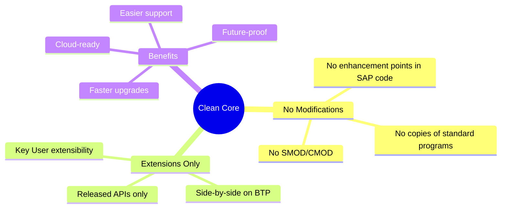
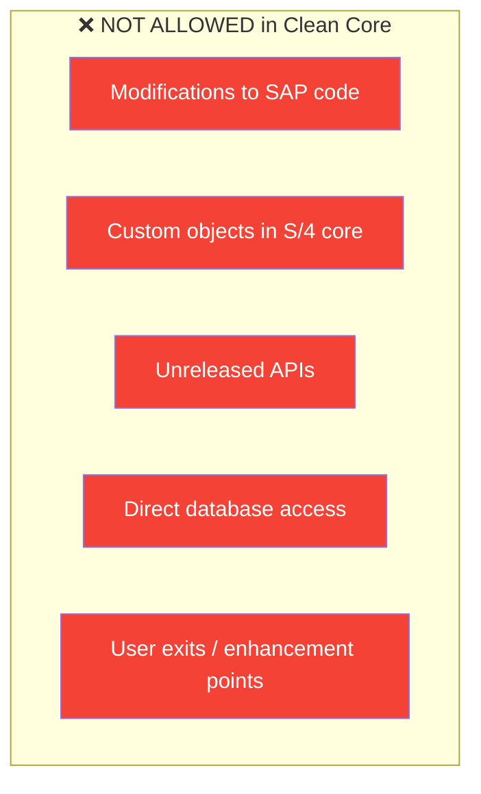
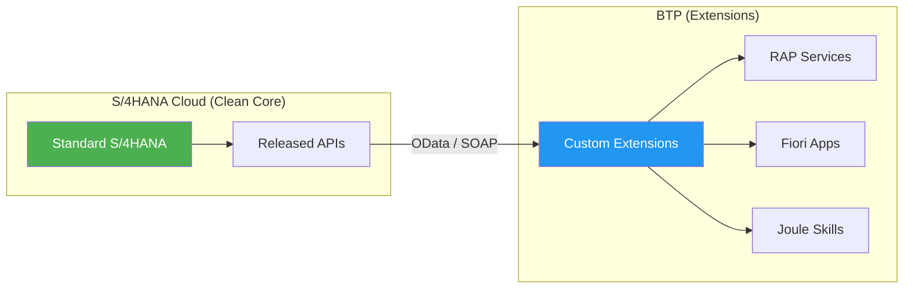
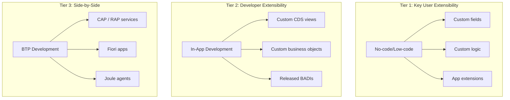
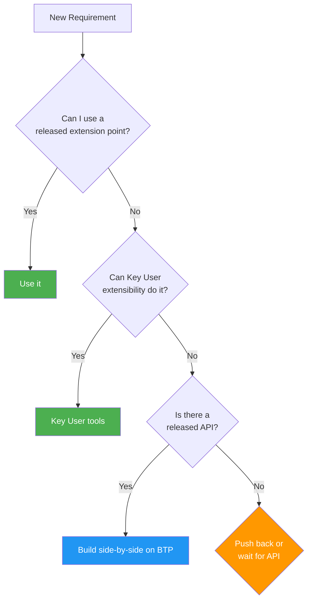
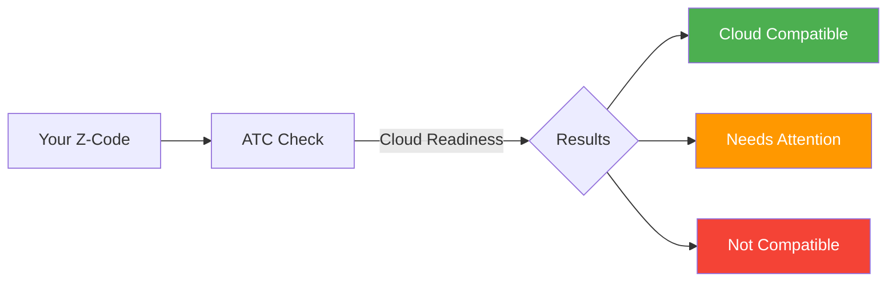
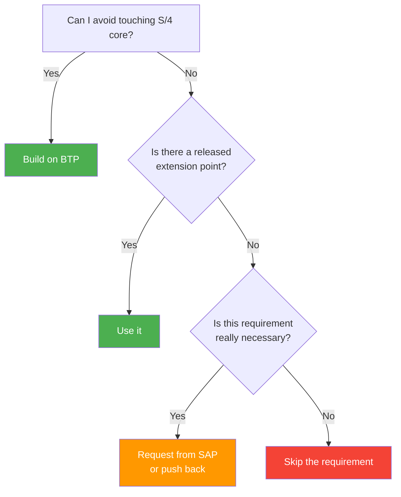

# Kısım 17: Clean Core Rules That Bite Old Habits

> *The Mindset Shift Every ABAP Developer Must Make*

---

Clean Core is the most important concept for developers transitioning to RISE with SAP and BTP. Your old habits? They don't work anymore. Let's understand why and what to do instead.

---

## 17.1 What Is Clean Core?



### The Philosophy

> **Old thinking:** "I'll modify this standard report to add my field"
>
> **Clean Core thinking:** "I'll build an extension that consumes the released API"

---

## 17.2 What Can't You Do Anymore?

### The Forbidden List



### Specific Örneks

| What You Did Before | Why It's Forbidden | Impact |
|--------------------|--------------------|--------|
| `ENHANCEMENT my_enh` in standard program | Modifies SAP code | Breaks on upgrade |
| Z-table in DDIC | Custom object in core | Migration issues |
| `SELECT * FROM VBAK` | Direct table access | Table may change |
| Calling unreleased FM | Internal API | May disappear |
| User exit USEREXIT_* | Deprecated mechanism | Not cloud-ready |

---

## 17.3 The Clean Core Extension Model

### Side-by-Side Pattern



### Three Extension Tiers



| Tier | Who | Where | Ne Zaman Kullanılır |
|------|-----|-------|-------------|
| **Tier 1** | Business users | S/4 Fiori apps | Simple field additions, basic logic |
| **Tier 2** | ABAP developers | S/4 ABAP | Custom analytics, released extensions |
| **Tier 3** | Full-stack developers | BTP | Complex logic, integrations, AI |

---

## 17.4 Adapting Your Development Mindset

### Translation Table: Old to New

| Old Habit | New Approach |
|-----------|--------------|
| Add Z-field to VBAK | Key User extensibility or append structure via released API |
| Create Z-report with ALV | Create RAP service + Fiori Elements app |
| Modify user exit | Use released BADI or build side-by-side |
| Copy standard program and modify | Build new solution using released APIs |
| Direct table SELECT | Use released CDS view or OData API |
| Enhancement spot in SAP code | Released extension point or side-by-side |
| Custom transaction | Fiori tile with semantic navigation |
| Print program (SAPscript) | Adobe Forms or Output Management |

### The Decision Flowchart



---

## 17.5 Released APIs: Finding Them

### Where to Find Released APIs

1. **SAP Business Accelerator Hub**
   - URL: `https://api.sap.com`
   - Browse S/4HANA Cloud APIs
   - OData V2, V4, SOAP services

2. **ABAP Development Tools (ADT)**
   - In Eclipse: API State filter
   - Look for `@ObjectModel.usageType: #CLOUD_API`

3. **Custom Code Migration App**
   - Fiori app in S/4HANA
   - Analyzes your Z-code
   - Suggests released alternatives

### API Release Contracts

```yaml
API States:
  - Released: Stable, supported, can use
  - Deprecated: Will be removed, migrate away
  - Not Released: Internal use only, forbidden
```

### Örnek: Finding Sales Order API

```
SAP Business Accelerator Hub:
  → Product: S/4HANA Cloud
  → Category: Sales
  → API: Sales Order (A2X)
  → Status: Released
  → Protocol: OData V4
  → Path: /sap/opu/odata4/sap/api_salesorder/srvd/sap/salesorder/0001/
```

---

## 17.6 Practical Migration Örneks

### Örnek 1: Z-Report → Fiori App

**Before (Classic):**
```abap
REPORT z_sales_report.
SELECT-OPTIONS: s_kunnr FOR kna1-kunnr.
PARAMETERS: p_date TYPE sy-datum.

SELECT * FROM vbak WHERE kunnr IN s_kunnr
                     AND erdat = p_date.

cl_salv_table=>factory( ... ).
```

**After (Clean Core):**

1. Create CDS view (released interface)
2. Add RAP behavior
3. Generate Fiori Elements List Report

```sql
@AccessControl.authorizationCheck: #CHECK
@EndUserText.label: 'Sales Orders Report'
define root view entity ZC_SalesOrderReport
  as select from I_SalesOrder
{
  key SalesOrder,
      SoldToParty,
      SalesOrderDate,
      TotalNetAmount
}
```

No SELECT-OPTIONS, no ALV—Fiori Elements handles the UI.

### Örnek 2: User Exit → Released BADI

**Before:**
```abap
" In standard include
ENHANCEMENT z_my_enhancement.
  " My custom logic
  IF wa_vbak-kunnr = '1000'.
    wa_vbak-vkorg = '2000'.
  ENDIF.
ENDENHANCEMENT.
```

**After:**
```abap
" In released BADI implementation
CLASS zcl_badi_sd_pricing DEFINITION
  PUBLIC FINAL
  CREATE PUBLIC.
  INTERFACES if_badi_sd_pricing.
ENDCLASS.

CLASS zcl_badi_sd_pricing IMPLEMENTATION.
  METHOD if_badi_sd_pricing~calculate.
    " Use only released APIs
    " Business logic here
  ENDMETHOD.
ENDCLASS.
```

### Örnek 3: Direct Table → Released API

**Before:**
```abap
SELECT * FROM vbak INTO TABLE @lt_orders
  WHERE kunnr = @lv_customer.
```

**After:**
```abap
" Use released CDS view
SELECT * FROM I_SalesOrder INTO TABLE @lt_orders
  WHERE SoldToParty = @lv_customer.
```

Or via OData for side-by-side:
```javascript
// In BTP CAP service
const orders = await S4.run(
  SELECT.from('API_SALES_ORDER_SRV.A_SalesOrder')
    .where({ SoldToParty: customer })
);
```

---

## 17.7 Custom Code Migration Tools

### ATC Cloud Readiness Check

Run ABAP Test Cockpit with cloud-specific checks:



### Common ATC Findings

| Finding | Meaning | Action |
|---------|---------|--------|
| `CLOUD_UNAVAILABLE_API` | Using unreleased API | Find released alternative |
| `CLOUD_FORBIDDEN_STATEMENT` | Forbidden statement | Rewrite logic |
| `CLOUD_DEPRECATED_API` | API being removed | Migrate to new API |

### Custom Code Migration App

**Path:** S/4HANA Fiori → Custom Code Migration

**What it does:**
1. Scans your Z-code
2. Identifies incompatibilities
3. Suggests alternatives
4. Tracks remediation progress

---

## 17.8 Benefits of Clean Core

### Why This Pain Is Worth It

```mermaid
graph TD
    subgraph "With Modifications (Old)"
        OLD[Upgrade] --> TEST1[Regression testing]
        TEST1 --> FIX[Fix conflicts]
        FIX --> TEST2[More testing]
        TEST2 --> DEPLOY1[Deploy]
        DEPLOY1 --> DONE1[6+ months]
    end

    subgraph "Clean Core (New)"
        NEW[Upgrade] --> AUTO[Automatic compatibility]
        AUTO --> QUICK[Quick validation]
        QUICK --> DEPLOY2[Deploy]
        DEPLOY2 --> DONE2[Weeks, not months]
    end

    style DONE1 fill:#f44336,color:white
    style DONE2 fill:#4CAF50,color:white
```



| Benefit | Impact |
|---------|--------|
| **Faster upgrades** | No code conflicts to resolve |
| **Continuous innovation** | Get new features immediately |
| **Easier support** | SAP can help (standard behavior) |
| **Cloud-ready** | Can move to RISE/Cloud anytime |
| **Lower TCO** | Less maintenance effort |

---

## 17.9 The Key Question

Before writing any code, ask yourself:

> **"Can I do this without touching the S/4HANA core?"**



---

## Temel Çıkarımlar

1. **Clean Core = No modifications** — Extensions only
2. **Three tiers of extensibility** — Key User, Developer, Side-by-side
3. **Released APIs mandatory** — Check api.sap.com
4. **Side-by-side on BTP** — For complex requirements
5. **Use migration tools** — ATC checks, Custom Code Migration app
6. **Benefits outweigh pain** — Faster upgrades, lower TCO

---

## Sırada Ne Var?

Congratulations! You've completed the main chapters. Now check out the appendices for quick reference tables, glossary, resources, and troubleshooting guides.

---

*[Önceki: Kısım 16 – Cloud Connector](16-cloud-connector.md) | [Sonraki: Ek A – Hızlı Referans Tables](appendix-a-reference-tables.md)*

*[İçindekilere Dön](../content.md)*

---

**Yazar:** [Beyhan Meyrali](https://www.linkedin.com/in/beyhanmeyrali) — SAP Storyteller & Digital Transformation Advocate

*Oluşturuldu ❤️ dünya genelindeki SAP öğrencileri için*
