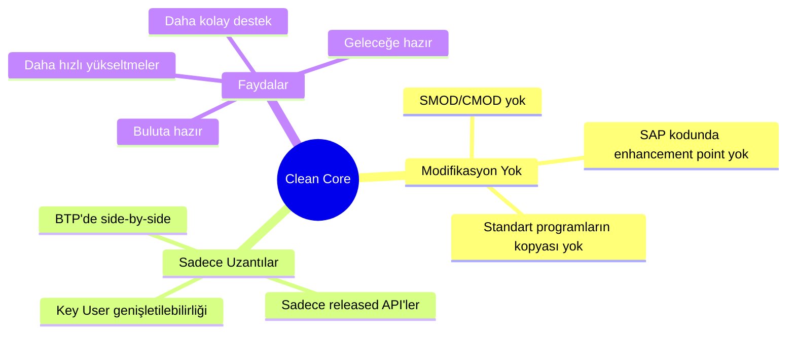
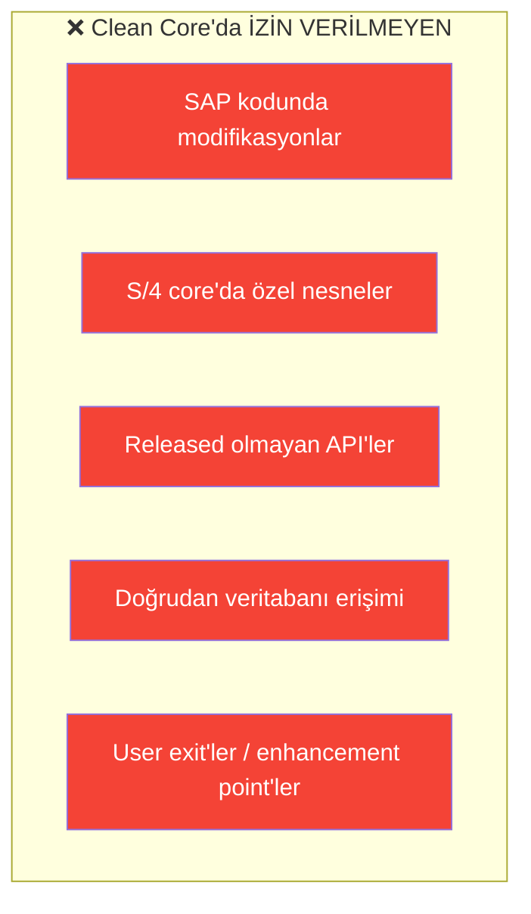
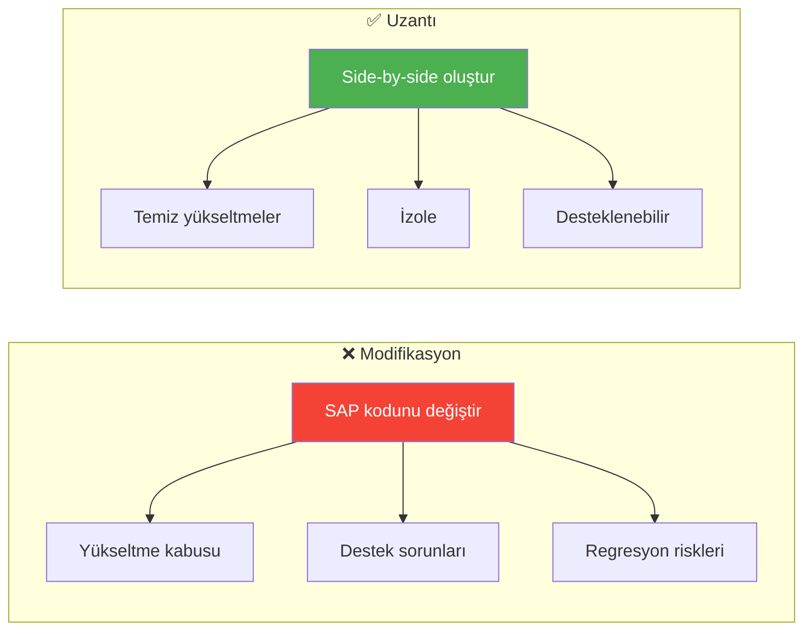
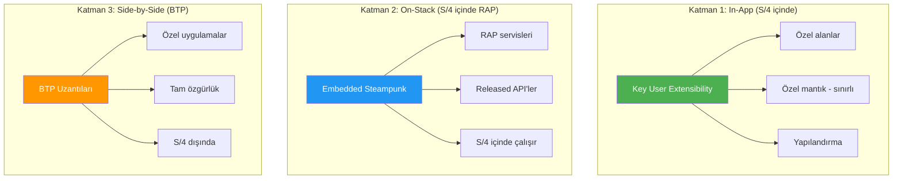
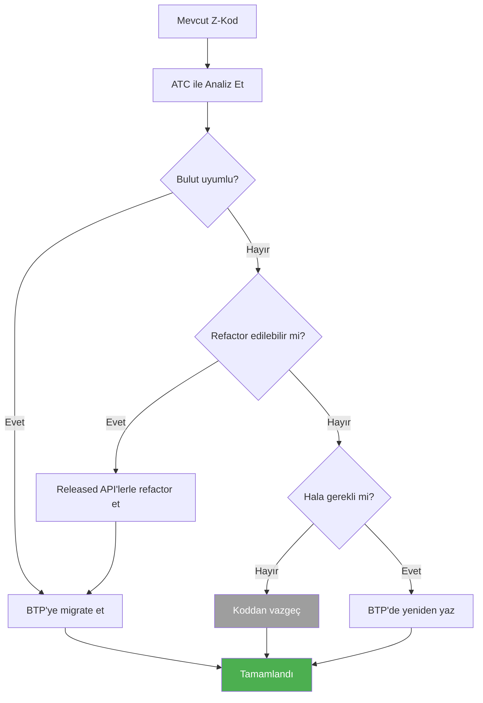

# Kısım 17: Eski Alışkanlıkları Sınırlayan Clean Core Kuralları

> *Her ABAP Geliştiricisinin Yapması Gereken Zihniyet Değişimi*

---

Clean Core, RISE with SAP ve BTP'ye geçiş yapan geliştiriciler için en önemli kavramdır. Eski alışkanlıklarınız mı? Artık işe yaramıyorlar. Neden olduğunu ve bunun yerine ne yapılması gerektiğini anlayalım.

---

## 17.1 Clean Core Nedir?



### Felsefe

> **Eski düşünce:** "Bu standart raporu değiştirip alanımı ekleyeceğim"
>
> **Clean Core düşüncesi:** "Released API'yi tüketen bir uzantı oluşturacağım"

---

## 17.2 Artık Ne Yapamıyorsunuz?

### Yasak Listesi



### Spesifik Örnekler

| Eski Alışkanlık | Neden Yasak | Ne Yapmalı |
|-----------------|-------------|------------|
| SE38'de Z-rapor | Core'da özel kod | BTP'de RAP servisi |
| SE11'de Z-tablo | Core'da özel nesne | BTP HANA'da tablo |
| SMOD/CMOD | SAP kodu modifikasyonu | Released BADI veya BTP uzantısı |
| Doğrudan BKPF erişimi | Released olmayan tablo | API_JOURNALENTRY_SRV API'si |
| FM değiştirme | SAP kodu modifikasyonu | Wrapper sınıfı veya BTP servisi |

---

## 17.3 Uzantılar vs. Modifikasyonlar



### Üç Katmanlı Uzantı Modeli



---

## 17.4 Eskiden Yeniye Tercüme Tablosu

| Eski Yol | Yeni Yol | Nerede |
|----------|----------|--------|
| `SE38` Z-rapor | RAP OData servisi | BTP ABAP Env |
| `SE11` Z-tablo | CDS tanımlı tablo | BTP ABAP Env |
| `SE37` Z-FM | ABAP sınıfı | BTP ABAP Env |
| `SMOD/CMOD` | Released BADI | S/4 veya BTP |
| `SE18/19` BADI | Released BADI | S/4 |
| Doğrudan tablo erişimi | OData API | BTP'den |
| `CALL TRANSACTION` | UI5 uygulaması | BTP |
| ALV rapor | Fiori uygulaması | BTP |

---

## 17.5 Released API'leri Bulma

### SAP API Business Hub

```
URL: https://api.sap.com
```

Burada şunları yapabilirsiniz:
- Kullanılabilir API'leri arama
- Dokümantasyon okuma
- Sandbox ortamında test etme
- OpenAPI spec'leri indirme

### Eclipse ADT'de

```
1. ABAP Development Tools'u açın
2. Bir S/4 sistemine bağlanın
3. Project Explorer'da "Released Objects"u arayın
4. API'ler @API annotation'ı ile işaretlidir
```

### Yaygın Released API'ler

| İş Alanı | API Adı |
|----------|---------|
| Satış Siparişi | `API_SALES_ORDER_SRV` |
| Satın Alma Siparişi | `API_PURCHASEORDER_PROCESS_SRV` |
| İş Ortağı | `API_BUSINESS_PARTNER` |
| Malzeme | `API_PRODUCT_SRV` |
| GL Hesabı | `API_GLACCOUNTINCHARTOFACCOUNTS_SRV` |
| Maliyet Merkezi | `API_COSTCENTER_SRV` |

---

## 17.6 ATC Bulut Hazırlık Kontrolleri

ABAP Test Cockpit (ATC), kodunuzun bulut uyumlu olup olmadığını kontrol edebilir.

### Kontrol Varyantı

```
ABAP_CLOUD_DEVELOPMENT
```

### Yaygın ATC Hataları

| Hata | Anlam | Çözüm |
|------|-------|-------|
| "API released değil" | Desteklenmeyen FM/sınıf | Released alternatif bul |
| "Doğrudan DB erişimi" | SELECT from BKPF | CDS view veya API kullan |
| "Enhancement yasak" | SMOD/CMOD | BADI veya BTP uzantısı |
| "Statement izin verilmez" | CALL TRANSACTION | Yeniden tasarla |

---

## 17.7 Migrasyon Stratejisi



### Adım Adım

1. **Envanter çıkar** - Tüm Z-nesnelerini listele
2. **ATC çalıştır** - Bulut uyumluluğunu kontrol et
3. **Kategorize et** - Migrate/Refactor/Yeniden yaz/Vazgeç
4. **Önceliklendir** - İş kritiğine göre sırala
5. **Yürüt** - Her nesneyi migrate veya yeniden yaz
6. **Doğrula** - Test et ve onayla

---

## 17.8 Pratik İpuçları

### Yapın ✅

- ✅ Her zaman SAP API Hub'ı released API'ler için kontrol edin
- ✅ Uzantılar için BTP'yi kullanın
- ✅ Migration'dan önce ATC çalıştırın
- ✅ Key User extensibility'yi basit değişiklikler için kullanın
- ✅ Mümkünse Fiori Elements kullanın

### Yapmayın ❌

- ❌ SAP kodunu modifiye etmeyin
- ❌ Z-tablolarını S/4 core'a eklemeyin
- ❌ Released olmayan FM'leri çağırmayın
- ❌ Doğrudan tablo erişimi kullanmayın
- ❌ Eski kalıpların çalışacağını varsaymayın

---

## 17.9 Clean Core Kontrol Listesi

```yaml
Geliştirmeden Önce:
☐ Released API var mı kontrol ettim
☐ Uzantı hangi katmanda olacak belirlendim
☐ ATC bulut kontrollerini çalıştırdım

Geliştirme Sırasında:
☐ Sadece released API'ler kullanıyorum
☐ Özel nesneler BTP'de (S/4 core değil)
☐ SAP kodu modifiye edilmedi

Deploy Öncesi:
☐ ATC temiz
☐ Fonksiyonel testler geçti
☐ Performans kabul edilebilir

Dokümantasyon:
☐ Hangi API'ler kullanıldı belgelendi
☐ Uzantı mimarisi açıklandı
☐ Gelecek bakım için talimatlar
```

---

## Temel Çıkarımlar

1. **Clean Core, SAP koduna dokunmamak** demektir
2. **Modifikasyonlar yasak** — uzantılar zorunlu
3. **Üç uzantı katmanı** — In-App, On-Stack, Side-by-Side
4. **Released API'ler** tek yol
5. **ATC** bulut uyumluluğunu kontrol eder
6. **BTP** çoğu özel geliştirme için tercih edilen hedef

---

## Sırada Ne Var?

Tebrikler! SAP BTP Mini Kitabını tamamladınız. Artık şunları anlıyorsunuz:
- BTP mimarisi ve kavramları
- RISE with SAP
- Destination'lar, ABAP Cloud, Fiori
- Joule skill'leri ve agent'ları
- Çoklu müşteri yönetimi
- Entegrasyon ve Clean Core

İyi geliştirmeler!

---

*[Önceki: Kısım 16 – Cloud Connector](16-cloud-connector.md)*

*[İçindekilere Dön](../content.md)*

---

**Yazar:** [Beyhan Meyrali](https://www.linkedin.com/in/beyhanmeyrali) — SAP Hikaye Anlatıcısı & Dijital Dönüşüm Savunucusu

*Dünya genelindeki SAP öğrencileri için ❤️ ile oluşturuldu*
