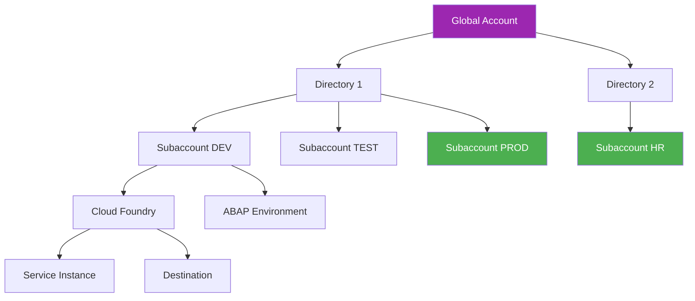
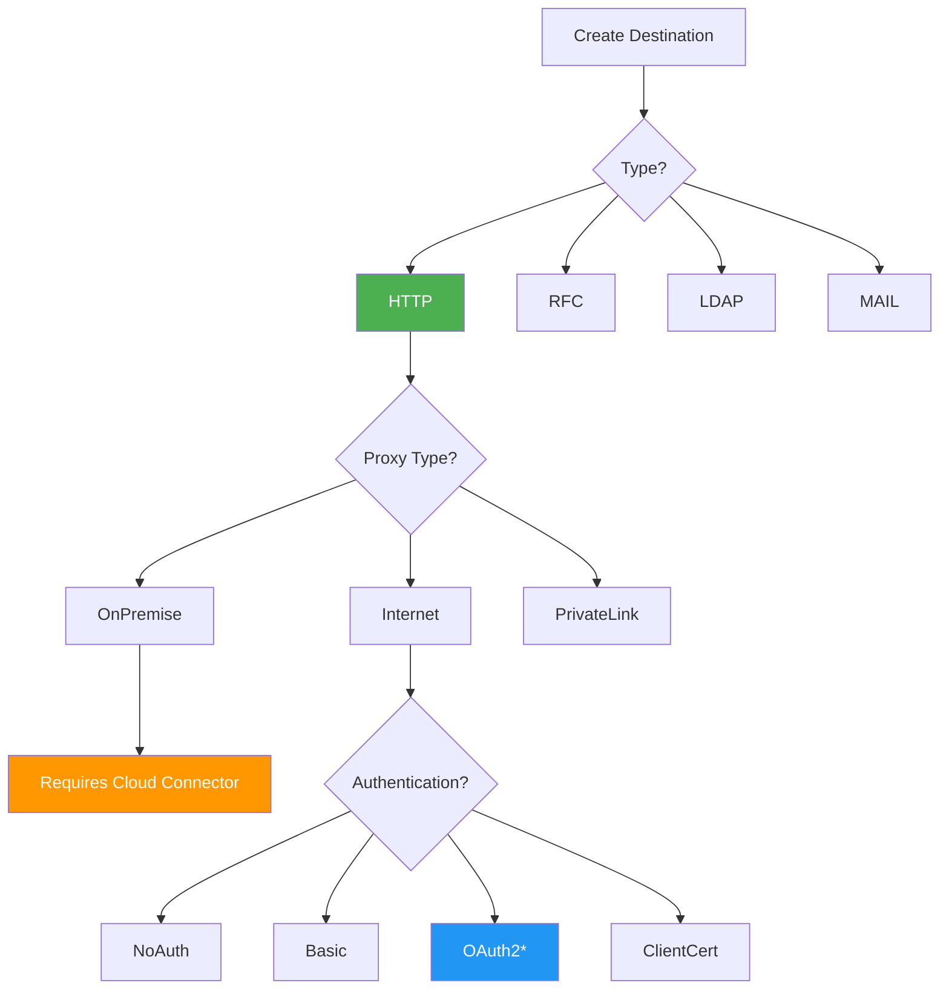
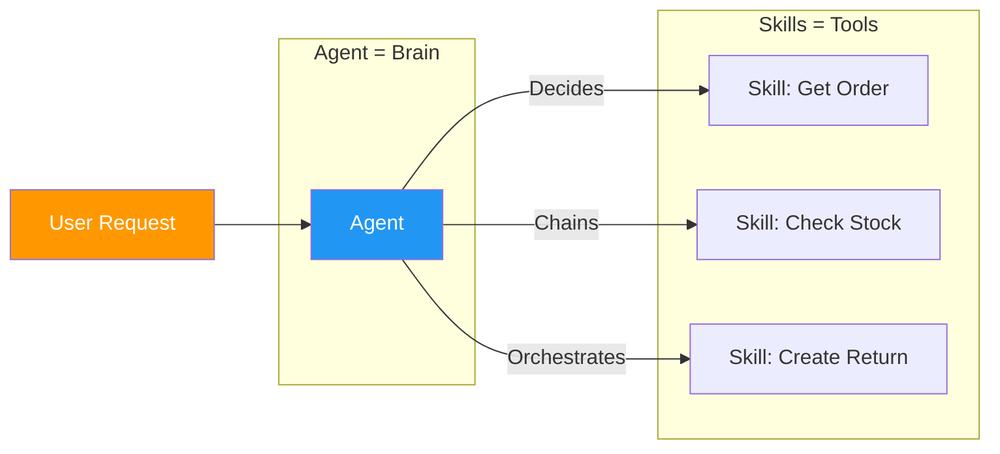
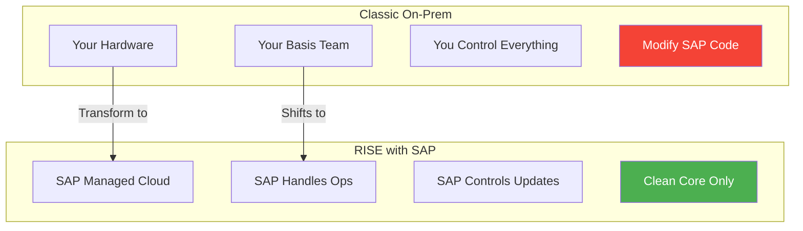
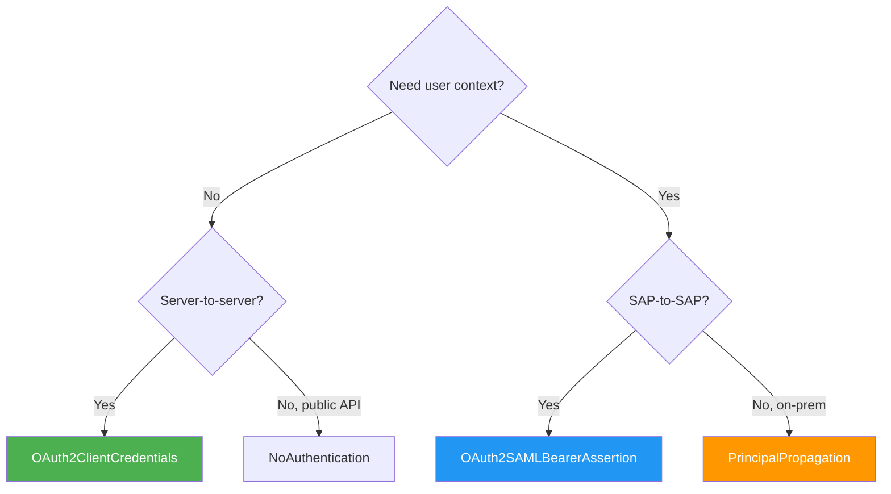

# Ek A: Hızlı Referans Tables

> *Cheat Sheets for Everyday Use*

---

## A.1 BTP Hierarchy Cheat Sheet



| Level | Nedir | Analogy | Örnek |
|-------|------------|---------|---------|
| **Global Account** | Your contract with SAP | Lease agreement | `ACME_Corp_GA` |
| **Directory** | Optional grouping | Floor in building | `Production`, `Non-Prod` |
| **Subaccount** | Where you work | Your apartment | `ACME_PROD_EU10` |
| **Environment** | Runtime (CF, Kyma, ABAP) | Type of appliance | `Cloud Foundry` |
| **Service Instance** | Enabled service | Installed appliance | `destination-service` |

---

## A.2 Destination Configuration Options



| Property | Values | Ne Zaman Kullanılır |
|----------|--------|-------------|
| **Type** | HTTP, RFC, LDAP, MAIL | HTTP for most APIs |
| **Proxy Type** | Internet, OnPremise, PrivateLink | OnPremise needs Cloud Connector |
| **Authentication** | NoAuth, Basic, OAuth2*, ClientCert, SAML | OAuth2 for production |

### Common Additional Properties

| Property | Value | Purpose |
|----------|-------|---------|
| `sap-client` | 100, 200, etc. | SAP system client |
| `HTML5.DynamicDestination` | true | Fiori apps |
| `WebIDEEnabled` | true | BAS development |
| `WebIDEUsage` | odata_abap, odata_gen | Service type |
| `TrustAll` | true | Skip cert validation (dev only!) |
| `URL.headers.x-api-key` | your-api-key | API key header |

### Complete Destination Örneks

**S/4HANA Cloud (OAuth2):**
```yaml
Name: ACME_S4_PROD
Type: HTTP
URL: https://my300001.s4hana.ondemand.com
Proxy Type: Internet
Authentication: OAuth2ClientCredentials
Client ID: sb-xsuaa-acme!t12345
Client Secret: ********
Token Service URL: https://my300001.authentication.eu10.hana.ondemand.com/oauth/token
Additional Properties:
  sap-client: 100
```

**On-Premise via Cloud Connector:**
```yaml
Name: ACME_ECC_ONPREM
Type: HTTP
URL: http://ecc-virtual:443
Proxy Type: OnPremise
Authentication: BasicAuthentication
User: BTPUSER
Password: ********
Additional Properties:
  sap-client: 800
```

---

## A.3 Joule Skill vs. Agent Comparison



| Aspect | Skill | Agent |
|--------|-------|-------|
| **Purpose** | Single action | Orchestrate multiple |
| **Complexity** | Simple | Can reason & chain |
| **Contains** | One action | Multiple skills |
| **Örnek** | "Get order status" | "Handle complaint" |
| **Build order** | First | After skills exist |
| **Instructions** | What this skill does | How to reason |
| **Input** | Specific parameters | Natural language |
| **Output** | Data | Formatted response |

---

## A.4 RISE vs. Classic Comparison



| Aspect | Classic On-Prem | RISE with SAP |
|--------|-----------------|---------------|
| **Hosting** | Your data center | SAP managed (AWS/Azure/GCP) |
| **Basis work** | Your team | SAP handles |
| **Upgrades** | You control | SAP delivers |
| **Custom ABAP** | Full freedom | Clean Core enforced |
| **Extensions** | Inside S/4 | BTP (side-by-side) |
| **Cost model** | CapEx + licenses | Subscription (OpEx) |
| **BTP included** | Separate purchase | Credits included |
| **Disaster Recovery** | Your responsibility | SAP managed |
| **Security Patches** | You apply | SAP applies |

---

## A.5 Authentication Type Hızlı Referans



| Type | Use Case | Credentials Needed | User Context |
|------|----------|-------------------|--------------|
| **NoAuthentication** | Public APIs | None | No |
| **BasicAuthentication** | Simple/legacy APIs | User + Password | No (technical) |
| **OAuth2ClientCredentials** | Server-to-server | Client ID + Secret + Token URL | No |
| **OAuth2SAMLBearerAssertion** | SAP-to-SAP with user | Client ID + Secret + Token URL | Yes |
| **ClientCertificateAuthentication** | High security | Certificate + Key | No |
| **PrincipalPropagation** | On-prem with user | Trust setup | Yes |

---

## A.6 Region Hızlı Referans

| Region Code | Location | Hyperscaler | Common Use |
|-------------|----------|-------------|------------|
| `eu10` | Frankfurt, Germany | AWS | EU (GDPR), main region |
| `eu20` | Netherlands | AWS | EU backup |
| `eu11` | Frankfurt | Azure | EU Azure customers |
| `us10` | US East (Virginia) | AWS | US customers |
| `us20` | US West (Washington) | AWS | US West |
| `ap10` | Sydney, Australia | AWS | APAC customers |
| `ap11` | Singapore | AWS | Southeast Asia |
| `jp10` | Tokyo, Japan | AWS | Japan |

---

## A.7 URL Pattern Hızlı Referans

| System | URL Pattern | Örnek |
|--------|-------------|---------|
| **BTP Cockpit** | `cockpit.btp.cloud.sap` | `https://cockpit.btp.cloud.sap` |
| **BTP Trial** | `cockpit.hanatrial.ondemand.com` | `https://cockpit.hanatrial.ondemand.com` |
| **S/4HANA Cloud** | `my{number}.s4hana.ondemand.com` | `https://my300001.s4hana.ondemand.com` |
| **BAS** | `{region}.applicationstudio.cloud.sap` | `https://eu10.applicationstudio.cloud.sap` |
| **Joule Studio** | `joule-studio-{region}.cfapps.{region}.hana.ondemand.com` | `https://joule-studio-eu10.cfapps.eu10.hana.ondemand.com` |
| **SAP API Hub** | `api.sap.com` | `https://api.sap.com` |
| **Cloud Connector Admin** | `localhost:8443` | `https://localhost:8443` |

---

## A.8 Common OData Service Paths

| Service | Path |
|---------|------|
| **Sales Order** | `/sap/opu/odata/sap/API_SALES_ORDER_SRV` |
| **Business Partner** | `/sap/opu/odata/sap/API_BUSINESS_PARTNER` |
| **Material** | `/sap/opu/odata/sap/API_PRODUCT_SRV` |
| **Purchase Order** | `/sap/opu/odata/sap/API_PURCHASEORDER_PROCESS_SRV` |
| **Purchase Requisition** | `/sap/opu/odata/sap/API_PURCHASEREQ_PROCESS_SRV` |
| **GL Account** | `/sap/opu/odata/sap/API_GLACCOUNTINCHARTOFACCOUNTS_SRV` |
| **Cost Center** | `/sap/opu/odata/sap/API_COSTCENTER_SRV` |

---

## A.9 Clean Core Hızlı Referans

| Allowed in Clean Core | Not Allowed |
|-----------------------|-------------|
| Using released APIs | Modifying SAP code |
| Key User extensibility | Z-tables in S/4 core |
| Side-by-side extensions (BTP) | User exits/enhancements |
| Custom CDS views (released) | Unreleased function modules |
| Released BADIs | Direct table modifications |
| Extension fields via API | SMOD/CMOD |

---

*[İçindekilere Dön](../content.md)*

---

**Yazar:** [Beyhan Meyrali](https://www.linkedin.com/in/beyhanmeyrali) — SAP Storyteller & Digital Transformation Advocate

*Oluşturuldu ❤️ dünya genelindeki SAP öğrencileri için*
