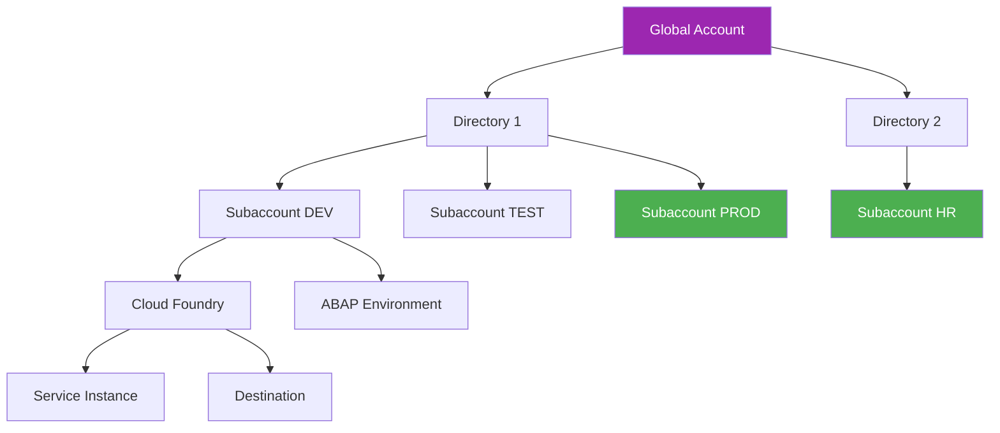
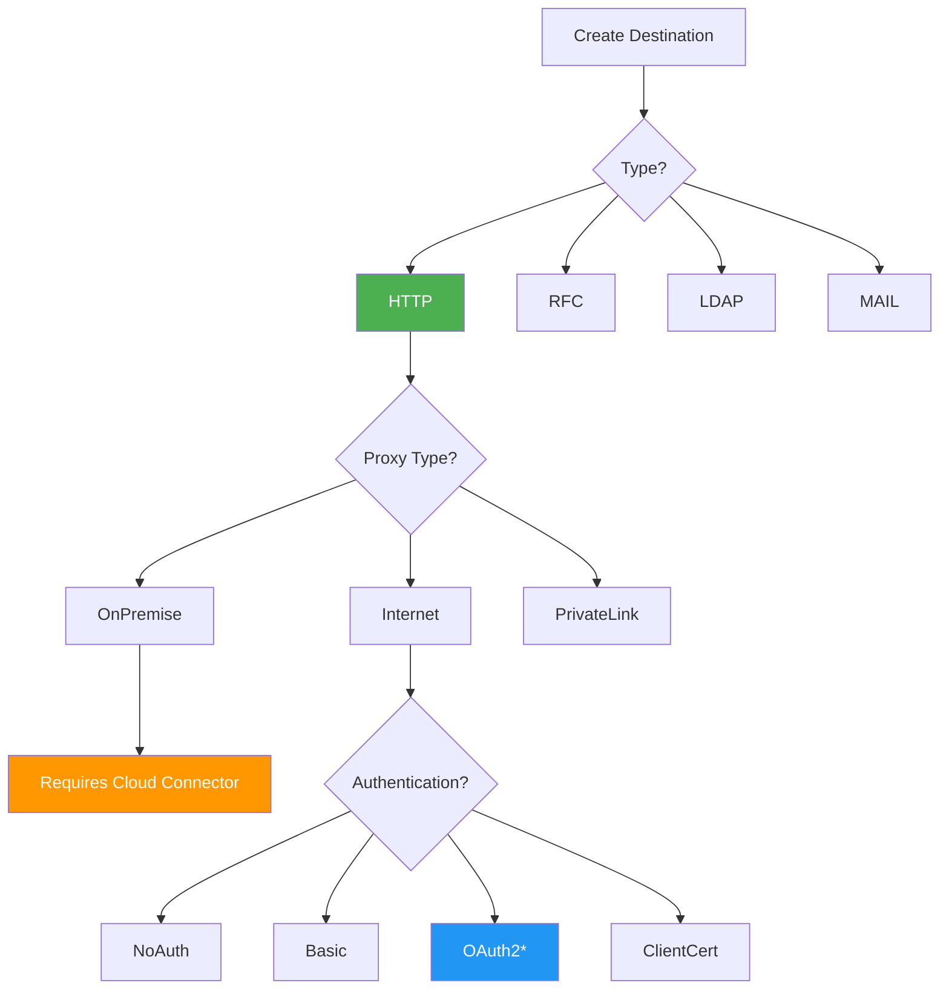
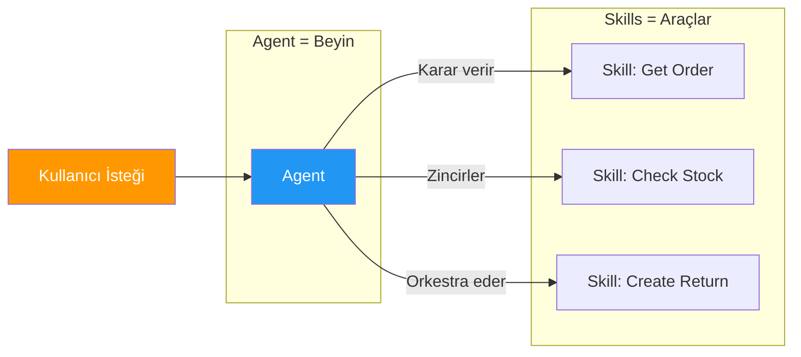
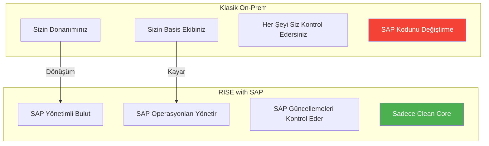
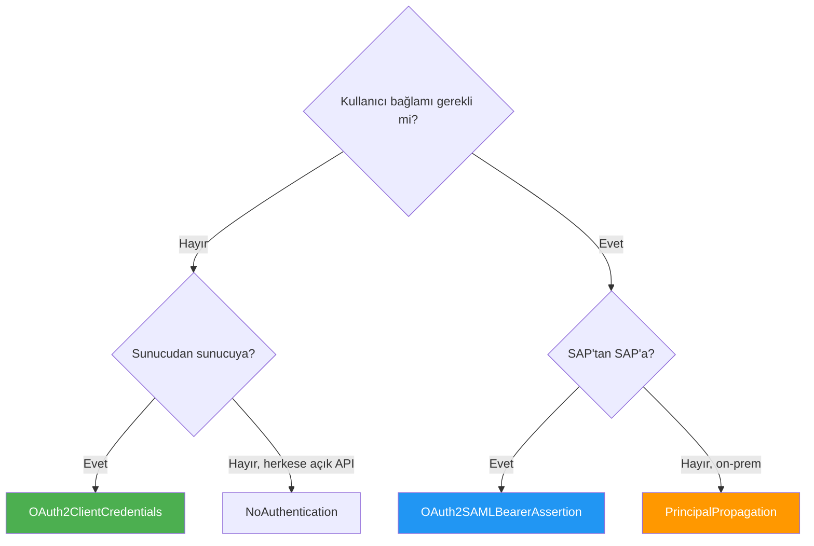

# Ek A: Hızlı Referans Tabloları

> *Günlük Kullanım için Kopya Kağıtları*

---

## A.1 BTP Hiyerarşi Kopya Kağıdı



| Seviye | Nedir | Benzetme | Örnek |
|--------|-------|----------|-------|
| **Global Account** | SAP ile sözleşmeniz | Kira sözleşmesi | `ACME_Corp_GA` |
| **Directory** | Opsiyonel gruplama | Binadaki kat | `Production`, `Non-Prod` |
| **Subaccount** | Çalıştığınız yer | Daireniz | `ACME_PROD_EU10` |
| **Environment** | Çalışma zamanı (CF, Kyma, ABAP) | Cihaz tipi | `Cloud Foundry` |
| **Service Instance** | Etkinleştirilmiş servis | Kurulu cihaz | `destination-service` |

---

## A.2 Destination Yapılandırma Seçenekleri



| Özellik | Değerler | Ne Zaman Kullanılır |
|---------|----------|---------------------|
| **Type** | HTTP, RFC, LDAP, MAIL | Çoğu API için HTTP |
| **Proxy Type** | Internet, OnPremise, PrivateLink | OnPremise için Cloud Connector gerekir |
| **Authentication** | NoAuth, Basic, OAuth2*, ClientCert, SAML | Üretim için OAuth2 |

### Yaygın Ek Özellikler

| Özellik | Değer | Amaç |
|---------|-------|------|
| `sap-client` | 100, 200, vb. | SAP sistem istemcisi |
| `HTML5.DynamicDestination` | true | Fiori uygulamaları |
| `WebIDEEnabled` | true | BAS geliştirme |
| `WebIDEUsage` | odata_abap, odata_gen | Servis tipi |
| `TrustAll` | true | Sertifika doğrulamasını atla (sadece geliştirme!) |
| `URL.headers.x-api-key` | api-anahtariniz | API anahtar başlığı |

### Tam Destination Örnekleri

**S/4HANA Cloud (OAuth2):**
```yaml
Name: ACME_S4_PROD
Type: HTTP
URL: https://my300001.s4hana.ondemand.com
Proxy Type: Internet
Authentication: OAuth2ClientCredentials
Client ID: sb-xsuaa-acme!t12345
Client Secret: ********
Token Service URL: https://my300001.authentication.eu10.hana.ondemand.com/oauth/token
Additional Properties:
  sap-client: 100
```

**Cloud Connector Üzerinden On-Premise:**
```yaml
Name: ACME_ECC_ONPREM
Type: HTTP
URL: http://ecc-virtual:443
Proxy Type: OnPremise
Authentication: BasicAuthentication
User: BTPUSER
Password: ********
Additional Properties:
  sap-client: 800
```

---

## A.3 Joule Skill ve Agent Karşılaştırması



| Boyut | Skill | Agent |
|-------|-------|-------|
| **Amaç** | Tek işlem | Birden fazlasını orkestra etme |
| **Karmaşıklık** | Basit | Akıl yürütebilir ve zincirleme yapabilir |
| **İçerir** | Bir işlem | Birden fazla skill |
| **Örnek** | "Sipariş durumunu al" | "Şikayeti ele al" |
| **Oluşturma sırası** | İlk | Skill'ler oluşturulduktan sonra |
| **Talimatlar** | Bu skill ne yapar | Nasıl akıl yürütülür |
| **Girdi** | Belirli parametreler | Doğal dil |
| **Çıktı** | Veri | Biçimlendirilmiş yanıt |

---

## A.4 RISE ile Klasik Karşılaştırması



| Boyut | Klasik On-Prem | RISE with SAP |
|-------|----------------|---------------|
| **Barındırma** | Sizin veri merkeziniz | SAP yönetimli (AWS/Azure/GCP) |
| **Basis işi** | Sizin ekibiniz | SAP yönetir |
| **Yükseltmeler** | Siz kontrol edersiniz | SAP sunar |
| **Özel ABAP** | Tam özgürlük | Clean Core zorunlu |
| **Uzantılar** | S/4 içinde | BTP (yan yana) |
| **Maliyet modeli** | CapEx + lisanslar | Abonelik (OpEx) |
| **BTP dahil** | Ayrı satın alma | Krediler dahil |
| **Felaket Kurtarma** | Sizin sorumluluğunuz | SAP yönetimli |
| **Güvenlik Yamaları** | Siz uygularsınız | SAP uygular |

---

## A.5 Kimlik Doğrulama Tipi Hızlı Referansı



| Tip | Kullanım Durumu | Gerekli Kimlik Bilgileri | Kullanıcı Bağlamı |
|-----|-----------------|--------------------------|-------------------|
| **NoAuthentication** | Herkese açık API'ler | Yok | Hayır |
| **BasicAuthentication** | Basit/eski API'ler | Kullanıcı + Şifre | Hayır (teknik) |
| **OAuth2ClientCredentials** | Sunucudan sunucuya | Client ID + Secret + Token URL | Hayır |
| **OAuth2SAMLBearerAssertion** | Kullanıcı ile SAP'tan SAP'a | Client ID + Secret + Token URL | Evet |
| **ClientCertificateAuthentication** | Yüksek güvenlik | Sertifika + Anahtar | Hayır |
| **PrincipalPropagation** | Kullanıcı ile On-prem | Güven kurulumu | Evet |

---

## A.6 Bölge Hızlı Referansı

| Bölge Kodu | Konum | Hyperscaler | Yaygın Kullanım |
|------------|-------|-------------|-----------------|
| `eu10` | Frankfurt, Almanya | AWS | AB (GDPR), ana bölge |
| `eu20` | Hollanda | AWS | AB yedek |
| `eu11` | Frankfurt | Azure | AB Azure müşterileri |
| `us10` | ABD Doğu (Virginia) | AWS | ABD müşterileri |
| `us20` | ABD Batı (Washington) | AWS | ABD Batı |
| `ap10` | Sidney, Avustralya | AWS | APAC müşterileri |
| `ap11` | Singapur | AWS | Güneydoğu Asya |
| `jp10` | Tokyo, Japonya | AWS | Japonya |

---

## A.7 URL Kalıbı Hızlı Referansı

| Sistem | URL Kalıbı | Örnek |
|--------|------------|-------|
| **BTP Cockpit** | `cockpit.btp.cloud.sap` | `https://cockpit.btp.cloud.sap` |
| **BTP Trial** | `cockpit.hanatrial.ondemand.com` | `https://cockpit.hanatrial.ondemand.com` |
| **S/4HANA Cloud** | `my{numara}.s4hana.ondemand.com` | `https://my300001.s4hana.ondemand.com` |
| **BAS** | `{bolge}.applicationstudio.cloud.sap` | `https://eu10.applicationstudio.cloud.sap` |
| **Joule Studio** | `joule-studio-{bolge}.cfapps.{bolge}.hana.ondemand.com` | `https://joule-studio-eu10.cfapps.eu10.hana.ondemand.com` |
| **SAP API Hub** | `api.sap.com` | `https://api.sap.com` |
| **Cloud Connector Admin** | `localhost:8443` | `https://localhost:8443` |

---

## A.8 Yaygın OData Servis Yolları

| Servis | Yol |
|--------|-----|
| **Satış Siparişi** | `/sap/opu/odata/sap/API_SALES_ORDER_SRV` |
| **İş Ortağı** | `/sap/opu/odata/sap/API_BUSINESS_PARTNER` |
| **Malzeme** | `/sap/opu/odata/sap/API_PRODUCT_SRV` |
| **Satın Alma Siparişi** | `/sap/opu/odata/sap/API_PURCHASEORDER_PROCESS_SRV` |
| **Satın Alma Talebi** | `/sap/opu/odata/sap/API_PURCHASEREQ_PROCESS_SRV` |
| **Genel Muhasebe Hesabı** | `/sap/opu/odata/sap/API_GLACCOUNTINCHARTOFACCOUNTS_SRV` |
| **Maliyet Merkezi** | `/sap/opu/odata/sap/API_COSTCENTER_SRV` |

---

## A.9 Clean Core Hızlı Referansı

| Clean Core'da İzin Verilenler | İzin Verilmeyenler |
|-------------------------------|-------------------|
| Yayınlanmış API'leri kullanma | SAP kodunu değiştirme |
| Anahtar Kullanıcı genişletilebilirliği | S/4 çekirdeğinde Z-tablolar |
| Yan yana uzantılar (BTP) | User exit'ler/geliştirmeler |
| Özel CDS görünümleri (yayınlanmış) | Yayınlanmamış fonksiyon modülleri |
| Yayınlanmış BADI'ler | Doğrudan tablo değişiklikleri |
| API üzerinden uzantı alanları | SMOD/CMOD |

---

*[İçindekilere Dön](../content.md)*

---

**Yazar:** [Beyhan Meyrali](https://www.linkedin.com/in/beyhanmeyrali) — SAP Hikaye Anlatıcısı & Dijital Dönüşüm Savunucusu

*Dünya genelindeki SAP öğrencileri için ❤️ ile oluşturuldu*
