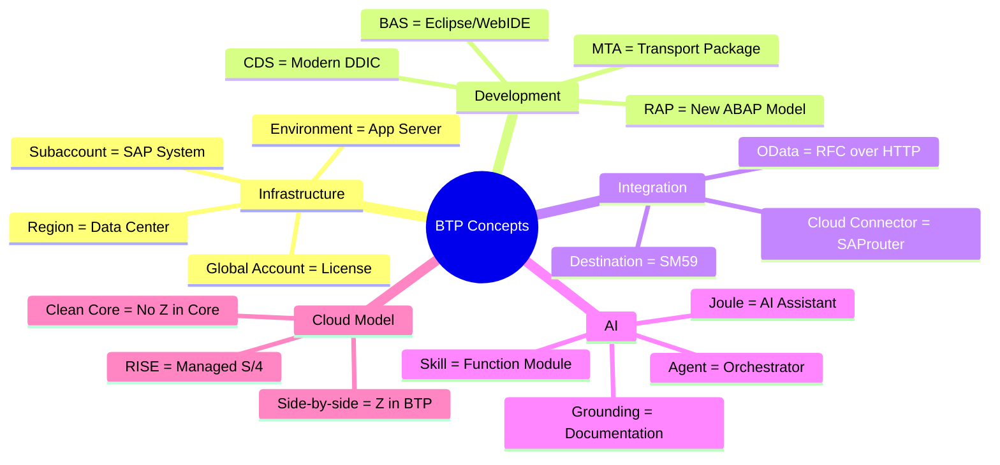
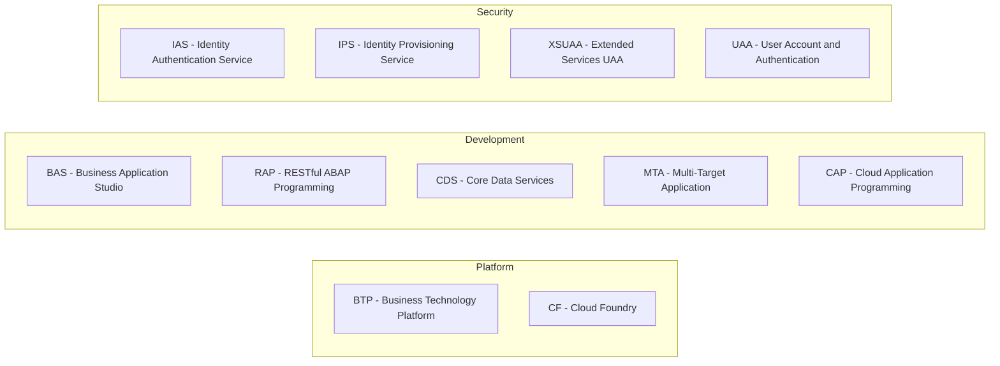
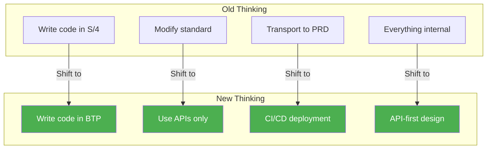

# Ek B: Glossary for Old ABAPers

> *BTP Terms Translated to What You Know*

---

## Concept Map



---

## Complete Glossary

| BTP Term | What It Means | Old-World Equivalent | Örnek |
|----------|---------------|---------------------|---------|
| **Global Account** | Your master contract with SAP | The license agreement | `ACME_CORP_GA` |
| **Subaccount** | Isolated environment for work | Like a separate SAP system | `ACME_PROD_EU10` |
| **Destination** | Named connection configuration | SM59 RFC destination | `S4_SALES_ORDERS` |
| **Cloud Connector** | Tunnel to on-premise | Like SAProuter but modern | CC on-prem server |
| **Service Instance** | Enabled feature | Like an installed add-on | `xsuaa-instance` |
| **Entitlement** | Permission to use a service | License allocation | 10 HANA Cloud units |
| **Environment** | Runtime platform | Application server | Cloud Foundry |
| **BAS** | Business Application Studio (IDE) | WebIDE / Eclipse | Browser-based dev |
| **RAP** | RESTful ABAP Programming | New dev model for ABAP | Behavior definitions |
| **CDS** | Core Data Services | Like DDIC views but modern | `@Annotation` syntax |
| **OData** | REST-like API protocol | Like RFC but HTTP | V2/V4 services |
| **Fiori Elements** | Template-based UI | Like ALV but for web | List Report |
| **MTA** | Multi-Target Application | Deployment package | `mtar` file |
| **Work Zone** | Central launchpad | Like Fiori Launchpad | SAP Build Work Zone |
| **Clean Core** | No modifications to standard | The goal SAP always wanted | No SMOD/CMOD |
| **Side-by-side** | Extension outside S/4 | Z-code in BTP not S/4 | Custom app on BTP |
| **Joule** | AI assistant | Nothing comparable (new!) | Chat-based AI |
| **Skill** | Single AI capability | Like one function module | GetSalesOrder skill |
| **Agent** | AI orchestrator | Like calling multiple FMs | Customer Service Agent |
| **Grounding** | Teaching AI context | Like custom documentation | Company policies |
| **Action Project** | API wrapper for Joule | Wrapper function group | SAP Build Actions |
| **RISE** | SAP's cloud bundle | Managed S/4 + services | RISE with SAP contract |
| **Private Edition** | Dedicated S/4 instance | Like hosted on-prem | Single tenant |
| **Public Edition** | Shared S/4 (multi-tenant) | New, no direct equivalent | Multi-tenant SaaS |
| **gCTS** | Git-based transport | CTS but with Git | Version control |
| **Key User Extensibility** | Low-code customization | Like easy enhancement | Custom Fields app |

---

## Transaction Code Equivalents

| Old Transaction | BTP Equivalent | Notes |
|-----------------|----------------|-------|
| `SE80` | Business Application Studio | Web-based IDE |
| `SE38` | BAS ABAP perspective | For ABAP Environment |
| `SE11` | CDS views in ADT | Data modeling |
| `SM59` | Destination Service | In BTP Cockpit |
| `SICF` | Cloud Foundry routes | HTTP services |
| `ST01` | BTP Monitoring | Cockpit → Monitoring |
| `SU01` | User Management | IAM in BTP Cockpit |
| `STMS` | gCTS | Git-based transports |
| `SE09/SE10` | gCTS / Git | Transport management |
| `SMICM` | Cloud Foundry logs | `cf logs` command |
| `SM21` | BTP Cockpit Logs | System logs |

---

## Common Acronyms



| Acronym | Full Name | Description |
|---------|-----------|-------------|
| **BTP** | Business Technology Platform | SAP's cloud platform |
| **BAS** | Business Application Studio | Cloud IDE |
| **RAP** | RESTful ABAP Programming | Modern ABAP development model |
| **CDS** | Core Data Services | Data modeling language |
| **MTA** | Multi-Target Application | Deployment unit |
| **CF** | Cloud Foundry | Runtime environment |
| **IAS** | Identity Authentication Service | Authentication service |
| **IPS** | Identity Provisioning Service | User sync |
| **XSUAA** | Extended Services for UAA | Authorization service |
| **UAA** | User Account and Authentication | Security component |
| **SaaS** | Software as a Service | Cloud delivery model |
| **CAP** | Cloud Application Programming | Node.js/Java framework |
| **ADT** | ABAP Development Tools | Eclipse plugin |
| **FLP** | Fiori Launchpad | Entry point for Fiori |
| **API** | Application Programming Interface | Service endpoint |
| **SSO** | Single Sign-On | One login for all |

---

## Quick Concept Translations

### "I want to create a Z-program"

**Old way:** SE38 → Create program → Write code → Activate

**BTP way:**
1. Open BAS or ADT
2. Create RAP-based CDS view
3. Add behavior definition
4. Generate Fiori Elements UI
5. Deploy to Cloud Foundry

---

### "I want to call an RFC"

**Old way:** CALL FUNCTION 'FM_NAME' DESTINATION 'DEST'

**BTP way:**
```abap
" Using HTTP in ABAP Environment
DATA(lo_http) = cl_http_destination_provider=>create_by_cloud_destination(
  i_name = 'MY_DESTINATION'
).
```

Or via OData:
```javascript
// In CAP/Node.js
const result = await S4.run(
  SELECT.from('API_SALES_ORDER_SRV.A_SalesOrder')
);
```

---

### "I want to create a custom table"

**Old way:** SE11 → Create table → Add fields → Activate

**BTP way (ABAP Environment):**
```sql
@EndUserText.label: 'My Custom Table'
define table zmytable {
  key client   : abap.clnt;
  key id       : abap.numc(10);
  name         : abap.char(100);
}
```

---

### "I want to transport my code"

**Old way:** SE09 → Create transport → Add objects → Release

**BTP way (gCTS):**
```bash
git add .
git commit -m "My changes"
git push
# CI/CD pipeline handles deployment
```

---

## API vs FM Reference

| Function Module Pattern | API Equivalent |
|------------------------|----------------|
| `BAPI_SALESORDER_GETLIST` | `GET /API_SALES_ORDER_SRV/A_SalesOrder` |
| `BAPI_MATERIAL_GET_DETAIL` | `GET /API_PRODUCT_SRV/A_Product('MATERIAL')` |
| `BAPI_PURCHASEORDER_CREATE1` | `POST /API_PURCHASEORDER_PROCESS_SRV/A_PurchaseOrder` |
| `RFC_READ_TABLE` | Use released CDS views instead |
| `POPUP_TO_CONFIRM` | Fiori dialog / sap.m.MessageBox |

---

## Mental Model Shift



---

*[İçindekilere Dön](../content.md)*

---

**Yazar:** [Beyhan Meyrali](https://www.linkedin.com/in/beyhanmeyrali) — SAP Storyteller & Digital Transformation Advocate

*Oluşturuldu ❤️ dünya genelindeki SAP öğrencileri için*
