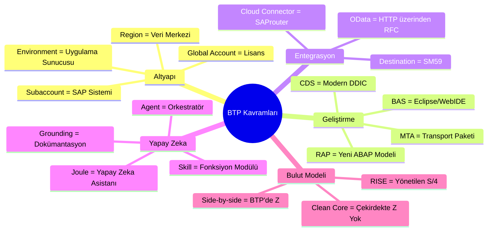
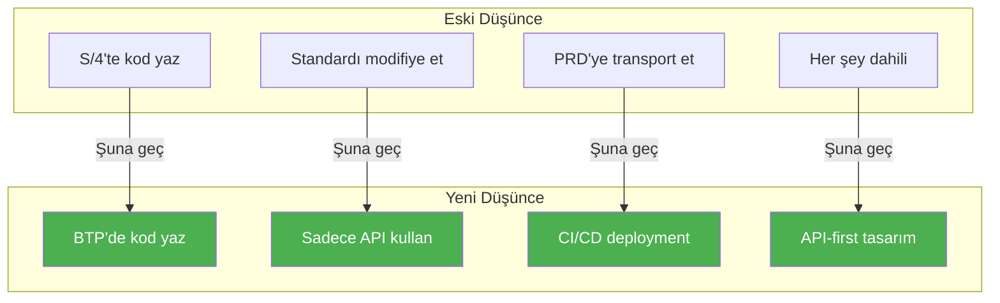

# Ek B: Eski ABAP'çılar için Sözlük

> *BTP Terimleri Bildiğiniz Şekilde Çevrildi*

---

## Kavram Haritası



---

## Tam Sözlük

| BTP Terimi | Anlamı | Eski Dünya Karşılığı | Örnek |
|------------|--------|---------------------|---------|
| **Global Account** | SAP ile ana sözleşmeniz | Lisans anlaşması | `ACME_CORP_GA` |
| **Subaccount** | Çalışma için izole ortam | Ayrı bir SAP sistemi gibi | `ACME_PROD_EU10` |
| **Destination** | Adlandırılmış bağlantı yapılandırması | SM59 RFC destination | `S4_SALES_ORDERS` |
| **Cloud Connector** | On-premise'e tünel | SAProuter gibi ama modern | CC on-prem sunucusu |
| **Service Instance** | Etkinleştirilmiş özellik | Kurulu bir eklenti gibi | `xsuaa-instance` |
| **Entitlement** | Bir servisi kullanma izni | Lisans tahsisi | 10 HANA Cloud birimi |
| **Environment** | Çalışma zamanı platformu | Uygulama sunucusu | Cloud Foundry |
| **BAS** | Business Application Studio (IDE) | WebIDE / Eclipse | Tarayıcı tabanlı geliştirme |
| **RAP** | RESTful ABAP Programming | ABAP için yeni geliştirme modeli | Behavior tanımlamaları |
| **CDS** | Core Data Services | DDIC view'lar gibi ama modern | `@Annotation` sözdizimi |
| **OData** | REST benzeri API protokolü | RFC gibi ama HTTP | V2/V4 servisleri |
| **Fiori Elements** | Şablon tabanlı UI | ALV gibi ama web için | List Report |
| **MTA** | Multi-Target Application | Deployment paketi | `mtar` dosyası |
| **Work Zone** | Merkezi launchpad | Fiori Launchpad gibi | SAP Build Work Zone |
| **Clean Core** | Standarda modifikasyon yok | SAP'ın her zaman istediği hedef | SMOD/CMOD yok |
| **Side-by-side** | S/4 dışında extension | S/4 yerine BTP'de Z-kod | BTP'de özel uygulama |
| **Joule** | Yapay zeka asistanı | Karşılaştırılabilir bir şey yok (yeni!) | Sohbet tabanlı yapay zeka |
| **Skill** | Tek bir yapay zeka yeteneği | Tek bir fonksiyon modülü gibi | GetSalesOrder skill |
| **Agent** | Yapay zeka orkestratörü | Birden fazla FM çağırmak gibi | Customer Service Agent |
| **Grounding** | Yapay zekaya bağlam öğretmek | Özel dokümantasyon gibi | Şirket politikaları |
| **Action Project** | Joule için API wrapper | Wrapper fonksiyon grubu | SAP Build Actions |
| **RISE** | SAP'ın bulut paketi | Yönetilen S/4 + servisler | RISE with SAP sözleşmesi |
| **Private Edition** | Ayrılmış S/4 instance | Barındırılan on-prem gibi | Tek kiracı |
| **Public Edition** | Paylaşımlı S/4 (multi-tenant) | Yeni, doğrudan karşılığı yok | Multi-tenant SaaS |
| **gCTS** | Git tabanlı transport | Git ile CTS | Versiyon kontrolü |
| **Key User Extensibility** | Low-code özelleştirme | Kolay geliştirme gibi | Custom Fields uygulaması |

---

## Transaction Kodu Karşılıkları

| Eski Transaction | BTP Karşılığı | Notlar |
|------------------|---------------|--------|
| `SE80` | Business Application Studio | Web tabanlı IDE |
| `SE38` | BAS ABAP perspektifi | ABAP Environment için |
| `SE11` | ADT'de CDS view'lar | Veri modelleme |
| `SM59` | Destination Service | BTP Cockpit'te |
| `SICF` | Cloud Foundry route'ları | HTTP servisleri |
| `ST01` | BTP İzleme | Cockpit → Monitoring |
| `SU01` | Kullanıcı Yönetimi | BTP Cockpit'te IAM |
| `STMS` | gCTS | Git tabanlı transport'lar |
| `SE09/SE10` | gCTS / Git | Transport yönetimi |
| `SMICM` | Cloud Foundry log'ları | `cf logs` komutu |
| `SM21` | BTP Cockpit Log'ları | Sistem log'ları |

---

## Yaygın Kısaltmalar


| Kısaltma | Tam Adı | Açıklama |
|----------|---------|----------|
| **BTP** | Business Technology Platform | SAP'ın bulut platformu |
| **BAS** | Business Application Studio | Bulut IDE |
| **RAP** | RESTful ABAP Programming | Modern ABAP geliştirme modeli |
| **CDS** | Core Data Services | Veri modelleme dili |
| **MTA** | Multi-Target Application | Deployment birimi |
| **CF** | Cloud Foundry | Çalışma zamanı ortamı |
| **IAS** | Identity Authentication Service | Kimlik doğrulama servisi |
| **IPS** | Identity Provisioning Service | Kullanıcı senkronizasyonu |
| **XSUAA** | Extended Services for UAA | Yetkilendirme servisi |
| **UAA** | User Account and Authentication | Güvenlik bileşeni |
| **SaaS** | Software as a Service | Bulut dağıtım modeli |
| **CAP** | Cloud Application Programming | Node.js/Java framework |
| **ADT** | ABAP Development Tools | Eclipse eklentisi |
| **FLP** | Fiori Launchpad | Fiori giriş noktası |
| **API** | Application Programming Interface | Servis endpoint'i |
| **SSO** | Single Sign-On | Tümü için tek oturum açma |

---

## Hızlı Kavram Çevirileri

### "Bir Z-program oluşturmak istiyorum"

**Eski yöntem:** SE38 → Program oluştur → Kod yaz → Aktive et

**BTP yöntemi:**
1. BAS veya ADT'yi aç
2. RAP tabanlı CDS view oluştur
3. Behavior definition ekle
4. Fiori Elements UI oluştur
5. Cloud Foundry'ye deploy et

---

### "Bir RFC çağırmak istiyorum"

**Eski yöntem:** CALL FUNCTION 'FM_NAME' DESTINATION 'DEST'

**BTP yöntemi:**
```abap
" ABAP Environment'ta HTTP kullanarak
DATA(lo_http) = cl_http_destination_provider=>create_by_cloud_destination(
  i_name = 'MY_DESTINATION'
).
```

Veya OData ile:
```javascript
// CAP/Node.js'te
const result = await S4.run(
  SELECT.from('API_SALES_ORDER_SRV.A_SalesOrder')
);
```

---

### "Özel bir tablo oluşturmak istiyorum"

**Eski yöntem:** SE11 → Tablo oluştur → Alan ekle → Aktive et

**BTP yöntemi (ABAP Environment):**
```sql
@EndUserText.label: 'My Custom Table'
define table zmytable {
  key client   : abap.clnt;
  key id       : abap.numc(10);
  name         : abap.char(100);
}
```

---

### "Kodumu transport etmek istiyorum"

**Eski yöntem:** SE09 → Transport oluştur → Nesneleri ekle → Release et

**BTP yöntemi (gCTS):**
```bash
git add .
git commit -m "My changes"
git push
# CI/CD pipeline deployment'ı yönetir
```

---

## API vs FM Referansı

| Fonksiyon Modülü Kalıbı | API Karşılığı |
|------------------------|----------------|
| `BAPI_SALESORDER_GETLIST` | `GET /API_SALES_ORDER_SRV/A_SalesOrder` |
| `BAPI_MATERIAL_GET_DETAIL` | `GET /API_PRODUCT_SRV/A_Product('MATERIAL')` |
| `BAPI_PURCHASEORDER_CREATE1` | `POST /API_PURCHASEORDER_PROCESS_SRV/A_PurchaseOrder` |
| `RFC_READ_TABLE` | Bunun yerine yayınlanmış CDS view'ları kullanın |
| `POPUP_TO_CONFIRM` | Fiori dialog / sap.m.MessageBox |

---

## Zihinsel Model Değişimi



---

*[İçindekilere Dön](../content.md)*

---

**Yazar:** [Beyhan Meyrali](https://www.linkedin.com/in/beyhanmeyrali) — SAP Hikaye Anlatıcısı & Dijital Dönüşüm Savunucusu

*Dünya genelindeki SAP öğrencileri için ❤️ ile oluşturuldu*
