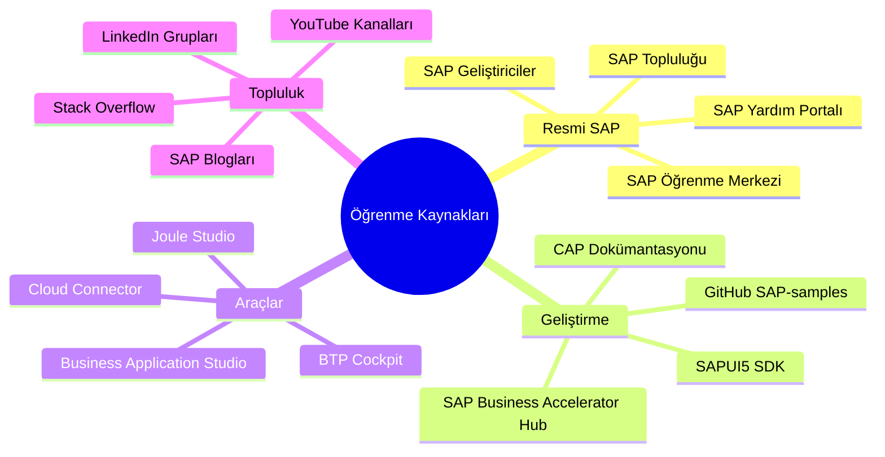
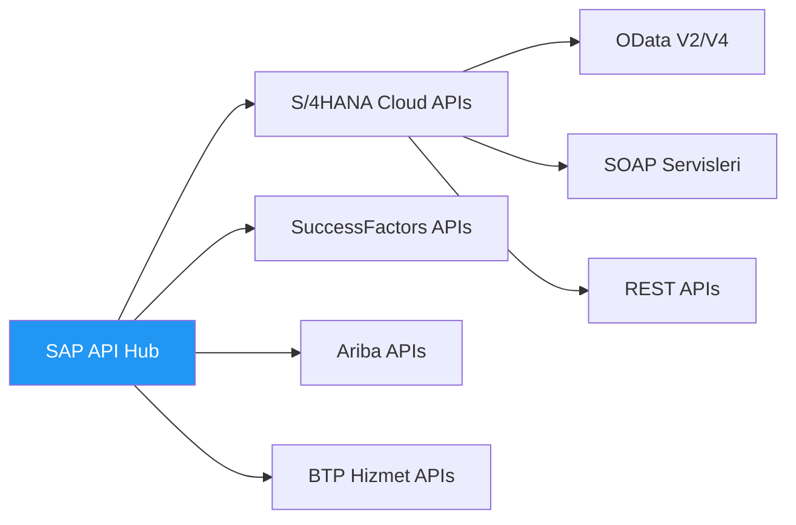
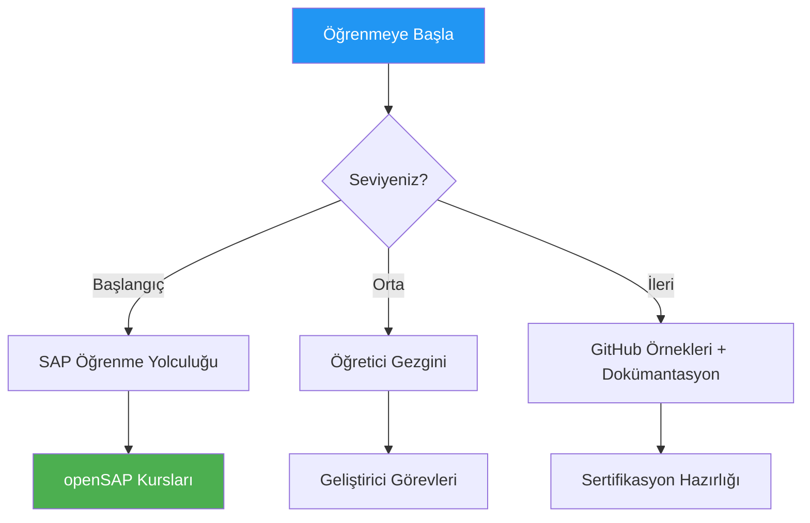

# Ek C: Faydalı Bağlantılar & Kaynaklar

> *Resmi Dokümantasyon ve Topluluk*

---

## Kaynak Haritası



---

## SAP Yardım Dokümantasyonu

| Konu | Bağlantı | Açıklama |
|------|----------|----------|
| **SAP BTP Dokümantasyonu** | [help.sap.com/btp](https://help.sap.com/docs/btp) | Ana BTP dokümantasyonu |
| **SAP BTP Cockpit (Üretim)** | [cockpit.btp.cloud.sap](https://cockpit.btp.cloud.sap) | Üretim BTP erişimi |
| **SAP BTP Cockpit (Deneme)** | [cockpit.hanatrial.ondemand.com](https://cockpit.hanatrial.ondemand.com) | Ücretsiz deneme erişimi |
| **Joule Dokümantasyonu** | [help.sap.com/joule](https://help.sap.com/docs/joule) | Joule AI dokümantasyonu |
| **SAP Build** | [help.sap.com/build](https://help.sap.com/docs/build) | Düşük kod platformu dokümantasyonu |
| **Cloud Connector** | [help.sap.com/connectivity](https://help.sap.com/docs/connectivity) | Cloud Connector kılavuzu |
| **ABAP Environment** | [help.sap.com/abap-environment](https://help.sap.com/docs/btp/sap-business-technology-platform/abap-environment) | BTP ABAP dokümantasyonu |
| **Integration Suite** | [help.sap.com/integration-suite](https://help.sap.com/docs/integration-suite) | Entegrasyon dokümantasyonu |
| **RISE with SAP** | [sap.com/rise](https://www.sap.com/products/rise.html) | RISE genel bakış |

---

## SAP Business Accelerator Hub (API Hub)

**URL:** [api.sap.com](https://api.sap.com)



### Temel API Koleksiyonları

| Ürün | API Yolu | Yaygın Kullanım |
|------|----------|-----------------|
| **S/4HANA Cloud** | Business Accelerator Hub → S/4HANA | Satış, Satınalma, Finans |
| **SuccessFactors** | Business Accelerator Hub → SuccessFactors | İK, İşe Alım, Öğrenme |
| **SAP Ariba** | Business Accelerator Hub → Ariba | Satınalma Ağı |
| **SAP Analytics Cloud** | Business Accelerator Hub → SAC | Analitik APIs |

### API Hub Nasıl Kullanılır

1. **APIs'e Göz Atın:** Alanınızı arayın (Satış, İK, vb.)
2. **Deneyin:** Sandbox ortamını kullanın
3. **Şartname Alın:** OpenAPI/EDMX dosyasını indirin
4. **Uygulayın:** Şartnameyi uygulamanızda veya Joule becerisinde kullanın

---

## SAP Geliştirici Kaynakları

| Kaynak | Bağlantı | Açıklama |
|--------|----------|----------|
| **SAP Geliştiriciler Portalı** | [developers.sap.com](https://developers.sap.com) | Ana geliştirici sitesi |
| **Öğretici Gezgini** | [developers.sap.com/tutorial-navigator](https://developers.sap.com/tutorial-navigator.html) | Adım adım öğreticiler |
| **Görev Gezgini** | [developers.sap.com/mission](https://developers.sap.com/mission.html) | Öğrenme görevleri |
| **CAP Dokümantasyonu** | [cap.cloud.sap](https://cap.cloud.sap/docs/) | Cloud Application Programming |
| **SAPUI5 SDK** | [sapui5.hana.ondemand.com](https://sapui5.hana.ondemand.com) | UI5 dokümantasyonu |
| **Fiori Tasarım Kılavuzları** | [experience.sap.com/fiori-design](https://experience.sap.com/fiori-design-web/) | UX kılavuzları |

---

## SAP Topluluğu

| Kaynak | Bağlantı | Açıklama |
|--------|----------|----------|
| **SAP Topluluğu** | [community.sap.com](https://community.sap.com) | Ana topluluk |
| **SAP Blogları** | [blogs.sap.com](https://blogs.sap.com) | Teknik makaleler |
| **Soru-Cevap Bölümü** | [answers.sap.com](https://answers.sap.com) | Soru sorun |
| **Etkinlikler** | [events.sap.com](https://events.sap.com) | Webinarlar, TechEd |

### Popüler Blog Etiketleri

- `#SAP BTP`
- `#SAP Joule`
- `#ABAP RAP`
- `#SAP Fiori`
- `#RISE with SAP`
- `#Clean Core`

---

## GitHub Örnekleri

| Depo | Bağlantı | İçerik |
|------|----------|--------|
| **SAP-samples** | [github.com/SAP-samples](https://github.com/SAP-samples) | Resmi örnekler |
| **cloud-cap-samples** | [github.com/SAP-samples/cloud-cap-samples](https://github.com/SAP-samples/cloud-cap-samples) | CAP örnekleri |
| **abap-platform-rap-workshops** | [github.com/SAP-samples/abap-platform-rap-workshops](https://github.com/SAP-samples/abap-platform-rap-workshops) | RAP atölyeleri |
| **btp-setup-automator** | [github.com/SAP-samples/btp-setup-automator](https://github.com/SAP-samples/btp-setup-automator) | BTP kurulumunu otomatikleştirin |
| **cloud-sdk** | [github.com/SAP/cloud-sdk](https://github.com/SAP/cloud-sdk) | Cloud SDK |

---

## Öğrenme Yolları



| Platform | Bağlantı | Açıklama | Maliyet |
|----------|----------|----------|---------|
| **SAP Learning Hub** | [learning.sap.com](https://learning.sap.com) | Resmi eğitim | Abonelik |
| **openSAP** | [open.sap.com](https://open.sap.com) | Ücretsiz çevrimiçi kurslar | Ücretsiz |
| **SAP Öğreticiler** | [developers.sap.com/tutorials](https://developers.sap.com/tutorial-navigator.html) | Uygulamalı öğreticiler | Ücretsiz |
| **Coursera** | Coursera'da SAP kursları | Partner kursları | Değişken |

### ABAP Geliştiricileri için Önerilen Öğrenme Sırası

1. **openSAP:** "Discover SAP Business Technology Platform"
2. **Öğretici:** BTP Deneme Hesabı Oluşturma
3. **Öğretici:** İlk RAP Uygulamanızı Oluşturun
4. **Görev:** Yan Yana Uzantı Oluşturma
5. **openSAP:** "Building Applications with the ABAP RESTful Application Programming Model"

---

## YouTube Kanalları

| Kanal | İçerik | Bağlantı |
|-------|--------|----------|
| **SAP Developers** | Teknik öğreticiler | [youtube.com/@SAPDevs](https://www.youtube.com/@SAPDevs) |
| **SAP Learning** | Eğitim videoları | [youtube.com/@SAPLearning](https://www.youtube.com/@SAPLearning) |
| **SAP TechEd** | Konferans oturumları | [youtube.com/SAP](https://www.youtube.com/SAP) |
| **Thomas Jung** | ABAP/CAP derinlemesine incelemeler | "Thomas Jung SAP" arayın |

---

## Faydalı Araçlar

| Araç | Amaç | Bağlantı |
|------|------|----------|
| **Postman** | API testi | [postman.com](https://www.postman.com) |
| **Bruno** | Açık kaynak API istemcisi | [usebruno.com](https://www.usebruno.com) |
| **Git** | Sürüm kontrolü | [git-scm.com](https://git-scm.com) |
| **VS Code** | Yerel geliştirme | [code.visualstudio.com](https://code.visualstudio.com) |
| **Eclipse ADT** | ABAP geliştirme | [tools.hana.ondemand.com](https://tools.hana.ondemand.com) |
| **draw.io** | Diyagramlar | [draw.io](https://app.diagrams.net) |
| **Mermaid Live** | Mermaid diyagramları | [mermaid.live](https://mermaid.live) |

---

## Sertifikasyon Yolları

| Sertifikasyon | Kod | Odak |
|---------------|-----|------|
| **SAP Certified Development Associate - SAP BTP** | C_BTP_2308 | BTP temelleri |
| **SAP Certified Development Associate - ABAP with SAP NetWeaver** | C_TAW12_750 | Klasik ABAP |
| **SAP Certified Development Associate - SAP Fiori Application Developer** | C_FIORDEV_22 | Fiori geliştirme |
| **SAP Certified Application Associate - SAP S/4HANA Cloud** | Çeşitli | S/4 fonksiyonel |

---

## Hızlı Bağlantılar Yer İmi Koleksiyonu

```markdown
# BTP Hızlı Bağlantılar (yer imlerine kopyalayın)

## Günlük Kullanım
- BTP Cockpit: https://cockpit.btp.cloud.sap
- BAS: https://eu10.applicationstudio.cloud.sap
- API Hub: https://api.sap.com
- SAP Yardım: https://help.sap.com

## Geliştirme
- SAPUI5: https://sapui5.hana.ondemand.com
- CAP Dokümantasyon: https://cap.cloud.sap
- Fiori Tasarım: https://experience.sap.com/fiori-design-web

## Öğrenme
- Öğreticiler: https://developers.sap.com/tutorial-navigator.html
- openSAP: https://open.sap.com
- Topluluk: https://community.sap.com
```

---

*[İçindekilere Dön](../content.md)*

---

**Yazar:** [Beyhan Meyrali](https://www.linkedin.com/in/beyhanmeyrali) — SAP Hikaye Anlatıcısı & Dijital Dönüşüm Savunucusu

*Dünya genelindeki SAP öğrencileri için ❤️ ile oluşturuldu*
