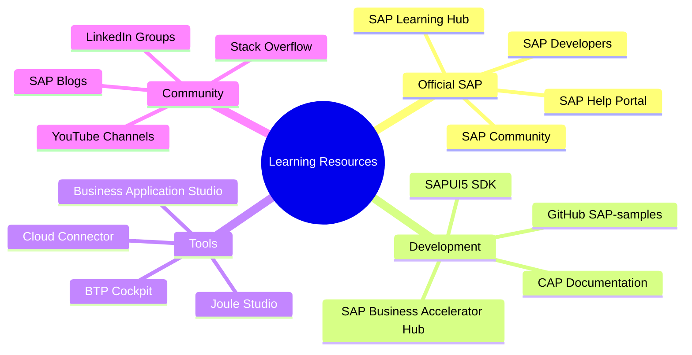
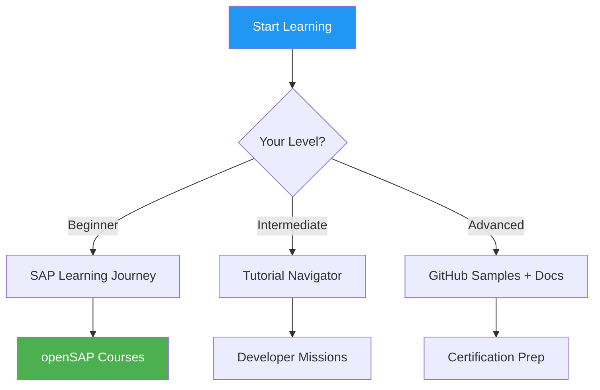

# Ek C: Useful Links & Resources

> *Official Documentation and Community*

---

## Resource Map



---

## SAP Help Documentation

| Topic | Link | Description |
|-------|------|-------------|
| **SAP BTP Documentation** | [help.sap.com/btp](https://help.sap.com/docs/btp) | Main BTP documentation |
| **SAP BTP Cockpit (Production)** | [cockpit.btp.cloud.sap](https://cockpit.btp.cloud.sap) | Production BTP access |
| **SAP BTP Cockpit (Trial)** | [cockpit.hanatrial.ondemand.com](https://cockpit.hanatrial.ondemand.com) | Free trial access |
| **Joule Documentation** | [help.sap.com/joule](https://help.sap.com/docs/joule) | Joule AI documentation |
| **SAP Build** | [help.sap.com/build](https://help.sap.com/docs/build) | Low-code platform docs |
| **Cloud Connector** | [help.sap.com/connectivity](https://help.sap.com/docs/connectivity) | Cloud Connector guide |
| **ABAP Environment** | [help.sap.com/abap-environment](https://help.sap.com/docs/btp/sap-business-technology-platform/abap-environment) | BTP ABAP docs |
| **Integration Suite** | [help.sap.com/integration-suite](https://help.sap.com/docs/integration-suite) | Integration documentation |
| **RISE with SAP** | [sap.com/rise](https://www.sap.com/products/rise.html) | RISE overview |

---

## SAP Business Accelerator Hub (API Hub)

**URL:** [api.sap.com](https://api.sap.com)


### Key API Collections

| Product | API Path | Common Use |
|---------|----------|------------|
| **S/4HANA Cloud** | Business Accelerator Hub → S/4HANA | Sales, Procurement, Finance |
| **SuccessFactors** | Business Accelerator Hub → SuccessFactors | HR, Recruiting, Learning |
| **SAP Ariba** | Business Accelerator Hub → Ariba | Procurement Network |
| **SAP Analytics Cloud** | Business Accelerator Hub → SAC | Analytics APIs |

### How to Use API Hub

1. **Browse APIs:** Search for your domain (Sales, HR, etc.)
2. **Try it out:** Use sandbox environment
3. **Get spec:** Download OpenAPI/EDMX file
4. **Implement:** Use spec in your app or Joule skill

---

## SAP Developer Resources

| Resource | Link | Description |
|----------|------|-------------|
| **SAP Developers Portal** | [developers.sap.com](https://developers.sap.com) | Main developer site |
| **Tutorial Navigator** | [developers.sap.com/tutorial-navigator](https://developers.sap.com/tutorial-navigator.html) | Step-by-step tutorials |
| **Mission Navigator** | [developers.sap.com/mission](https://developers.sap.com/mission.html) | Learning missions |
| **CAP Documentation** | [cap.cloud.sap](https://cap.cloud.sap/docs/) | Cloud Application Programming |
| **SAPUI5 SDK** | [sapui5.hana.ondemand.com](https://sapui5.hana.ondemand.com) | UI5 documentation |
| **Fiori Design Guidelines** | [experience.sap.com/fiori-design](https://experience.sap.com/fiori-design-web/) | UX guidelines |

---

## SAP Community

| Resource | Link | Description |
|----------|------|-------------|
| **SAP Community** | [community.sap.com](https://community.sap.com) | Main community |
| **SAP Blogs** | [blogs.sap.com](https://blogs.sap.com) | Technical articles |
| **Q&A Section** | [answers.sap.com](https://answers.sap.com) | Ask questions |
| **Events** | [events.sap.com](https://events.sap.com) | Webinars, TechEd |

### Popular Blog Tags

- `#SAP BTP`
- `#SAP Joule`
- `#ABAP RAP`
- `#SAP Fiori`
- `#RISE with SAP`
- `#Clean Core`

---

## GitHub Samples

| Repository | Link | Content |
|------------|------|---------|
| **SAP-samples** | [github.com/SAP-samples](https://github.com/SAP-samples) | Official samples |
| **cloud-cap-samples** | [github.com/SAP-samples/cloud-cap-samples](https://github.com/SAP-samples/cloud-cap-samples) | CAP examples |
| **abap-platform-rap-workshops** | [github.com/SAP-samples/abap-platform-rap-workshops](https://github.com/SAP-samples/abap-platform-rap-workshops) | RAP workshops |
| **btp-setup-automator** | [github.com/SAP-samples/btp-setup-automator](https://github.com/SAP-samples/btp-setup-automator) | Automate BTP setup |
| **cloud-sdk** | [github.com/SAP/cloud-sdk](https://github.com/SAP/cloud-sdk) | Cloud SDK |

---

## Learning Paths



| Platform | Link | Description | Cost |
|----------|------|-------------|------|
| **SAP Learning Hub** | [learning.sap.com](https://learning.sap.com) | Official training | Subscription |
| **openSAP** | [open.sap.com](https://open.sap.com) | Free online courses | Free |
| **SAP Tutorials** | [developers.sap.com/tutorials](https://developers.sap.com/tutorial-navigator.html) | Hands-on tutorials | Free |
| **Coursera** | SAP courses on Coursera | Partner courses | Varies |

### Recommended Learning Order for ABAPers

1. **openSAP:** "Discover SAP Business Technology Platform"
2. **Tutorial:** Set up BTP Trial Account
3. **Tutorial:** Create your first RAP application
4. **Mission:** Build a Side-by-Side Extension
5. **openSAP:** "Building Applications with the ABAP RESTful Application Programming Model"

---

## YouTube Channels

| Channel | Content | Link |
|---------|---------|------|
| **SAP Developers** | Technical tutorials | [youtube.com/@SAPDevs](https://www.youtube.com/@SAPDevs) |
| **SAP Learning** | Training videos | [youtube.com/@SAPLearning](https://www.youtube.com/@SAPLearning) |
| **SAP TechEd** | Conference sessions | [youtube.com/SAP](https://www.youtube.com/SAP) |
| **Thomas Jung** | ABAP/CAP deep dives | Search "Thomas Jung SAP" |

---

## Useful Tools

| Tool | Purpose | Link |
|------|---------|------|
| **Postman** | API testing | [postman.com](https://www.postman.com) |
| **Bruno** | Open-source API client | [usebruno.com](https://www.usebruno.com) |
| **Git** | Version control | [git-scm.com](https://git-scm.com) |
| **VS Code** | Local development | [code.visualstudio.com](https://code.visualstudio.com) |
| **Eclipse ADT** | ABAP development | [tools.hana.ondemand.com](https://tools.hana.ondemand.com) |
| **draw.io** | Diagrams | [draw.io](https://app.diagrams.net) |
| **Mermaid Live** | Mermaid diagrams | [mermaid.live](https://mermaid.live) |

---

## Certification Paths

| Certification | Code | Focus |
|---------------|------|-------|
| **SAP Certified Development Associate - SAP BTP** | C_BTP_2308 | BTP fundamentals |
| **SAP Certified Development Associate - ABAP with SAP NetWeaver** | C_TAW12_750 | Classic ABAP |
| **SAP Certified Development Associate - SAP Fiori Application Developer** | C_FIORDEV_22 | Fiori development |
| **SAP Certified Application Associate - SAP S/4HANA Cloud** | Various | S/4 functional |

---

## Quick Links Bookmark Collection

```markdown
# BTP Quick Links (copy to bookmarks)

## Daily Use
- BTP Cockpit: https://cockpit.btp.cloud.sap
- BAS: https://eu10.applicationstudio.cloud.sap
- API Hub: https://api.sap.com
- SAP Help: https://help.sap.com

## Development
- SAPUI5: https://sapui5.hana.ondemand.com
- CAP Docs: https://cap.cloud.sap
- Fiori Design: https://experience.sap.com/fiori-design-web

## Learning
- Tutorials: https://developers.sap.com/tutorial-navigator.html
- openSAP: https://open.sap.com
- Community: https://community.sap.com
```

---

*[İçindekilere Dön](../content.md)*

---

**Yazar:** [Beyhan Meyrali](https://www.linkedin.com/in/beyhanmeyrali) — SAP Storyteller & Digital Transformation Advocate

*Oluşturuldu ❤️ dünya genelindeki SAP öğrencileri için*
