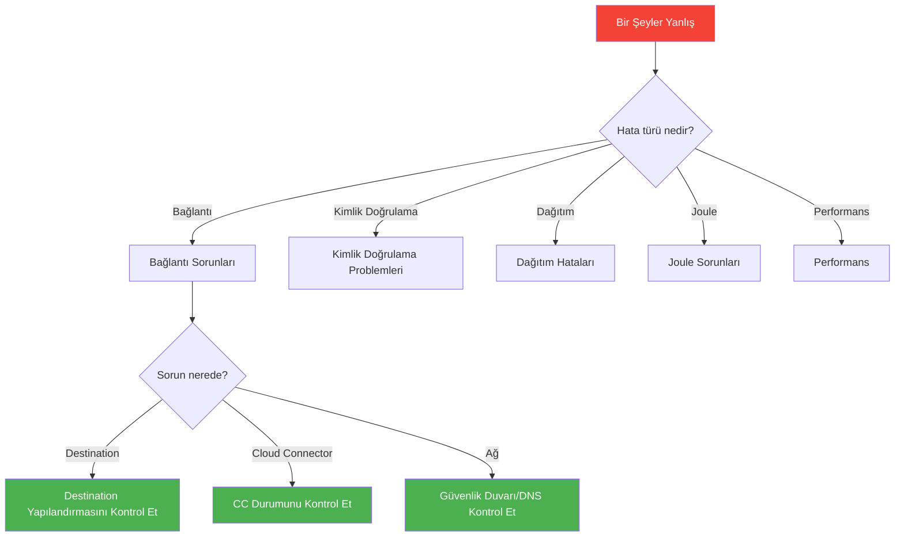
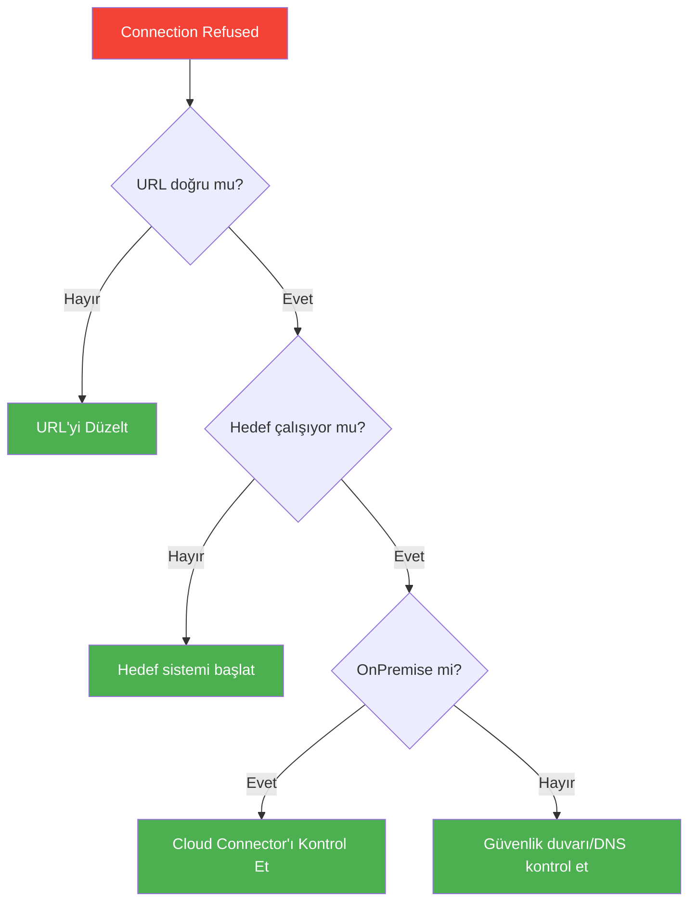
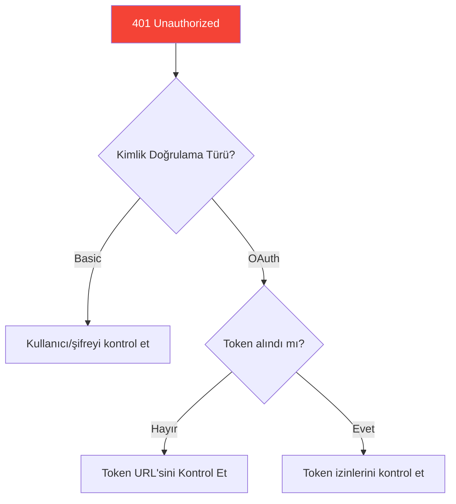
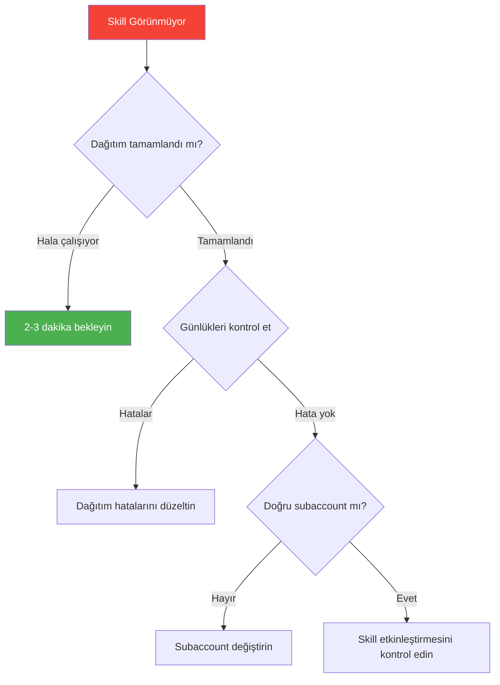
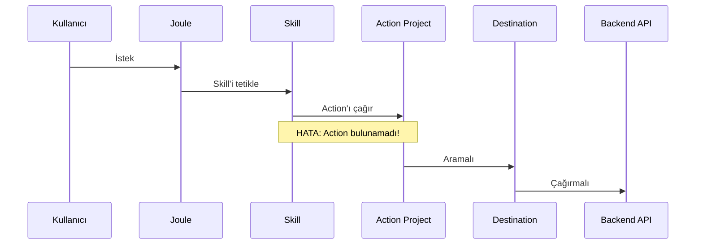
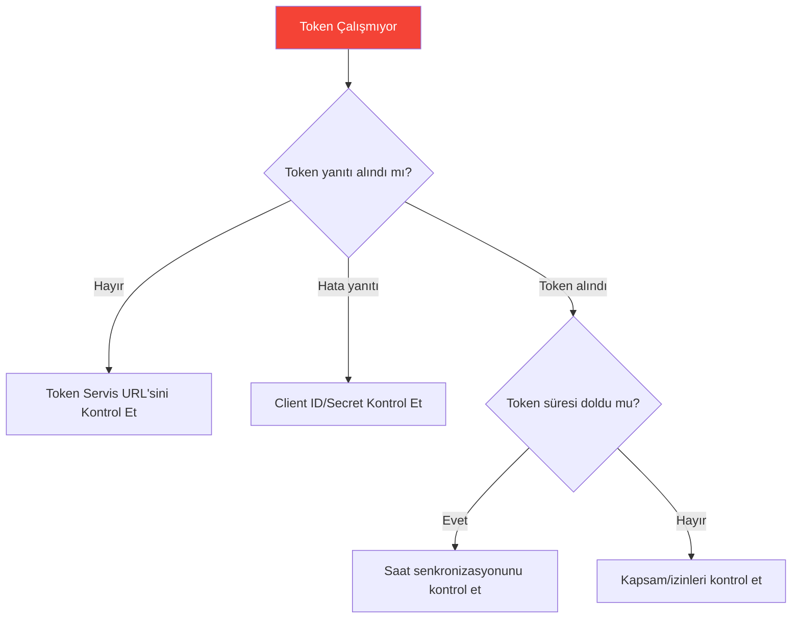
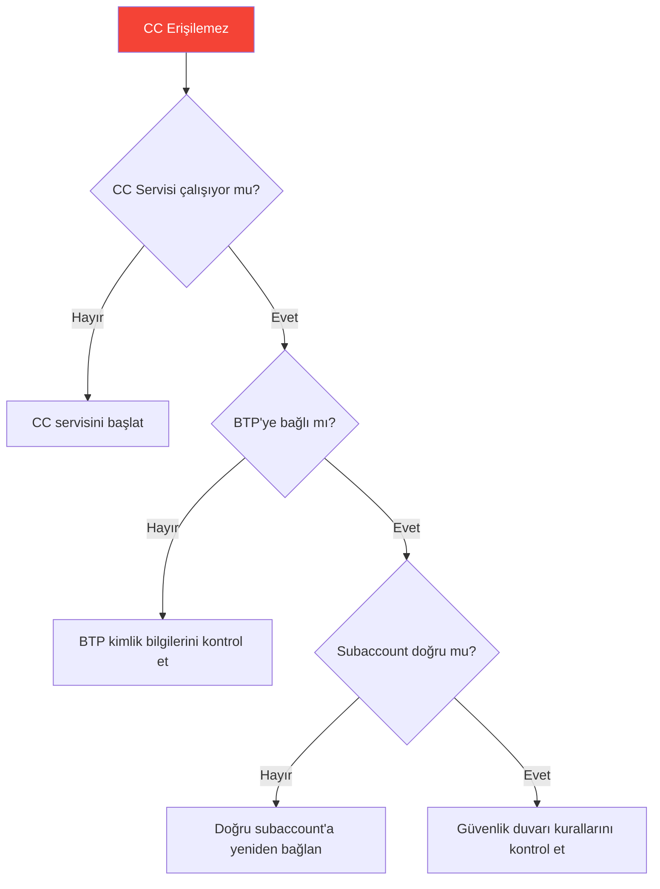
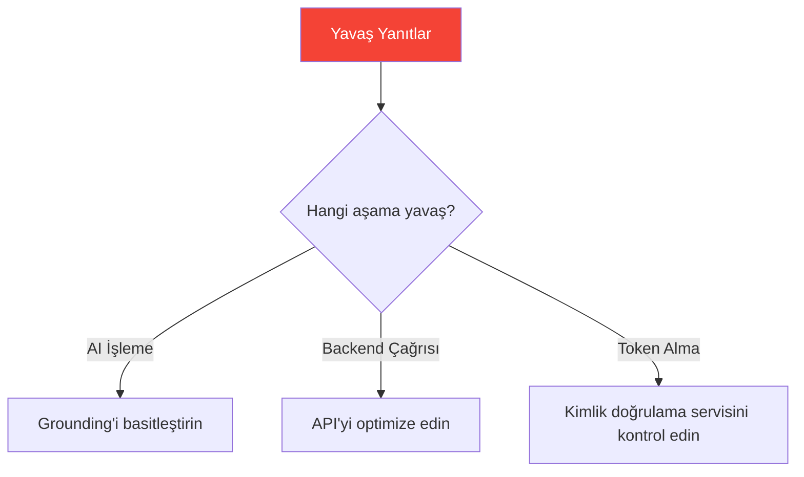
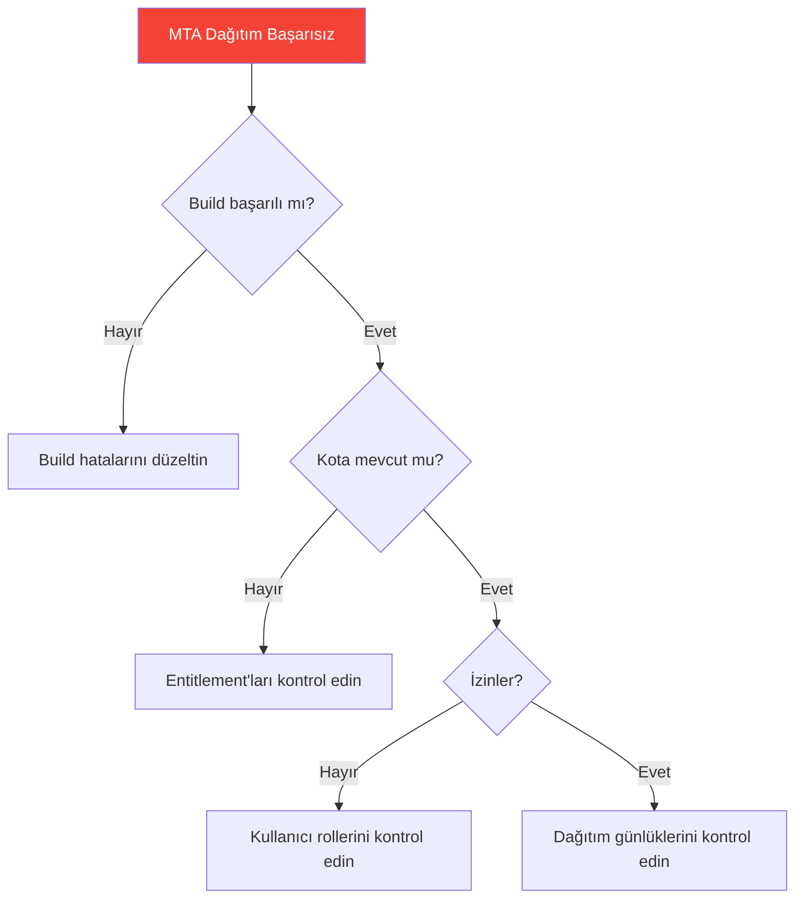

# Ek D: Yaygın Sorunları Giderme

> *İşler Çalışmadığında*

---

## Sorun Giderme Akış Şeması



---

## Destination Hataları

### "Connection refused" veya "Host not found"



**Neden**: URL yanlış veya sistem kapalı

**Tanılama adımları:**
1. URL'yi kopyalayıp tarayıcıya yapıştırın—yanıt veriyor mu?
2. Hedef sistemin çalışıp çalışmadığını kontrol edin
3. OnPremise için: Cloud Connector bağlı mı?
4. DNS çözümlemesini kontrol edin

**Çözüm:**
```yaml
# Destination yapılandırmasını doğrulayın
1. BTP Cockpit → Subaccount → Connectivity → Destinations
2. "Check Connection" butonuna tıklayın
3. Hata mesajını dikkatle okuyun
4. OnPremise için, sanal hostun CC eşlemesiyle uyuştuğunu doğrulayın
```

---

### "401 Unauthorized"

**Neden**: Kimlik doğrulama başarısız oldu



**Çözüm kontrol listesi:**

| Kimlik Doğrulama Türü | Bunu Kontrol Edin |
|----------------------|-------------------|
| **Basic** | Kullanıcı adı ve şifre doğru mu? Kullanıcı kilitli mi? |
| **OAuth2** | Client ID, Secret, Token URL hepsi doğru mu? |
| **SAMLBearer** | Güven yapılandırması yapıldı mı? Kullanıcı eşlendi mi? |

**OAuth2 için:**
```bash
# Token endpoint'ini curl ile manuel test edin
curl -X POST "https://authentication.eu10.hana.ondemand.com/oauth/token" \
  -H "Content-Type: application/x-www-form-urlencoded" \
  -d "grant_type=client_credentials&client_id=YOUR_CLIENT_ID&client_secret=YOUR_SECRET"
```

---

### "403 Forbidden"

**Neden**: Kimlik doğrulandı ancak yetkilendirilmedi

**Çözüm:**
1. Kullanıcının hedef sistemde gerekli rollere sahip olup olmadığını kontrol edin
2. Cloud Connector için: Yolun kaynaklarda açığa çıkarıldığını doğrulayın
3. Hedefte IP'nin beyaz listede olup olmadığını kontrol edin
4. Gerekiyorsa `sap-client` header'ını doğrulayın

```yaml
# Yaygın eksik yetkilendirme senaryoları
- Kullanıcı mevcut ancak rol atanmamış
- Yol Cloud Connector kaynaklarında açığa çıkarılmamış
- API, verilmemiş belirli bir kapsam gerektiriyor
- SAP sistemleri için sap-client header'ı eksik
```

---

### "Certificate error" / SSL Sorunları

**Neden**: SSL/TLS sertifika problemi

**Çözüm:**

| Ortam | Çözüm |
|-------|-------|
| **Geliştirme** | Destination'a `TrustAll=true` ekleyin (Üretimde ASLA!) |
| **Üretim** | CA sertifikasını BTP Trust Store'a içe aktarın |

```yaml
# Geliştirmede kendinden imzalı sertifikalar için
Additional Properties:
  TrustAll: true  # YALNIZCA GELİŞTİRME!
```

---

## Joule Dağıtım Sorunları

### Dağıtımdan sonra skill görünmüyor



**Tanılama adımları:**
1. Joule Studio'da dağıtım durumunu kontrol edin
2. Hatalar için dağıtım günlüklerini inceleyin
3. Doğru subaccount'ta olduğunuzu doğrulayın
4. Skill'in Joule için etkinleştirildiğini onaylayın

**Çözüm:**
```yaml
1. Joule Studio'yu açın
2. Skill/agent'ınıza gidin
3. Durum göstergesini kontrol edin
4. Takılı kaldıysa, yeniden dağıtmayı deneyin
5. Tarayıcı önbelleğini temizleyin ve yenileyin
```

---

### "Action not found" hatası

**Neden**: Action Project düzgün bağlanmamış



**Çözüm:**
1. Action Project'in başarıyla dağıtıldığını doğrulayın
2. Destination'ın mevcut ve doğru adlandırıldığını kontrol edin
3. Skill yapılandırmasında action'ı yeniden bağlayın
4. Action operationId'nin skill yapılandırmasıyla eşleştiğinden emin olun

---

### Agent skill'i kullanmıyor

**Neden**: Skill atanmamış veya talimatlar belirsiz

**Tanılama:**
```yaml
Test sırası:
1. Önce skill'i tek başına test edin (tek başına çalışıyor mu?)
2. Skill'in agent'ın skill listesinde olup olmadığını kontrol edin
3. Agent talimatlarını inceleyin - skill'in ne zaman kullanılacağından bahsediyor mu?
4. Benzer tetikleyicilere sahip çakışan skill'leri kontrol edin
```

**Çözüm:**
```yaml
# Agent talimatlarını iyileştirin
Kötü:  "Kullanıcılara satışlarla ilgili yardım et"
İyi:   "Bir kullanıcı satış siparişi durumunu sorduğunda,
        sipariş numarasıyla GetSalesOrderStatus skill'ini kullan"
```

---

## Kimlik Doğrulama Problemleri

### OAuth token çalışmıyor



**Yaygın OAuth2 sorunları:**

| Belirti | Neden | Çözüm |
|---------|-------|-------|
| "invalid_client" | Yanlış Client ID/Secret | Kimlik bilgilerini doğrulayın |
| "unauthorized_client" | Yanlış grant türü | grant_type parametresini kontrol edin |
| Token çalışıyor sonra başarısız | Token süresi doldu | Token ömrünü kontrol edin |
| "insufficient_scope" | Eksik izinler | Gerekli kapsamı ekleyin |

---

### SSO çalışmıyor

**Neden**: Güven yapılandırma sorunu

**Çözüm:**
1. BTP'de IAS/IdP yapılandırmasını kontrol edin
2. Güven ilişkisinin kurulduğunu doğrulayın
3. Kullanıcının her iki sistemde de mevcut olup olmadığını kontrol edin
4. Öznitelik eşlemesini inceleyin

```yaml
Güven Kurulum Kontrol Listesi:
☐ IAS kiracısı BTP subaccount'ta yapılandırıldı
☐ Uygulama IAS'ta kayıtlı
☐ Kullanıcı grupları doğru eşlendi
☐ SAML metadata değişimi yapıldı (gerekiyorsa)
☐ Test kullanıcısı IdP'de mevcut
```

---

## Cloud Connector Sorunları

### Bağlantı "unreachable" gösteriyor



**Çözüm:**
```bash
# CC servis durumunu kontrol edin (Windows)
services.msc → "SAP Cloud Connector" bulun → Durumu kontrol edin

# CC servis durumunu kontrol edin (Linux)
systemctl status scc_daemon

# CC Admin'e erişin
https://localhost:8443
```

**CC Admin'de doğrulayın:**
1. Ana bağlantı "Connected" gösteriyor
2. Doğru subaccount bağlı
3. Sertifika hatası yok

---

### On-prem için "No route to host"

**Neden**: Sanal eşleme sorunu

**Çözüm:**
1. CC'de sanal host eşlemesini doğrulayın
2. Kaynaklarda yol açığa çıkarmasını kontrol edin
3. CC sunucusundan dahili bağlantıyı test edin

```yaml
Cloud Connector Kontrol Listesi:
☐ Sanal host yapılandırıldı (örn. "s4-virtual")
☐ Dahili host CC sunucusundan erişilebilir
☐ Yollar Kaynaklarda açığa çıkarıldı
☐ Erişim politikası doğru (Path and All Sub-Paths)
☐ CC → dahili sistem arasında güvenlik duvarı engellemesi yok
```

---

## Performans Sorunları

### Yavaş Joule yanıtları



**Yaygın nedenler ve çözümler:**

| Neden | Belirti | Çözüm |
|-------|---------|-------|
| Büyük grounding dokümanları | İlk yanıt yavaş | Dokümanları bölün/optimize edin |
| Yavaş backend API | Tutarlı gecikmeler | Önbellekleme ekleyin, sorguyu optimize edin |
| AI aşırı yükü | Aralıklı yavaşlık | Bekleyin, daha sonra tekrar deneyin |
| Ağ gecikmesi | Bölge uyumsuzluğu | Tüm servisler için aynı bölgeyi kullanın |

---

### Destination zaman aşımı

**Neden**: Hedef sistem çok yavaş

**Çözüm:**
```yaml
# Destination'da zaman aşımını artırın
Additional Properties:
  timeout: 60000  # milisaniye (60 saniye)

# Veya backend'i optimize edin:
1. Sık sorgulanan alanlara indeks ekleyin
2. Sonuç kümesini $top veya $filter ile sınırlayın
3. Yalnızca gerekli alanları almak için $select kullanın
```

---

## Dağıtım Sorunları

### MTA dağıtımı başarısız



**Yaygın MTA hataları:**

| Hata | Neden | Çözüm |
|------|-------|-------|
| "Insufficient quota" | Entitlement yok | Cockpit'te entitlement'ları atayın |
| "Service broker error" | Servis mevcut değil | Servis kullanılabilirliğini kontrol edin |
| "Route already exists" | URL çakışması | Manifest'te route'u değiştirin |
| "Authorization failed" | Dağıtım hakları eksik | SpaceDeveloper rolü ekleyin |

---

## Genel Hata Ayıklama İpuçları

### Günlükler nerede bulunur

| Bileşen | Günlük Konumu |
|---------|---------------|
| **BTP Uygulamaları** | BTP Cockpit → Subaccount → Spaces → App → Logs |
| **Cloud Connector** | `<CC_Install>/log/ljs_trace.log` |
| **Destinations** | BTP Cockpit → Connectivity → Destinations → Check Connection |
| **Joule** | Joule Studio → Deployment → Logs |
| **ABAP Environment** | ADT → ABAP Console |

### Yararlı Komutlar

```bash
# Cloud Foundry CLI - uygulama günlüklerini görüntüle
cf logs APP_NAME --recent

# Cloud Foundry CLI - günlükleri canlı izle
cf logs APP_NAME

# Uygulama durumunu kontrol et
cf apps

# Servisleri kontrol et
cf services
```

### Genel Kontrol Listesi

```yaml
Yardım istemeden önce doğrulayın:
☐ Doğru subaccount/space seçili
☐ Kullanıcı gerekli izinlere sahip
☐ Tüm bağımlılıklar dağıtıldı
☐ Destination erişilebilir (Check Connection)
☐ Bozmuş olabilecek son değişiklikler
☐ Hata mesajı tamamen okundu
☐ Günlükler incelendi
```

---

## Yardım Alma

1. **SAP Notlarını Kontrol Edin** — [launchpad.support.sap.com](https://launchpad.support.sap.com)
2. **SAP Topluluğunu Arayın** — [community.sap.com](https://community.sap.com)
3. **Stack Overflow** — Etiket: `sap`, `sap-cloud-platform`, `sapui5`
4. **SAP Desteği** — Lisanslıysanız incident açın

---

*[İçindekilere Dön](../content.md)*

---

**Yazar:** [Beyhan Meyrali](https://www.linkedin.com/in/beyhanmeyrali) — SAP Hikaye Anlatıcısı & Dijital Dönüşüm Savunucusu

*Dünya genelindeki SAP öğrencileri için ❤️ ile oluşturuldu*
