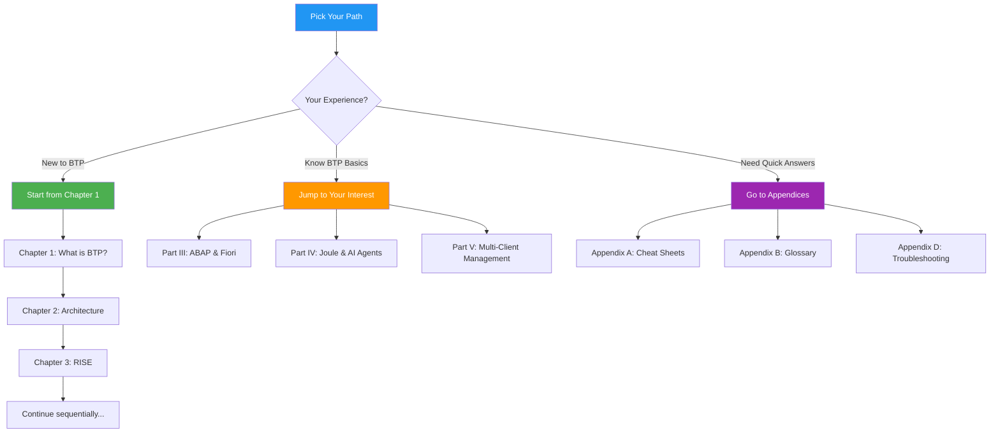
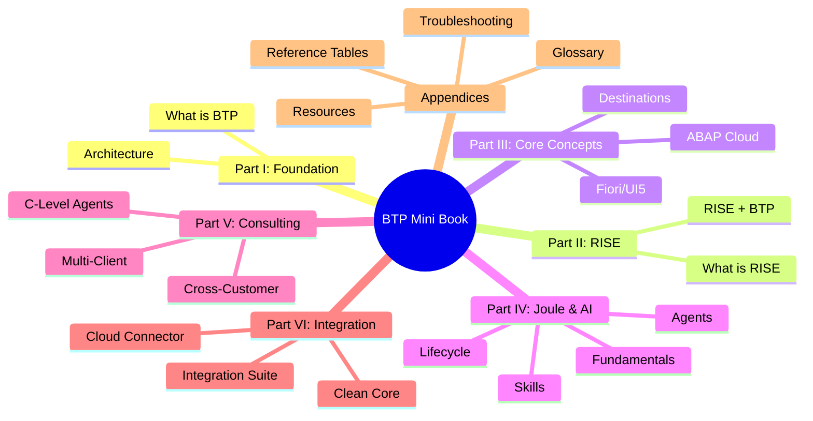

# Preface

## Who This Book Is For

If you've spent years working with ABAP, debugging SE38 programs, extending SAP systems through user exits and BADIs, or building Fiori apps deployed to on-premise launchpads—this book is for you.

You've heard the buzzwords:
- *"We're moving to RISE"*
- *"Build it on BTP"*
- *"Use Joule for that"*
- *"Keep the core clean"*

And you've probably thought: *"What does this actually mean for my daily work?"*

This mini book answers that question. No marketing slides. No 500-page documentation that assumes you already know everything. Just clear explanations built on what you already understand.

---

## The Feynman Philosophy

Richard Feynman, the Nobel Prize-winning physicist, had a simple rule:

> *"If you can't explain it simply, you don't understand it well enough."*

That's the approach here. Every concept gets explained like we're having coffee together—using analogies from everyday life, building from what you already know, and never hiding behind jargon.

When we say "Destination," we'll explain it's like a contact card in your phone.
When we say "Subaccount," we'll show it's like an apartment in a building.
When we say "Clean Core," we'll be honest about what habits you'll need to change.

---

## How to Use This Book

### If You're New to BTP
Start from Chapter 1. We build each concept on the previous one, so the order matters.

### If You Know BTP Basics
Jump to the part that interests you:
- **Part III** for ABAP and Fiori specifics
- **Part IV** for Joule and AI agents
- **Part V** if you're a consultant juggling multiple clients

### If You're Looking for Quick Answers
Check the **Appendices**:
- **Appendix A** has cheat sheets and comparison tables
- **Appendix B** translates BTP terms for old-school SAP folks
- **Appendix D** covers common problems and fixes

### The Idea File
This book started as a conversation—a back-and-forth explanation of BTP concepts. That original content lives in `idea.txt` if you want the raw, unedited discussion format.

---

## Book Structure

---

## What This Book Is Not

- **Not a certification guide** — We focus on understanding, not exam prep
- **Not comprehensive documentation** — SAP Help is there for the details
- **Not for absolute SAP beginners** — We assume you know SAP basics
- **Not static** — This is a living document that evolves

---

## A Note on Timing

This book reflects SAP BTP and Joule as of **early 2026**. The platform evolves quickly—especially Joule Studio and AI features. When in doubt, check the latest SAP Help documentation for current capabilities.

That said, the *concepts* and *mental models* here are designed to last. Even as features change, understanding *why* things work the way they do will help you adapt.

---

## Let's Begin

Ready? Grab your coffee (or çay ☕), and let's start with the simplest question:

**What even is SAP BTP?**

---

*[Next: Chapter 1 – What Even Is SAP BTP?](01-what-is-sap-btp.md)*

*[Back to Table of Contents](../content.md)*

---

**Author:** [Beyhan Meyrali](https://www.linkedin.com/in/beyhanmeyrali) — SAP Storyteller & Digital Transformation Advocate

*Created with ❤️ for SAP learners worldwide*
