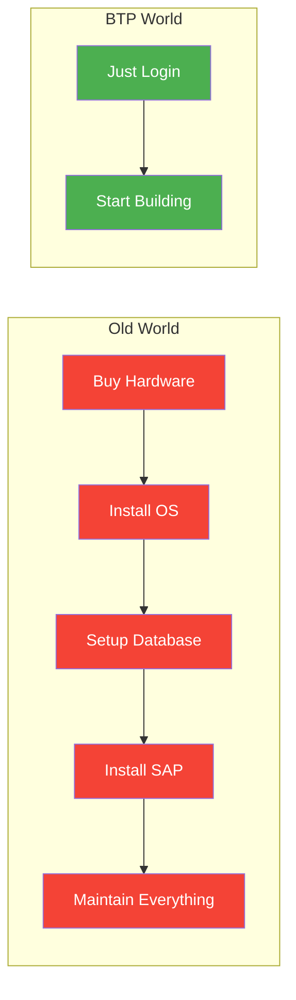
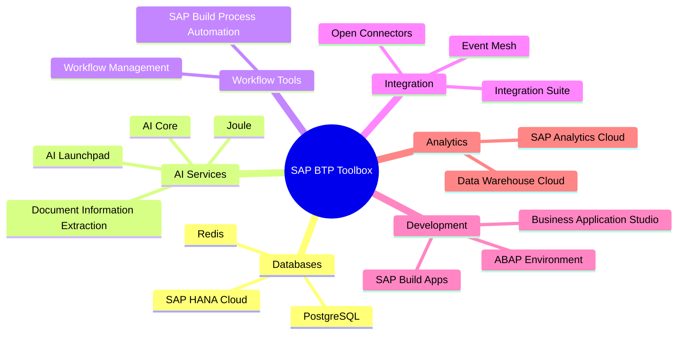
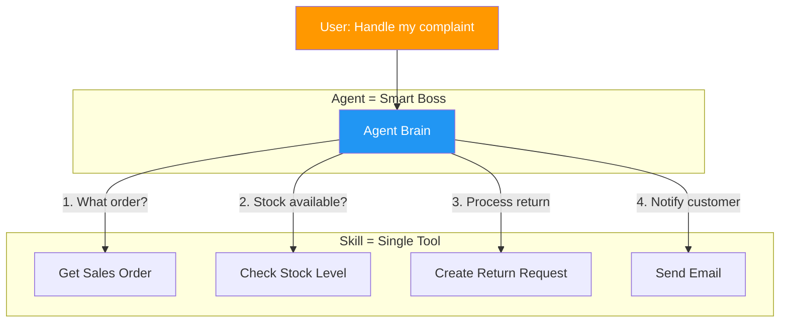
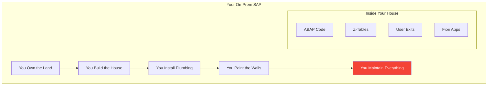
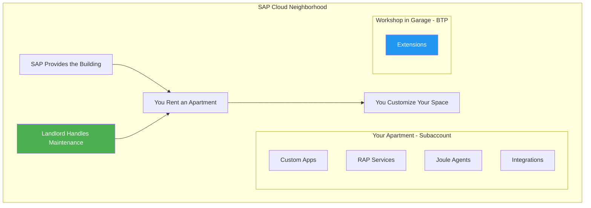
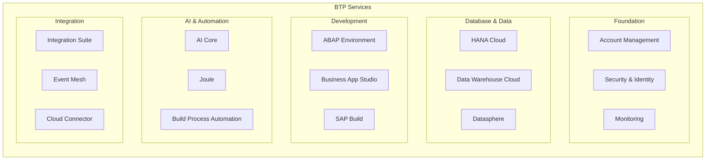

# Chapter 1: What Even Is SAP BTP?

> *The Big Picture – Super Simple*

---

## 1.1 The Cloud Toolbox Concept

Imagine SAP BTP as a **huge cloud toolbox** where companies can build, run, and connect modern apps without buying 50 servers.

In the old world, you wanted to extend SAP? You needed:
- Hardware (servers, storage, networking)
- Operating systems
- Database licenses
- A team to maintain everything
- Weeks or months to set up

With BTP, SAP says: *"Here's a ready-to-use cloud platform. Just log in and start building."*

It's like the difference between:
- **Old way**: Buying land, hiring architects, building a house from scratch
- **BTP way**: Renting a fully furnished apartment in a well-managed building

You focus on *what* you want to build, not *how* to set up infrastructure.

---

## 1.2 What's Inside: Databases, AI, Workflows, and Integrations

Inside this toolbox, you get:

| Category | What It Includes | Old-World Equivalent |
|----------|------------------|---------------------|
| **Databases** | SAP HANA Cloud, PostgreSQL | Your on-prem HANA or Oracle |
| **AI Services** | AI Core, AI Launchpad, Joule | Nothing comparable! |
| **Workflow Tools** | SAP Build Process Automation | Workflow in S/4 |
| **Integration** | Integration Suite, Event Mesh | PI/PO, CPI |
| **Development** | ABAP Environment, BAS | SE80, Eclipse |
| **Analytics** | SAP Analytics Cloud | BW, BOBJ |

You don't have to use everything. Pick what you need, like choosing tools from a toolbox.

---

## 1.3 Where Joule Fits In – SAP's AI Assistant

**Joule** is SAP's AI assistant—think of it as a company-specific ChatGPT + Copilot that:

- Lives inside SAP apps (S/4HANA, SuccessFactors, Ariba, etc.)
- Understands SAP data and processes
- Can be extended with custom **skills** and **agents**

### Skills vs. Agents: Quick Preview

| Concept | What It Is | Example |
|---------|------------|---------|
| **Skill** | One specific superpower | "Look up sales order status" |
| **Agent** | A smart boss that decides which skills to use | "Help me handle a customer complaint" → uses multiple skills |

An agent might:
1. Look up order (Skill A)
2. Check stock (Skill B)
3. Create return request (Skill C)
4. Send apology email (Skill D)

You build skills first, then give them to an agent so it can reason and chain them.

*We'll dive deep into Joule in Part IV.*

---

## 1.4 The Old House vs. The New Neighborhood

Here's an analogy that helps ABAP developers understand the mindset shift:

### The Old House: Classic On-Prem SAP

- You (or the customer) **own the land**
- You **build the house** (hardware)
- You **install plumbing/electricity** (infrastructure)
- You **paint the walls** (apply support packs)
- You **maintain everything** (basis team runs upgrades, backups, monitoring)
- Your ABAP code lives **inside the house walls** (modifications, user exits)
- Fiori apps are like **fancy windows** added later

**Pain points**: Slow upgrades, hardware costs, downtime for maintenance.

### The New Neighborhood: BTP Cloud

- SAP provides the **fully built building**
- You **rent an apartment** (subaccount)
- Maintenance is **handled by the landlord** (SAP manages infrastructure)
- You can **customize your apartment** (build apps, extensions)
- But you **can't knock down load-bearing walls** (Clean Core concept)
- You **add a workshop in the garage** (BTP for extensions instead of modifying core)

**Benefits**: Faster innovation, no infrastructure worries, forced best practices.

---

## 1.5 BTP Service Categories

---

## Key Takeaways

1. **BTP is a cloud platform** — Not a single product, but a toolbox
2. **It replaces infrastructure work** — You focus on building, not maintaining servers
3. **Joule is the AI layer** — Skills + Agents for intelligent automation
4. **Mindset shift required** — From owning everything to renting and extending

---

## What's Next?

Now that you know *what* BTP is, let's look at *how it's organized*. In the next chapter, we'll explore the BTP architecture using the apartment building analogy.

---

*[Previous: Preface](00-preface.md) | [Next: Chapter 2 – The BTP Architecture](02-btp-architecture.md)*

*[Back to Table of Contents](../content.md)*

---

**Author:** [Beyhan Meyrali](https://www.linkedin.com/in/beyhanmeyrali) — SAP Storyteller & Digital Transformation Advocate

*Created with ❤️ for SAP learners worldwide*
