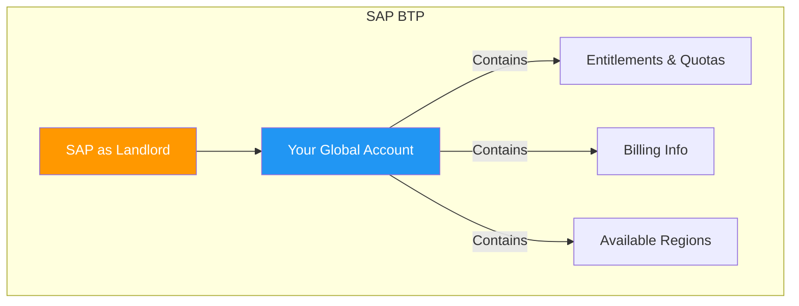
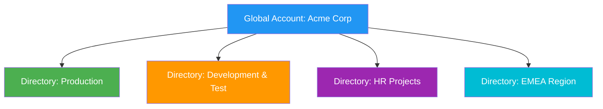
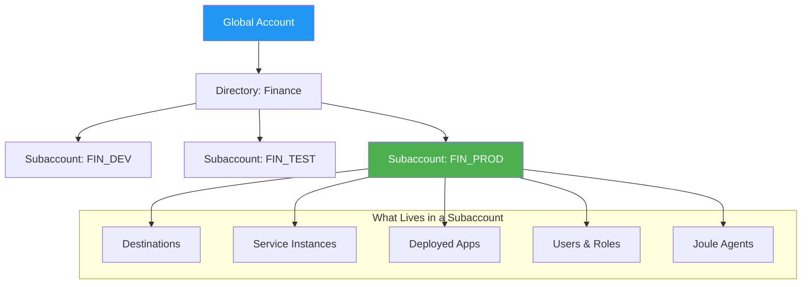
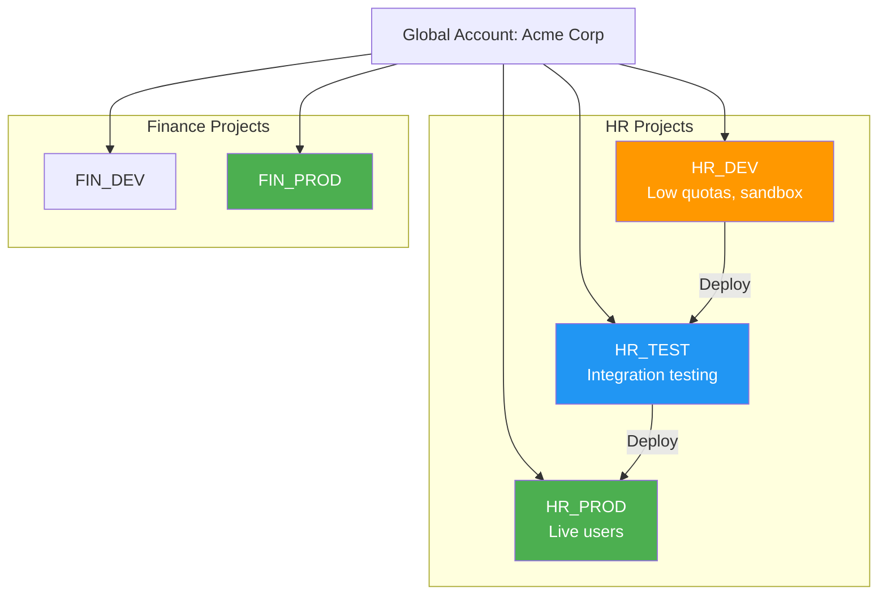
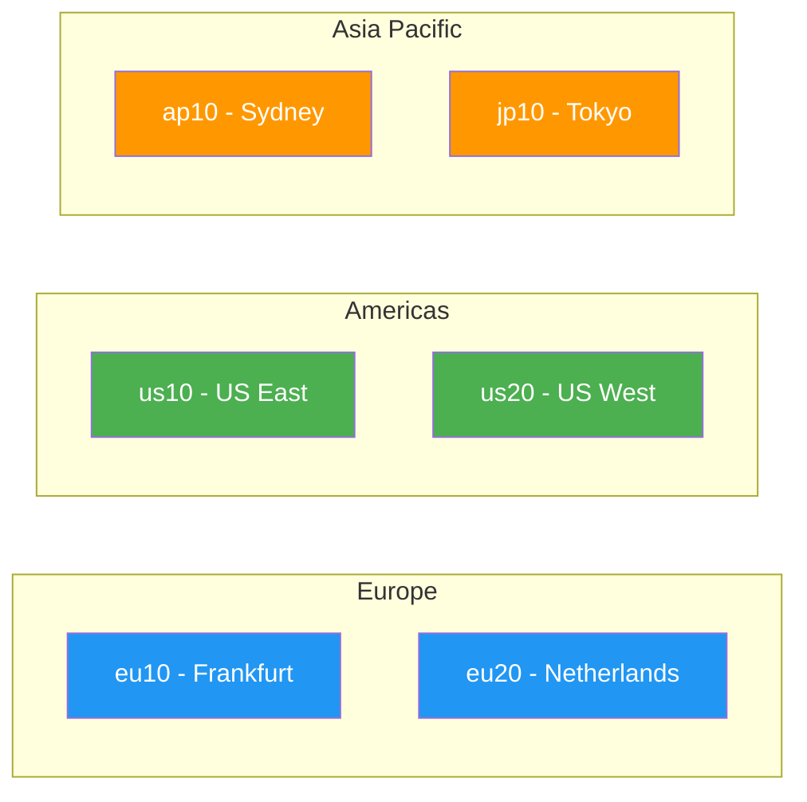
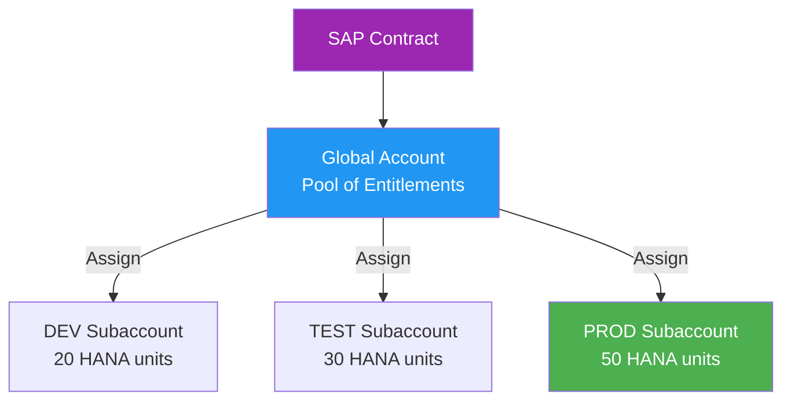
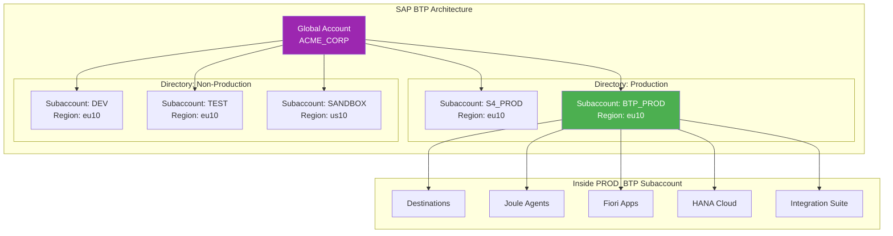
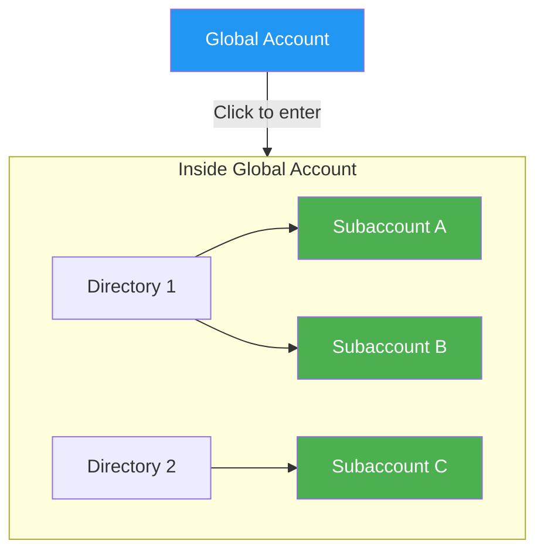

# Chapter 2: The BTP Architecture

> *Your New Apartment Building*

---

Imagine SAP BTP is a **massive apartment building** owned by SAP. You (or your company) rent space in it. Let's explore each level.

---

## 2.1 Global Account – Your Lease Contract with SAP

When you sign up for SAP BTP (trial or paid), SAP gives you one **Global Account**.



This is basically **your name on the building's lease agreement**. It knows:

- ✅ How much you're allowed to use (quotas, entitlements)
- ✅ How you're billed
- ✅ Which regions (data centers) you can use

You normally have **only one global account per company** (sometimes more for very large orgs or separate contracts).

> **Think**: *"This is Acme Corp's official contract folder with SAP."*

### In the BTP Cockpit

When you log in, you see your Global Account at the top level. Everything else is nested inside it.

**URL Pattern:** `https://cockpit.btp.cloud.sap/cockpit/?idp=...`

---

## 2.2 Directories – Organizing Floors (Optional)

You can create **Directories** inside your global account to organize things logically.



Examples:
- One directory called **"Production"**
- One called **"Development & Test"**
- One called **"HR Projects"**
- One called **"EMEA Region"**

Directories are **just folders** to group subaccounts. They're optional—you can skip them and put everything directly under the global account.

> **Analogy**: Floors in the building labeled by purpose or team.

---

## 2.3 Subaccounts – Your Actual Apartments

Here's where the real work happens!



A **Subaccount** is the place where you actually do things:

- ✅ Create apps
- ✅ Enable services (Joule, destinations, databases, AI Core, etc.)
- ✅ Deploy skills, agents, destinations
- ✅ Manage users & roles
- ✅ Choose a region (e.g., Europe Frankfurt, US East)
- ✅ Get separate quotas

### Key Point: Isolation

Each subaccount is **almost completely isolated** from the others—even if they're under the same global account.

This is powerful for:

| Use Case | Why Isolation Helps |
|----------|---------------------|
| **Dev vs Test vs Prod** | A broken test app can't crash production |
| **Different teams/projects** | HR team won't accidentally mess with Finance |
| **Different regions** | EU data stays in EU (GDPR compliance) |
| **Cost control** | See exactly what each project consumes |
| **Security** | Revoke access to one subaccount without affecting others |

---

## 2.4 Why Isolation Matters: Dev vs. Test vs. Prod

In classic SAP, you had separate systems (development, quality, production) with transport paths between them.

In BTP, **subaccounts serve a similar purpose**:



Each subaccount has its own:
- Destinations (pointing to different backends)
- User assignments
- Service instances
- Deployed applications

---

## 2.5 Regions, Compliance, and Data Residency

When you create a subaccount, you **choose a region** (data center location):



| Region | Location | Common Use |
|--------|----------|------------|
| `eu10` | Frankfurt, Germany | EU customers, GDPR |
| `eu20` | Netherlands | EU backup |
| `us10` | US East (Virginia) | US customers |
| `ap10` | Sydney | APAC customers |
| `jp10` | Tokyo | Japan customers |

**Why this matters**:
- GDPR requires EU citizen data to stay in EU
- Some industries have data residency requirements
- Network latency considerations

---

## 2.6 Entitlements & Quotas – How Much You Can Use

**Entitlements** = What services you're *allowed* to use
**Quotas** = How *much* of each service you can use



Think of it like a buffet:
- **Entitlements**: Which dishes you're allowed to take (included in your plan)
- **Quotas**: How many plates of each dish (limits)

### How Entitlements Flow

```
SAP Contract → Global Account (pool of entitlements)
                    ↓
              Assign to Subaccounts
                    ↓
              Each subaccount gets a portion
```

For example:
- Global Account has 100 HANA units
- DEV subaccount gets 20 units
- TEST subaccount gets 30 units
- PROD subaccount gets 50 units

### Viewing Entitlements

In BTP Cockpit:
1. Go to your Global Account
2. Click **Entitlements** → **Entity Assignments**
3. See what's assigned where

---

## 2.7 The Complete Picture



---

## Quick Building Analogy Summary

| BTP Concept | Building Analogy |
|-------------|------------------|
| **Global Account** | The lease / ownership papers |
| **Directory** | A labeled floor (optional organizer) |
| **Subaccount** | One actual apartment |
| **Region** | Which building location (city) |
| **Entitlements** | What appliances you're allowed to have |
| **Quotas** | How many of each appliance |

---

## The BTP Cockpit View



**Most of your time** (95%+) is spent inside a subaccount—that's where the action happens:
- Creating destinations
- Building skills
- Deploying agents
- Managing users

---

## Real-World Example: Accessing BTP Cockpit

```
1. Open browser
2. Navigate to: https://cockpit.btp.cloud.sap
3. Log in with your SAP Universal ID
4. Select your Global Account
5. Navigate to your Subaccount
6. You're in!
```

---

## Key Takeaways

1. **Global Account** = Your contract with SAP (one per company usually)
2. **Directories** = Optional folders to organize (by team, region, purpose)
3. **Subaccounts** = Where you actually work (isolated environments)
4. **Regions** = Data center location (compliance + performance)
5. **Entitlements/Quotas** = What you can use and how much

---

## What's Next?

Now you understand the BTP structure. But how does this relate to **RISE with SAP**? That's what's confusing many old-school SAP folks. Let's demystify it.

---

*[Previous: Chapter 1 – What Is SAP BTP?](01-what-is-sap-btp.md) | [Next: Chapter 3 – RISE with SAP Demystified](03-rise-with-sap.md)*

*[Back to Table of Contents](../content.md)*

---

**Author:** [Beyhan Meyrali](https://www.linkedin.com/in/beyhanmeyrali) — SAP Storyteller & Digital Transformation Advocate

*Created with ❤️ for SAP learners worldwide*
