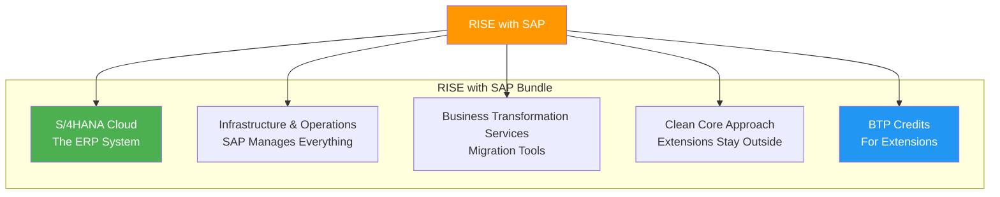
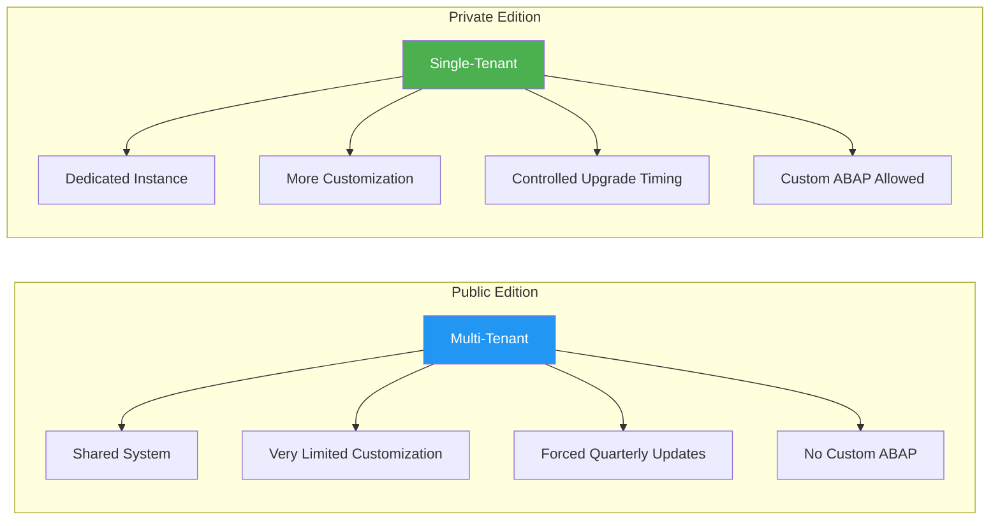
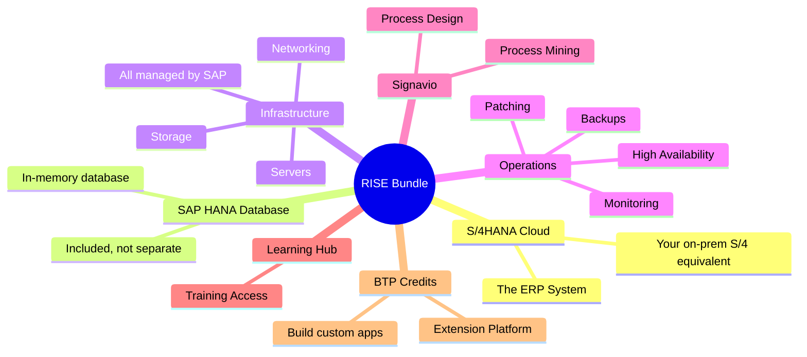
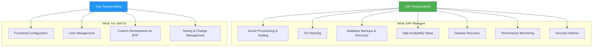
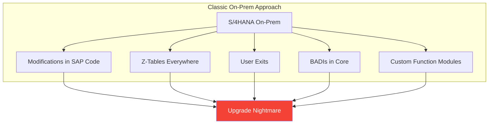
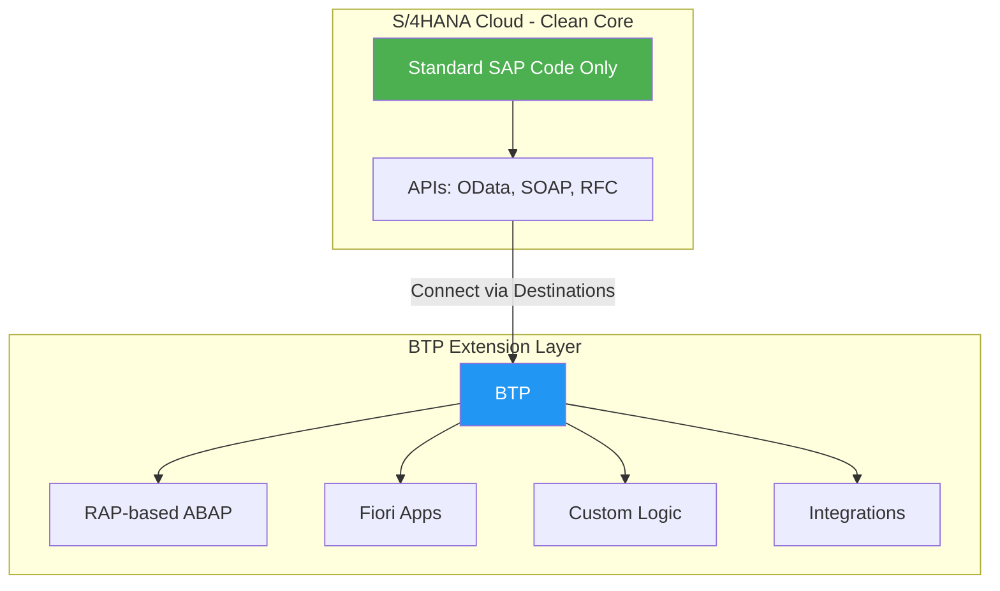
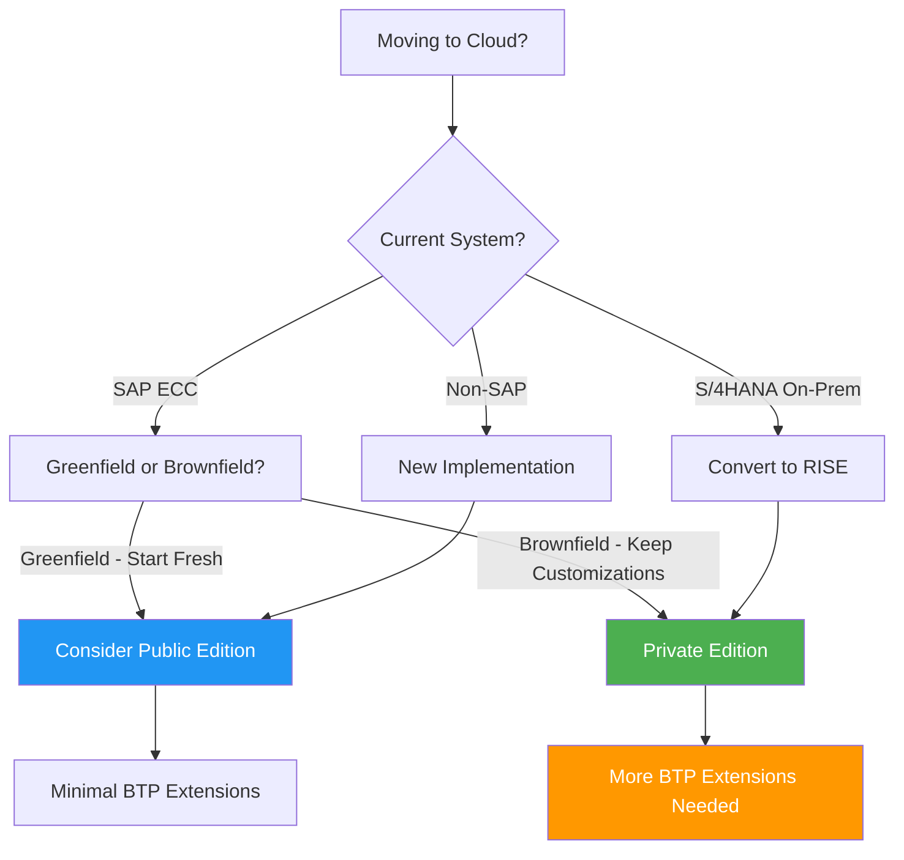

# Chapter 3: RISE with SAP Demystified

> *It's Not a Product—It's a Package!*

---

This is the concept that confuses the most ABAP developers. Let's break it down clearly.

---

## 3.1 What RISE Actually Is (It's Not a Product!)

**RISE with SAP** is NOT a separate product or platform.

It's a **complete bundled offering**—a "transformation package" from SAP that helps move your business to the cloud with **S/4HANA as the core**.

> **Think of RISE as**: SAP saying, *"Stop worrying about building and maintaining the house. We'll give you a ready-made, modern cloud house (S/4HANA Cloud), fully managed by us, plus tools to renovate it intelligently."*

### What RISE Includes

1. **SAP S/4HANA Cloud** (the ERP system itself)
2. **Infrastructure & Operations** (SAP manages everything)
3. **Business Transformation Services** (tools to help you migrate)
4. **Clean Core Approach** (extensions stay outside the core)
5. **BTP Credits** (to build extensions)

---

## 3.2 S/4HANA Cloud Private Edition vs. Public Edition

This is where old ABAPers get confused. There are two flavors:

### Public Edition (Multi-Tenant)

- SAP runs one big system, you get a "slice" (tenant)
- Very limited customization
- Quarterly updates forced on you
- Good for: Standard processes, smaller companies

### Private Edition (Single-Tenant)

- You get your own dedicated S/4HANA instance
- More customization possible (feels closer to on-prem)
- You control upgrade timing (within limits)
- Custom ABAP code can run (with restrictions)
- Good for: Large enterprises with specific needs

> **For ABAP developers**: Private Edition is usually what you'll encounter in RISE projects because it allows more customization.

### Comparison Table

| Aspect | Public Edition | Private Edition |
|--------|---------------|-----------------|
| Tenancy | Multi-tenant (shared) | Single-tenant (dedicated) |
| Customization | Very limited | More flexible |
| Custom ABAP | None | Allowed (with guidelines) |
| Upgrades | Forced quarterly | Controlled timing |
| Typical customer | SMB, greenfield | Large enterprise, brownfield |

---

## 3.3 The RISE Bundle: What's Included

When a customer signs a RISE contract, they get:

| Component | What It Is | Old-World Equivalent |
|-----------|------------|---------------------|
| **S/4HANA Cloud** | The ERP system | Your on-prem S/4 or ECC |
| **SAP HANA Database** | In-memory database | Your HANA/Oracle/DB2 |
| **Infrastructure** | Servers, storage, networking | Your data center |
| **Operations** | Patching, backups, monitoring | Your Basis team |
| **Signavio** | Process mining & design | N/A |
| **Learning Hub** | Training access | N/A |
| **BTP Credits** | Extension platform | Separate purchase before |

---

## 3.4 Infrastructure & Operations – Say Goodbye to Basis Worries

One of the biggest changes for old SAP shops:

### What SAP Manages in RISE

- ✅ Server provisioning and scaling
- ✅ Operating system patching
- ✅ Database backups and recovery
- ✅ High availability setup
- ✅ Disaster recovery
- ✅ Performance monitoring
- ✅ Security patches

### What You Still Do

- ✅ Functional configuration (transactions, master data)
- ✅ User management
- ✅ Custom development (in BTP, not core)
- ✅ Testing and change management

> **For Basis teams**: Your role shifts from "keeping servers alive" to "architecture and governance."

---

## 3.5 The Clean Core Promise

This is the fundamental mindset shift:

### Old World: Modify Everything

Problems:
- Upgrades become nightmares
- Support is complicated
- Testing takes forever

### RISE World: Keep Core Clean

### What "Clean Core" Means Practically

| Allowed | Not Allowed |
|---------|-------------|
| Using released APIs | Modifying standard code |
| Key User extensibility | Custom dictionary objects in S/4 |
| Side-by-side extensions (BTP) | Unreleased function modules |
| Custom CDS views (released objects) | Direct table modifications |

We'll dive deeper into Clean Core implications in Chapter 17.

---

## 3.6 RISE Decision Flowchart

---

## Key Takeaways

1. **RISE is a bundle, not a product** — S/4HANA + infrastructure + services + BTP credits
2. **Private Edition** is for enterprises needing customization
3. **SAP manages infrastructure** — your Basis role changes
4. **Clean Core is mandatory** — extensions go to BTP, not into S/4 core
5. **BTP credits are included** — use them for custom development

---

## What's Next?

Now let's see exactly how RISE and BTP connect. What does "BTP extension wing" actually look like when you're developing?

---

*[Previous: Chapter 2 – BTP Architecture](02-btp-architecture.md) | [Next: Chapter 4 – How RISE and BTP Fit Together](04-rise-and-btp.md)*

*[Back to Table of Contents](../content.md)*

---

**Author:** [Beyhan Meyrali](https://www.linkedin.com/in/beyhanmeyrali) — SAP Storyteller & Digital Transformation Advocate

*Created with ❤️ for SAP learners worldwide*
