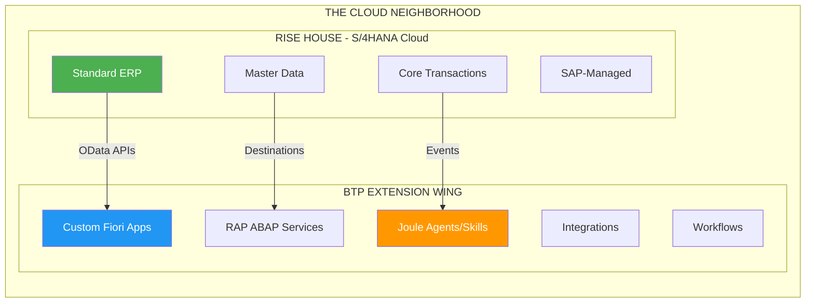
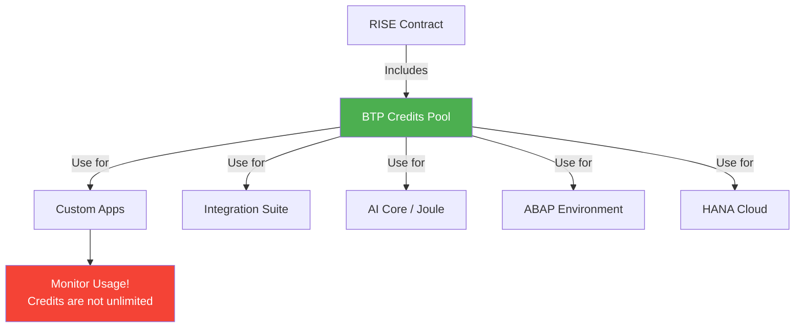
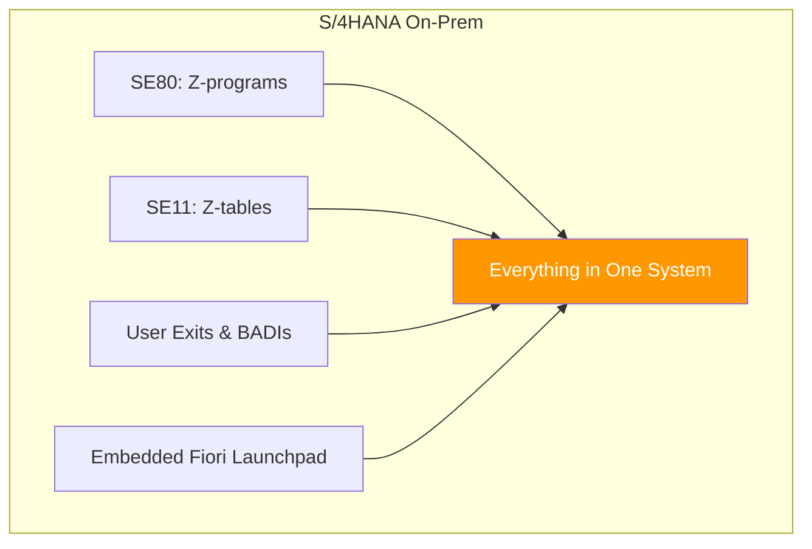
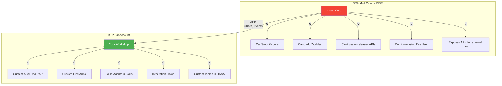
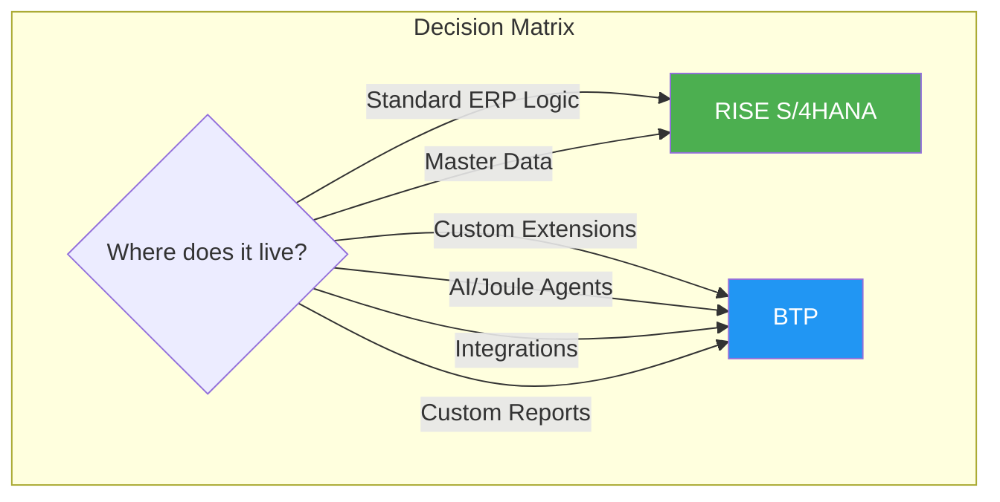
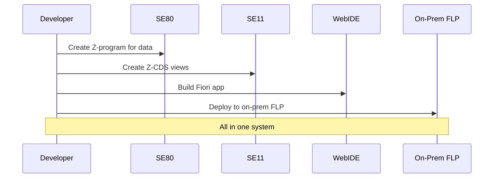
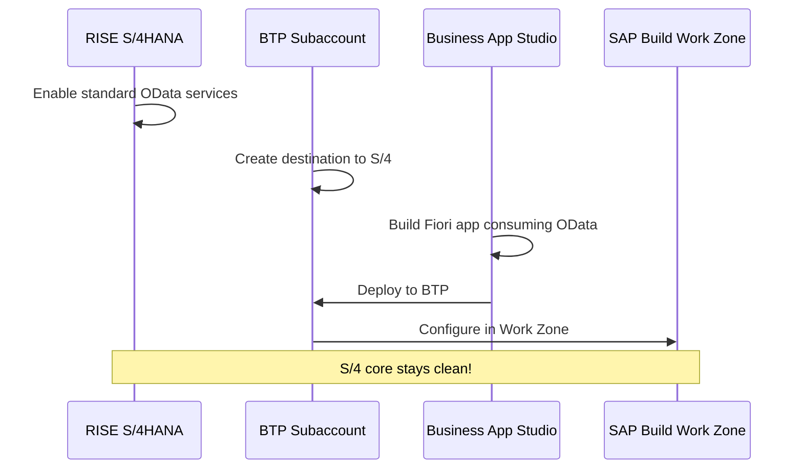
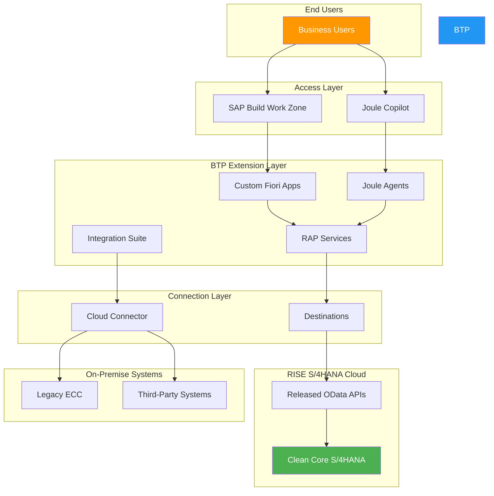

# Chapter 4: How RISE and BTP Fit Together

> *The Neighborhood View*

---

## 4.1 The Neighborhood View: RISE House + BTP Extension Wing

Here's the picture that makes it click:

- **RISE** = The fully managed S/4HANA cloud house (the ERP core)
- **BTP** = The flexible extension wing/garage/workshop
- **Destinations** = The bridge connecting them

They're **designed to work together tightly**:
- A custom Fiori app in BTP pulls data from S/4 via OData
- A Joule skill reads sales orders from RISE S/4
- An integration flow in BTP connects RISE to external systems

---

## 4.2 BTP Credits in RISE Contracts

Here's something many don't realize:

> Every RISE contract includes **BTP credits** (like free fuel vouchers) for building extensions.

### What You Get

- A dedicated BTP subaccount (often called "BTP for RISE")
- Entitlements for common services (depends on contract)
- Credits to consume BTP services

### Typical Included Services

| Service | What For |
|---------|----------|
| SAP Build (Work Zone, Apps, PA) | Low-code development |
| Integration Suite | Connect systems |
| ABAP Environment | Cloud ABAP development |
| AI Core / Joule | AI capabilities |
| HANA Cloud | Additional databases |

### Watch Out

Credits aren't unlimited. High-consumption services (like AI and large HANA instances) can burn through credits fast. Monitor usage!

---

## 4.3 The New Reality for ABAP/Fiori Developers

Let's be concrete about what changes:

### Old World (On-Prem S/4)

### RISE World

### What This Means Day-to-Day

| Task | Old Way | RISE + BTP Way |
|------|---------|----------------|
| Add custom field | Append structure in SE11 | Key User extensibility or BTP |
| Custom report | SE38 program | RAP in BTP ABAP Env → Fiori app |
| Custom table | SE11 in S/4 | HANA Cloud table in BTP |
| Complex logic | Function module in core | Service in BTP, call via API |
| Fiori extension | Extend in WebIDE, deploy to FLP | Extend in BAS, deploy to BTP |

---

## 4.4 Comparison Table: Classic On-Prem vs. RISE vs. BTP

| Aspect | Classic On-Prem | RISE (S/4 Cloud) | BTP (Extensions) |
|--------|-----------------|-------------------|-------------------|
| **Who manages infra?** | Your Basis team | SAP | SAP |
| **S/4HANA version** | You control | SAP delivers updates | N/A |
| **Custom ABAP** | Full freedom (risky) | Clean Core only | RAP in ABAP Env |
| **Fiori apps** | Deploy to on-prem FLP | Embedded FLP | Build/deploy in BAS |
| **Extensions location** | Inside S/4 | Outside (BTP) | This is BTP! |
| **Cost model** | Hardware + licenses | Subscription | Credits/consumption |
| **Typical for...** | Legacy SAP shops | Cloud transformation | All custom work |

---

## 4.5 Practical Example: Customer Wants a Custom Dashboard

### Old Way (On-Prem)

### RISE + BTP Way

The dashboard **looks the same** to users, but the architecture is fundamentally different.

---

## 4.6 The Complete Architecture Picture

---

## 4.7 Real-World URL Examples

When working with RISE + BTP, you'll encounter these URL patterns:

| System | URL Pattern | Example |
|--------|-------------|---------|
| **BTP Cockpit** | `cockpit.btp.cloud.sap` | `https://cockpit.btp.cloud.sap/cockpit/?idp=...` |
| **S/4HANA Cloud** | `my{number}.s4hana.ondemand.com` | `https://my300001.s4hana.ondemand.com` |
| **Business App Studio** | `{region}.applicationstudio.cloud.sap` | `https://eu10.applicationstudio.cloud.sap` |
| **Joule Studio** | `joule-studio-{region}.cfapps.{region}.hana.ondemand.com` | `https://joule-studio-eu10.cfapps.eu10.hana.ondemand.com` |
| **OData Service** | `{s4_url}/sap/opu/odata/sap/{service}` | `https://my300001.s4hana.ondemand.com/sap/opu/odata/sap/API_SALES_ORDER_SRV` |

---

## Key Takeaways

1. **RISE is the managed ERP core** — S/4HANA with SAP handling infrastructure
2. **BTP is the extension platform** — where your custom work lives
3. **They connect via APIs** — Destinations bridge the two
4. **RISE includes BTP credits** — use them for extensions
5. **Your skills transfer** — ABAP is still ABAP, just in a new location

---

## What's Next?

You understand the big picture of RISE + BTP. Now let's get practical. In Part III, we'll dive into the core BTP concepts you'll use daily, starting with **Destinations**—the critical bridge between systems.

---

*[Previous: Chapter 3 – RISE with SAP](03-rise-with-sap.md) | [Next: Chapter 5 – Destinations](05-destinations.md)*

*[Back to Table of Contents](../content.md)*

---

**Author:** [Beyhan Meyrali](https://www.linkedin.com/in/beyhanmeyrali) — SAP Storyteller & Digital Transformation Advocate

*Created with ❤️ for SAP learners worldwide*
