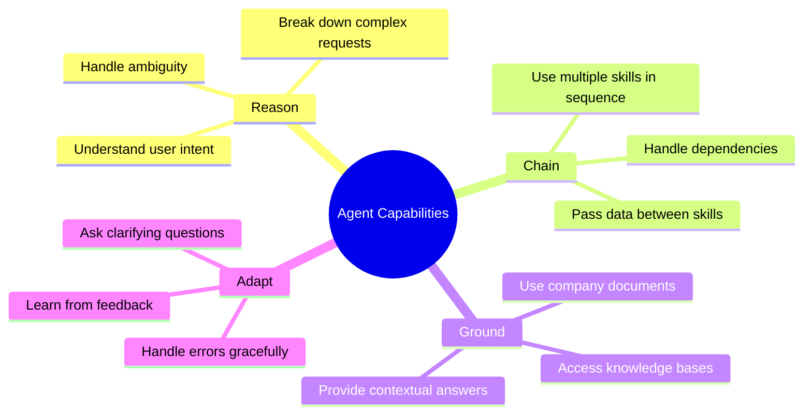
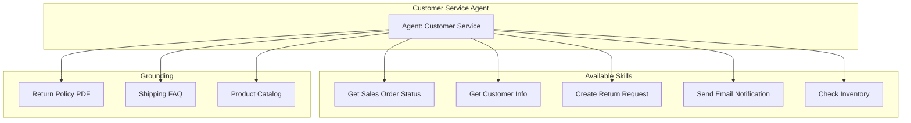
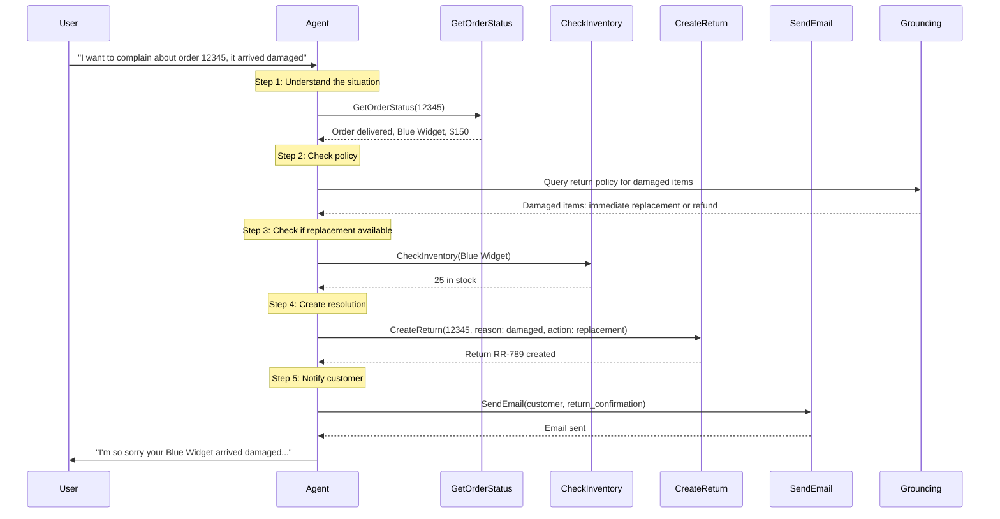
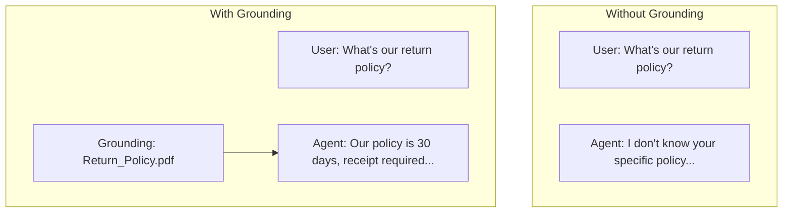
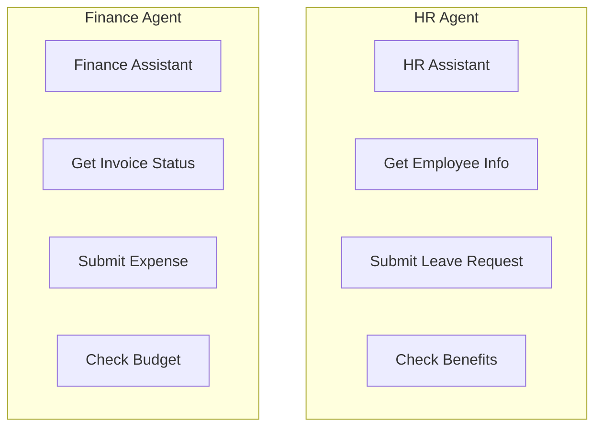
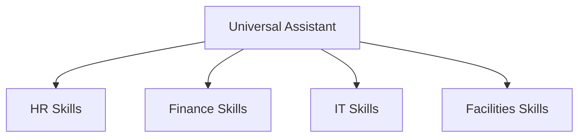
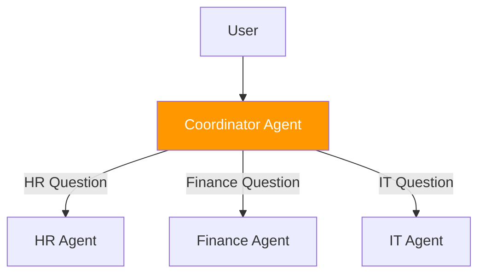

# Chapter 10: Building Joule Agents

> *The Smart Boss That Chains Skills*

---

You've built skills. Now let's build an agent that orchestrates them—making intelligent decisions about which skills to use and when.

---

## 10.1 What Makes an Agent "Smart"

An agent is more than a collection of skills. It can:



### Agent vs. Simple Chatbot

| Feature | Simple Chatbot | Joule Agent |
|---------|----------------|-------------|
| **Understanding** | Keyword matching | Semantic understanding |
| **Actions** | Pre-defined flows | Dynamic skill selection |
| **Multi-step** | Hard-coded sequences | Reasoning-based chaining |
| **Context** | Session only | Grounded in documents |
| **Errors** | Generic messages | Intelligent recovery |

---

## 10.2 Building Your First Agent

### Scenario: Customer Service Agent

We'll build an agent that handles customer inquiries about orders:



### Step 1: Create Agent in Joule Studio

1. Open **Joule Studio**
2. Click **Create Agent**
3. Fill in details:

```yaml
Agent Name: Customer Service Assistant
Description: Handles customer inquiries about orders, returns, and shipping

Agent Purpose: |
  You are a customer service assistant for ACME Corp.
  Help customers with:
  - Order status inquiries
  - Return and exchange requests
  - Shipping questions
  - Product availability

Tone: Friendly, professional, helpful
```

### Step 2: Assign Skills to Agent

1. Go to **Skills** tab
2. Click **Add Skill**
3. Add these skills:

| Skill | When to Use |
|-------|-------------|
| Get Sales Order Status | Customer asks about order status |
| Get Customer Info | Need customer details for context |
| Create Return Request | Customer wants to return/exchange |
| Send Email Notification | Need to send confirmation |
| Check Inventory | Customer asks about availability |

### Step 3: Write Agent Instructions

This is the most important part—teaching the agent HOW to behave:

```markdown
# Customer Service Agent Instructions

## Your Role
You are a customer service representative for ACME Corp.
Always be helpful, polite, and solution-oriented.

## Decision Making

### When customer asks about an order:
1. Ask for order number if not provided
2. Use "Get Sales Order Status" skill
3. Present status in friendly language:
   - "A" (Not delivered) → "Your order is being prepared for shipment"
   - "B" (Partial) → "Part of your order has shipped"
   - "C" (Complete) → "Your order has been delivered"

### When customer wants to return:
1. Look up the order first
2. Check return policy grounding document
3. If eligible, use "Create Return Request" skill
4. Send confirmation email with "Send Email Notification"

### When customer asks about availability:
1. Use "Check Inventory" skill
2. If in stock, confirm availability
3. If out of stock, provide estimated restock date

## Response Guidelines

### Always:
- Start with acknowledging the customer's concern
- Be specific with dates, numbers, tracking info
- Offer next steps or alternatives
- End with "Is there anything else I can help with?"

### Never:
- Make promises you can't keep
- Share other customers' information
- Guess if you don't know—ask for clarification

## Example Conversations

### Example 1: Order Status
Customer: "Where's my order?"
You: "I'd be happy to help you track your order. Could you please provide your order number?"
Customer: "It's 12345"
[Use Get Sales Order Status skill]
You: "I found your order #12345. Great news—it was delivered on January 20th to 123 Main St. The tracking shows it was signed for by J. Smith. Is there anything else I can help with?"

### Example 2: Return Request
Customer: "I want to return order 67890"
[Use Get Sales Order Status skill first]
You: "I see order #67890 was for a Blue Widget, delivered 5 days ago. Our return policy allows returns within 30 days, so you're all set! Let me start that return for you."
[Use Create Return Request skill]
You: "Done! I've created return request RR-456. You'll receive an email with a prepaid shipping label within the hour. Just drop it off at any UPS location. Anything else?"
```

---

## 10.3 Multi-Step Reasoning and Chaining

Here's how the agent chains skills for complex requests:

### Example: "Handle complaint for order 12345"



### The Agent's Internal Reasoning

```
User: "I want to complain about order 12345, it arrived damaged"

ANALYSIS:
- Intent: Complaint about damaged item
- Order number: 12345
- Issue: Damaged in transit

PLAN:
1. Look up order details to understand what was ordered
2. Check our policy on damaged items
3. Determine resolution options
4. Execute the best resolution
5. Confirm with customer

EXECUTION:
Step 1: GetOrderStatus(12345)
  Result: Blue Widget, $150, delivered Jan 20

Step 2: Check grounding - damaged items policy
  Result: "Damaged items eligible for immediate replacement or full refund"

Step 3: CheckInventory(Blue Widget)
  Result: 25 in stock - replacement available

Step 4: CreateReturn(order: 12345, reason: "damaged", action: "replacement")
  Result: Return RR-789 created, replacement shipping today

Step 5: SendEmail(type: "damage_resolution", to: customer)
  Result: Email sent

RESPONSE:
"I'm so sorry your Blue Widget arrived damaged. I've taken care of this for you:
- Created return RR-789 for the damaged item
- A replacement Blue Widget is shipping today
- You'll receive a prepaid label to return the damaged one

You should receive your replacement within 2-3 business days.
Is there anything else I can help with?"
```

---

## 10.4 Grounding Agents on Company Documents

### What Is Grounding?

Grounding gives the agent specific knowledge about your company:



### Setting Up Grounding

1. In Joule Studio, go to your agent
2. Click **Grounding** tab
3. Click **Add Document**

**Supported formats:**
- PDF files
- Word documents
- Text files
- Web URLs

### Example Grounding Documents

**Return Policy (Return_Policy.pdf):**
```markdown
# ACME Corp Return Policy

## Standard Returns
- Returns accepted within 30 days of delivery
- Original receipt or order confirmation required
- Items must be unused and in original packaging
- Refund to original payment method within 5-7 business days

## Damaged Items
- Report within 48 hours of delivery
- Photo evidence helpful but not required
- Immediate replacement or full refund offered
- No return shipping cost to customer

## Non-Returnable Items
- Custom or personalized items
- Clearance items marked "Final Sale"
- Items used or missing original packaging

## Process
1. Customer contacts support
2. Return authorization created
3. Prepaid shipping label provided
4. Refund processed within 48 hours of receiving item
```

**Shipping FAQ (Shipping_FAQ.pdf):**
```markdown
# Shipping Information

## Delivery Times
- Standard: 5-7 business days
- Express: 2-3 business days
- Next Day: Order by 2 PM for next business day

## Shipping Costs
- Free standard shipping on orders over $50
- Express: $9.99
- Next Day: $19.99

## Tracking
- All orders include tracking
- Tracking email sent when order ships
- Track at: tracking.acme.com

## International
- We ship to US and Canada only
- International orders: 10-14 business days
- Customs fees are customer responsibility
```

### Using Grounding in Agent Instructions

```markdown
## Using Your Knowledge Base

When answering policy questions:
1. ALWAYS check the grounding documents first
2. Quote specific policies when relevant
3. If information isn't in documents, say "Let me check on that" rather than guessing

Example:
User: "How long do I have to return something?"
[Check Return_Policy.pdf]
You: "You have 30 days from delivery to return items. They need to be unused and in original packaging. Would you like to start a return?"
```

---

## 10.5 Agent Design Patterns

### Pattern 1: The Specialist

One agent, one domain:



**Pros:** Focused, easier to train, clearer boundaries
**Cons:** Users need to know which agent to use

### Pattern 2: The Generalist

One agent, multiple domains:



**Pros:** Single entry point, handles routing
**Cons:** More complex instructions, potential confusion

### Pattern 3: The Coordinator

Master agent routes to specialists:



**Pros:** Clean separation, specialized handling
**Cons:** More complex setup

---

## 10.6 Testing Your Agent

### Test Scenarios Checklist

Create test scenarios covering:

```yaml
Test Scenarios:
  Happy Path:
    - Simple order status inquiry
    - Straightforward return request
    - Product availability check

  Edge Cases:
    - Order number doesn't exist
    - Return policy exception (final sale item)
    - Out of stock situation

  Ambiguous Requests:
    - "I have a problem with my order"
    - "Help"
    - "I'm not happy"

  Multi-Step:
    - Complex complaint handling
    - Order + return + question about shipping
    - Multiple orders for same customer

  Error Handling:
    - Backend API down
    - Missing required information
    - User provides invalid input
```

### Test Script Example

```markdown
## Test Case: TC-001 Order Status Happy Path

**Input:** "What's the status of order 12345?"

**Expected Behavior:**
1. Agent recognizes order status intent
2. Calls GetOrderStatus skill with "12345"
3. Formats response with delivery status
4. Offers further assistance

**Expected Response Pattern:**
"Order #12345... [status details]... Is there anything else?"

**Pass Criteria:**
- ✅ Correct skill invoked
- ✅ Order details accurate
- ✅ Friendly tone
- ✅ Offers further help
```

---

## 10.7 Agent Best Practices

### 1. Start Simple, Expand Gradually


### 2. Clear Skill Boundaries

Make each skill's purpose distinct:

| Skill | Clear Purpose | NOT Overlapping |
|-------|--------------|-----------------|
| GetOrderStatus | Fetch order info | Don't also create returns |
| CreateReturn | Create return | Don't also send emails |
| SendEmail | Send notifications | Don't also lookup data |

### 3. Explicit Instructions

```markdown
# Good ✅
When the customer asks about an order:
1. Ask for order number if not provided
2. Call GetOrderStatus with the order number
3. If status is "C", say "delivered"
4. If status is "A", say "being prepared"

# Bad ❌
Handle order questions appropriately.
```

### 4. Handle Failures Gracefully

```markdown
## Error Handling

If GetOrderStatus fails:
- Say: "I'm having trouble looking up that order right now.
       Let me try again in a moment."
- Retry once
- If still failing: "I apologize, our order system is experiencing
       issues. Please try again in a few minutes or call 1-800-ACME."

If order not found:
- Say: "I couldn't find order #[number]. Could you double-check
       the number? It should be 5-10 digits."
```

---

## Key Takeaways

1. **Agents orchestrate skills** — They decide what to do and when
2. **Instructions are critical** — Detailed instructions = better behavior
3. **Grounding adds knowledge** — Company-specific context matters
4. **Test thoroughly** — Happy path + edge cases + errors
5. **Start simple** — Add complexity gradually
6. **Clear boundaries** — Each skill should do one thing well

---

## What's Next?

Your agent is built. Now let's deploy it across environments—from development to production—and manage its lifecycle.

---

*[Previous: Chapter 9 – Building Your First Joule Skill](09-first-joule-skill.md) | [Next: Chapter 11 – Agent Lifecycle & Deployment](11-agent-lifecycle.md)*

*[Back to Table of Contents](../content.md)*

---

**Author:** [Beyhan Meyrali](https://www.linkedin.com/in/beyhanmeyrali) — SAP Storyteller & Digital Transformation Advocate

*Created with ❤️ for SAP learners worldwide*
