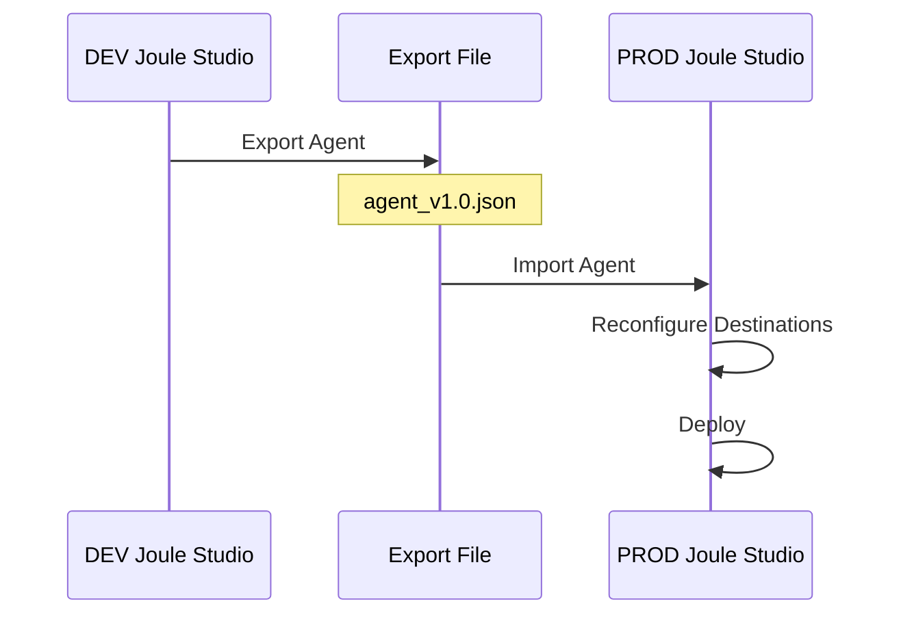
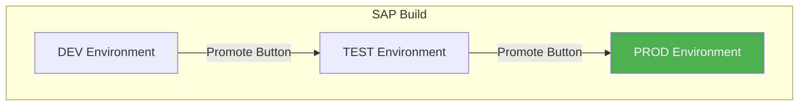
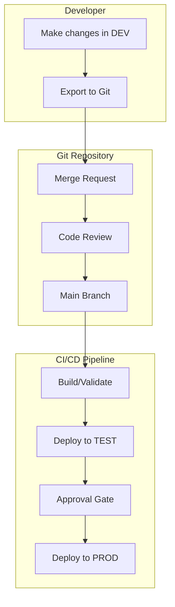
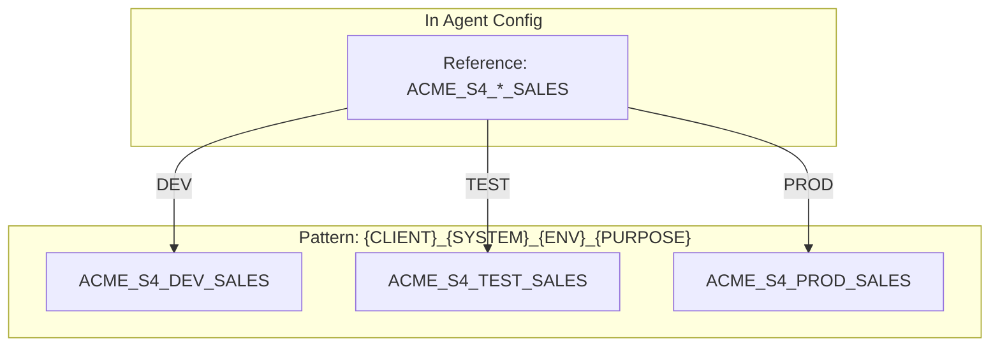
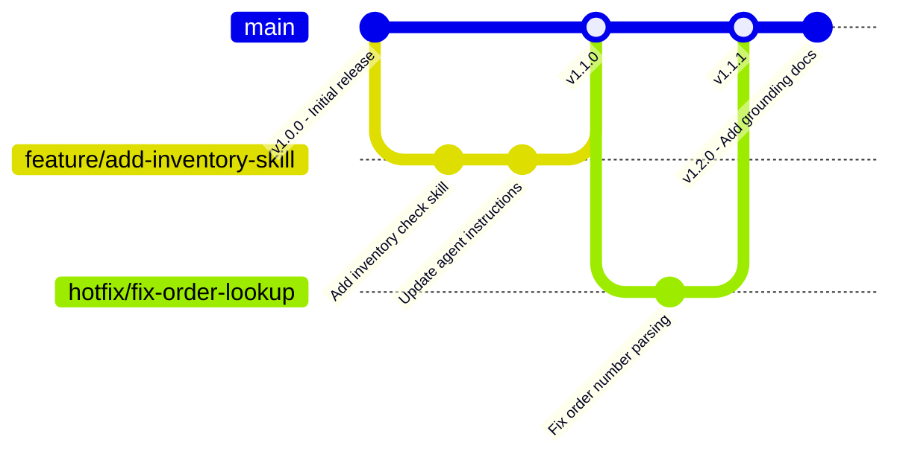
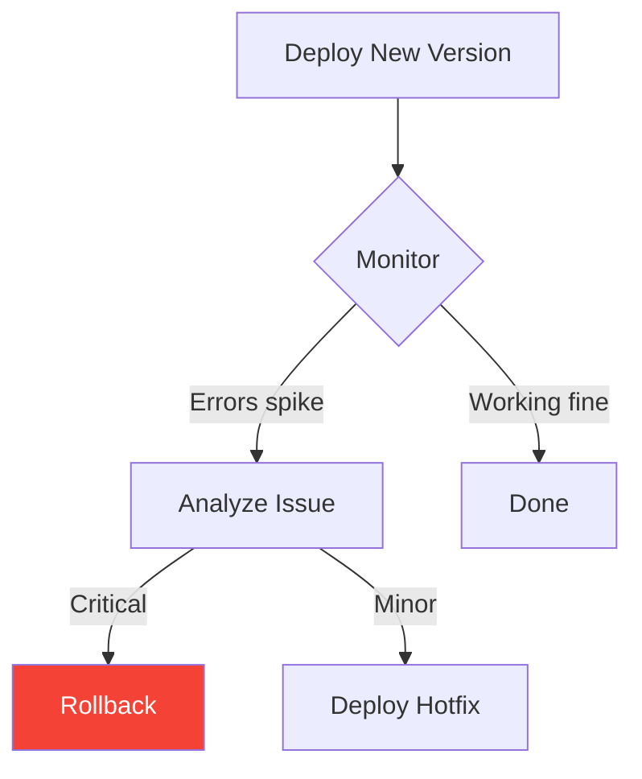
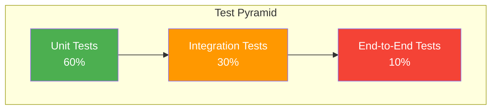
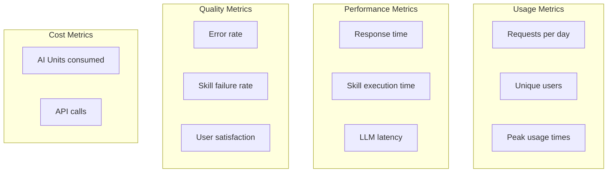

# Chapter 11: Agent Lifecycle & Deployment

> *From Dev to Prod—The Right Way*

---

Your agent works in development. Now let's move it through environments properly—without breaking things in production.

---

## 11.1 The Environment Landscape

### Standard Three-Tier Setup

```mermaid
graph LR
    subgraph "DEV"
        D_SUB[Subaccount: ACME-DEV]
        D_DEST[Destinations: *_DEV_*]
        D_AG[Agents: Testing versions]
    end

    subgraph "TEST/QA"
        T_SUB[Subaccount: ACME-TEST]
        T_DEST[Destinations: *_TEST_*]
        T_AG[Agents: Staging versions]
    end

    subgraph "PROD"
        P_SUB[Subaccount: ACME-PROD]
        P_DEST[Destinations: *_PROD_*]
        P_AG[Agents: Released versions]
    end

    DEV --> |"Promote"| TEST/QA
    TEST/QA --> |"Release"| PROD

    style PROD fill:#4CAF50,color:white
```



### What Changes Per Environment

| Component | DEV | TEST | PROD |
|-----------|-----|------|------|
| **Destinations** | `ACME_S4_DEV_SALES` | `ACME_S4_TEST_SALES` | `ACME_S4_PROD_SALES` |
| **Backend URLs** | dev.s4hana.com | test.s4hana.com | prod.s4hana.com |
| **AI Model** | Smaller/cheaper | Same as PROD | Production model |
| **Grounding Docs** | Test documents | Real docs (anonymized) | Production docs |
| **Users** | Developers | QA testers | End users |
| **Data** | Mock/sandbox data | Test data | Real data |

---

## 11.2 Deployment Methods

### Method 1: Export/Import (Manual)

Best for: Small teams, initial deployments



**Step-by-step:**

1. **Export from DEV:**
   - Joule Studio → Your Agent → Export
   - Save the JSON bundle

2. **Import to PROD:**
   - PROD Joule Studio → Import → Select file
   - Agent appears with same structure

3. **Reconfigure:**
   - Update destination references
   - Adjust environment-specific settings

4. **Test and Deploy:**
   - Test with production destinations
   - Deploy when ready

### Method 2: SAP Build Promote Feature

Best for: Organizations using SAP Build formations



**Requirements:**
- Formations configured between subaccounts
- Proper entitlements in target environment
- Destination names consistent across environments

### Method 3: Git + CI/CD (Recommended for Enterprise)

Best for: Large teams, frequent updates, audit requirements



**Git Repository Structure:**
```
joule-agents/
├── agents/
│   ├── customer-service/
│   │   ├── agent.json
│   │   ├── skills/
│   │   │   ├── get-order-status.json
│   │   │   └── create-return.json
│   │   └── grounding/
│   │       ├── return-policy.pdf
│   │       └── shipping-faq.pdf
│   └── finance-assistant/
│       └── ...
├── config/
│   ├── dev.env
│   ├── test.env
│   └── prod.env
└── pipelines/
    └── deploy.yml
```

**CI/CD Pipeline Example (Azure DevOps):**
```yaml
trigger:
  branches:
    include:
      - main

stages:
  - stage: ValidateExport
    jobs:
      - job: Validate
        steps:
          - script: |
              # Validate JSON structure
              python validate_agent.py agents/

  - stage: DeployToTest
    dependsOn: ValidateExport
    jobs:
      - job: Deploy
        steps:
          - script: |
              # Deploy to TEST using API
              ./deploy.sh --env test --agent customer-service

  - stage: DeployToProduction
    dependsOn: DeployToTest
    condition: succeeded()
    jobs:
      - deployment: Production
        environment: production  # Requires approval
        steps:
          - script: |
              ./deploy.sh --env prod --agent customer-service
```

---

## 11.3 Configuration Management

### Environment Variables Pattern

Use placeholders that get replaced per environment:

**agent.json (template):**
```json
{
  "name": "Customer Service Agent",
  "skills": [
    {
      "name": "GetOrderStatus",
      "destination": "${DESTINATION_S4_SALES}"
    }
  ]
}
```

**dev.env:**
```
DESTINATION_S4_SALES=ACME_S4_DEV_SALES
AI_MODEL=gpt-35-turbo
```

**prod.env:**
```
DESTINATION_S4_SALES=ACME_S4_PROD_SALES
AI_MODEL=gpt-4
```

### Destination Naming Strategy

Use consistent naming across environments:



---

## 11.4 Version Control for Agents

### Versioning Strategy



### Version Naming

| Version | Meaning |
|---------|---------|
| 1.0.0 | Initial production release |
| 1.1.0 | New feature (backward compatible) |
| 1.1.1 | Bug fix |
| 2.0.0 | Breaking change |

### Change Log

Maintain a CHANGELOG.md:

```markdown
# Customer Service Agent - Changelog

## [1.2.0] - 2026-01-24
### Added
- Grounding documents for return policy
- New skill: CheckInventory
### Changed
- Improved error handling in GetOrderStatus

## [1.1.1] - 2026-01-20
### Fixed
- Order number parsing for 10-digit orders

## [1.1.0] - 2026-01-15
### Added
- Skill: CreateReturn
- Email notification capability
```

---

## 11.5 Rollback Procedures

### When to Rollback



### Rollback Steps

**Option A: Redeploy Previous Version**

1. Find previous version in Git or export archive
2. Import previous version
3. Deploy immediately
4. Verify functionality

**Option B: Quick Disable**

If agent is causing issues:

1. Joule Studio → Agent → Settings
2. Disable agent temporarily
3. Users fall back to standard help
4. Fix and redeploy

### Rollback Checklist

```yaml
Rollback Checklist:
  - [ ] Identify the problematic version
  - [ ] Locate previous stable version
  - [ ] Import/deploy previous version
  - [ ] Test critical paths
  - [ ] Notify users if needed
  - [ ] Document incident
  - [ ] Root cause analysis
```

---

## 11.6 Testing Strategy

### Test Pyramid for Agents



### Unit Tests: Individual Skills

Test each skill in isolation:

```yaml
Test: GetOrderStatus Skill
  Input: { orderNumber: "12345" }
  Mock: S4 API returns order details
  Expected: Formatted order response

Test: GetOrderStatus - Not Found
  Input: { orderNumber: "99999" }
  Mock: S4 API returns 404
  Expected: Friendly "not found" message
```

### Integration Tests: Skill + Destination

Test skills with real (or realistic) backends:

```yaml
Test: GetOrderStatus with TEST environment
  Environment: TEST
  Destination: ACME_S4_TEST_SALES
  Input: { orderNumber: "1" }  # Known test order
  Expected: Actual order data returned
```

### End-to-End Tests: Full Agent Flow

Test complete user scenarios:

```yaml
Test: Customer Complaint Flow
  Steps:
    1. User: "Order 12345 arrived damaged"
    2. Agent: Looks up order
    3. Agent: Checks policy
    4. Agent: Creates return
    5. Agent: Sends email
  Expected: Return created, email sent
```

---

## 11.7 Monitoring in Production

### Key Metrics to Track



### Alerting Rules

```yaml
Alerts:
  Critical:
    - Error rate > 10% for 5 minutes
    - All skills failing
    - AI Core unavailable

  Warning:
    - Error rate > 5%
    - Response time > 10 seconds
    - AI Units consumption spike

  Info:
    - New peak usage reached
    - Unusual query patterns
```

### Logging Best Practices

```json
{
  "timestamp": "2026-01-24T10:30:00Z",
  "level": "INFO",
  "agent": "customer-service",
  "sessionId": "sess-abc123",
  "userId": "user@acme.com",
  "action": "skill_invocation",
  "skill": "GetOrderStatus",
  "input": { "orderNumber": "12345" },
  "duration_ms": 450,
  "success": true
}
```

---

## Key Takeaways

1. **Three environments minimum** — DEV, TEST, PROD
2. **Automate deployments** — CI/CD for consistency
3. **Version everything** — Agents, skills, configurations
4. **Test at every level** — Unit, integration, E2E
5. **Plan for rollback** — Know how to recover quickly
6. **Monitor continuously** — Track metrics and alert on issues

---

## What's Next?

Now that you can deploy agents, let's look at managing multiple clients—a common scenario for consultants and partners.

---

*[Previous: Chapter 10 – Building Joule Agents](10-building-agents.md) | [Next: Chapter 12 – Managing Multiple Clients](12-multi-client-management.md)*

*[Back to Table of Contents](../content.md)*

---

**Author:** [Beyhan Meyrali](https://www.linkedin.com/in/beyhanmeyrali) — SAP Storyteller & Digital Transformation Advocate

*Created with ❤️ for SAP learners worldwide*
