# Chapter 12: Managing Multiple Clients on BTP

> *The Consultant's Survival Guide*

---

If you're a consultant, partner, or work in a shared services team, you'll manage BTP for multiple clients. This chapter shows you how to do it without losing your sanity.

---

## 12.1 The Classic Trap: One Subaccount for Everything

### What People Do Wrong

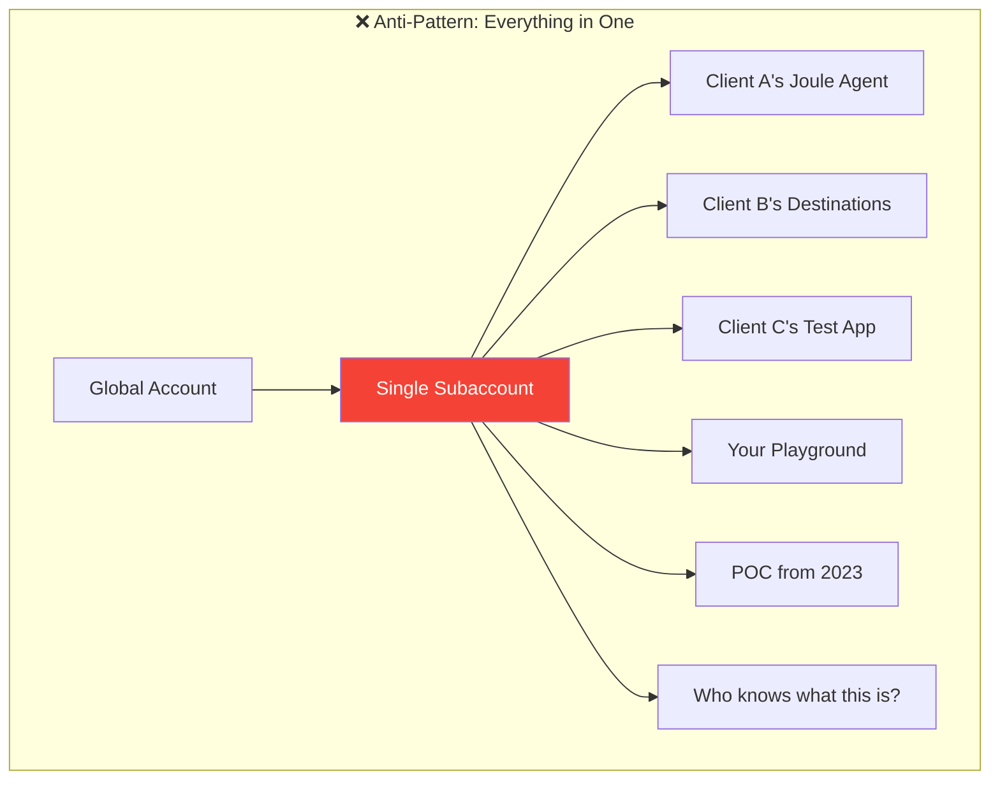

### The Problems This Causes

| Problem | Impact |
|---------|--------|
| **Entitlement chaos** | Can't tell who's using what quota |
| **Security nightmare** | Client A can see Client B's destinations |
| **Naming collisions** | `S4_ORDERS` — whose S4? |
| **Billing impossible** | Can't charge back costs per client |
| **Handover problems** | "Here's access to everything" |
| **Cleanup paralysis** | Afraid to delete anything |

---

## 12.2 Best Practice: One Subaccount Per Client

### The Recommended Structure

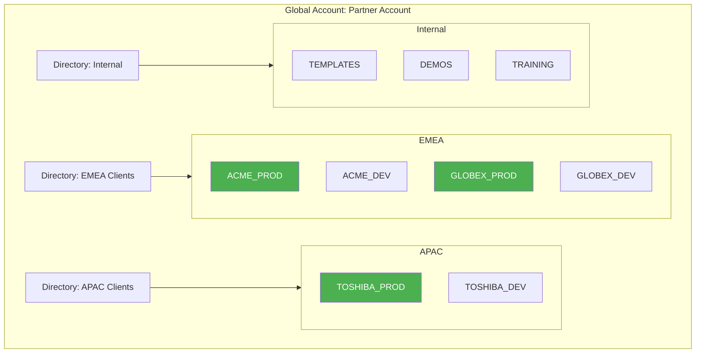

### Benefits

| Benefit | Description |
|---------|-------------|
| **Isolation** | Clients can't see each other's data |
| **Clear billing** | Usage tracked per subaccount |
| **Easy handover** | Transfer entire subaccount to client |
| **Clean naming** | No prefixes needed within subaccount |
| **Simpler security** | Assign roles per subaccount |

---

## 12.3 Naming Conventions That Scale

### Subaccount Naming

**Pattern:** `{REGION}_{CLIENT}_{ENVIRONMENT}`

```
Examples:
TR_ACME_PROD       → Turkey, Acme Corp, Production
TR_ACME_DEV        → Turkey, Acme Corp, Development
EU_GLOBEX_PROD     → Europe, Globex Inc, Production
US_INITECH_POC     → USA, Initech, Proof of Concept
```

### Destination Naming

Within client subaccount, simpler names work:

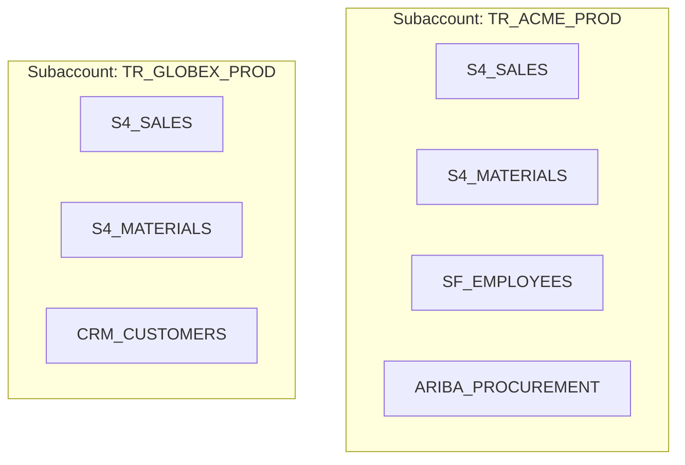

**Why this works:**
- Within ACME's subaccount, `S4_SALES` is unambiguous
- No collision with GLOBEX's `S4_SALES` (different subaccount)

### For Shared Subaccounts (if you must)

If you have a shared subaccount, use full prefixes:

```
ACME_S4_PROD_SALES
GLOBEX_S4_PROD_SALES
INITECH_S4_DEV_ORDERS
```

---

## 12.4 Security & Access Management

### Identity Provider Setup

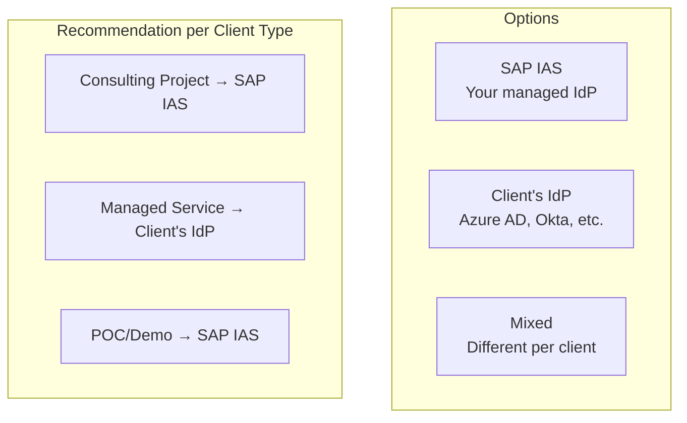

### Role Assignments

**Your Team (Consultants):**
```yaml
Global Account Level:
  - Global Account Administrator (you)
  - Directory Administrator (team leads)

Subaccount Level (per client):
  - Subaccount Administrator
  - Cloud Foundry Space Developer
  - Destination Administrator
```

**Client Team:**
```yaml
Subaccount Level (their subaccount only):
  - Subaccount Viewer (read-only) or
  - Subaccount Administrator (full control)
  - Role specific to their apps
```

### Access Pattern for Client Handover

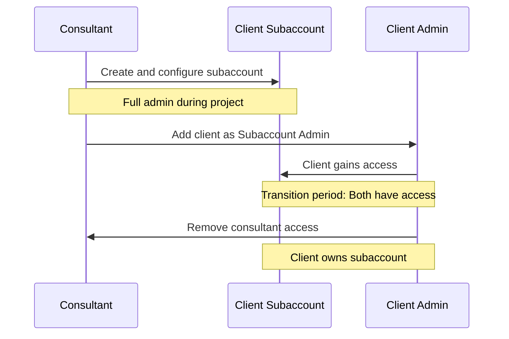

---

## 12.5 Entitlement Distribution

### Visualizing Entitlements

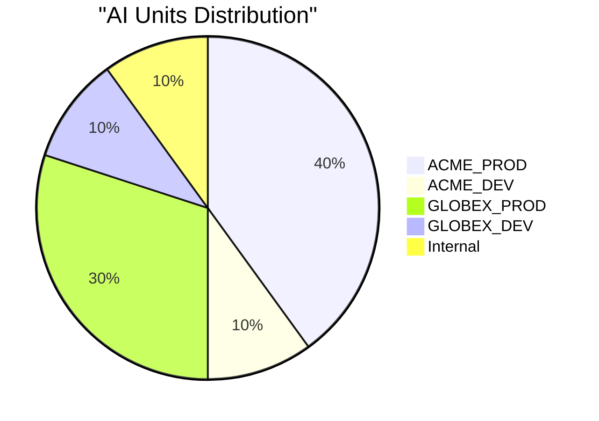

### Managing Quotas

In BTP Cockpit:

1. **Global Account → Entitlements**
2. **Entity Assignments** (formerly "Manage Quota")
3. Distribute to subaccounts:

```yaml
AI Core (AI Units):
  Total: 1000 units/month
  Distribution:
    - ACME_PROD: 400
    - ACME_DEV: 100
    - GLOBEX_PROD: 300
    - GLOBEX_DEV: 100
    - Internal: 100

Cloud Foundry Runtime:
  Total: 16 GB
  Distribution:
    - ACME_PROD: 4 GB
    - ACME_DEV: 2 GB
    - GLOBEX_PROD: 4 GB
    - GLOBEX_DEV: 2 GB
    - Internal: 4 GB
```

---

## 12.6 Cost Allocation and Chargeback

### Tracking Costs Per Client

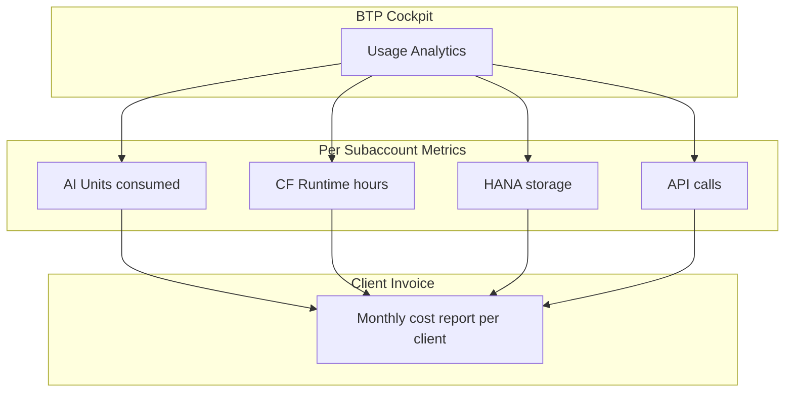

### Export and Report

1. **BTP Cockpit → Usage Analytics**
2. **Select subaccount** (or directory)
3. **Export to CSV**
4. **Build monthly reports per client**

### Sample Cost Report Structure

```markdown
# Monthly BTP Cost Report - ACME Corp

Period: January 2026

| Service | Usage | Unit Cost | Total |
|---------|-------|-----------|-------|
| AI Core | 350 AI Units | €0.10 | €35.00 |
| CF Runtime | 720 GB-hours | €0.05 | €36.00 |
| HANA Cloud | 50 GB | €2.00 | €100.00 |
| Destination Service | 10,000 calls | €0.001 | €10.00 |
| **Total** | | | **€181.00** |
```

---

## 12.7 Template-Based Setup

### The Golden Template Approach

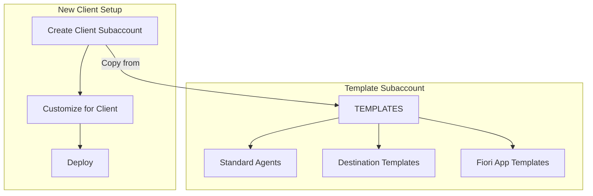

### Standard Setup Checklist

When onboarding a new client:

```yaml
Client Onboarding Checklist:
  Subaccount:
    - [ ] Create subaccount with naming convention
    - [ ] Enable Cloud Foundry
    - [ ] Assign entitlements

  Connectivity:
    - [ ] Create destination to S/4HANA
    - [ ] Create destination to SuccessFactors (if needed)
    - [ ] Set up Cloud Connector (if on-prem)

  Identity:
    - [ ] Configure trust with IdP
    - [ ] Create initial users
    - [ ] Set up role collections

  Services:
    - [ ] Deploy standard Fiori apps
    - [ ] Set up Joule agents from template
    - [ ] Configure Work Zone

  Documentation:
    - [ ] Document subaccount details
    - [ ] Document credentials (secure storage)
    - [ ] Create handover package
```

---

## 12.8 Multi-Client Joule Agents

### Option 1: Separate Agents Per Client

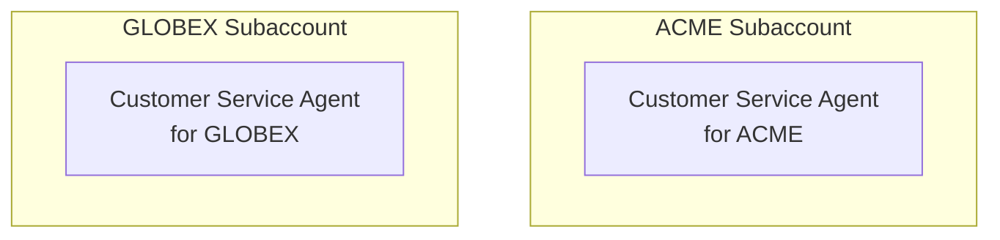

**Pros:** Full isolation, client-specific customization
**Cons:** More maintenance, changes replicated manually

### Option 2: Shared Agent Template

Build once, deploy to each:

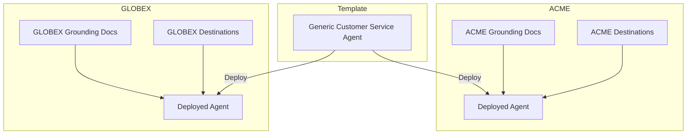

---

## 12.9 Disaster Recovery Considerations

### Per-Client Backup Strategy

```yaml
Backup Frequency:
  Destinations: Weekly export
  Agents: After each change
  Fiori Apps: Git repository
  Configurations: Document + export

Storage:
  Location: Secure company storage
  Format: JSON exports + documentation
  Retention: 90 days minimum
```

### Quick Recovery Plan

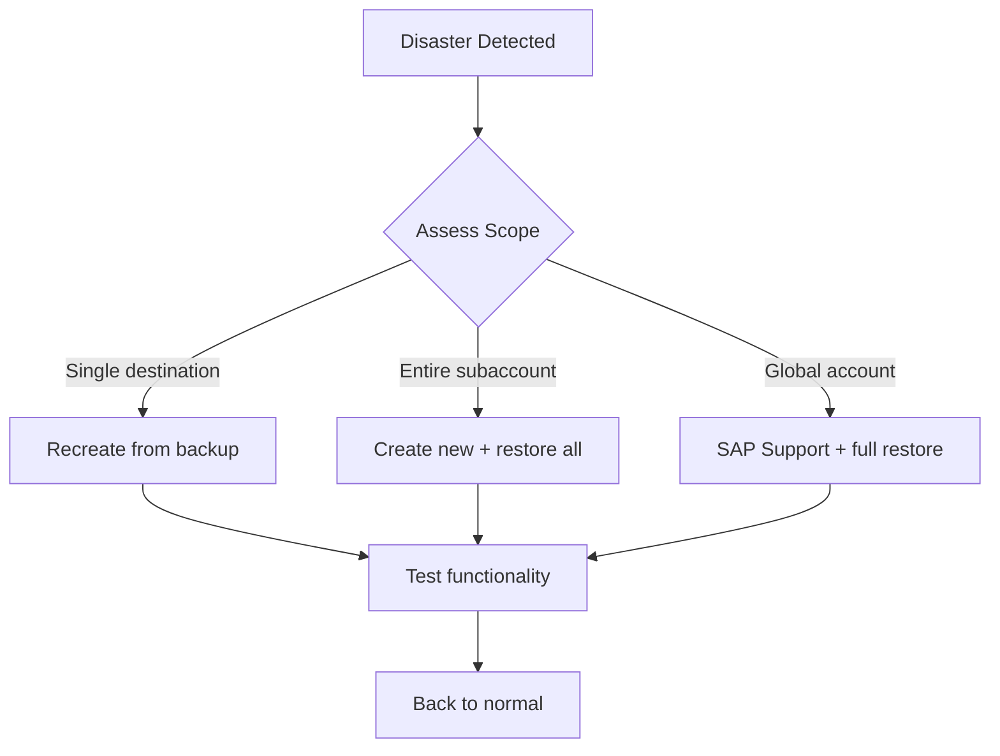

---

## Key Takeaways

1. **One subaccount per client** — Essential for isolation
2. **Naming conventions** — `{REGION}_{CLIENT}_{ENV}`
3. **Clear entitlement distribution** — Track quotas per client
4. **Proper access control** — Consultants vs. client roles
5. **Template approach** — Standardize and replicate
6. **Cost tracking** — Enable chargeback

---

## What's Next?

Now let's look at deploying the same solution across multiple clients—template-based vs. multi-tenant approaches.

---

*[Previous: Chapter 11 – Agent Lifecycle & Deployment](11-agent-lifecycle.md) | [Next: Chapter 13 – Cross-Customer Deployments](13-cross-customer-deployments.md)*

*[Back to Table of Contents](../content.md)*

---

**Author:** [Beyhan Meyrali](https://www.linkedin.com/in/beyhanmeyrali) — SAP Storyteller & Digital Transformation Advocate

*Created with ❤️ for SAP learners worldwide*
