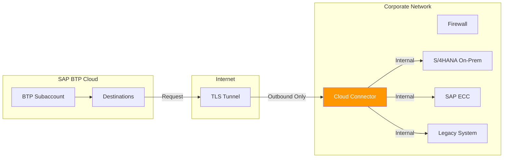
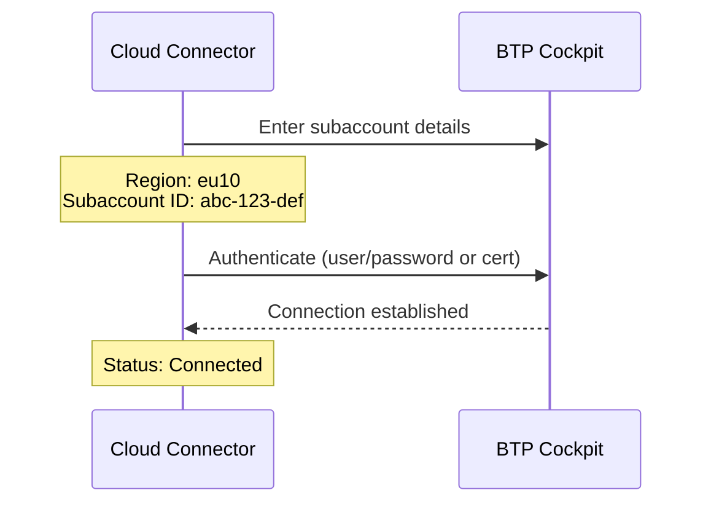
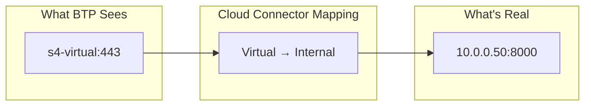
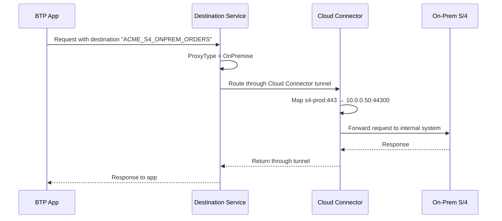
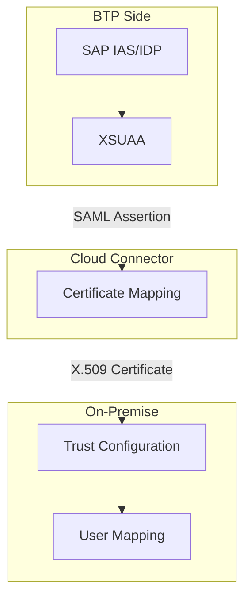
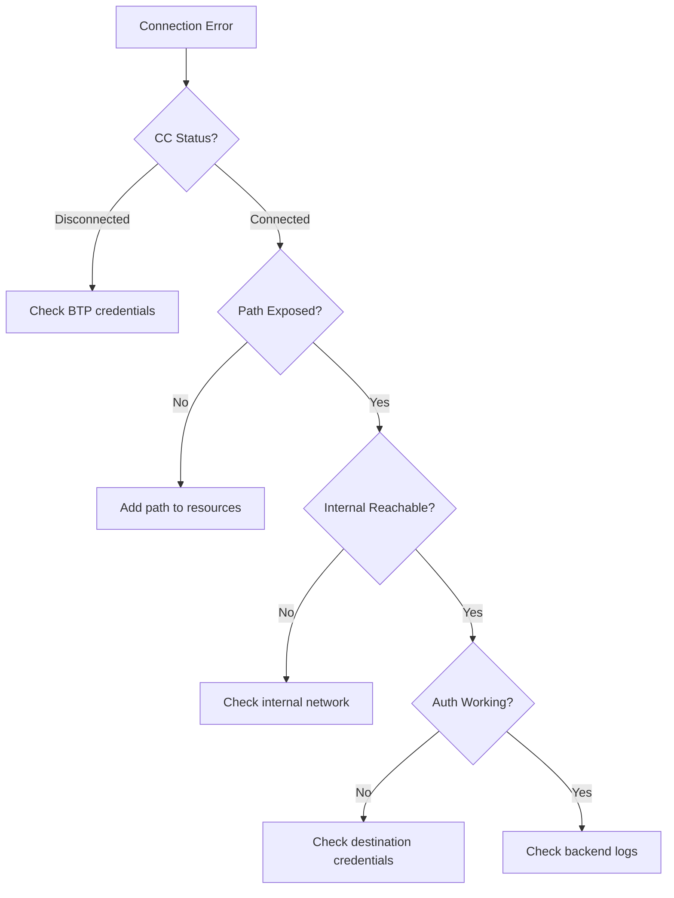

# Chapter 16: Cloud Connector for On-Premise Access

> *The Secure Tunnel to Your Data Center*

---

Most enterprises still have on-premise systems. Cloud Connector bridges the gap—securely connecting BTP to systems behind your firewall.

---

## 16.1 What Is Cloud Connector?

Cloud Connector is a lightweight software agent installed in your network that creates a **secure, outbound-only tunnel** to BTP.



### Key Benefits

| Feature | Benefit |
|---------|---------|
| **Outbound-only** | No inbound firewall rules needed |
| **Virtual hosts** | Hide real internal addresses |
| **Path control** | Expose only what you need |
| **Audit logging** | Track all access |
| **High availability** | Master-shadow setup |

---

## 16.2 Installation and Setup

### System Requirements

```yaml
Operating System: Windows Server 2016+ or Linux (SLES, RHEL, Ubuntu)
Memory: 4 GB minimum (8 GB recommended)
Disk: 20 GB minimum
Network: Outbound HTTPS (443) to BTP
Java: SAP JVM bundled with installer
```

### Step-by-Step Installation

**1. Download**
- SAP Support Portal → Software Downloads
- Search: "Cloud Connector"
- Download portable version or installer

**2. Install (Windows)**
```bash
# Unzip to C:\SAP\CloudConnector
# Run as administrator:
C:\SAP\CloudConnector\go.bat

# Service installation:
C:\SAP\CloudConnector\sccservice.bat install
```

**3. Access Admin UI**
```
URL: https://localhost:8443
Default user: Administrator
Default password: manage

(Change immediately!)
```

**4. Connect to BTP Subaccount**



**Fill in:**
```yaml
Region Host: cf.eu10.hana.ondemand.com
Subaccount: abc123-def456-...  # From BTP Cockpit
Display Name: ACME Production CC
User: your.email@acme.com
Password: ********
```

---

## 16.3 Virtual Host Mapping

The most important concept! Virtual hosts hide your real internal addresses.

### How It Works



### Creating a Virtual Host

**In Cloud Connector Admin UI:**

1. Cloud To On-Premise → Access Control
2. Add System Mapping (+)

```yaml
Back-end Type: ABAP System (or HTTP)
Protocol: HTTPS (recommended) or HTTP
Internal Host: 10.0.0.50
Internal Port: 44300
Virtual Host: s4-prod
Virtual Port: 443
Principal Type: X.509 Certificate (or None)
```

### Why Virtual Hosts Matter

| Real Internal | Virtual External | Benefit |
|--------------|------------------|---------|
| `10.0.0.50:8000` | `s4-prod:443` | Hide internal IPs |
| `SAP-ECC-PRD:44300` | `ecc-legacy:443` | Standardize ports |
| `server1.acme.local` | `erp:443` | Simple names |

---

## 16.4 Path Exposure (Security!)

**Critical:** Only expose the paths you actually need.

### Good vs. Bad

```mermaid
graph TD
    subgraph "❌ BAD: Everything Exposed"
        BAD["/"]
        BAD --> B1[/sap/bc/gui/*]
        BAD --> B2[/sap/bc/adt/*]
        BAD --> B3[/sap/opu/odata/*]
        BAD --> B4[/irj/*]
    end

    subgraph "✅ GOOD: Only What's Needed"
        GOOD[Specific Paths]
        GOOD --> G1[/sap/opu/odata/sap/API_SALES_ORDER_SRV]
        GOOD --> G2[/sap/opu/odata/sap/API_MATERIAL_SRV]
    end

    style BAD fill:#f44336,color:white
    style GOOD fill:#4CAF50,color:white
```

### Adding Path Resources

1. Select your system mapping
2. Click "Resources" (+)
3. Add specific paths:

```yaml
# For Joule skills calling OData
Path: /sap/opu/odata/sap/API_SALES_ORDER_SRV
Access Policy: Path And All Sub-Paths
Enabled: Yes

# For ABAP Development Tools
Path: /sap/bc/adt
Access Policy: Path And All Sub-Paths
Enabled: Yes (only if needed)
```

### Access Policy Options

| Option | Meaning |
|--------|---------|
| **Path Only** | Exact path only |
| **Path And All Sub-Paths** | Path and everything under it |

---

## 16.5 Destination Configuration for On-Premise

### Creating the Destination in BTP

```yaml
Name: ACME_S4_ONPREM_ORDERS
Type: HTTP
Description: ACME S/4HANA On-Premise - Sales Orders
URL: http://s4-prod:443/sap/opu/odata/sap/API_SALES_ORDER_SRV
Proxy Type: OnPremise   # <-- Key difference!
Authentication: BasicAuthentication  # or PrincipalPropagation
User: BTPUSER
Password: ********

Additional Properties:
  sap-client: 100
  WebIDEEnabled: true
  WebIDEUsage: odata_abap
```

### The Complete Flow



---

## 16.6 Principal Propagation (SSO)

For scenarios where the logged-in user's identity should flow to the on-premise system.

### Without Principal Propagation

```
BTP User: john.doe@acme.com
On-Prem Call: Technical user "BTPUSER"
On-Prem sees: BTPUSER (no user context)
```

### With Principal Propagation

```
BTP User: john.doe@acme.com
On-Prem Call: john.doe@acme.com certificate
On-Prem sees: JDOE (actual user)
```

### Setup Requirements



### Configuration Steps

**1. Configure Cloud Connector SNC**
- Principal Propagation → Enable
- Upload CA certificate

**2. Configure On-Premise Trust**
- STRUST: Import Cloud Connector CA cert
- SICF: Enable client certificate authentication

**3. Configure Destination**
```yaml
Authentication: PrincipalPropagation
# No user/password needed
```

---

## 16.7 High Availability Setup

For production, use master-shadow configuration.

```mermaid
graph TD
    subgraph "BTP"
        BTP[BTP Subaccount]
    end

    subgraph "Corporate Network"
        subgraph "Primary Site"
            CC1[Cloud Connector<br/>MASTER]
        end

        subgraph "DR Site"
            CC2[Cloud Connector<br/>SHADOW]
        end

        S4[On-Prem Systems]
    end

    BTP --> |"Active"| CC1
    BTP --> |"Standby"| CC2
    CC1 --> S4
    CC2 --> S4

    style CC1 fill:#4CAF50,color:white
    style CC2 fill:#FF9800,color:white
```

### Setting Up HA

**Master:**
```yaml
Role: Master
Shadow Host: cc-shadow.acme.local
Shadow Port: 8443
```

**Shadow:**
```yaml
Role: Shadow
Master Host: cc-master.acme.local
Master Port: 8443
```

---

## 16.8 Troubleshooting

### Common Issues

| Symptom | Cause | Fix |
|---------|-------|-----|
| "Connection refused" | CC not connected | Check CC admin UI status |
| "Host not found" | Wrong virtual host | Verify virtual host mapping |
| "403 Forbidden" | Path not exposed | Add path to resources |
| "401 Unauthorized" | Bad credentials | Check destination auth |
| Timeout | Internal firewall | Check CC → backend connectivity |

### Diagnostic Steps



### Useful Logs

**Cloud Connector:**
```
Location: <CC_Install>/log/
Files: ljs_trace.log, ljs_audit.log
```

**Check connectivity:**
```bash
# From CC server
curl -v https://internal-host:port/sap/opu/odata/sap/API_SALES_ORDER_SRV
```

---

## Key Takeaways

1. **Outbound-only** — No inbound firewall changes needed
2. **Virtual hosts** — Hide real internal addresses
3. **Expose minimally** — Only paths you actually use
4. **Principal propagation** — User identity flows through
5. **HA for production** — Master-shadow setup
6. **Test the chain** — CC connectivity → Path exposure → Auth

---

*[Previous: Chapter 15 – SAP Integration Suite](15-integration-suite.md) | [Next: Chapter 17 – Clean Core Rules](17-clean-core.md)*

*[Back to Table of Contents](../content.md)*

---

**Author:** [Beyhan Meyrali](https://www.linkedin.com/in/beyhanmeyrali) — SAP Storyteller & Digital Transformation Advocate

*Created with ❤️ for SAP learners worldwide*
