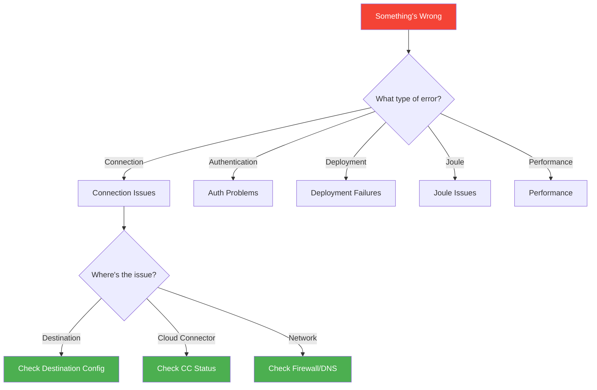
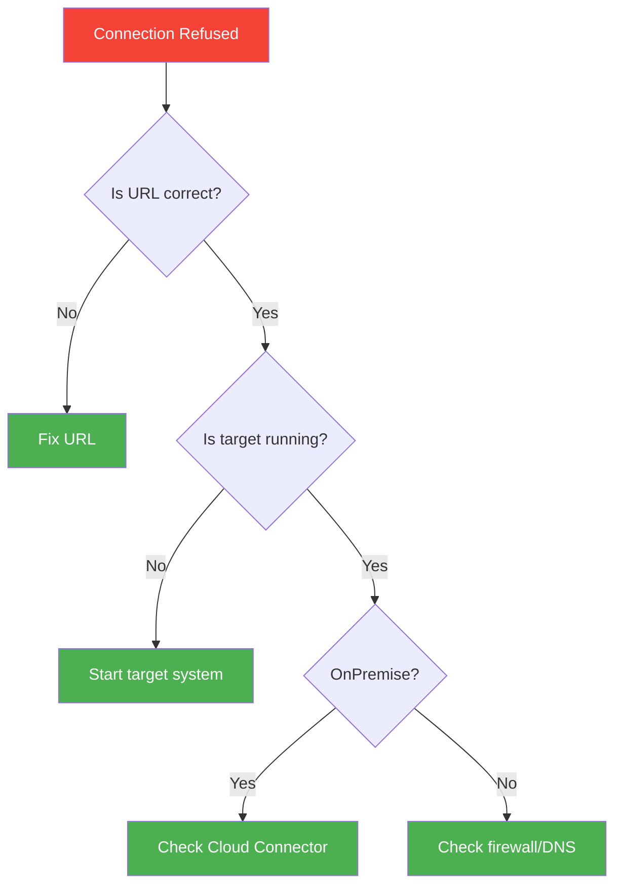
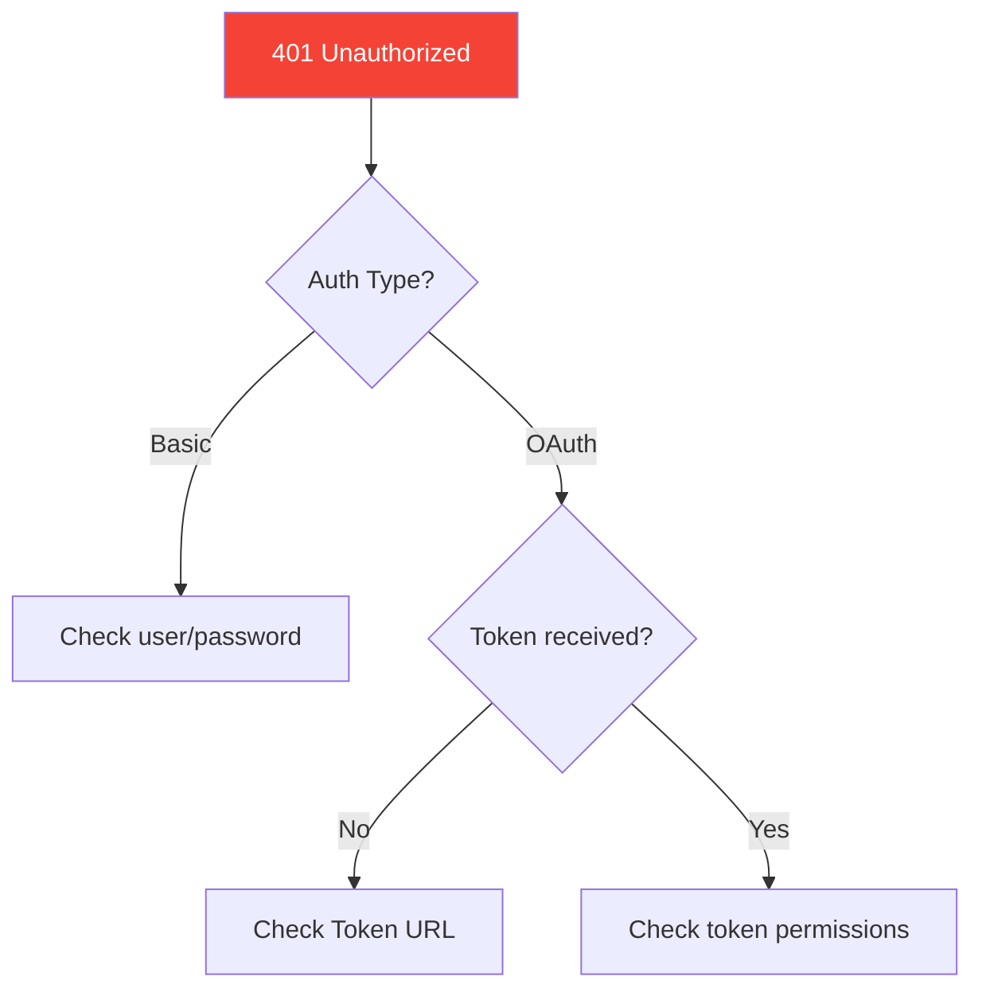
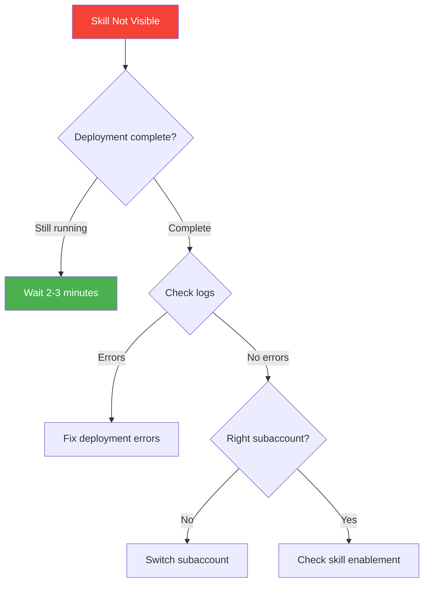
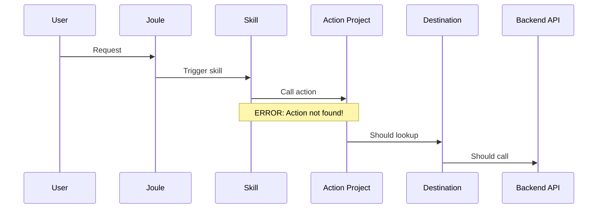
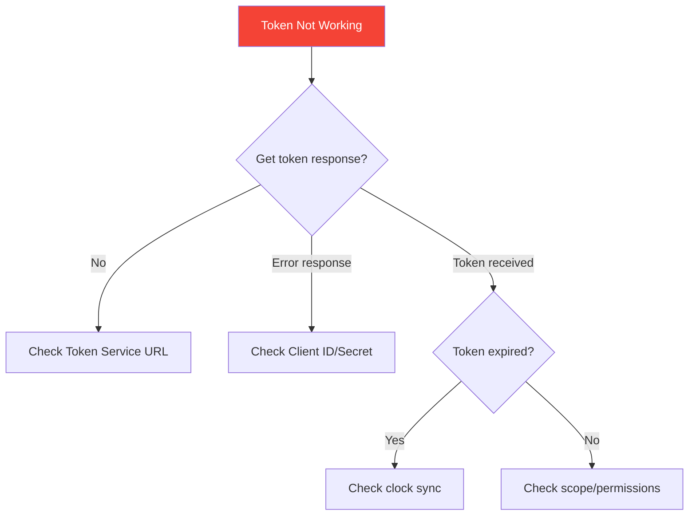
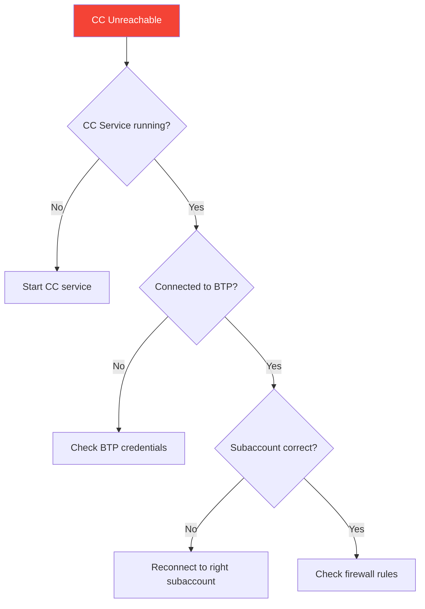
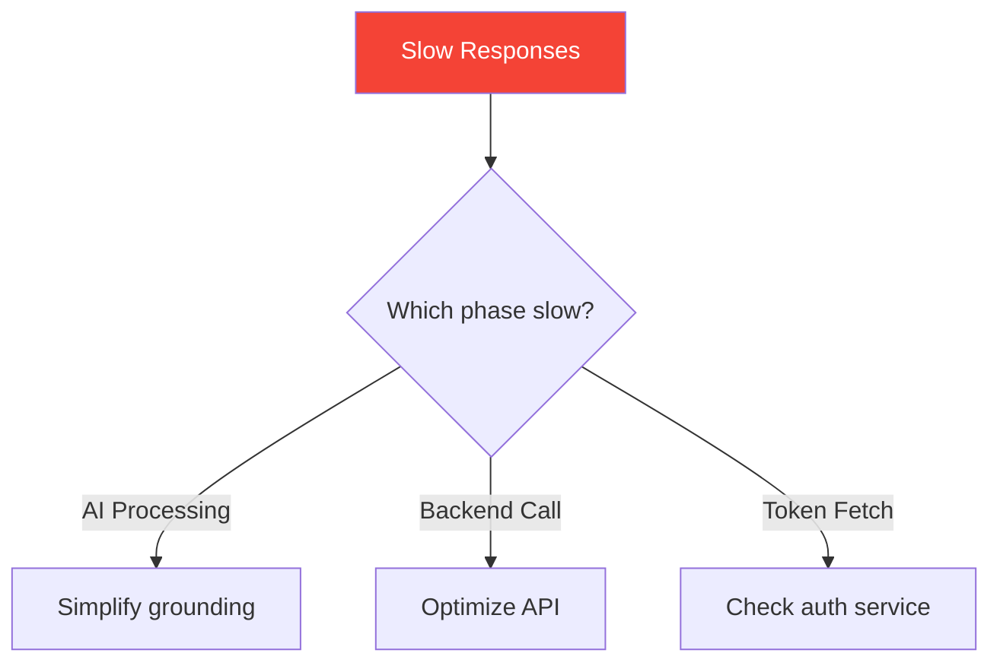
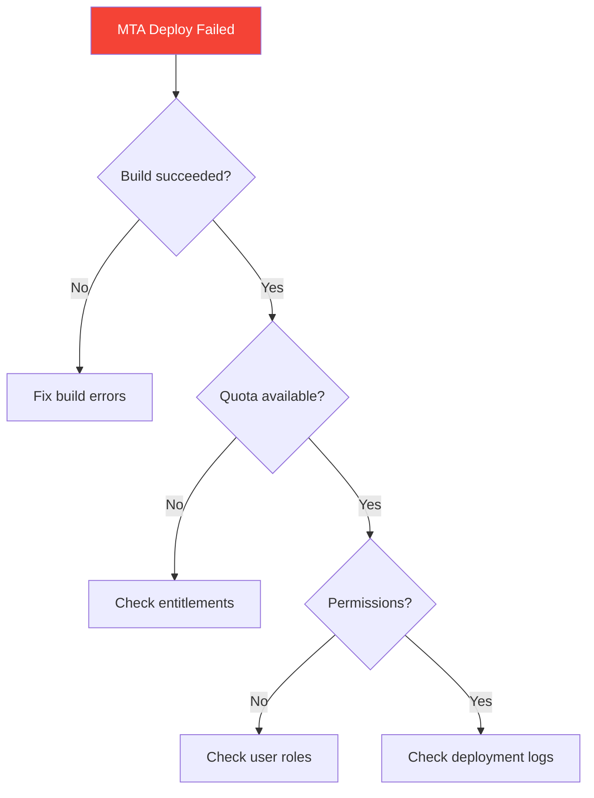

# Appendix D: Troubleshooting Common Issues

> *When Things Don't Work*

---

## Troubleshooting Flowchart



---

## Destination Errors

### "Connection refused" or "Host not found"



**Cause**: URL is wrong or system is down

**Diagnostic steps:**
1. Copy the URL and paste in browser—does it respond?
2. Check if target system is running
3. For OnPremise: Is Cloud Connector connected?
4. Check DNS resolution

**Fix:**
```yaml
# Verify destination configuration
1. BTP Cockpit → Subaccount → Connectivity → Destinations
2. Click "Check Connection" button
3. Read error message carefully
4. For OnPremise, verify virtual host matches CC mapping
```

---

### "401 Unauthorized"

**Cause**: Authentication failed



**Fix checklist:**

| Auth Type | Check This |
|-----------|------------|
| **Basic** | Username and password correct? User locked? |
| **OAuth2** | Client ID, Secret, Token URL all correct? |
| **SAMLBearer** | Trust configured? User mapped? |

**For OAuth2:**
```bash
# Test token endpoint manually with curl
curl -X POST "https://authentication.eu10.hana.ondemand.com/oauth/token" \
  -H "Content-Type: application/x-www-form-urlencoded" \
  -d "grant_type=client_credentials&client_id=YOUR_CLIENT_ID&client_secret=YOUR_SECRET"
```

---

### "403 Forbidden"

**Cause**: Authenticated but not authorized

**Fix:**
1. Check user has required roles on target system
2. For Cloud Connector: Verify path is exposed in resources
3. Check if IP is whitelisted on target
4. Verify `sap-client` header if needed

```yaml
# Common missing authorization scenarios
- User exists but no roles assigned
- Path not exposed in Cloud Connector resources
- API requires specific scope not granted
- sap-client header missing for SAP systems
```

---

### "Certificate error" / SSL Issues

**Cause**: SSL/TLS certificate problem

**Fix:**

| Environment | Solution |
|-------------|----------|
| **Development** | Add `TrustAll=true` to destination (NEVER in prod!) |
| **Production** | Import CA certificate to BTP Trust Store |

```yaml
# For self-signed certs in dev
Additional Properties:
  TrustAll: true  # DEVELOPMENT ONLY!
```

---

## Joule Deployment Issues

### Skill not appearing after deploy



**Diagnostic steps:**
1. Check deployment status in Joule Studio
2. Review deployment logs for errors
3. Verify you're in the correct subaccount
4. Confirm skill is enabled for Joule

**Fix:**
```yaml
1. Open Joule Studio
2. Navigate to your skill/agent
3. Check status indicator
4. If stuck, try redeploy
5. Clear browser cache and refresh
```

---

### "Action not found" error

**Cause**: Action Project not linked properly



**Fix:**
1. Verify Action Project is deployed successfully
2. Check destination exists and is correctly named
3. Re-link action in skill configuration
4. Ensure action operationId matches skill config

---

### Agent doesn't use the skill

**Cause**: Skill not assigned or instructions unclear

**Diagnostic:**
```yaml
Test sequence:
1. Test skill individually first (does it work alone?)
2. Check skill is in agent's skill list
3. Review agent instructions - does it mention when to use the skill?
4. Check for conflicting skills with similar triggers
```

**Fix:**
```yaml
# Improve agent instructions
Bad:  "Help users with sales"
Good: "When a user asks about sales order status,
       use the GetSalesOrderStatus skill with the order number"
```

---

## Authentication Problems

### OAuth token not working



**Common OAuth2 issues:**

| Symptom | Cause | Fix |
|---------|-------|-----|
| "invalid_client" | Wrong Client ID/Secret | Verify credentials |
| "unauthorized_client" | Wrong grant type | Check grant_type parameter |
| Token works then fails | Token expired | Check token lifetime |
| "insufficient_scope" | Missing permissions | Add required scope |

---

### SSO not working

**Cause**: Trust configuration issue

**Fix:**
1. Check IAS/IdP configuration in BTP
2. Verify trust relationship established
3. Check user exists in both systems
4. Review attribute mapping

```yaml
Trust Setup Checklist:
☐ IAS tenant configured in BTP subaccount
☐ Application registered in IAS
☐ User groups mapped correctly
☐ SAML metadata exchanged (if applicable)
☐ Test user exists in IdP
```

---

## Cloud Connector Issues

### Connection shows "unreachable"



**Fix:**
```bash
# Check CC service status (Windows)
services.msc → Find "SAP Cloud Connector" → Check status

# Check CC service status (Linux)
systemctl status scc_daemon

# Access CC Admin
https://localhost:8443
```

**Verify in CC Admin:**
1. Main connection shows "Connected"
2. Correct subaccount connected
3. No certificate errors

---

### "No route to host" for on-prem

**Cause**: Virtual mapping issue

**Fix:**
1. Verify virtual host mapping in CC
2. Check path exposure in resources
3. Test internal connectivity from CC server

```yaml
Cloud Connector Checklist:
☐ Virtual host configured (e.g., "s4-virtual")
☐ Internal host reachable from CC server
☐ Paths exposed in Resources
☐ Access policy correct (Path and All Sub-Paths)
☐ No firewall blocking CC → internal system
```

---

## Performance Issues

### Slow Joule responses



**Common causes and fixes:**

| Cause | Symptom | Fix |
|-------|---------|-----|
| Large grounding docs | Initial response slow | Split/optimize documents |
| Slow backend API | Consistent delays | Add caching, optimize query |
| AI overload | Intermittent slowness | Wait, try again later |
| Network latency | Region mismatch | Use same region for all services |

---

### Destination timeout

**Cause**: Target system too slow

**Fix:**
```yaml
# Increase timeout in destination
Additional Properties:
  timeout: 60000  # milliseconds (60 seconds)

# Or optimize the backend:
1. Add indexes to frequently queried fields
2. Limit result set with $top or $filter
3. Use $select to retrieve only needed fields
```

---

## Deployment Issues

### MTA deployment fails



**Common MTA errors:**

| Error | Cause | Fix |
|-------|-------|-----|
| "Insufficient quota" | No entitlements | Assign entitlements in cockpit |
| "Service broker error" | Service not available | Check service availability |
| "Route already exists" | URL conflict | Change route in manifest |
| "Authorization failed" | Missing deploy rights | Add SpaceDeveloper role |

---

## General Debugging Tips

### Where to find logs

| Component | Log Location |
|-----------|--------------|
| **BTP Apps** | BTP Cockpit → Subaccount → Spaces → App → Logs |
| **Cloud Connector** | `<CC_Install>/log/ljs_trace.log` |
| **Destinations** | BTP Cockpit → Connectivity → Destinations → Check Connection |
| **Joule** | Joule Studio → Deployment → Logs |
| **ABAP Environment** | ADT → ABAP Console |

### Useful Commands

```bash
# Cloud Foundry CLI - view app logs
cf logs APP_NAME --recent

# Cloud Foundry CLI - stream logs
cf logs APP_NAME

# Check app status
cf apps

# Check services
cf services
```

### General Checklist

```yaml
Before asking for help, verify:
☐ Correct subaccount/space selected
☐ User has required permissions
☐ All dependencies deployed
☐ Destination accessible (Check Connection)
☐ Recent changes that might have broken it
☐ Error message read completely
☐ Logs reviewed
```

---

## Getting Help

1. **Check SAP Notes** — [launchpad.support.sap.com](https://launchpad.support.sap.com)
2. **Search SAP Community** — [community.sap.com](https://community.sap.com)
3. **Stack Overflow** — Tag: `sap`, `sap-cloud-platform`, `sapui5`
4. **SAP Support** — Open incident if licensed

---

*[Back to Table of Contents](../content.md)*

---

**Author:** [Beyhan Meyrali](https://www.linkedin.com/in/beyhanmeyrali) — SAP Storyteller & Digital Transformation Advocate

*Created with ❤️ for SAP learners worldwide*
