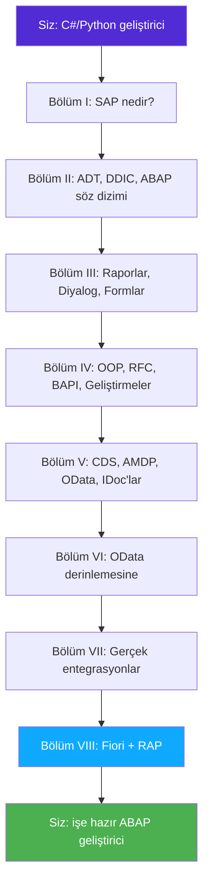

# Önsöz: Bu Kitap Nasıl Okunur

> *"İlk kural şudur: kendinizi kandırmamalısınız — kendiniz kendinizi en kolay kandıran kişisinizdir."* — Richard Feynman

---

## ☕ Nerede olduğunuza dair dürüst bir değerlendirme

Kod yazabiliyorsunuz. C# servisleri, belki Python script'leri ve API'lar geliştirdiniz. Sınıfları, koleksiyonları, LINQ'yu veya list comprehension'ları, async'i, REST'i ve ORM'yi anlıyorsunuz. Peki bir SAP projesine girince neden başka bir gezegene inen biri gibi hissediyorsunuz?

Çünkü SAP bir *dil* sorunu değil — bir *dünya* sorunudur. Dil (ABAP) kolay kısımdır; birkaç gün içinde üretken olmaya başlarsınız. Zor olan kısım şunlardır: kelime dağarcığı, araçlar, 40 yıllık gelenekler ve SAP'ta **veritabanının evrenin merkezi** olduğu gerçeği — bir ORM'nin arkasına atılmış bir düşünce değil.

Bu kitap **deltayı** öğretiyor — zaten bildikleriniz ile bir SAP ekibinin sizden bilmenizi beklediği arasındaki farkı. Döngüleri yeniden açıklamakla zaman harcamıyoruz.

## 🎯 Hedef: İşe Hazır, Hızla

Her bölüm tek bir sonuca doğru ilerlemek için yazıldı: **mülakatı geçmek ve bir ABAP ekibinde ilk aylarınızı sağ salim atlatmak.** Bu şu anlama gelir:

- Gerçek **transaction kodları** (`SE11`, `SE37`, `SE80`, `SEGW`, `SE38`) — sistemi gerçekten bulabilmeniz için.
- Mülakatlarda karşılaştığınız gerçek **tablo ve BAPI adları** (`MARA`, `VBAK`, `BKPF`, `BAPI_ACC_DOCUMENT_POST`).
- **Neyin eski, neyin gelecek** olduğuna dair dürüst notlar — ölen becerilere fazla yatırım yapmayasınız diye.
- **Portföyünüze** koyabileceğiniz uygulamalı yapımlar.

## 🔁 Üç Geçiş Yöntemi

Bu kitaptaki her yeni kavram şu sırayla üç kez açıklanır:

1. **Benzetme** — kavramın *ne olduğu*, tek sade bir zihin resmiyle.
2. **"Bunu zaten biliyorsun"** — C# (ve çoğunlukla Python) eşdeğeri, kod olarak.
3. **ABAP'taki karşılığı** — gerçek ABAP, artı sistemi nerede bulacağınız.

Yöntemi, ABAP'ın en önemli veri yapısı olan **internal table** (iç tablo) üzerinde uygulamalı görelim.

### 1️⃣ Benzetme

*Internal table*, tüm satırları aynı şekle sahip bellekteki bir listedir. Bu kadar. ABAP'ın temel taşı budur: veritabanı satırlarını `SELECT` ile içine alır, üzerinde dönersiniz, değiştirir ve geri yazarsınız.

### 2️⃣ Bunu Zaten Biliyorsun

```csharp
// C#
public record Customer(int Id, string Name, string City);

var customers = new List<Customer>();
customers.Add(new Customer(1, "Acme", "Berlin"));

foreach (var c in customers.Where(c => c.City == "Berlin"))
    Console.WriteLine($"{c.Id}: {c.Name}");
```

```python
# Python
customers = []
customers.append({"id": 1, "name": "Acme", "city": "Berlin"})

for c in [c for c in customers if c["city"] == "Berlin"]:
    print(f'{c["id"]}: {c["name"]}')
```

### 3️⃣ ABAP'taki Karşılığı

```abap
" ABAP — bir structure (satır şekli) + internal table (liste)
TYPES: BEGIN OF ty_customer,
         id   TYPE i,
         name TYPE string,
         city TYPE string,
       END OF ty_customer.

DATA customers TYPE STANDARD TABLE OF ty_customer WITH EMPTY KEY.

customers = VALUE #( ( id = 1 name = 'Acme' city = 'Berlin' ) ).

LOOP AT customers INTO DATA(c) WHERE city = 'Berlin'.
  WRITE: / c-id, c-name.
ENDLOOP.
```

Dersin şekline dikkat edin: aynı fikir, üç farklı açıdan. ABAP'taki `LOOP AT ... WHERE`, sizin `foreach + Where`'iniz. `VALUE #( )`, koleksiyon başlatıcınız. `DATA(c)` ise `var c`'niz. Programlamayı öğrenmiyorsunuz — **zaten yaptığınız şeylerin yeni yazımlarını** öğreniyorsunuz.

> 💡 **Bu eşleme kitabın tamamının özüdür.** [Ek A](appendix-a-csharp-abap-cheatsheet.md)'yı ikinci bir sekmede açık tutun — sürekli güncellenen C#/Python ↔ ABAP sözlüğüdür.

## 🗺️ Yolculuğun Haritası



SAP'ta yeniyseniz baştan sona okuyun. Temelleri zaten biliyorsanız ve sadece OData'ya ihtiyacınız varsa **Bölüm VI**'ya atlayın — ama önce **Kısım 18**'i tarayın ki terminoloji yerli yerine otursun.

## 🛠️ Pratik Yapabileceğiniz Bir Yer Kurun (Bunu Hemen Yapın)

ABAP'ı ABAP yazarak öğrenirsiniz. Birini seçin:

| Seçenek | Maliyet | En iyi olduğu yer |
|---------|---------|------------------|
| **SAP BTP ABAP Environment (Trial)** | Ücretsiz deneme | Modern ABAP, CDS, RAP — geleceğe yönelik yığın |
| **ABAP Platform Trial (Docker image)** | Ücretsiz, yerel | Dizüstünüzde tam klasik yığın (SE80, SEGW, DDIC) |
| **İşvereninizdeki pratik tenant** | — | Zaten bir teklifiniz/rolünüz varsa |

> 🐳 Docker tabanlı **ABAP Platform Trial** ("Developer Edition") kendi makinenizde tam on-premise tarzı bir sistem verir — `SE11`, `SE37`, `SE80`, `SEGW`, hepsi var. Kitap boyunca buna işaret edeceğiz. Kurulum adımları ve bağlantılar için [Ek D](appendix-d-resources.md)'ye bakın.

## 📐 Bu Kitapta Kullanılan Kurallar

- Kod her zaman etiketlidir: ```` ```abap ````, ```` ```csharp ````, ```` ```python ````.
- **Transaction kodları** şu şekilde görünür: `SE11`. SAP GUI komut alanına yazın.
- Aşağıdaki gibi kutular, C#/Python geliştiricilerini özgüle olarak yakalayan tuzakları işaretler:

> ⚠️ **C#/Python tuzağı:** ABAP, anahtar kelimeler ve isimler için **büyük/küçük harf duyarsızdır**, tablo satırları için **1'den başlar** (`LOOP AT itab INDEX 1` ilk satırdır) ve bağlama göre hem atama hem de karşılaştırma için `=` kullanır. Kas belleğiniz bir hafta boyunca size karşı savaşacak. Bu normaldir.

- 🧭 **İş hayatında** kutuları, bir kavramın gerçek biletlerde ve mülakatlarda nasıl göründüğünü anlatır.

## 🚦 Hazır mısınız?

Sıfırdan başlamıyorsunuz. Yeni bir lehçe ve yeni bir mahalle öğrenen bir geliştiricisisiniz. Sizi akıcı — ve işe alınmış — hale getirelim.

➡️ **[Kısım 1: Bir Geliştirici İçin SAP & ERP](01-sap-erp-introduction.md)** ile başlayın.

---

*[← İçindekiler](../content.md) | [Sonraki: Kısım 1 →](01-sap-erp-introduction.md)*
