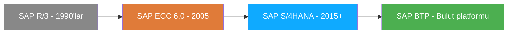
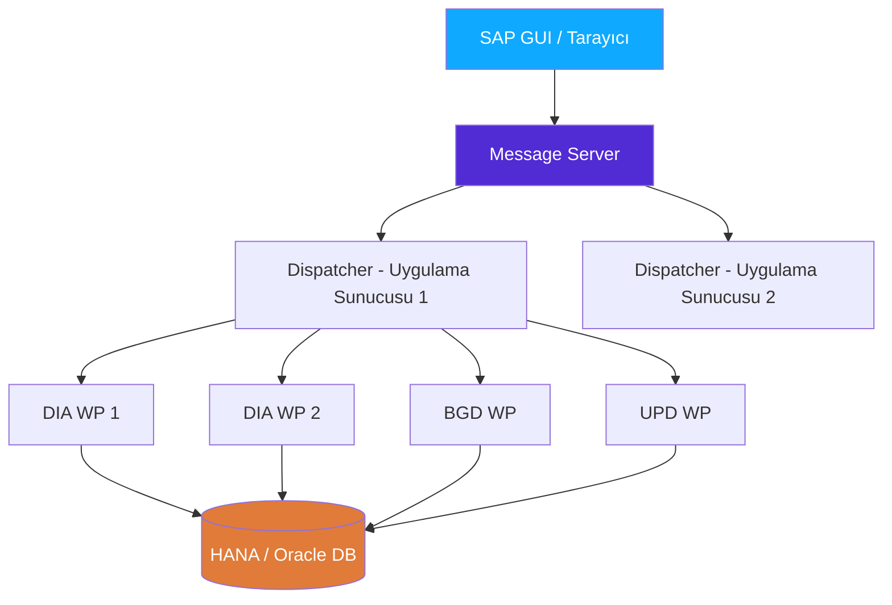

# Kısım 1: Bir Geliştirici İçin SAP & ERP

> *"Tek bir satır ABAP yazmadan önce, tüm sistemin hangi problemi çözdüğünü bilmeniz gerekir."*

---

## ☕ Bu kısım neden var?

SAP öğreticilerinin çoğu doğrudan koda atlar. Oysa söz dizimi açısından mükemmel ABAP yazabilir ve yine de SAP'ın *ne işe yaradığını* ve *neden böyle inşa edildiğini* anlamadığınız için ekipte tamamen işlevsiz kalabilirsiniz. Stand-up'ta beş dakika geçince fonksiyonel bir danışman size "material master", "client", "mandant", "production system" gibi terimler fırlatmaya başlar — ve bu kelimelerin yerli yerine oturması gerekir.

Bu kısım oryantasyon uçuşudur. Henüz kod yok. Sadece Bölüm II'deki her şeyin gerçekten kafanıza yapışması için ihtiyaç duyduğunuz zihinsel model.

---

## 1.1 🗺️ ERP Aslında Nedir?

### 1️⃣ Benzetme

Bir şirket hayal edin — diyelim ki araç parçaları üreten bir imalatçı. Şunlara sahipler:

- Ham madde ve bitmiş ürünleri takip eden **depo ekibi**
- Müşteri siparişlerini alan **satış ekibi**
- Fatura gönderen ve ödemeleri izleyen **finans ekibi**
- Neyin ne zaman üretileceğini planlayan **üretim ekibi**

Şimdi bu ekiplerin her birinin *kendi ayrı yazılımını* kullandığını, her birinin kendi veritabanına sahip olduğunu hayal edin. Satış, Salesforce'a sipariş kaydeder. Depo stoğu eski bir Access veritabanında tutar. Finans faturayı QuickBooks'ta işler. Üretim çizelgesini bir Excel tablosunda yönetir.

Her gün toplantılar yapılır — gerçekten toplantılar — sadece şu soruyu yanıtlamak için: *O siparişi karşılayacak yeterli stoğumuz var mı?* Çünkü hiçbir sistemin diğer sistemlerle haberi yok. Veriler kopyalanır, e-postayla iletilir ve elle uzlaştırılır. Kaotiktir.

**ERP (Enterprise Resource Planning)** sistemi bunu tek bir fikirle çözer: **tüm şirket için tek ortak veritabanı.** Satış ekibi bir sipariş kaydettiğinde, depo talebi anında görür. Depo sevkiyat yaptığında, finans bunu görür ve fatura kesilebilir. Finans ödeme aldığında, kasa pozisyonu gerçek zamanlı güncellenir. Tablolar yok. Senkronizasyon toplantıları yok. Tek bir gerçek kaynağı.

SAP, dünyada en yaygın kullanılan ERP'dir. Hepsi bu kadar. SAP budur.

### 2️⃣ Bunu Zaten Biliyorsun (Veri Mimarisi Açısından)

Microservice dünyasında çalıştıysanız tam tersi kalıbı biliyorsunuzdur:

```csharp
// Microservice dünyası: her servis kendi veritabanına sahip
// OrderService → orders_db (PostgreSQL)
// InventoryService → inventory_db (PostgreSQL)
// FinanceService → finance_db (PostgreSQL)

// Aralarında veri paylaşmak için:
// - REST çağrıları / mesaj kuyruları
// - Event-driven senkronizasyon
// - "Nihai tutarlılık" ödünleşimleri
// - Çok fazla altyapı
```

```python
# Python / Django dünyası: aynı kalıp
# Her uygulama models.py'a ve kendi DB migration'larına sahip
# Uygulamalar arası sorgular için serializerlar, API çağrıları ya da
# şemalar arasında can sıkıcı DB join'leri gerekir
```

Microservice'ler ölçeklenebilirlik ve ekip özerkliği sağlar. Ama *iş süreci bütünlüğünü* zorlaştırır — ödeme eventi tetiklenirse ama stok güncellemesi başarısız olursa ne olur?

### 3️⃣ SAP'taki Karşılığı

SAP'ın yanıtı microservice'lerin tam tersidir: **tüm modüllerin yazdığı ve okuduğu tek bir büyük, sıkı entegre veritabanı.** Satış, Finans, Lojistik, İK — hepsi aynı temel HANA (ya da eski sistemlerde Oracle/MSSQL) veritabanına konuşur.

```
     Satış Siparişi      Mal Çıkışı          Fatura Kayıtlı
         │                   │                    │
         ▼                   ▼                    ▼
   ┌──────────┐       ┌──────────────┐    ┌──────────────┐
   │  VBAK    │       │    MKPF      │    │    BKPF      │
   │  VBAP    │       │    MSEG      │    │    BSEG      │
   │  (SD)    │       │    (MM/IM)   │    │    (FI)      │
   └──────────┘       └──────────────┘    └──────────────┘
         │                   │                    │
         └───────────────────┴────────────────────┘
                             │
                    TEK SAP VERİTABANI
```

Bir satış siparişi (tablo `VBAK`) oluşturulduğunda, mal çıkışı yapıldığında (tablo `MKPF`/`MSEG`) ve fatura kaydedildiğinde (tablo `BKPF`/`BSEG`) — tüm bunlar aynı veritabanında, tamamen tutarlı biçimde bulunur. Şirketlerin SAP'a en kritik süreçlerini emanet etmesinin nedeni budur.

> ⚠️ **C#/Python tuzağı:** *Servisler*i iş birimi olarak düşünmeye alışkınsınızdır. SAP'ta *iş belgeleri*ni (siparişler, teslimler, faturalar) birim olarak düşünün. Kod, bu belgeleri oluşturmak, doğrulamak, değiştirmek ve üzerinde rapor üretmek için vardır.

> 🧭 **İş hayatında:** Bir paydaş "satış siparişi stoğu güncellemiyor" dediğinde, bu "satış servisinde" bir hata değildir — birden fazla SAP modülünü kapsayan bir belge akışı sorunudur. Bu zihinsel modeli anlamak, saatler sürebilecek kafa karışıklıklarını ortadan kaldırır.

---

## 1.2 🗺️ SAP ECC vs S/4HANA vs SAP BTP — Genel Tablo

Her mülakatta duyacağınız soru şudur: *"S/4 deneyiminiz var mı?"* İşte bunun dürüst karşılığı.



### SAP ECC (ERP Central Component) — "eski dünya"

ECC 6.0, büyük şirketlerin bugün hâlâ çalıştırdığı versiyondur. 1990'lı ve 2000'li yıllarda inşa edilmiş olup geleneksel veritabanlarının (Oracle, MSSQL, DB2) üzerinde çalışır. Çok olgun, çok kararlı, çok büyük bir monolitik yapı olarak düşünün. Milyonlarca müşteri. Binlerce özelleştirme. Çalışıyor.

SAP, **ECC için ana bakımı 2027'de sonlandıracağını duyurdu** (ücret ödeyen müşteriler için 2030'a kadar uzatıldı). Bu yüzden herkes yavaş yavaş S/4HANA'ya geçiyor. "Yavaş yavaş" demek, ECC sistemleri üzerinde yıllarca çalışacaksınız demektir.

### SAP S/4HANA — "yeni dünya"

S/4HANA, özellikle **SAP HANA** (SAP'ın kendi bellek içi sütun tabanlı veritabanı) üzerinde çalışmak için tasarlanmış yeni nesil ERP'dir. Geliştirici için büyük farklar:

| Konu | ECC | S/4HANA |
|------|-----|---------|
| Veritabanı | Oracle / MSSQL / DB2 / HANA | Yalnızca HANA |
| Veri modeli | Karmaşık (çok sayıda yedekli özet tablo) | Basitleştirilmiş (daha az tablo, daha fazla CDS view) |
| ABAP versiyonu | ~7.50'ye kadar | 7.54+ yeni söz dizimi ile |
| Varsayılan UI | SAP GUI (transaction tabanlı) | Fiori (tarayıcı tabanlı) |
| Programlama modeli | Klasik ABAP + OOP | RAP (RESTful Application Programming) |
| Kullanılabilirlik | On-premise | On-premise veya bulut (RISE) |

Kilit basitleştirme: ECC'de `BSEG` (muhasebe satır kalemleri) gibi tablolar, performans için özet tablolara yayılmıştı (`BSIS`, `BSAS`, `BSID` vb.). S/4'te HANA, `ACDOCA`'yı (evrensel günlük) doğrudan sorgulamak için yeterince hızlıdır. Daha az tablo, daha temiz model.

### SAP BTP (Business Technology Platform) — bulut katmanı

BTP, SAP'ın platform hizmeti bulut teklifleridir. SAP'ın Azure veya AWS'ye yanıtı olarak düşünün — ERP'nin *dışında* uzantılar, entegrasyonlar ve yeni uygulamalar oluşturabileceğiniz bir yer. BTP'de Node.js, Java, Python veya ABAP Cloud yazabilirsiniz.

Bir ABAP geliştiricisi için **SAP BTP ABAP Environment**, en ilgili BTP servisidir — herhangi bir Basis altyapısı yönetmeden bulutta modern ABAP yazdığınız ve dağıttığınız, bulutta barındırılan bir ABAP sistemidir.

> 🧭 **İş hayatında:** Bir iş ilanı "S/4HANA deneyimi tercih edilir" diyorsa, şunları bilmenizi istiyorlar demektir: HANA'ya özgü CDS view'ları, ACDOCA tablosu, modern ABAP söz dizimi ve Fiori. "BTP" diyorsa muhtemelen ABAP Cloud, RAP ve OData servisleri istiyorlardır. Yalnızca ECC deneyiminiz varsa paniğe kapılmayın — ABAP çekirdeğinin %80'i aynıdır.

---

## 1.3 🗺️ Client (Mandant) Kavramı — Multi-Tenancy Gibi Ama Sisteme Gömülü

### 1️⃣ Benzetme

Her SAP sisteminde birden fazla **client** (Almanca: *Mandant*) bulunur. Client'ı, aynı fiziksel veritabanı içinde yaşayan tamamen ayrı bir şirket olarak düşünün. Client 100, "Üretim — gerçek iş verisi" olabilir. Client 200, "Kalite Güvencesi" olabilir. Client 300, "Geliştirme / Sandbox" olabilir. Aynı veritabanı sunucusu, tamamen ayrı veriler.

SAP GUI'ye giriş yaptığınızda ilk yazdığınız şey client numarasıdır. Sonra kullanıcı adınız. Ardından şifreniz. Client, *gördüğünüz her şeyi* şekillendirir — özelleştirme ayarları, iş verileri, kullanıcı yetkilendirmeleri.

### 2️⃣ Bunu Zaten Biliyorsun

.NET/Python dünyasında multi-tenancy'nin uygulama katmanında uygulandığını görmüşsünüzdür:

```csharp
// ASP.NET Core'da yaygın multi-tenancy kalıpları
// Seçenek A: tenant başına ayrı veritabanı
services.AddDbContext<AppDbContext>(opts =>
    opts.UseSqlServer(GetConnectionStringForTenant(tenantId)));

// Seçenek B: tenant discriminator sütunu olan paylaşımlı DB
public class Order
{
    public int TenantId { get; set; }   // ← discriminator
    public string OrderNumber { get; set; }
    // ...
}

// Her sorgu TenantId'ye göre filtrelenir
var orders = db.Orders.Where(o => o.TenantId == currentTenant.Id);
```

```python
# Django multi-tenancy (django-tenants kütüphanesi)
# Her tenant kendi şemasını alır ya da tenant_id sütunlu paylaşımlı şema kullanır
class Order(models.Model):
    tenant = models.ForeignKey(Tenant, on_delete=models.CASCADE)
    order_number = models.CharField(max_length=20)
```

### 3️⃣ ABAP / SAP'taki Karşılığı

SAP B seçeneğini kullanır — ama bu *isteğe bağlı* değildir ve uygulama tarafından eklenmez. SAP'taki her saydam tablonun ilk birincil anahtar alanı **MANDT** (client)'dir. Nokta. İş verisi tabloları için istisna yoktur.

```abap
" MARA (malzeme master) tablo tanımının gerçekte nasıl göründüğü:
" SE11 → Tablo MARA → Alanlar
"
" MANDT  MANDT   3   Client       ← HER ZAMAN ilk, HER ZAMAN PK'nin parçası
" MATNR  MATNR  18   Malzeme Numarası
" ERSDA  DATUM   8   Oluşturulma Tarihi
" ERNAM  USNAM  12   Oluşturan
" ...

" ABAP'ta SELECT yaptığınızda, client otomatik filtrelenir:
SELECT * FROM mara INTO TABLE @DATA(lt_materials)
  WHERE matnr = '000000000000000001'.
" SAP örtük olarak ekler: AND mandt = sy-mandt
" sy-mandt mevcut giriş client'ıdır — ABAP bunu sizin için ekler.
```

`SY-MANDT` sistem değişkeni her zaman giriş yaptığınız client'ı tutar. WHERE koşulunuza `MANDT = SY-MANDT` eklemenize gerek yoktur — Open SQL bunu arka planda yapar. Ama bunu *bilmeniz* gerekir, çünkü:

1. SE16N'de (veri tarayıcı) client 100'ün verisi, client 200'den görünmez.
2. Nadiren ihtiyaç duyulan çapraz-client SELECT için (yapılandırma/özelleştirme), `CLIENT SPECIFIED` kullanırsınız.
3. Mülakatlarda bu sorulur — bilmeyen adaylar sandbox'ta "verimi neden göremiyorum?" sorunlarında sıklıkla bocalar.

> ⚠️ **C#/Python tuzağı:** Normal bir SELECT ile başka bir client'ın verisini yanlışlıkla sorgulayamazsınız — MANDT filtresi otomatiktir. Ama ham yerel SQL (EXEC SQL veya ADBC) yapıyorsanız, otomatik filtreleme *gider*. İş verileri için Open SQL'i asla atlayın.

> 🧭 **İş hayatında:** DEV sisteminiz neredeyse her zaman client 100'dür. QA, client 200'dür (ya da benzeri). Production, client 300'dür (ya da benzeri). Kod aralarında taşınır (bkz. Kısım 3). Ama iş verileri bu şekilde taşınmaz — kendi client'ında kalır. "DEV'de test verisi oluşturdum ve QA'da yok" sorusu, yeni katılanların klasik kafa karışıklığı anıdır.

---

## 1.4 🛠️ ABAP Nerede Çalışır: NetWeaver Application Server

### 1️⃣ Benzetme

Bir ASP.NET Core uygulaması yazdığınızda bir istek hattınız olur: client → Kestrel (veya IIS) → middleware → controller → veritabanı. İstekler gelir, işçi thread'leri tarafından işlenir, yanıtlar çıkar.

SAP'ın **SAP NetWeaver Application Server for ABAP (AS ABAP)** adında yapısal olarak benzer bir şeyi var. ABAP kodunuzu yürüten, oturumları yöneten, veritabanı bağlantılarını işleyen ve SAP GUI istemcilerine hizmet eden çalışma zamanıdır.

### 2️⃣ Bunu Zaten Biliyorsun

```
  ASP.NET Core / Python WSGI
  ────────────────────────────────────────────────────
  Tarayıcı / client
       │
       ▼
  Ters proxy (nginx / IIS)
       │
       ▼
  Kestrel / Gunicorn   ← süreç yöneticisi, birden fazla işçi süreç
       │
  İşçi thread'leri (ThreadPool)  ← her biri bir HTTP isteğini işler
       │
       ▼
  Controller / View / WSGI uygulaması
       │
       ▼
  Veritabanı (SQL Server / PostgreSQL)
```

### 3️⃣ ABAP / SAP AS'taki Karşılığı

```
  SAP NetWeaver AS ABAP
  ────────────────────────────────────────────────────
  SAP GUI / Tarayıcı (Fiori)
       │
       ▼
  Message Server  ← yük dengeleyici gibi, girişleri uygulama sunucusuna yönlendirir
       │
       ▼
  Dispatcher  ← Kestrel/Gunicorn gibi — istekleri alır, kuyruğa koyar
       │
  Work Process'ler (WP)  ← gerçek ABAP yürütücüleri (aşağıda 6 tür)
       │
       ▼
  Veritabanı (HANA / Oracle / MSSQL)
```

**Work process türleri** — bunları SM50 (süreç genel bakış) ve SM66 (global WP genel bakış)'ta görürsünüz:

| Tür | Kısa Ad | Ne Yapar | C# Benzetmesi |
|-----|---------|----------|---------------|
| Dialog | DIA | Etkileşimli SAP GUI ekran isteklerini işler | HTTP istek işçisi |
| Background | BGD | Zamanlanmış işleri çalıştırır (toplu programlar) | Arka plan servisi / Hangfire işi |
| Update | UPD | Asenkron veritabanı güncellemeleri | Mesaj kuyruğu tüketicisi |
| Enqueue | ENQ | Kilit yönetimi (eşzamanlı veri bozulmasını önler) | Dağıtık kilit yöneticisi |
| Spool | SPO | Yazdırma ve çıktı işleri | Yazıcı kuyruğu |
| Message | MSG | Uygulama sunucusu içi yönlendirme (sistem başına bir tane) | Yük dengeleyici süreci |

> ⚠️ **C#/Python tuzağı:** SAP'ta "sınırsız işçi thread'i" kavramı yoktur. Dialog work process sayısı, Basis tarafından yapılandırılan sabit, küçük bir sayıdır (uygulama sunucusu başına genellikle 10–30). **Uzun süren işlemler diyalog içinde çalıştırılmamalıdır.** Bunun için arka plan işleri (transaction SM36/SM37) vardır — tıpkı C# web uygulamasında yavaş işlemleri bir kuyruğa iteceğiniz gibi.

> 🧭 **İş hayatında:** Kullanıcılar "SAP yavaş / donmuş" diye şikayet ettiğinde, çoğunlukla tüm dialog work process'leri dolmuş durumdadır. SM50, Basis'in bunu teşhis ettiği yerdir. Bunu bilmek, Basis meslektaşlarıyla sohbette sizi kıdemli gösterir.



### Bellek modeli — program bağlamı

C#/Python geliştiricilerini şaşırtan bir şey daha: ABAP programları, klasik diyalog programlamada **varsayılan olarak ekran adımları arasında durumsuz (stateless)** kalır. Sunucuya her gidiş-dönüş, *farklı* bir work process tarafından işlenebilir. Kullanıcının oturum verisi ("ABAP belleği" veya "roll area" olarak adlandırılır), adımlar arasında paylaşılan bellekte serileştirilip saklanır.

Bu, ASP.NET oturum durumunun çalışma biçimine benzer — ama çok daha katıdır ve Module Pool (diyalog) programlarını nasıl tasarladığınızı doğrudan etkiler (Kısım 9).

---

## 1.5 🧭 Bir ABAP Ekibinde Günün Nasıl Geçtiği

Teknolojiyi bilmek gereklidir ama yeterli değildir. Girdiğiniz *insan sistemini* de anlamanız gerekir.

### Ekipteki Roller

| Rol | Ne Yapar | Sizinle İlişkisi |
|-----|----------|-----------------|
| **ABAP Geliştirici** | Siz. ABAP kodu yazar ve hata ayıklar. | — |
| **Fonksiyonel Danışman** | *İş sürecini* bilir (SD, MM, FI uzmanı). Fonksiyonel şartnameler yazar, SAP'ı yapılandırır. | Birincil gereksinim kaynağınız. |
| **Basis Yöneticisi** | SAP operasyon/altyapı. Sistem ortamını, transportları, performansı, kullanıcı erişimini yönetir. | Sistem düzeyinde bir şeyler bozulduğunda başvurduğunuz kişi. |
| **Proje Yöneticisi / SAP Mimarı** | Projeyi yönetir, tasarım kararları verir. | Tasarım soruları için eskalasyon yolu. |
| **Son Kullanıcı / Anahtar Kullanıcı** | SAP'ı her gün gerçekten kullanan kişiler. Hata bildirir, UAT'a katılır. | Test edenler. Onayları önemlidir. |

### ABAP Geliştiricisinin Tipik İş Akışı

```
Sabah stand-up
  │
  ├─ JIRA / ServiceNow / SAP Solution Manager'dan bilet al
  │     "Satış siparişi raporuna yeni alan ekle"
  │
  ├─ Fonksiyonel şartnameyi oku (fonksiyonel danışman tarafından yazılmış)
  │     "VBAK-AUART = 'ZOR' ise, VBKD-BSTKD alanını 5. sütunda göster"
  │
  ├─ DEV client'ında geliştir (SE38 / Eclipse'te ADT)
  │     ABAP yaz, /h breakpoint'leriyle hata ayıkla
  │
  ├─ DEV'de birim test et
  │     Derleniyor mu? Test verisi üzerinde çalışıyor mu?
  │
  ├─ Transport isteğini serbest bırak (SE10)
  │     Değişikliğiniz bir Transport Request'e (TR) paketlendi
  │
  ├─ QA'ya transport et (Basis STMS'i çalıştırır)
  │     Basis, TR'yi DEV'den QA sistemine taşır
  │
  ├─ QA'da UAT
  │     Fonksiyonel danışman + anahtar kullanıcılar QA üzerinde test eder
  │
  └─ PRD'ye (Üretime) transport et
        Onaydan sonra Basis, TR'yi Üretime taşır
```

### Transport sistemi — "git push to prod"unuzun karşılığı

CI/CD dünyasından gelen bir geliştirici için en büyük zihinsel dönüşüm şudur: **`git push` yoktur**. Kod değişiklikleriniz, **SE10** transaction'ında yönetilen **Transport Request'ler (TR)** aracılığıyla ilerler. Transport request, **Transport Management System (STMS)** aracılığıyla DEV → QA → PRD arasında bir birim olarak hareket eden kilitli bir değişiklik demeti (ABAP programları, tablo tanımları, özelleştirme ayarları) gibidir.

Bunu şöyle düşünün:

```
  Git tabanlı CI/CD dünyası:
  git commit → git push → PR review → merge → CI pipeline → deploy to prod

  SAP transport dünyası:
  ABAP değişikliği kaydedildi → TR'ye atandı (commit gibi) →
  TR serbest bırakıldı ("push" gibi) → Basis QA'ya import etti ("staging'e deploy" gibi) →
  UAT onayı → Basis PRD'ye import etti ("prod'a deploy" gibi)
```

> ⚠️ **C#/Python tuzağı:** Üretime siz "deploy etmiyorsunuz". Basis yapıyor. Sizin işiniz "transport request'i serbest bırak" aşamasında biter. Başta tuhaf hissedebilir, ama aslında bu bir güvenlik ağıdır — hiçbir geliştirici kontrollü bir süreç olmadan üretimi doğrudan dokunmaz.

> 🧭 **İş hayatında:** Yeni geliştiricilerin en yaygın hatası **yanlış client'ta çalışmaktır**. Her zaman şunu doğrulayın: DEV client'ındayım? Çalışmamı bir transport request'e atadım? QA client'ında geliştirirseniz değişiklikleriniz bir sonraki import'ta yok olur. SE10 dostunuzdur — sürekli kontrol edin.

### Fonksiyonel şartname — gereksinim belgeniz

Kullanıcı hikayeleri ve Figma mockup'larına sahip web ürün ekiplerinden farklı olarak, SAP ekipleri genellikle **fonksiyonel şartnamelerle** çalışır — bazen Word belgeleri, bazen biletler, bazen SAP Solution Manager dokümantasyonu. Fonksiyonel danışman bunları yazar. İş mantığını, ilgili tablo alanlarını, kullanıcıların programı çalıştıracağı transaction'ı ve çıktının nasıl görünmesi gerektiğini açıklar.

Bir fonksiyonel şartnameyi *okumayı* öğrenmek — özellikle hangi tablo ve alanların yer aldığını saptamak — hiçbir ABAP söz dizimi öğreticisinin öğretmediği temel bir ABAP geliştirici becerisidir.

---

## 🧠 Özet

- **ERP = tüm şirket için tek ortak veritabanı.** SAP, dünyada en yaygın kullanılan ERP'dir. Geliştirici olarak, iş süreçlerinin (siparişler, faturalar, teslimler) o paylaşılan veri üzerinden doğru akmasına yardımcı şeyler inşa ediyorsunuz.
- **ECC eski dünya** (hâlâ dominant), **S/4HANA çoğu şirketin hedefi**, **BTP** ise uzantılar için SAP'ın bulut platformu. Mülakatlarda farkı bilin.
- **Client (Mandant)**, SAP'ın yerleşik multi-tenancy'sidir. Her tablonun bir MANDT sütunu vardır. DEV/QA/PRD ayrı client'lardır. ABAP'ta `SY-MANDT` size mevcut client'ı verir.
- **AS ABAP**, kodunuzu work process'ler (Dialog, Background, Update vb.) aracılığıyla çalıştırır — sayıları sonludur. Ağır işleri arka plan işlerine taşıyın, diyalog değil.
- **Transport, deployment değil.** Kodunuz, Transport Request'ler aracılığıyla DEV → QA → PRD'ye ilerler (SE10/STMS). Import'ları Basis çalıştırır.
- **Fonksiyonel danışmanlar, PM'iniz + analistinizdir.** Şartnamelerini dikkatle okuyun — kodlayacağınız tablo adları ve alan mantığını içerirler.

---

*[← İçindekiler](../content.md) | [← Önceki: Önsöz](00-preface.md) | [Sonraki: Jargon Olmadan SAP Modülleri →](02-sap-modules.md)*
