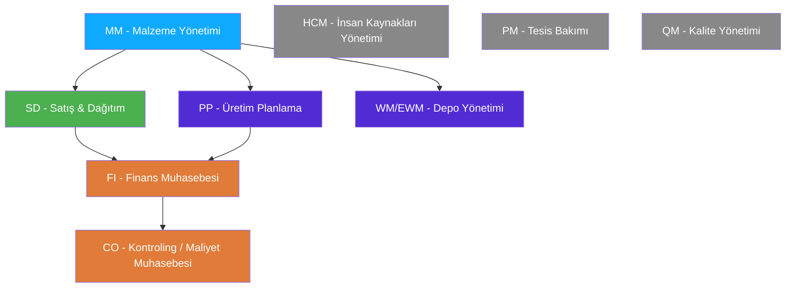

# Kısım 2: Jargon Olmadan SAP Modülleri

> *"Fonksiyonel bir uzman olmak zorunda değilsiniz — ama dili konuşmanız gerekiyor."*

---

## ☕ Bunu neden bilmeniz gerekiyor?

Siz geliştiricisisiniz. Kod yazıyorsunuz, iş süreci değil. Peki "MM" ya da "FI"'nin ne anlama geldiğini neden bilmeniz gerekiyor?

Çünkü üzerinde çalışacağınız her ABAP bileti modül diliyle çerçevelenmiştir. Bir fonksiyonel danışman size şöyle bir şartname verecektir:

> *"SD satış siparişi oluşturulduğunda, MM malzeme masterında MRP tipini kontrol et; 'PD' olarak ayarlıysa PP üretim siparişi oluşturmayı tetikle ve onay gelene kadar FI kaydını bloke et."*

SD, MM, MRP, PP ve FI'nın ne anlama geldiğini — en azından kabaca — bilmiyorsanız doğru sorular soramazsınız. Şartnameyi yanlış anlayıp yanlış kod yazarsınız. Bir mülakatta biri "MM deneyiminiz var mı?" diye sorduğunda evet mi yoksa hayır mı diyeceğinizi bilmeniz gerekir.

Bu kısım size SAP modüllerini *geliştirici gözüyle* anlatır — fonksiyonel danışmanların yıllarca kazandığı derin fonksiyonel bilgiyi değil, ama konuşmayı sürdürebilecek ve doğru tabloları bulabilecek kadarını.

---

## 2.1 🗺️ Temel Modüller — Her Biri Tek Cümleyle

SAP modüllerini DDD'deki bounded context'ler ya da iyi tasarlanmış bir mimarideki microservice'ler gibi düşünün — her biri bir iş alanını kapsar, kendi verisi, kendi sözlüğü ve kendi transaction seti vardır.



### MM — Materials Management (Malzeme Yönetimi)
*Mal satın alma ve stok yönetimiyle* ilgili her şey. Satın alma siparişleri, mal girişleri, satıcı faturaları (fatura doğrulama), stok yönetimi ve **malzeme master** (şirketin satın aldığı, ürettiği veya sattığı her ürün için merkezi kayıt).

**MM'e ne zaman dokunursunuz:** stok yönetimi, kodla satın alma siparişi oluşturma veya herhangi bir gelen mal akışında.

---

### SD — Sales & Distribution (Satış & Dağıtım)
*Müşterilere satışla* ilgili her şey. Satış siparişleri, teslimler, sevkiyatlar, faturalandırma, fiyatlandırma, müşteri master. Klasik akış: Talep → Teklif → **Satış Siparişi** → **Teslimat** → **Mal Çıkışı** → **Fatura Belgesi**.

**SD'ye ne zaman dokunursunuz:** bir müşterinin sipariş verdiği, mal gönderildiği veya fatura oluşturulduğu her durumda.

---

### FI — Financial Accounting (Finans Muhasebesi - Dışa Dönük)
Genel muhasebe defteri, borçlar hesabı, alacaklar hesabı, banka muhasebesi, sabit kıymet muhasebesi. Finansal etkisi olan her iş olayı, `BSEG` tablosunda borç ve alacak satır kalemleri içeren bir **belge** oluşturur.

**FI'ya ne zaman dokunursunuz:** finansal belge kaydederken, hesap bakiyelerini okurken veya para hareketi içeren herhangi bir entegrasyonda.

---

### CO — Controlling (Kontroling - İç Muhasebe)
Finans'ın şirkete *içeriden* baktığı yer — maliyet merkezleri, kâr merkezleri, iç siparişler, ürün maliyetleme. FI "vergi dairesine ne bildirdik?" sorusunun yanıtıdır; CO ise "para şirket içinde gerçekte nereye gitti?"nin.

**CO'ya ne zaman dokunursunuz:** maliyet tahsis ederken, kârlılık rapor ederken veya maliyet merkezi atamalarıyla çalışırken.

---

### PP — Production Planning (Üretim Planlama)
İmalat sürecini yönetme. Malzeme listeleri (BOM), rotalar, üretim siparişleri, MRP (Material Requirements Planning — neyin ne zaman yapılacağını hesaplayan algoritma). MM satın almakla ilgiliyse, PP yapmakla ilgilidir.

**PP'ye ne zaman dokunursunuz:** atölye sistemleriyle entegrasyon, üretim sipariş teyitleri veya kapasite planlama.

---

### HCM — Human Capital Management (İnsan Kaynakları Yönetimi - artık SAP SuccessFactors)
Çalışanlarla ilgili her şey — bordro, zaman yönetimi, organizasyon yapısı, işe alım. Eski sistemlerde SAP HR/HCM olarak geçer. Modern SAP bunu bulut ortamındaki **SuccessFactors**'a taşımıştır.

**HCM'e ne zaman dokunursunuz:** İK entegrasyonları, bordro arayüzleri veya başlık/sayısı raporlama.

---

### PM — Plant Maintenance (Tesis Bakımı)
Fiziksel varlıkları yönetme — makineler, tesisler, araçlar. Bakım siparişleri, ekipman master, arıza bildirimleri. Makineler için "servis bileti" modülü olarak düşünebilirsiniz.

**PM'e ne zaman dokunursunuz:** bakım iş akışları, IoT'den SAP'a entegrasyonlar veya varlık yaşam döngüsü raporlaması.

---

### QM — Quality Management (Kalite Yönetimi)
Muayene planları, kalite bildirimleri, mal girişi muayenesi, hata kaydı. MM (mal girişi) ile PP (üretim) arasında kalite kapıları sağlamak için konumlanmıştır.

**QM'e ne zaman dokunursunuz:** muayene iş akışları veya kaliteyle ilgili raporlama.

---

### WM/EWM — Warehouse Management / Extended Warehouse Management (Depo Yönetimi)
Raf düzeyinde depo yönetimi — hangi raf, hangi göz, hangi transfer siparişi. WM klasik modüldür; EWM daha güçlü modern versiyondur.

**WM/EWM'e ne zaman dokunursunuz:** depo otomasyon arayüzleri (barkod okuyucuları, bant sistemleri, RFID).

---

## 2.2 🔁 Modüller Veriyi Nasıl Paylaşır — Belge Akışı

SAP entegrasyonunda tek en önemli kavram şudur: **belge akışı**.

### 1️⃣ Benzetme

Amazon'dan bir şey satın almayı düşünün. Tek bir müşteri eylemi ("sipariş ver"), bir zincir reaksiyonu başlatır: sipariş kaydı, ardından depo toplama görevi, ardından kargo etiketi, ardından taşıyıcı teslim kaydı, ardından ödeme tahsilatı, ardından muhasebe girişi. Bir tıklama, birbiriyle bağlantılı pek çok belge.

SAP tam olarak böyle çalışır — ama kurumsal iş için. Bir iş işlemi, izlenebilir bir zincirde birden fazla modülde birbiriyle bağlantılı birden fazla belge oluşturur ve günceller.

### 2️⃣ Bunu Zaten Biliyorsun

```csharp
// Microservice dünyasında bu bir event zinciri olurdu:
// OrderPlaced eventi → InventoryReserved eventini tetikler
//                   → PaymentProcessed eventini tetikler
//                   → ShipmentCreated eventini tetikler

// Her servis kendi alanını işler ve eventleri yayımlar.
// İzleme, birden fazla servis logu arasında correlation ID gerektirir.
```

```python
# Django / Python'da:
# Bunu sinyaller, Celery görevleri veya açık iş akışı orkestrasyonu olarak uygularsınız.
# Çapraz servis bağlantısı genellikle ayrı veritabanlarındaki foreign key'ler veya
# compensating transaction'larla bir saga kalıbı üzerinden sağlanır.
```

### 3️⃣ ABAP / SAP'taki Karşılığı

SAP'ta tüm zincir **tek bir veritabanı içindedir** ve belge numaralarıyla bağlantılıdır. `VA03` (satış siparişini görüntüle) transaction'ı size bir **belge akışı** düğmesi gösterir — tıklayın ve tekliften faturaya tüm zinciri, hepsi bağlantılı biçimde görün.

Klasik order-to-cash (sipariş-tahsilat) akışı:

```
VA01: Satış Siparişi Oluştur (VBAK/VBAP)
  │
  ↓
VL01N: Giden Teslimat Oluştur (LIKP/LIPS)
  │
  ↓
VL02N: Mal Çıkışı Kaydet → stok azalışını tetikler (MSEG) + FI kaydı (BKPF/BSEG)
  │
  ↓
VF01: Fatura Belgesi Oluştur (VBRK/VBRP) → FI faturasını tetikler (BKPF/BSEG)
  │
  ↓
F-28: Müşteri ödemesi alındı (BKPF/BSEG kapatıldı)
```

Her adım bir önceki adıma referans veren belgeler oluşturur. Bağlantı, `VBFA` (Satış Belgesi Akışı) gibi tablolarda bulunur — "SD belgesi X, SD belgesi Y ile devam etti" diyen tek bir tablo.

```abap
" Bir satış siparişinin belge akışını oku:
SELECT vbelv  " önceki belge numarası
       posnv  " önceki kalem
       vbeln  " sonraki belge numarası
       posnn  " sonraki kalem
       vbtyp_n " sonraki belgenin belge tipi
  FROM vbfa
  INTO TABLE @DATA(lt_flow)
  WHERE vbelv = '0000001234'.  " satış sipariş numaranız

" Bu size şunu verir: sipariş → teslimat → fatura, hepsi bağlantılı.
```

> 🧭 **İş hayatında:** Bir kullanıcı "fatura belgesi yanlış" dediğinde — kod yazmadan önce satış siparişinde `VA03` çalıştırın, **Belge Akışı** düğmesine tıklayın ve zinciri takip edin. Zamanın %90'ında tek bir satır kod yazmadan önce bunun SD yapılandırma sorunu mu, MM stok problemi mi, yoksa FI kayıt hatası mı olduğunu belirleyeceksiniz.

---

## 2.3 🗺️ Hangi Tablolar Hangi Modüle Aittir

Biri bir modül adı söylediğinde zihinsel olarak başvuracağınız tablo budur. İlk mülakatınızdan önce bunları ezberleyin.

| Modül | Temel Tablolar | Ne Depolar | Görüntüleme Transaction'ı |
|-------|---------------|-----------|--------------------------|
| **MM** | `MARA` | Malzeme master — genel veri (malzeme numarası, tipi, birimi) | MM03 / SE16N |
| **MM** | `MARC` | Malzeme master — fabrikaya özgü veri (MRP tipi, depolama) | MM03 / SE16N |
| **MM** | `MARD` | Malzeme master — depo konumu stok seviyeleri | MMBE / SE16N |
| **MM** | `EKKO` | Satın alma belgesi başlığı (satın alma siparişleri) | ME23N |
| **MM** | `EKPO` | Satın alma belgesi kalemi | ME23N |
| **MM** | `MSEG` | Malzeme belgesi kalemleri (mal hareketleri) | MB03 |
| **MM** | `MKPF` | Malzeme belgesi başlığı | MB03 |
| **SD** | `VBAK` | Satış belgesi başlığı (satış siparişleri, teklifler) | VA03 |
| **SD** | `VBAP` | Satış belgesi kalemleri | VA03 |
| **SD** | `LIKP` | Teslimat başlığı | VL03N |
| **SD** | `LIPS` | Teslimat kalemleri | VL03N |
| **SD** | `VBRK` | Fatura belgesi başlığı | VF03 |
| **SD** | `VBRP` | Fatura belgesi kalemleri | VF03 |
| **SD** | `VBFA` | Satış belgesi akışı (belgeleri bağlar) | VA03 → Belge Akışı |
| **SD** | `KNA1` | Müşteri master — genel veri | XD03 |
| **FI** | `BKPF` | Muhasebe belgesi başlığı | FB03 |
| **FI** | `BSEG` | Muhasebe belgesi satır kalemleri | FB03 |
| **FI** | `SKA1` | Genel muhasebe hesap master (hesap planı) | FS00 |
| **FI** | `SKAT` | Genel muhasebe hesap açıklamaları | FS00 |
| **FI/S4** | `ACDOCA` | Evrensel günlük (S/4HANA'da birçok FI tablosunun yerini alır) | SE16N |
| **MM** | `LFA1` | Satıcı master — genel veri | XK03 |
| **PP** | `AUFK` | Üretim sipariş başlığı | CO03 |
| **PP** | `AFKO` | Üretim sipariş başlığı (rota) | CO03 |
| **PP** | `MAST` | Malzeme ile BOM bağlantısı | CS03 |
| **HCM** | `PA0001` | İK master — organizasyonel atama | PA20 |
| **HCM** | `PA0002` | İK master — kişisel veri | PA20 |

> 💡 **Profesyonel ipucu:** Herhangi bir SAP sisteminde, **SE16N** (Tablo Tarayıcı) transaction'ı herhangi bir tablonun verisine doğrudan bakmanızı sağlar. Bir mülakat alıştırmasında, bir tablonun ne tuttuğunu anlamanın en hızlı yolu çoğunlukla budur. `SE16N` yazın → tablo adını girin → Enter'a basın.

> ⚠️ **C#/Python tuzağı:** Pek çok SAP tablosunun 1980'lerden kalma şifreli 4-6 karakterli adı vardır. `BKPF`, "BuchhaltungsKopF" (Almanca'da muhasebe başlığı) demektir. `VBAK` ise "VerkaufsBeleg AKtiv" (aktif satış belgesi). Almanca kökenbilgisini ezberlemek zorunda değilsiniz — sadece hangi modüle ait olduklarını ve ne temsil ettiklerini öğrenin.

---

## 2.4 🎯 "Modül Dilini" Konuşmanız Neden Gerekiyor?

### Modül bilgisi olmadan fonksiyonel şartname okumak

Bunu somutlaştıralım. İşte gerçek dünyadan bir fonksiyonel şartname alıntısı (anonimleştirilmiş):

> *"Gereksinim: Z-Rapor ZSD_OPEN_ITEMS — Her açık satış siparişi için (VBAK-GBSTK 'C'ye eşit değil), ilgili müşteri adını KNA1'den, malzeme açıklamasını MARA/MAKT'tan, teyit edilen teslim tarihini VBEP'ten ve bekleyen AR bakiyesini BSID'den oku. ALV olarak göster."*

Modülleri biliyorsanız bu şartname hemen eyleme dönüştürülebilir durumdadır:

| Şartnamenin dediği | Sizin bildiğiniz |
|-------------------|-----------------|
| `VBAK-GBSTK 'C'ye eşit değil` | SD: açık satış siparişi (GBSTK "Genel işleme durumu", 'C' = tamamlandı) |
| `KNA1` | SD: müşteri master — VBAK-KUNNR üzerinden birleştir |
| `MARA/MAKT` | MM: malzeme master + metin tablosu (MAKT dile göre açıklamaları içerir) |
| `VBEP` | SD: Satış belgesi planlama satırları (teyit edilen teslim tarihleri) |
| `BSID` | FI: alacak hesapları için açık kalemler |

Artık tek bir açıklayıcı soru sormadan SELECT yapısını kafanızda çizebilirsiniz. Bu modülleri bilmeseydiniz, tamamen çaresiz kalırdınız.

### Doğru açıklayıcı soruları sormak

Modül bilgisi aynı zamanda *hangi soruları soracağınızı* da söyler:

> "Şartname BSID'i AR bakiyesi için belirtiyor — müşteri için tüm faturalardaki toplam açık tutarı mı göstermemiz gerekiyor, yoksa yalnızca bu belirli satış siparişiyle bağlantılı tutarı mı? İtirazlı kalemleri (ödeme blokları) dahil etmeli miyiz?"

Bu, FI belge yapısını bilen bir geliştirici tarafından sorulan akıllıca bir sorudur. FI'yı bilmeyen bir geliştirici ya soruyu atlayacak (ve yanlış şey inşa edecek) ya da yanıtlanamayacak kadar muğlak bir şey soracaktır.

### Mülakatlarda

Neredeyse her ABAP geliştirici mülakatı modül sorularını içerir:

- *"BKPF hangi modüle aittir?"* (FI — muhasebe belgesi başlığı)
- *"VBAK ile VBAP arasındaki ilişki nedir?"* (satış belgesinin başlık/kalemi)
- *"Tüm açık satın alma siparişlerini bulmak istesem hangi tabloya bakarım?"* (EKKO/EKPO)
- *"MRP ne anlama gelir ve hangi modül çalıştırır?"* (Material Requirements Planning, PP)

Fonksiyonel danışman olmanıza gerek yok. Ama bu tür soruları güvenle yanıtlayacak kadar bilmeniz gerekiyor.

> 🧭 **İş hayatında:** Gördüğüm en iyi ABAP geliştiricileri en fazla söz dizimi bilenler değildir — fonksiyonel bir şartnameyi hızlıca okuyabilen, ilgili tüm tabloları tanımlayabilen ve kod yazmadan önce kesin açıklayıcı sorular sorabilen kişilerdir. Bu beceriyi mümkün kılan şey modül bilgisidir.

---

## 🧠 Özet

- **MM** (tedarik/stok), **SD** (satış/teslimat), **FI** (dış muhasebe), **CO** (iç maliyet kontrolü), **PP** (imalat), **HCM** (İK), **PM** (tesis bakımı), **QM** (kalite) — her biri kendi tablo ve transaction'larına sahip sınırlı bir iş alanıdır.
- **Belge akışı**, modüllerin veriyi paylaşma şeklidir: bir satış siparişi teslimatı tetikler, teslimat mal çıkışını tetikler, mal çıkışı muhasebe kaydını tetikler. Hepsi tek bir veritabanında bağlantılı. SD akışında gezinmek için `VBFA`'yı kullanın.
- **Ezberlenecek temel tablolar:** MARA/MARC (MM), VBAK/VBAP (SD), KNA1 (müşteriler), BKPF/BSEG (FI), EKKO/EKPO (satın alma). Hangi modüle ait olduklarını ve ne depoladıklarını bilin.
- **SE16N** tablo tarayıcınızdır — sürekli kullanın.
- **Fonksiyonel şartname okumak** temel bir beceridir. Modül bilgisi, `VBAK-GBSTK` ve `BSID` gibi şifreli alan adlarını ve tablo referanslarını eyleme dönüştürülebilir hale getirir.

---

*[← İçindekiler](../content.md) | [← Önceki: Bir Geliştirici İçin SAP & ERP](01-sap-erp-introduction.md) | [Sonraki: SAP Proje Türleri →](03-sap-project-types.md)*
