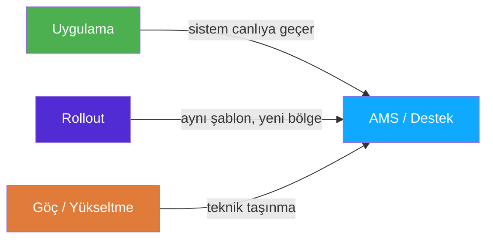
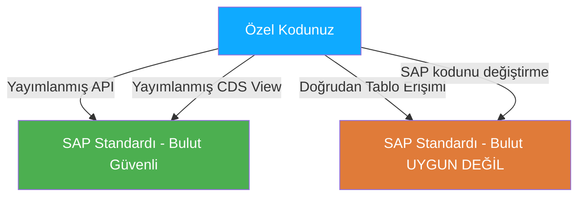
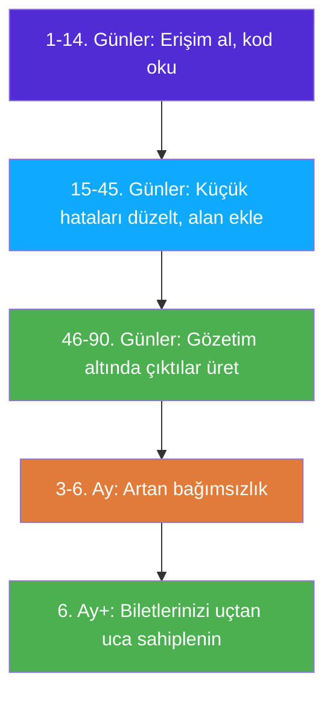

# Kısım 3: SAP Proje Türleri (ve Nereye Uyacağınız)

> *"Girdiğiniz proje türünü bilmek, nasıl hazırlanmanız gerektiğini tamamen değiştirir."*

---

## ☕ Kimsenin sormadığı — ama sorması gereken — mülakat sorusu

Çoğu aday teknik mülakata hazırlanır: ABAP söz dizimi, tablo adları, hata ayıklama. Neredeyse hiç kimse *bağlam* sorusuna hazırlanmaz: *"Ne tür SAP görevleri üzerinde çalıştınız?"*

Bu soru önemlidir çünkü greenfield bir S/4HANA uygulamasında çalışan bir ABAP geliştirici, 15 yıllık eski bir ECC sisteminde üretim desteği yapan birinden tamamen farklı işler yapar. Araçlar, baskı, çıktılar, en çok ihtiyaç duyulan beceriler — hepsi farklı.

Bu kısım, o farklı dünyaların haritasını çıkarır ve junior/yeni geliştiricilerin her birinde gerçekte ne yapmaları istendiğine dürüstçe bakar.

---

## 3.1 🗺️ Dört SAP Proje Türü

### 3.1.1 Uygulama (Greenfield / Brownfield)

**Nedir:** SAP'ı olmayan (ya da eski SAP'ını yenisiyle değiştiren) bir şirket, uygulama projesinden geçer. Bu genellikle büyük bir danışmanlık firmasından (Accenture, Deloitte, Capgemini, IBM vb.) büyük bir ekip artı müşterinin iç BT'sini içeren 18 ay ile 3 yıl arasında süren bir görevlendirmedir.

**Greenfield** sıfırdan başlamak anlamına gelir — mevcut özelleştirme yok. SAP'ı temiz bir halden yapılandırırsınız, standart SAP'ın gereksinimi karşılamadığı yerlerde özel Z-programlar inşa edersiniz ve sonunda canlıya geçersiniz.

**Brownfield** ise mevcut bir ECC sistemini S/4HANA'ya *mevcut özelleştirmeleri koruyarak* geçirmek anlamına gelir. Eski veriler taşınır; özel kod, S/4HANA'nın değişen veri modeline uyumlu olacak şekilde yeniden düzenlenir.

**Geliştiricilerin gerçekte yaptıkları:**
- Özel raporlar inşa etmek (ALV raporları, etkileşimli listeler)
- Standart SAP süreçlerine özel geliştirmeler yazmak (user exit'ler, BAdI'lar)
- Dış sistemlere arayüzler inşa etmek (RFC, IDoc, web servisleri, OData)
- Veri göç programları yazmak (BDC, LSMW, doğrudan BAPI çağrıları)
- Entegrasyon testinde ve UAT'ta bulunan hataları ayıklamak ve düzeltmek

**Hız ve baskı:** Yüksek. Sıkı son tarihler (canlıya geçiş tarihleri), çok sayıda bağımlılıkla büyük ekipler ve biçimsel proje kapıları (Birim Test, Entegrasyon Testi, UAT, Regresyon Testi, Canlıya Geçiş) vardır. Canlıya geçişi geciktiren bir hata pahalıya patlar. Son sprintte fazla mesai yaygındır.

**C#/Python geliştiricisi için:** SAP'ta bulacağınız startup tarzına en yakın ortam budur. Hızlı öğrenme, çeşitlilik, tüm SAP ortamına geniş maruz kalma. SAP'ta yeniyseniz junior geliştirici olarak bir uygulama projesine girmeniz yoğundur — ama çok şey hızla öğrenirsiniz.

> 🧭 **İş hayatında:** Bir uygulama projesinde sürekli duyacağınız ifade **WRICEF**'tir. **W**orkflow'lar, **R**apor'lar, **I**nterface'ler (Arayüzler), **C**onversion (Veri göçü), **E**nhancement'lar (Geliştirmeler) ve **F**orm'lar anlamına gelir. Proje başında ekip bir WRICEF listesi hazırlar — inşa edilecek tüm özel nesnelerin bir kaydı. Junior geliştirici olarak, farklı karmaşıklık dereceleri (genellikle 1–3 veya S/M/L) olan WRICEF kalemleri size atanacaktır.

---

### 3.1.2 AMS / Application Managed Services (Destek)

**Nedir:** Bir sistem canlıya geçtikten sonra sürekli destek gerektirir — hatalar bildirilir, küçük değişiklikler talep edilir, performans sorunları ortaya çıkar. Buna **AMS** (Application Managed Services) veya kısaca **destek** denir. Pek çok danışmanlık firmasının özel AMS pratikleri vardır; bazı şirketlerin ise kendi iç SAP destek ekipleri bulunur.

**Geliştiricilerin gerçekte yaptıkları:**
- Üretim hatalarını düzeltmek (çoğunlukla SLA ile — "P1 olayları 4 saat içinde çözülmeli")
- Mevcut programlara küçük iyileştirmeler yapmak ("rapora şu alanı ekle", "şu doğrulama mantığını değiştir")
- Performans sorunlarını araştırmak (yavaş sorgular, ağır arka plan işleri)
- Başarısız arka plan işlerinde (SM37) kök neden analizi yapmak
- Tek seferlik veri düzeltmeleri için küçük yardımcı programlar ve programlar yazmak (dikkat — SAP'ta "tek seferlik" programlar bile transport gerektirir)

**Hız ve baskı:** Döngüseldir. Bazı haftalar sakin geçer; bazı haftalar üretimde kritik bir süreç bozulur ve herkes telaşlanır. Olay şiddet düzeyleri (P1/P2/P3) yanıt sürenizi belirler. En kritik anlar, finansın tüm dönem sonu süreçlerini çalıştırdığı ve herhangi bir başarısızlığın iş açısından kritik olduğu ay sonu / yıl sonu kapanışlarıdır.

**C#/Python geliştiricisi için:** SAP bilginizi *derinleştirmek* için en iyi ortam budur. Gerçek üretim verisi, gerçek iş etkisi ve çok çeşitli sorunlarla karşılaşırsınız. Baskı, hızlı hata ayıklamayı ve iş kullanıcılarıyla açık iletişim kurmayı öğretir. Dezavantajı: yeni bir şey inşa etmek yerine yıllarca aynı kötü yazılmış 2007 dönem programını düzeltmekle zaman geçirebilirsiniz.

> ⚠️ **C#/Python tuzağı:** AMS'de, regresyon riski ve değişiklik dondurma dönemleri nedeniyle bir programı "düzgün şekilde" yeniden düzenleyemezsiniz. Temiz yeniden yazım yerine hassas cerrahi düzeltmeler yaparsınız. Güzel kod yazmak isteyen geliştiriciler için sinir bozucu olabilir. Bununla barışmayı öğrenin — ve eski kodun ne yaptığını açıklayan bir yorum ekleyin, böylece bir sonraki geliştirici acı çekmez.

---

### 3.1.3 Rollout

**Nedir:** Bir şirketin SAP'ı zaten bir bölgede (örneğin Almanya) çalışıyor ve başka bir bölgeye (örneğin Polonya, Brezilya veya ABD) genişletmek istiyor. Mevcut sistem "şablon"dur — yeni ülke, yerel uyarlamalar (dil, vergi mevzuatı, ödeme yöntemleri, yerel para birimi) ile aynı yapılandırmayı alır.

**Geliştiricilerin gerçekte yaptıkları:**
- Mevcut özel programları ülkeye özgü gereksinimlere göre uyarlamak (yerel dilde çıktı formları, ülkeye özgü vergi mantığı)
- Baskı formlarını (Smartforms / Adobe Forms) yeni diller ve yasal içerikle yerelleştirmek
- Ülkeye özgü arayüzleri işlemek (yerel e-fatura düzenlemeleri, yerel bankacılık biçimleri)
- Yerel verileri göç ettirmek (müşteri master, satıcı master, açılış bakiyeleri)
- Şablonun yerel iş farklılıklarını hesaba katmadığı için ortaya çıkan sorunları düzeltmek

**Hız ve baskı:** Orta düzeyde. Bir canlıya geçiş son tarihi var ama kapsam tam bir uygulamadan daha sınırlıdır. Daha büyük zorluk çoğunlukla politiktir — yerel ekipler şablondan sapmak ister ve proje standardizasyon ile yerel gereksinimler arasında denge kurmak zorunda kalır.

**C#/Python geliştiricisi için:** Rollout projeleri iyi bir giriş noktasıdır. Kod zaten yazılmış; siz onu uyarlıyor ve genişletiyorsunuz. Mevcut kodu okuyarak öğrenirsiniz, bu da SAP geleneklerini sıfırdan yazmaktan daha hızlı öğretir.

---

### 3.1.4 Göç / Yükseltme

**Nedir:** Sıklıkla birbirine karıştırılan iki ayrı şey:

- **Teknik Yükseltme:** SAP sürümünü yükseltme (örn. ECC 6.0 EHP5 → EHP8, ya da SAP Basis 7.40 → 7.55). İşlevsellikle değil, uyumlulukla ilgilidir.
- **ECC → S/4HANA Göçü:** Büyük olan. ECC'den S/4HANA'ya geçiş. Pazarın şu an (2024-2026+) odaklandığı şey budur. "Brownfield" dönüşüm (mevcut sistemi koruyarak) veya "seçici veri göçü" (yalnızca temiz verileri greenfield S/4'e taşıyarak) olarak yapılabilir.

**S/4 göçünde geliştiricilerin gerçekte yaptıkları:**
- **Özel kod iyileştirmesi:** S/4'te değiştirilen veya kaldırılan kullanımdan kalkmış tablo/alan adlarını kullanan kodu bulmak için **ABAP Test Cockpit (ATC)** ve **Custom Code Migration uygulamasını** çalıştırmak (örn. `BSEG` hâlâ orada, ama `BSIS`/`BSID`/`BSAS` artık `ACDOCA` ile değiştirildi).
- Eski özet tablolara dayanan CDS view'larını ve sorguları uyarlamak.
- Tüm özel programları S/4 sandbox'ta test etmek ve uyumsuzlukları düzeltmek.
- Bazen raporları doğrudan tablo erişimi yerine yeni CDS tabanlı Virtual Data Model (VDM) kullanacak şekilde yeniden yazmak.

> 🧭 **İş hayatında:** ATC (ABAP Test Cockpit), ABAP'ınızı S/4HANA uyumluluğu, clean-core uyumu ve kodlama kalitesi açısından kontrol eden otomatik kod tarayıcısıdır. Transaction `ATC` veya Eclipse'teki ADT aracılığıyla. Göç onayından önce her özel programda çalıştırırsınız. ATC bulgularını yorumlamayı ve düzeltmeyi öğrenmek şu an *çok* pazarlanabilir bir beceridir.

---

## 3.2 ☁️ On-Premise vs RISE/Bulut — Geliştirici Olarak Sizin İçin Ne Değişir?

### Klasik on-premise SAP ortamı

Geleneksel SAP: şirket kendi veri merkezinde (veya bir kolokasyon tesisinde) sunuculara sahip, SAP yazılımını kendisi çalıştırıyor ve Basis ekibi her şeyi yönetiyor. Bu hâlâ SAP dağıtımlarının çoğunluğudur.

Geliştirici olarak SAP GUI'de (veya ADT'de) çalışırsınız, SE38/SE11/SE80'e erişiminiz vardır, SE16N'de herhangi bir tabloya göz atabilirsiniz ve sisteme geniş erişiminiz vardır.

### RISE with SAP (bulut ERP)

**RISE with SAP**, SAP'ın yönetilen bulut teklifleridir. Müşteri hâlâ SAP S/4HANA çalıştırır, ama SAP (veya AWS/Azure/GCP gibi bir hiper ölçekleyici) altyapıyı yönetir. Müşteri abonelik ücreti öder. "Sizin SAP'ınız, SAP tarafından barındırılıp yönetiliyor" demektir.

Geliştirici olarak sizin için en büyük değişiklik **clean core** — bulut dağıtımlarında gereken katı bir disiplindir:

| Özellik | On-Premise | RISE/Bulut |
|---------|-----------|-----------|
| SAP standart nesnelerini değiştirme | İzinli (ama önerilmez) | Yasak |
| Standart tablolara doğrudan tablo erişimi | Kısıtsız | Yayımlanan API'lar aracılığıyla kısıtlı |
| Özel Z-tablolar | Kısıtsız | Kendi ad alanınızda izinli |
| Klasik BAdI/User Exit | İzinli | İzinli (bazıları kullanımdan kaldırıldı) |
| Modern uygulama içi uzantılar (BAdI via ADT, Key User araçları) | Destekleniyor | Zorunlu / tercih edilen |

**Clean core** şu anlama gelir: SAP'ın standart nesnelerine dokunmayın. Yalnızca **yayımlanan API'ları** kullanın — resmi, sürümlendirilmiş, SAP tarafından desteklenen arayüzler. Bir CDS view veya BAPI "yayımlanmışsa" (ABAP Development Tools'da "API State" özelliğiyle kontrol edebilirsiniz), kullanabilirsiniz. Yayımlanmamışsa, ona bağlı olmamalısınız.

> ⚠️ **C#/Python tuzağı:** .NET/Python'dan geliyorsunuz ve bir kütüphanenin kaynak koduna bakıp ihtiyacınız olduğunda herhangi bir dahili metoda bağımlı olabildiğinize alışkınsınız. SAP Bulut/clean core'da SAP'ın dahili uygulama ayrıntılarına **bağımlı olamazsınız**. Bulut sisteminde `BSEG`'e doğrudan okursanız, SAP gelecekteki bir güncellemede tablo yapısını değiştirebilir ve kodunuzu kırabilir — bu sizin sorununuzdur, SAP'ın değil, çünkü `BSEG` yayımlanmış bir API değildir. Bunun yerine `I_JournalEntry` gibi yayımlanmış CDS view'ları kullanın.

### SAP BTP ABAP Environment

Bu tamamen bulut tabanlı seçenektir. SAP GUI yok. SE80 yok. Yalnızca **ADT (Eclipse)** ile geliştirirsiniz. Yalnızca **yayımlanmış API'lar** kullanırsınız. Klasik raporlar ve Module Pool burada mevcut değildir — her şey OData + Fiori veya RAP'tır.

Artısı: mümkün olan en modern, ileriye dönük uyumlu ABAP yazıyorsunuzdur. Eksisi: çoğu gerçek dünya destek biletini hâlâ domine eden klasik araç kutusuna erişimi kaybediyorsunuz.

> 🧭 **İş hayatında:** 2024-2026'da şirketlerin çoğu ortada bir yerdedir — on-premise S/4 veya RISE üzerinde çalışıyor, clean core'a doğru ilerlemek istiyor ama yıllarca süren klasik özel kod taşıyor. *Her iki* dünyada da çalışabilen geliştirici (eski `SE38` raporunu düzeltmek VE yeni bir RAP servisi yazmak) en değerlidir.

---

## 3.3 👥 SAP Ekibindeki Roller — Bildiklerinizle Karşılaştırma

C#/Python geliştiricisi olarak geliştirici, teknik lider, DevOps mühendisi, ürün yöneticisi, QA gibi rolleri biliyorsunuz. SAP projelerinde farklı bir kadro var. İşte çeviri tablosu.

| SAP Rolü | Ne Yapar | Bildiğinize En Yakın Karşılık |
|----------|----------|------------------------------|
| **ABAP Geliştirici** | Özel ABAP kodu yazar: raporlar, geliştirmeler, arayüzler, formlar | Backend / full-stack geliştirici |
| **Fonksiyonel Danışman** | SAP'ı iş süreci için yapılandırır, fonksiyonel şartname yazar, UAT yapar | İş Analisti + QA + ürün sahibi birleşimi |
| **Basis Yöneticisi** | SAP altyapısını yönetir: sistem ortamı, transportlar, performans ayarı, kullanıcı erişimi | DevOps / SRE / Sistem Yöneticisi |
| **Çözüm Mimarı / SAP Mimarı** | Uçtan uca çözümü tasarlar, teknoloji seçimleri yapar (RAP vs. klasik, hangi entegrasyon kalıbı) | Yazılım Mimarı / Kıdemli Mühendis |
| **Proje Yöneticisi (PY)** | Projeyi yürütür: zaman çizelgeleri, bütçe, paydaş iletişimi | Proje Yöneticisi / Scrum Master |
| **Anahtar Kullanıcı** | Gereksinimleri tanımlamaya ve UAT yapmaya yardımcı olan iş tarafı konu uzmanı | Alan uzmanı / Ürün Sahibi vekili |

### ABAP geliştiricisinin her rolle ilişkisi

**Fonksiyonel Danışmanla:** En önemli ilişkinizdir. FC şartnameyi yazar; siz inşa edersiniz. Şartname belirsiz olduğunda (ve genellikle öyle olur), FC'yi sorguluyormuş gibi hissettirmeden doğru soruları sormak gerekir. İyi sorular: *"Şartname müşteri adını okumamı söylüyor — KNA1-NAME1'i mi kullanmalıyım yoksa satış siparişi başlığındaki VBAK-KUNNR → KNA1'i mi?"* Bu spesifiktir ve ödevinizi yaptığınızı gösterir.

**Basis ile:** Transportlarınızı import etmeleri için Basis'e ihtiyacınız var. Basis'i değişiklik yönetimi sürecini atlamaya asla zorlamayın — yanlış zamanda import yaparlarsa ve üretimi çökertlerse, bu paylaşılan bir sorun haline gelir. İyi bir ilişki kurun: Basis'in sistem kesintisi olduğunda test etmeye yardımcı olmayı teklif edin. Bunu hatırlarlar.

**Anahtar Kullanıcılarla:** Kodunuzu test ederler. Kod kalitesiyle ilgilenmezler — "istediğimi yapıyor mu?" ile ilgilenirler. Kendi dilleriyle (iş terimleriyle, teknik değil) iletişim kurmayı öğrenin. Bir hata bildirdiklerinde, onlara test sisteminde adım adım göstermelerini söyleyin. Kullanıcı yeniden üretirken izlemeksizin "bende çalışıyor" diyen geliştiriciler bir sorumluluktur.

> 🧭 **İş hayatında:** Her SAP projesinde yazılmayan hiyerarşi şudur: **Fonksiyonel Danışman neyi tanımlar; ABAP Geliştirici nasılı tanımlar; Basis ne zamanı tanımlar** (transport ne zaman üretime gider). Bu üçgeni anlamak, yeni geliştiricilerin yaşadığı politik sürtüşmenin %80'ini önler.

---

## 3.4 🎯 Junior Geliştiricinin İlk 90 Günü

Somut olalım. İlk ABAP rolünüzü alırsanız — ister danışmanlık firması, ister müşteri tarafı ekip, ister AMS şirketi olsun — ilk 90 gün genellikle şöyle görünür.

### 1–14. Günler: Erişim ve oryantasyon

Bu sürenin büyük bölümünü şeylere erişim sağlamaya harcarsınız. SAP güvenlik yetkilendirmeleri karmaşıktır — DEV, QA ve sonunda üretime erişmeniz gerekir. Her biri ayrı yetkilendirme gerektirir. Bu normaldir ve sizi yansıtmaz.

**Ne yapacaksınız:**
- SAP GUI'yi kurun ve DEV sistemine giriş yapın
- ADT'yi (Eclipse'te ABAP) kurun — bu Kısım 4 olacak
- Transport sistemine (SE10) erişim alın
- İlk "okuma ödevi"ni alın: mevcut özel programlara bakarak kodlama standartlarını anlayın
- Bir kıdemli geliştirici bilet üzerinde çalışırken gölge olun

**Açacağınız transaction'lar:** SE38, SE11, SE16N, SE80, SE10.

### 15–45. Günler: İlk gerçek biletler

Basit biletler atanacak — kıdemli geliştiricilerin vakit harcamak istemediği "başlangıç vergisi" kalemleri.

**Tipik ilk biletler:**
- Mevcut bir rapordaki söz dizimi hatasını veya kısa dökümü (çalışma zamanı hatası) düzeltmek — kısa döküm analizi için `ST22` transaction'ına bakın
- Mevcut bir ALV raporuna alan eklemek (biri bir sütun daha görmek istiyor)
- Mevcut bir baskı formundaki metni değiştirmek
- Tabloyu okuyan ve sonuçları gösteren basit bir seçim ekranı programı yazmak

> 💡 **İyi bir junior geliştirici nasıl öne çıkar:** Sadece hatayı düzeltmeyin — *neden* oluştuğunu anlayın. Bir kısa dökümü düzelttiğinizde, koda neyin yanlış olduğunu ve ne değiştirdiğinizi açıklayan bir yorum yazın. Bilet notlarınızda bundan bahsedin. Kıdemli geliştiriciler, juniorların sadece semptomu yamalamak yerine kök nedeni araştırdığını fark eder.

### 46–90. Günler: Gözetim altında bir şeyler inşa etmek

6. haftada, uçtan uca bir şeyler inşa etmeye yetecek kadar bağlamınız olmalıdır. Gözetim altında olacak ve kıdemli bir geliştirici kodunuzu inceleyecek — ama sizin olacak.

**Tipik gözetim altında çıktılar:**
- Uygun seçim ekranı ve yetki kontrolüyle 2–3 tablodan okuyan eksiksiz bir ALV raporu
- Mevcut SAP sürecine doğrulama ekleyen özel bir geliştirme (BAdI veya user exit)
- Bir dış sisteme veri sunan RFC etkin basit bir function module
- Bir veri göç yardımcı programı (CSV veya eski tablodan oku, doğrula, BAPI aracılığıyla yükle)

> ⚠️ **C#/Python tuzağı:** Programlama geçmişine sahip yeni ABAP geliştiricileri için en büyük tuzak **aşırı mühendisliktir**. SAP iş kullanıcıları temiz mimari kalıplarınızı umursamaz. Doğruluk ve performansı umursarlar. Çalışan, açıkça okunabilir ve değiştirilmesi kolay kod yazın. 200 satırlık bir rapor için altı soyutlama katmanı oluşturma isteğine direnmek.

### Öğrenme eğrisi gerçek — ama beklediğiniz gibi değil

İşte dürüst gerçek: zaten programlıyorsanız ABAP *dili* 2–3 hafta içinde rahat hissettirecek. 3–6 ay boyunca rahatsız hissettirecek olan şey her şey başkasıdır:

- Belirli bir gereksinim için *hangi* tabloların okunacağını bilmek
- Çarkı yeniden icat etmemek için *hangi* standart SAP function module veya BAPI'nin var olduğunu bilmek
- Yanlışlıkla bir şeyleri bozmamak için transport sistemini yeterince derinlemesine anlamak
- SAP GUI'ye verimli şekilde gidip gelmek (sizi 3 kat hızlandıran klavye kısayolları var — onları öğrenin)
- Bir iş sürecinin (procure-to-pay, order-to-cash) SAP belgelerine ve tablolarına nasıl eşlendiğine dair zihinsel bir model oluşturmak

Bunların hepsi deneyim sorunlarıdır, zeka sorunları değil. Hızla gelişirler ve SAP'ta bir yıldır olan herkes tam da şu an nerede olduğunuzdan geçmiştir.

### İlk 90 günde yapılacak pratik şeyler

1. **Markdown'da kişisel bir "hızlı başvuru" oluşturun** — yeni keşfettiğiniz her tablo, BAPI veya transaction'ı ekleyin. 90. günde 50 girdiniz olacak; 6. ayda 200.
2. **SE38 ile mevcut kodu okuyun** — herhangi bir özel programı (ismi `Z` veya `Y` ile başlayan) açın ve ne yaptığını takip edin. Başkalarının ABAP'ını okumak, kalıpları ve deyimleri öğrenmenin en hızlı yoludur.
3. **SE16N'i ilk hata ayıklama adımınız olarak kullanın** — bir breakpoint koymadan önce programın okuduğu tablolardaki gerçek veriye bakın. Veri orada mı? Doğru client'ta mı?
4. **`ST22` kısa döküm analizcisini öğrenin** — çalışma zamanı hatasına tam olarak hangi satırın neden yol açtığını söyler. Bu muazzam zaman kazandırır.
5. **Fonksiyonel danışmanınızdan iş sürecini bir kez size anlatmasını isteyin** — hiç görmediğiniz bir modül için kod yazmadan önce sistemde 30 dakikalık bir demo isteyin. Onların satış siparişi oluşturmasını veya fatura kaydetmesini izleyin. Tablo birleştirmeleri çok daha mantıklı gelecektir.

---

## 🧠 Özet

- **Dört proje türü:** Uygulama (yeni inşa et), AMS/Destek (mevcutu koru), Rollout (yeni bölgelere genişlet), Göç/Yükseltme (S/4HANA'ya geç). Her birinin farklı hızı, farklı iş türleri ve farklı öğrenme fırsatları vardır.
- **On-premise vs bulut:** RISE/bulut **clean core** gerektirir — yalnızca yayımlanmış API'ları kullanın, SAP standardını değiştirmeyin. On-premise daha esnektir ama geleceğe daha az yöneliktir. Gerçek projelerin çoğu ortada bir yerdedir.
- **SAP ekip üçgeni:** Fonksiyonel Danışman (ne), ABAP Geliştirici (nasıl), Basis (ne zaman/nerede). FC'lerle ve Basis'le iyi çalışma ilişkileri kurmak sizi çok daha etkili kılar.
- **İlk 90 gün gerçeklik kontrolü:** ABAP söz dizimi kolay kısımdır. Tablo bilgisi, iş süreci anlayışı ve transport disiplini zaman alan kısımdır. Kendinize karşı sabırlı olun.
- **En iyi junior alışkanlıkları:** Kişisel hızlı başvuru oluşturun, mevcut Z-programlarını okuyun, breakpoint koymadan önce SE16N kullanın ve her zaman "bu hata neden oluştu?" sorusunu sorun, "neyi yamalayayım?" değil.

---

*[← İçindekiler](../content.md) | [← Önceki: Jargon Olmadan SAP Modülleri](02-sap-modules.md) | [Sonraki: Eclipse'te ABAP / ADT →](04-abap-on-eclipse-adt.md)*
