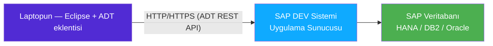
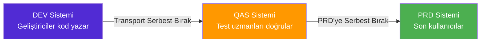

# Kısım 4: Eclipse'te ABAP (ADT) — Yeni Visual Studio'n

*SE80 dinozorluğundan Eclipse güçlüsüne — ve modern SAP ekiplerinin neden bir daha geriye bakmadığı.*

---

## ☕ Bir itirafla başlayalım

Çoğu kişi klasik SAP'ı ilk açtığında — "ABAP Workbench" olan `SE80`'e tıkladığında — aynı şeyi düşünür: *"Bu... 1998'den mi kaldı? Ciddiler mi?"*

Evet, biraz öyle. Ve evet, uzun süre ciddilerdi.

Ama işte şu var: **SE80 içinde yaşamaya devam eden SAP ekipleri giderek azınlıkta kalıyor.** Modern ABAP geliştirme, Eclipse'i tam kapasiteli bir ABAP IDE'sine dönüştüren bir eklenti olan **ADT** (ABAP Development Tools) içinde gerçekleşiyor. Visual Studio veya VS Code'da yaşadıysan, ADT sana SE80'in hiç sağlayamayacağı kadar çabuk bir şekilde evinde hissettiriyor.

Bu kısım seni ADT'de en hızlı şekilde üretken kılmak için tasarlandı. Kurulum, zihinsel model, Visual Studio'dan eksik hissedeceğin klavye kısayolları ve .NET ya da Python'da gerçek bir karşılığı olmayan tek SAP kavramını ele alıyoruz: **transport'lar**.

---

## 4.1 ADT ve SE80 — Modern ile Klasik IDE

### 1️⃣ Benzetme

Şöyle düşün: SE80, üstüne birkaç menü eklenmiş Notepad++ gibi SAP GUI masaüstü istemcisi içinde çalışır, kendi nesne gezgini ağacına sahiptir ve modern geliştirici deneyimi diyebileceğin her şeyin öncesine dayanır.

ADT ise Eclipse'tir — Java'dan tanıyor olabileceğin aynı açık kaynaklı IDE — ABAP dil desteği, yeniden düzenleme araçları, düzgün arama ve ABAP Unit entegrasyonu sunan zengin bir SAP eklentisiyle. SAP arka ucuyla HTTP üzerinden (SAP ADT REST API) konuşur; yani kodu *sunucu üzerinde canlı olarak* düzenliyorsun, önünde ise düzgün bir editör var.

### 2️⃣ Bunu zaten biliyorsun

```csharp
// .NET dünyasında net bir ayrım var:
// - Visual Studio (büyük IDE) veya VS Code (hafif editör)
// - MSBuild yerel olarak derler
// - Git, push öncesinde değişikliklerini yerel takip eder

// Zihinsel model: yerel düzenle → yerel derle → commit → push
```

```python
# Python karşılığı:
# - PyCharm veya VS Code
# - Python yorumlayıcısı yerel çalışır
# - git ile sürüm takibi
```

### 3️⃣ ABAP'taki karşılığı

ABAP'ın temel bir farkı var: **yerel derleme yoktur.** Kodun SAP *uygulama sunucusunda* — uzak bir makinede — yaşar. Hem SE80 hem ADT o sunucuya açılan birer *penceredir*. **Activate** (ABAP'taki "build" karşılığı) tuşuna bastığında sunucu derler ve kodu saklar. Ekipteki her geliştirici *aynı çalışan sistemi* (DEV sistemi) düzenler.



**SE80 vs ADT: karşılaştırma tablosu**

| Özellik | SE80 (klasik) | ADT (Eclipse) |
|---|---|---|
| Nerede çalışır | SAP GUI masaüstü istemcisi içinde | Laptopundaki Eclipse'te |
| Kod gezintisi | Ayrı nesne tarayıcı ağacı | F3 ile tanıma git (VS gibi) |
| Yeniden düzenleme | Çok sınırlı | Metot çıkar, yeniden adlandır, hızlı düzeltme |
| ABAP Unit testleri | Sınırlı | Kırmızı/yeşil test koşucusuyla tam destek |
| Arama | Çoğunlukla işlem kodu tabanlı | ABAP repository araması, çapraz referanslar |
| Kod tamamlama | Temel düzey | IntelliSense benzeri Ctrl+Space |
| Çoklu dosya | Sekmeli, sınırlı | Tam Eclipse çok editör desteği |
| Hata ayıklayıcı | SE80 debugger | Eclipse'e entegre debugger |

> 🧭 **İş hayatında:** Bir ekibe katıldığında hangi IDE'yi kullandıklarını sor. Cevap SE80 ise, genellikle eski bir sistem ya da eski bir ekip kültürü demektir. Her halükarda ADT'yi savunmaya değer — ve onda çok daha üretken olursun.

> ⚠️ **C#/Python tuzağı:** VS/VS Code'da *workspace*'in sabit diskindeki bir klasördür. ADT'de ise "workspace" *SAP sunucusuna canlı bir bağlantıdır*. "Çevrimdışı" modu yoktur — sunucu düşükse geliştirme yapamazsın. Bu durum neredeyse her yeni ABAP geliştiricisini şaşırtır.

---

## 4.2 Sisteme Bağlanma — ABAP Projeleri ve Favori Paketler

### 1️⃣ Benzetme

ADT'deki bir **ABAP Project**, SQL Server Management Studio'daki bağlantı profili ya da PyCharm'daki "Remote Interpreter" gibidir. Sunucu adresini, sistem ID'sini, istemci numarasını ve kimlik bilgilerini saklar — ve sana o SAP sistemine bir pencere açar.

### 2️⃣ Bunu zaten biliyorsun

```csharp
// .NET'te uzak bir sisteme "bağlantı" genellikle bir yapılandırmadır:
// appsettings.json → bağlantı dizesi → Entity Framework

// ADT'de karşılığı bir "ABAP Project"tir:
// New → Other → ABAP → ABAP Project
// → sunucu, sistem ID (SID), örnek numarası, istemci, kullanıcı/şifre gir
```

### 3️⃣ ABAP'taki karşılığı

**ADT'de ilk ABAP Project'ini oluşturma:**

1. Eclipse'i aç → **File → New → Other → ABAP → ABAP Project**
2. Bağlantı bilgilerini gir:
   - **Application server**: hostname veya IP
   - **Instance number**: genellikle `00`
   - **System ID (SID)**: 3 harfli sistem tanımlayıcısı, ör. `NSP`
   - **Client**: 3 basamaklı sayı, ör. `001`
3. Kullanıcı adı/şifrenle kimlik doğrulaması yap.
4. Eclipse bağlanır ve solda **Project Explorer**'ı gösterir — bu senin nesne gezgindir.

```
Project Explorer
└── NSP [DEV] (ABAP Project'in)
    ├── Favorite Packages
    │   └── $TMP (yerel nesneler, transport gerekmez)
    │   └── ZMYPACKAGE (özel paketiniz)
    ├── Favorite Objects
    └── (vb.)
```

**Favorite Packages**, sabitlenmiş yer imleri gibidir — en sık çalıştığın paketleri (4.3'te daha fazlası var) eklersin ve ağacın en üstünde görünürler.

> 💡 **Yerel `$TMP` paketi:** Deney yapıyor veya öğreniyorsan nesneleri `$TMP`'de oluştur — bu, transport gerektirmeyen "yerel" pakettir. `$TMP`'deki hiçbir şey başka bir sisteme geçmez. Alıştırma için mükemmeldir; gerçek işler için asla kullanma.

**`.conn_adt` dosyası (ADT yapılandırma otomasyonu kullanan ekipler için):**

Bazı ekipler bağlantı ön ayarlarını içeren bir `.conn_adt` veya benzeri bir yapılandırma dosyasını commit'ler. Bir repository'de bu dosyayı gördüğünde, ekibin yeni geliştiricinin ADT bağlantısını manuel giriş olmadan kurması için sağladığı kısayol olduğunu bil.

---

## 4.3 Paketler ve Transport'lar — Solution + Değişiklik Taşıma Mekanizması

Bu, .NET/Python geliştiricileri için en büyük kavramsal boşluktur. Beş dakika ayır çünkü bu, iş hayatında saat saat kafa karışıklığı yaşamaktan seni kurtaracak.

### 1️⃣ Benzetme

Visual Studio'nun şunu zorunlu kıldığını hayal et: *değiştirdiğin her dosyanın kaydedilmeden önce bir "değişiklik bileti"ne etiketlenmesi gerekiyor ve QA ile Production'a gidecek olan git branch'i değil, pipeline artifact değil, tam anlamıyla bilet.*

İşte **Transport Request'ler** tam olarak budur. SAP'ta deployment birimi bunlardır.

### 2️⃣ Bunu zaten biliyorsun

```csharp
// .NET / DevOps'ta şunlara sahipsin:
// 1. Solution/proje yapısı (kodu organize eder)
// 2. Git branch'leri + PR'lar (neyin değiştiğini takip eder)
// 3. CI/CD pipeline artifact'ı (QA/Prod'a deploy edilen şey)

// SAP'ta:
// 1. Package'lar     ← kodu organize eder (proje/namespace gibi)
// 2. Transport Request'ler ← neyin değiştiğini takip eder VE deployment artifact'tır
// 3. TMS (Transport Management System) ← transport'u DEV→QAS→PRD taşır
```

### 3️⃣ ABAP'taki karşılığı

**Package'lar**, ABAP nesneleri (programlar, sınıflar, tablolar vb.) için hiyerarşik kaplardır. Bir nesnenin hangi **yazılım bileşenine** ait olduğunu tanımlar ve transport davranışını belirlerler.

```
$TMP          ← yerel, transport yok (geliştirici deneme alanı)
ZMYAPP        ← özel paketiniz
  ZMYAPP_DATA ← data dictionary nesneleri için alt paket
  ZMYAPP_UI   ← ekranlar / UI için alt paket
```

Package'ları `SE80` → Package node üzerinden veya ADT'de sağ tık → New → ABAP Package yoluyla oluşturur ve yönetirsin.

**Transport Request'ler şu şekilde çalışır:**



Her yeni ABAP nesnesi (sınıf, tablo, program) oluşturduğunda SAP sorar: *"Bu hangi transport request'e gitsin?"* Mevcut açık bir request seçer ya da yenisini oluşturursun. O request senin "değişiklik biletidir."

**Transport yaşam döngüsü:**

1. **Open (Açık)** — aktif olarak çalışıyorsun, nesne ekliyorsun.
2. **Released (Serbest bırakılmış)** — bitirdin; request "mühürlendi" ve QAS'a import için kuyruğa alındı.
3. **QAS'a import edildi** — Basis ekibi (SAP sistem yöneticileri) import eder; test uzmanları doğrular.
4. **PRD'ye import edildi** — onay sonrası production'a geçer.

Transport için transaction kodları:
- `SE09` — kendi transport request'lerini görüntüle
- `SE10` — tüm transport request'leri görüntüle (daha fazla detay)
- `STMS` — Transport Management System (Basis/yönetici aracı)

> ⚠️ **C#/Python tuzağı:** Transport'lar **git değildir**. Dallanma yoktur, birleştirme yoktur, transport sürümleri arasında diff yoktur. İki geliştirici farklı transport'larda aynı nesneyi değiştirip ikisi de serbest bırakırsa, *en son import eden* kazanır — diğerinin değişiklikleri sessizce üzerine yazılır. Bu nedenle SAP ekiplerinin transport yönetimi konusunda katı süreçleri vardır. Bazıları git'i işin içine katmak için **gCTS** (git-enabled Change and Transport System) kullanır ama bu evrensel değildir.

> 🧭 **İş hayatında:** İlk günde şunu sor: *"Değişikliklerim için hangi transport request'i kullanmalıyım?"* Gerçek işler için `$TMP`'de asla nesne oluşturma. Transport serbest bırakmadan önce daima sor — serbest bırakmak deployment zincirini başlatır.

**Package vs Transport: tek satırlık özet**

> *Package kodunun yaşadığı yerdir. Transport ise onun nasıl yolculuk ettiğidir.*

---

## 4.4 Activate vs Save — Söz Dizimi Kontrolü ve ABAP Debugger

### 1️⃣ Benzetme

Visual Studio'da **Ctrl+S** tuşuna basmak dosyayı *kaydeder* ve arka planda derleyici hemen söz dizimi hatalarını kontrol eder. Projeyi build etmek her şeyi derler. ABAP'ta bu adımlar daha açık biçimde ayrılmıştır — ve bu ayrımın önemi vardır.

### 2️⃣ Bunu zaten biliyorsun

```csharp
// .NET yaşam döngüsü:
// Ctrl+S         → dosya diske kaydedilir, arka planda Roslyn analizi çalışır
// Ctrl+Shift+B   → tam build (derleme)
// F5             → build + çalıştır + debugger ekle
```

### 3️⃣ ABAP'taki karşılığı

ABAP'ta sürekli yapacağın üç farklı adım vardır:

| Eylem | Kısayol | Ne yapar |
|---|---|---|
| **Check** (yalnızca söz dizimi) | `Ctrl+F2` | Kaydetmeden veya aktive etmeden kodu söz dizimi hatalarına karşı ayrıştırır |
| **Save** (etkin olmayan sürümü sakla) | `Ctrl+S` | Sunucuya *etkin olmayan* bir kopya kaydeder; başkaları henüz göremez |
| **Activate** | `Ctrl+F3` | Derler ve nesneyi canlı yapar; ABAP'taki "build" budur |

> ⚠️ **C#/Python tuzağı:** **Activate** yapana kadar değişikliklerin başkası için — hatta kendi test çalıştırmalarında bile — mevcut değildir. Yaygın bir başlangıç hatası: kodu kaydedip test programı çalıştırmak ve hiçbir şeyin değişmediğine şaşırmak. *Activate etmeyi unuttun.* `Ctrl+F3`, ABAP geliştirmesindeki en önemli tuştur.

**ADT'deki ABAP Debugger**

ADT debugger'ı gerçekten Visual Studio debugger'ıyla kıyaslanabilir. Oluk kısmına tıklayarak (veya imleç konumuna breakpoint ayarlamak için `Ctrl+Shift+Alt+H` tuşuna basarak) breakpoint koyar, programı çalıştırır ve debugger breakpoint'te durur.

```
ADT'deki debugger özellikleri:
├── Breakpoint'ler (satır breakpoint'leri, exception breakpoint'leri)
├── Step Over (F6)         — VS'deki F10 gibi
├── Step Into (F5)         — VS'deki F11 gibi
├── Step Return (F7)       — VS'deki Shift+F11 gibi
├── Resume (F8)            — VS'deki F5 gibi
├── Variables view         — herhangi bir DATA değişkenini incele
├── ABAP Objects pane      — nesne niteliklerini incele
└── Watchpoint'ler         — bir değişken değer değiştirdiğinde dur
```

**Koddan session breakpoint ayarlama:**

```abap
" Hard-coded breakpoint — geçerli kullanıcı için yürütmeyi durdurur
" (transport öncesinde kaldır — production kodunda bırakma!)
BREAK-POINT.

" Veya: yalnızca belirli bir kullanıcı için dur (paylaşılan sistemlerde kullanışlı)
BREAK your_user_name.
```

> 💡 **External debugger** — SAP GUI'den tetiklenen (doğrudan ADT'den değil) bir şeyi test ediyorsan, ADT'de "External Breakpoints" modunu açabilirsin: debugger yapılandırmasında "<kullanıcı adı> için bir sonraki komutta dur" seçeneğini etkinleştir. SAP GUI'den çalıştıracağın bir sonraki SAP transaction'ı ADT debugger'ı tarafından yakalanacaktır.

**Klasik SE80/SAP GUI debugger'ı** (eski sistemlerde karşılaşırsın):

Herhangi bir SAP GUI ekranının komut alanına `/h` yazarak o transaction için klasik debugger'ı etkinleştirebilirsin. Bu eski usul yöntemdir ve her yerde çalışır — ADT mevcut olmadığında iyi bilmek gerekir.

---

## 4.5 Klavye Kısayolları ve Visual Studio / VS Code Geliştiricisinin Seveceği Alışkanlıklar

ADT Eclipse'tir, dolayısıyla çoğu Eclipse kısayolu geçerlidir. İşte Visual Studio veya VS Code'daki kas hafızanla doğrudan örtüşenler:

### Temel kısayollar

| Ne istiyorsun | VS / VS Code | ADT (Eclipse) |
|---|---|---|
| Kod tamamlama | `Ctrl+Space` | `Ctrl+Space` (aynı!) |
| Tanıma git | `F12` | `F3` |
| Referansları bul / kullanıldığı yerler | `Shift+F12` | `Ctrl+Shift+G` |
| Hızlı düzeltme / ampul | `Ctrl+.` | `Ctrl+1` |
| Yeniden adlandır | `F2` | `Alt+Shift+R` |
| Belgeyi biçimlendir | `Ctrl+K, Ctrl+D` | `Ctrl+Shift+F` (ABAP pretty-printer) |
| Tip/sınıf aç | `Ctrl+T` | `Ctrl+Shift+A` (Open ABAP Dev Object) |
| Programı çalıştır | `F5` | `F8` (Run) |
| Satır yorumunu aç/kapat | `Ctrl+/` | `Ctrl+/` (aynı!) |
| Editörü böl | sekmeyi sürükle | Eclipse sekme sürükleme |
| Activate | (derle = Ctrl+Shift+B) | `Ctrl+F3` |
| Yalnızca söz dizimi kontrolü | (arka planda, otomatik) | `Ctrl+F2` |

### ABAP Pretty Printer (`Ctrl+Shift+F`)

ABAP'ın görüşlü bir biçimlendiricisi vardır. `Ctrl+Shift+F` tuşuna basmak tüm dosyayı yeniden biçimlendirir: anahtar kelimeler büyük harf (klasik ABAP stilinde), uygun girintileme, tutarlı boşluk. Tam `dotnet format` veya Black değil ama işini görür.

> 💡 Bazı modern ABAP ekipleri küçük harf anahtar kelimeler kullanır (ABAP 7.0'dan beri geçerlidir). Ekip kuralına karşı çıkma — kod tabanı büyük harf kullanıyorsa büyük harfte kal. Pretty-printer proje başına yapılandırılabilir.

### Tanımadık bir kod tabanında gezinme

ADT'nin SE80'e kıyasla gerçekten parladığı yer burasıdır:

```
Ctrl+Shift+A  → "Open ABAP Development Object" — evrensel atlama noktası
                  Sınıf adı, program adı, tablo adı, BAPI — ne olursa yaz.
                  VS "Navigate To" veya VS Code Ctrl+P gibi

F3            → İmlecin altındaki şeyin tanımına git
                  Bir metot çağrısına tıkla, F3 → metot gövdesine indir
                  Bir tipe tıkla, F3 → DDIC tanımına indir

Ctrl+Shift+G  → Kullanıldığı yerler listesi — bu metot/değişkenin çağrıldığı her yer
                  Bir şeyi değiştirmeden önce etki analizi için kritik

Ctrl+H        → ABAP repository genelinde tam metin araması
                  (grep'ten yavaş ama canlı sunucuyu arar)
```

### ABAP Tip Hiyerarşisi (ADT'de F4)

Herhangi bir sınıf veya interface üzerine sağ tıkla → **Open Type Hierarchy** (veya `F4`). Tam kalıtım ve interface uygulama ağacını gösterir — tıpkı VS'deki "View Class Diagram" veya IntelliJ'deki tip hiyerarşisi gibi.

> 🧭 **İş hayatında:** Gerçek bir projede ilk haftanda zamanının %80'ini kod *okumaya* harcarsın, yazmaya değil. `Ctrl+Shift+A` + `F3` + `Ctrl+Shift+G` birincil gezinme araçlarındır. Bunları birinci günde öğren.

### ADT'de ABAP Unit

ADT'nin yerleşik bir test koşucusu vardır. Bir sınıf veya package seç, sağ tıkla → **Run As → ABAP Unit Test**. JUnit stilinde kırmızı/yeşil bir görünüm elde edersin. ABAP Unit testlerini düzgün yazmayı ilerleyen bir kısımda ele alıyoruz, ama koşucunun burada olduğunu bilmek birinci gün için önemlidir.

```abap
" Minimal bir ABAP Unit test sınıfı (ön izleme)
CLASS zcl_my_calculator_test DEFINITION FINAL
  FOR TESTING RISK LEVEL HARMLESS DURATION SHORT.

  PRIVATE SECTION.
    METHODS: add_two_numbers FOR TESTING.
ENDCLASS.

CLASS zcl_my_calculator_test IMPLEMENTATION.
  METHOD add_two_numbers.
    DATA(result) = zcl_my_calculator=>add( a = 2  b = 3 ).
    cl_abap_unit_assert=>assert_equals(
      act = result
      exp = 5 ).
  ENDMETHOD.
ENDCLASS.
```

ADT'de yeşil çubuk → metot çalışıyor. Kırmızı çubuk → assertion hata mesajını görmek için düğümü genişlet. VS'deki NUnit/xUnit ile aynı geliştirici deneyimi.

---

## 🧠 Özet

- **ADT**, SAP eklentili Eclipse'tir — gerçek bir IDE'dir, eski SE80 workbench değil. Modern SAP ekipleri onu kullanır.
- **ABAP Project**, bir SAP sistemine bağlantı profilidir. Kod sunucuda yaşar, yerel değil.
- **Package'lar** nesneleri organize eder (namespace/proje gibi). **Transport'lar** bu nesneleri DEV → QAS → PRD'ye taşır. Git değillerdir — deployment artifact'lardır.
- `$TMP` yalnızca deneme çalışmaları içindir. Gerçek işler her zaman transport request'li, taşınabilir bir package içine gider.
- **Save** etkin olmayan bir kopya saklar. **Activate** (`Ctrl+F3`) derler ve canlı yapar. Activate etmeyi unutmak #1 başlangıç hatasıdır.
- ADT **debugger'ı** VS kalitesindedir: breakpoint'ler, step-over/into, değişken inceleme.
- Birinci gün ezberlenecek kısayollar: `Ctrl+Space` (tamamla), `F3` (tanıma git), `Ctrl+Shift+G` (kullanıldığı yerler), `Ctrl+1` (hızlı düzeltme), `Ctrl+F3` (activate).

---

*[← İçindekiler](../content.md) | [← Önceki: SAP Proje Türleri](03-sap-project-types.md) | [Sonraki: Data Dictionary (DDIC) →](05-data-dictionary-ddic.md)*
