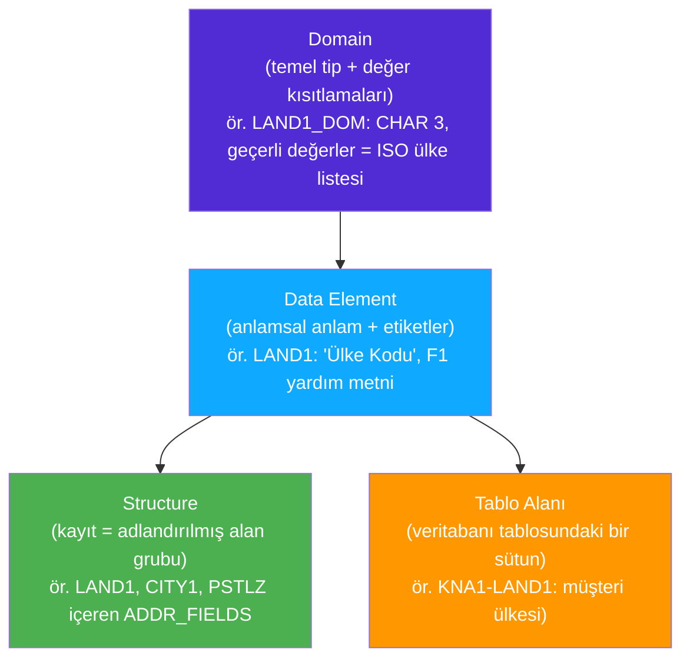
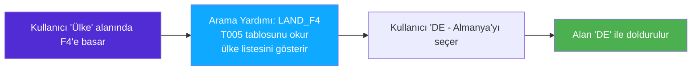

# Kısım 5: Data Dictionary (DDIC) — SAP'ın Şema Katmanı

*40 yılda yazılmış 500 modül genelinde SAP verisinin tutarlı kalmasının nedeni — ve DTO'larınızla EF modellerinizin bu ölçeğe neden yetmediği.*

---

## ☕ Bu neden var ki?

Bir .NET geliştiricisi olduğunu ve bir müşterinin ülke kodunu saklamak istediğini hayal et. `Customer` DTO'na `string CountryCode` oluşturursun. Fatura servisindeki meslektaşın `string Country` oluşturur. İK servisi `char[3] CountryIsoCode` kullanır. Üç servis, üç farklı yazım, aynı şeyi mi kastettiklerine dair sıfır garanti.

Şimdi bunu 500 uygulama modülü, 40 yıl ve 50.000'den fazla veritabanı tablosu boyunca yaptığını hayal et. Tam olarak SAP'ın *düşebileceği* duruma düşerdiniz — ancak SAP 1980'lerde farklı bir tercih yaptı. **Data Dictionary (DDIC)** adlı merkezi bir tip kaydı inşa ettiler: her alanın, her tablo sütununun ve her yeniden kullanılabilir veri tipinin tam olarak bir kez tanımlandığı ve her yerde paylaşıldığı bir sistem.

SAP, bir alanın `Data Element LAND1` olduğunu söylediğinde, o 50.000 tablonun her birinde bunun 3 karakterli bir ülke kodu olduğunu *biliyorsun*. İşte DDIC budur.

---

## 5.1 DDIC Neden Var — Merkezi, Yeniden Kullanılabilir Tipleme

### 1️⃣ Benzetme

DDIC'yi, herkesin *kullanmak zorunda olduğu* şirket genelinde bir tip kütüphanesi olarak düşün. Her geliştirici kendi `string`, `decimal` veya kayıt tipini tanımlamak yerine katalogdan seçer. Kataloğun içinde arama yardımları (geçerli değerler için açılır listeler), belgeler, dönüştürme rutinleri ve anlamlı isimler yerleşik olarak gelir.

### 2️⃣ Bunu zaten biliyorsun

```csharp
// Tipik .NET yaklaşımı — dağınık, tutarsız
// Sipariş servisi DTO:
public record OrderHeader(
    string OrderId,        // ne kadar uzun? hangi format?
    string CustomerId,     // 10 karakter mi? GUID mı?
    decimal TotalAmount,   // kaç ondalık basamak?
    DateTime OrderDate
);

// Fatura servisi DTO — farklı bir geliştirici, farklı sprint:
public record Invoice(
    string InvoiceNumber,
    string CustId,         // yukarıdaki CustomerId ile aynı mı? farklı mı?
    double Amount,         // decimal vs double — ay ay
    DateOnly Date
);
```

```python
# Python — dataclass veya dict ile aynı sorun
from dataclasses import dataclass

@dataclass
class OrderHeader:
    order_id: str        # herhangi bir uzunluk, herhangi bir format
    customer_id: str
    total: float         # hassasiyet? para birimi?
    order_date: str      # datetime mi? ISO string mi? timestamp mı?
```

### 3️⃣ ABAP'taki karşılığı

SAP'ta standart alanlar için bu tutarsızlıklar yaşanamaz çünkü DDIC paylaşılan bir tipi zorunlu kılar. Bir tablo sütunu tanımladığında `CHAR(3)` yazmıyorsun — "bu sütunun Data Element'i `LAND1`" diyorsun ve DDIC onun hakkında her şeyi biliyor: uzunluk, format, geçerli değerler, etiket, belgeleme.

```abap
" DDIC tablo tanımında (ABAP tarzı sözde kod olarak gösteriliyor):
" LAND1 alanı CHAR(3) olarak tanımlanmıyor —
" DDIC'de bir kez tanımlanmış ve tüm tablolarda paylaşılan
" önceden mevcut LAND1 Data Element'ine başvuruyor.

" ABAP'ta okurken:
DATA lv_country TYPE land1.   " land1 = CHAR uzunluk 3, ülke kodu domain'i
```

DDIC, şirketin zorunlu tip sözleşmesidir ve herhangi bir SAP kod tabanını anlamak için *temel* beceridir.

> 🧭 **İş hayatında:** Mülakatlarda ve kod incelemelerinde "veri tipi nedir?" değil "data element nedir?" sorusunu duyarsın. `SE11`'de data element'leri anında aramayı öğrenmek, SAP'ı bilen biri olduğunu hemen belli eder.

---

## 5.2 Katmanlı Tip Sistemi: Domain → Data Element → Structure → Table

Bu kısımdaki en önemli zihinsel model budur. İki kez oku.



Yığını yukarı doğru inceleyelim.

### Domain'ler — Kısıtlamalı Temel Tip

Bir **Domain**, *teknik* tipi tanımlar: veri tipi (karakter, sayısal, tarih…), uzunluk ve isteğe bağlı olarak izin verilen değerlerin sabit listesi.

```
Domain: LAND1_DOM
  Veri tipi: CHAR
  Uzunluk:   3
  Sabit değerler: (yok — bunun yerine T005 değer tablosuna karşı kontrol edilir)

Domain: XFELD  (yaygın boolean benzeri domain)
  Veri tipi: CHAR
  Uzunluk:   1
  Sabit değerler: ' ' = boş/false, 'X' = true/evet
```

> ⚠️ **C#/Python tuzağı:** Klasik ABAP'ta `bool` yoktur. Bir boolean bayrağı için SAP geleneği, `XFELD` domain'iyle `CHAR(1)` kullanmaktır: `' '` false anlamına gelir, `'X'` ise true. Bunu *her yerde* görürsün. `IF lv_flag = 'X'.` ifadesi `if flag:` için ABAP deyimidir.

### Data Element'ler — Anlamsal Anlam

Bir **Data Element**, bir Domain'i sarar ve insanın okuyabileceği anlam ekler: alan etiketleri (kısa/orta/uzun), F1 yardım belgelemesi ve isteğe bağlı arama yardımı ataması.

```
Data Element: LAND1
  Domain:       LAND1_DOM (CHAR 3)
  Kısa etiket:  "Ülk"
  Orta etiket:  "Ülke"
  Uzun etiket:  "Ülke Anahtarı"
  F1 doc:       "Müşterinin/satıcının bulunduğu ülkenin anahtarı"
```

Aynı `LAND1` Data Element'i yüzlerce tabloda yeniden kullanılır: müşteri master'ı (`KNA1`), satıcı master'ı (`LFA1`), şirket kodu (`T001`), tesis (`T001W`)... Hepsi tam olarak aynı anlama gelir, UI'da aynı etiketlere sahiptir ve aynı F4 açılır listesini paylaşır.

### Structure'lar — Kayıt / DTO

Bir **Structure**, adlandırılmış bir alan grubudur (Data Element'leri veya diğer structure'ları kullanarak). Veritabanı tablosu yoktur — ABAP programlarında kullanılmak üzere yalnızca bir tip tanımıdır.

```
Structure: BAPIADDR1  (standart SAP adres structure'ı)
  STREET     TYPE AD_STREET    (Data Element → Domain → CHAR 60)
  CITY       TYPE AD_CITY1     (CHAR 40)
  POSTL_COD1 TYPE AD_PSTCD1    (CHAR 10)
  COUNTRY    TYPE LAND1        (CHAR 3)
  ...
```

Structure'lar, *work area* olarak kullandığın şeylerdir — bir satır veri tutan yerel değişkenin ABAP karşılığı. Bunu Kısım 6'da ele alıyoruz.

### Table'lar — Birincil Anahtara Sahip Kalıcı Structure'lar

Bir **Transparent Table**, aynı zamanda veritabanında fiziksel olarak saklanan bir structure'dır. Bir DDIC tablosu = bir veritabanı tablosu.

```
Table: KNA1  (Müşteri Master'ı: Genel Veri)
  MANDT  TYPE MANDT   " İstemci (her zaman ilk, her zaman)
  KUNNR  TYPE KUNNR   " Müşteri numarası — birincil anahtar alanı
  LAND1  TYPE LAND1   " Ülke
  NAME1  TYPE NAME1_GP " Ad 1
  ORT01  TYPE ORT01   " Şehir
  PSTLZ  TYPE PSTLZ   " Posta kodu
  ... (yüzlerce alan daha)
  Birincil Anahtar: MANDT + KUNNR
```

---

## 5.3 Transparent Table'lar, Birincil Anahtarlar ve MANDT

### 1️⃣ Benzetme

SAP **transparent table**'ı, fiziksel bir veritabanı tablosuna 1:1 eşleşmedir — SQL Server, PostgreSQL veya herhangi bir ORM'de "tablo" dediğin şey. Bu konuda karmaşık bir şey yok.

SAP'a özgü olan **MANDT** alanıdır.

### 2️⃣ Bunu zaten biliyorsun

```csharp
// Çok kiracılı .NET'te her tabloya TenantId ekleyebilirsin:
public class Order
{
    public string TenantId { get; set; }  // veriyi kiracı bazında izole eder
    public string OrderId  { get; set; }
    // ...
}
```

### 3️⃣ ABAP'taki karşılığı

SAP sistemleri doğası gereği **çok istemcilidir**. Tek bir SAP sistem kurulumu (tek sunucu seti), tamamen izole edilmiş birden fazla "istemci" barındırabilir — her birinin kendi verisi vardır. İstemci 100 Production olabilir. İstemci 200 QA olabilir. İstemci 000 varsayılan teslimat istemcisidir.

**MANDT** (Mandant = Almanca'da "istemci") alanı her zaman istemci bağımlı bir tablonun ilk alanıdır ve her zaman birincil anahtarın bir parçasıdır. SAP her sorguyu otomatik olarak geçerli istemciye göre filtreler — ABAP kodunda `WHERE MANDT = sy-mandt` yazmana gerek yoktur (Open SQL tarafından otomatik eklenir).

```abap
" Şunu yazarsın:
SELECT * FROM kna1 INTO TABLE @DATA(lt_customers)
  WHERE land1 = 'DE'.

" Open SQL aslında DB'ye kabaca şunu gönderir:
" SELECT * FROM KNA1 WHERE MANDT = '100' AND LAND1 = 'DE'
"                                          ^ otomatik eklenir
```

> ⚠️ **C#/Python tuzağı:** Bir SAP tablosuna ham SQL'de bakarsanız (ör. bir DB tarayıcısı aracılığıyla), tüm tablolarda MANDT ilk sütun olarak görünür. ABAP WHERE cümleciklerine dahil etme — senin için halledilmiştir ve manuel olarak eklemek gereksizdir (zararsız olsa da).

**DDIC tablolarında birincil anahtarlar**

Her DDIC tablosu birincil anahtar alanlarını tanımlar. DDIC'de alanları "Key" onay kutusuyla işaretlersin. Birincil anahtar = MANDT + teknik anahtar alanlar.

**Index'ler**

DDIC'de ikincil index'ler tanımlayabilirsin (`SE11` → tablo → Indexes sekmesi). Bunlar fiziksel DB index'leri haline gelir. Yoğun bir SAP sisteminde milyarlarca satır içeren büyük tablolarda (örneğin `BSEG`) doğru index, 0,1 saniyelik bir sorgu ile 10 dakikalık bir sorgu arasındaki farktır.

```abap
" Uygun bir index olmadan bu BSEG tam tablo taraması yapar:
SELECT * FROM bseg INTO TABLE @DATA(lt_items)
  WHERE bukrs = '1000' AND gjahr = '2024'.

" BUKRS+GJAHR üzerinde bir index ile bu hızlıdır.
" Basis/DBA ekibiniz production index'lerini yönetir,
" ancak kendi tablolarınız için DDIC'de tanımlayabilirsiniz.
```

---

## 5.4 Tablo Tipleri, Arama Yardımları (F4) ve Foreign Key'ler

### Tablo Tipleri (DDIC)

"DDIC tablo tiplerini" yukarıdaki veritabanı tablolarıyla karıştırma. Bir **DDIC Table Type**, bir *internal table* için — ABAP'ın bellekte tutulan liste yapısı — bir tip tanımıdır. Satır tipini (bir structure) ve tablo tipini (STANDARD/SORTED/HASHED) tanımlarsın, ardından programlarda `TYPE` ile referans alırsın.

```abap
" Bir DDIC tablo tipi şöyle adlandırılabilir: BAPIRET2TAB
" Satır tipi: structure BAPIRET2 (standart SAP dönüş mesajı structure'ı)
" Tablo tipi: STANDARD TABLE

DATA lt_messages TYPE bapiret2tab.  " DDIC tablo tipini kullanır
```

Bu, birden fazla program ve BAPI genelinde aynı tablo tipini her seferinde yeniden tanımlamadan kullanmana olanak tanır.

### Arama Yardımları (F4 helps) — Açılır Liste Kataloğu

Bir kullanıcı SAP ekranındaki bir alana tıklayıp **F4** tuşuna bastığında, geçerli değerlerle açılır/arama kutusu açılır. Bu **Search Help** (F4 help olarak da bilinir). DDIC'de tanımlanır ve bir Data Element'e ya da doğrudan bir tablo alanına bağlanır.



ABAP geliştiricisi açısından bakıldığında: bir alanın Data Element'ine bağlı bir arama yardımı varsa, kullanıcılar F4'ü ücretsiz alır — kod yazımı gerekmez.

### Foreign Key'ler

DDIC, SQL foreign key'lerine benzer şekilde tablolar arasında foreign key ilişkileri tanımlamanıza olanak tanır. "Check table" geçerli değerleri sağlar.

```
Table:     ZCUSTOMER_ORDERS
Field:     LAND1  (Tip: LAND1)
Foreign Key → Check Table: T005 (Ülkeler)
              Key Fields:  T005-MANDT = ZCUSTOMER_ORDERS-MANDT
                           T005-LAND1 = ZCUSTOMER_ORDERS-LAND1
```

Bu, SAP'ın kullanıcının girdiği `LAND1` değerinin gerçekten `T005`'te var olup olmadığını doğrulayacağı ve `T005`'ten otomatik olarak F4 arama yardımı oluşturacağı anlamına gelir.

> 🧭 **İş hayatında:** Arama yardımları ve foreign key'leri anlamak, dialog ekranları veya OData servisleri oluştururken önem taşır. "F4 yardımım neden çalışmıyor?" yaygın bir sorudur — zamanın %90'ında arama yardımı doğru Data Element'e bağlanmamıştır.

---

## 5.5 SE11 İncelemesi — İlk Özel Tablonu Oluşturma

Somutlaştıralım. `ZORDERS` adında basit bir tablo oluşturacağız (özel nesneler her zaman `Z` veya `Y` ile başlar).

### SE11'i Açma

SAP GUI komut alanına `SE11` yazıp Enter'a bas. Bu **ABAP Dictionary** transaction'ı — tüm DDIC çalışmaları için ana merkezin. Alternatif olarak ADT'de package'ına sağ tıkla → New → Other ABAP Repository Object → Dictionary → Database Table.

```
SE11 ana ekranı:
  [ ] Database table    [ZORDERS         ] [Display] [Change] [Create]
  [ ] View
  [ ] Data type
  [ ] Type group
  [ ] Domain
  [ ] Search help
  [ ] Lock object
```

### Tabloyu Oluşturma (Adım Adım Anlatım)

**Adım 1 — Temel nitelikler**

Database Table alanına `ZORDERS` yaz ve Create'e tıkla. Şunları doldur:
- Short Description: `Müşteri Siparişleri (demo)`
- Delivery Class: `A` (uygulama tablosu — işlem verilerini saklar)
- Data Browser/Table View Maintenance: `Display/Maintenance Allowed`

**Adım 2 — Alanlar**

Fields sekmesine tıkla. Sütunları tek tek ekleyeceksin:

| Alan | Anahtar | Data Element | Açıklama |
|-------|-----|-------------|-------------|
| MANDT | ✓ | MANDT | İstemci |
| ORDER_ID | ✓ | SYSUUID_C32 | Sipariş UUID (veya özel DE kullan) |
| KUNNR | | KUNNR | Müşteri Numarası |
| NETWR | | NETWR | Net Değer |
| WAERS | | WAERS | Para Birimi |
| ERDAT | | ERDAT | Oluşturma Tarihi |
| ERZET | | ERZET | Oluşturma Saati |
| ERNAM | | ERNAM | Oluşturan |

Dikkat et: "Data Element" sütununa bir Data Element adı yazarsın ve SE11 uzunluğu, tipi ve etiketleri otomatik olarak doldurur. DDIC işte bu — yeni şeyler icat etmiyorsun, mevcut anlamsal tiplere *başvuruyorsun*.

**Adım 3 — Teknik ayarlar**

Menüden: Extras → Technical Settings:
- Data Class: `APPL0` (master ve işlem verileri — en yaygın)
- Size Category: `0` (küçük tablo, ~600 satıra kadar) veya orta için `1`

**Adım 4 — Activate**

**Activate** düğmesine bas (veya F8). SAP şunları yapacak:
1. Alan tanımlarını DDIC'ye göre doğrular.
2. Fiziksel veritabanı tablosunu oluşturur.
3. Bir transport request ister (bkz. Kısım 4).

Aktivasyon sonrası `ZORDERS` hem DDIC tanımı hem de gerçek bir veritabanı tablosu olarak var olur. ABAP'ta hemen `SELECT * FROM zorders` yapabilirsin.

### Tablo İçeriğini Görüntüleme

Tablonuz oluştuktan sonra, içeriğini `SE16` (Data Browser) veya `SE16N` transaction'ı ile görüntüleyip düzenleyebilirsin. Tablo adını yaz, Enter'a bas ve satırların elektronik tablo tarzında bir görünümünü al. Hata ayıklama için mükemmeldir.

```
SE16 → Table name: ZORDERS → Execute
→ ZORDERS'daki tüm satırları ızgara olarak gösterir
```

> 💡 **SE16 vs SE16N:** SE16 klasik görüntüleyicidir. SE16N daha fazla filtre seçeneğiyle daha yeni bir sürümdür. S/4HANA sistemlerinde `SE16H` (HANA hızlandırmalı görüntüleme) de mevcuttur.

---

## C#/Python Karşılaştırması — Yan Yana

Gerçekçi bir karşılaştırmayla hepsini bir araya getirelim. Bir sipariş özelliği geliştiriyorsun.

### C# — Entity Framework Yaklaşımı

```csharp
// .NET'te yaygın "dağınık DTO + EF model" yaklaşımı

// 1. Domain modeli / EF entity
[Table("Orders")]
public class Order
{
    [Key]
    public Guid OrderId { get; set; }

    [Required, MaxLength(10)]
    public string CustomerId { get; set; }   // paylaşılan tip yok — sadece string

    [Column(TypeName = "decimal(15,2)")]
    public decimal NetAmount { get; set; }

    [MaxLength(5)]
    public string Currency { get; set; }     // "USD"? "EUR"? 5 karakterli herhangi string

    public DateTime CreatedAt { get; set; }
}

// 2. EF DbContext
public class AppDbContext : DbContext
{
    public DbSet<Order> Orders { get; set; }
}

// 3. Kullanım
using var db = new AppDbContext();
var deOrders = db.Orders
    .Where(o => o.Currency == "EUR")
    .ToList();
```

```python
# Python — SQLAlchemy / dataclass yaklaşımı
from dataclasses import dataclass
from datetime import datetime
from sqlalchemy import Column, String, Numeric, DateTime
from sqlalchemy.orm import DeclarativeBase

class Base(DeclarativeBase):
    pass

class Order(Base):
    __tablename__ = "orders"

    order_id:   str       # format zorlaması yok
    customer_id: str      # herhangi bir şey olabilir
    net_amount: float     # float hassasiyet sorunları
    currency:   str       # F4 yardımı yok, doğrulama yok
    created_at: datetime
```

### SAP ABAP — DDIC + Open SQL Yaklaşımı

```abap
" 1. DDIC tablosu ZORDERS mevcut (yukarıda gösterildiği gibi SE11'de tanımlı)
"    Alanlar standart Data Element'leri kullanır: KUNNR, NETWR, WAERS, ERDAT
"    WAERS otomatik F4 yardımına sahip (T009'dan para birimi anahtarı)
"    KUNNR, KNA1'e (müşteri master'ı) foreign key'e sahip

" 2. ABAP'ta veri okuma
SELECT order_id, kunnr, netwr, waers
  FROM zorders
  INTO TABLE @DATA(lt_orders)
  WHERE waers = 'EUR'.

" lt_orders DDIC tanımından otomatik tiplendirilir —
" ayrı DTO sınıfına gerek yok.

" 3. Tek bir satırı work area'ya (structure) okuma
DATA ls_order TYPE zorders.    " ABAP, şekli DDIC'den bilir
SELECT SINGLE * FROM zorders
  INTO @ls_order
  WHERE order_id = @lv_id.

IF sy-subrc = 0.
  WRITE: / ls_order-kunnr, ls_order-netwr, ls_order-waers.
ENDIF.
```

Temel farklar:
- Ayrı "DTO sınıfı" gerekmez — `TYPE zorders` doğru structure'ı otomatik verir.
- `WAERS`, Data Element'i sayesinde F4 yardımı ve doğrulamayla zaten birlikte gelir.
- `KUNNR`, müşteri master'ına zaten foreign key'e sahiptir — SE11 anlamsal ilişkiyi zorlar.
- ALV raporlarında görünen etiketler ("Para Birimi", "Müşteri") kodundan değil, Data Element'ten gelir.

> ⚠️ **C#/Python tuzağı:** ABAP tipleri null ile sonlandırılmak yerine SAĞ TARAFTAN boşlukla doldurulur. 'HELLO' içeren bir `CHAR(10)` alanı aslında 'HELLO     ' (5 sondaki boşluk) şeklindedir. Karşılaştırmada: `IF ls-field = 'HELLO'.` gayet çalışır (ABAP, CHAR karşılaştırmalarında sondaki boşlukları yoksayar), ancak dış sistemlere (REST API'leri, dosyalar) iletirken dolguyu kaldırmak için sıklıkla `CONDENSE` veya `TRIM` kullanman gerekir. Bu, her C#/Python geliştiricisini en az bir kez yakalar.

---

## 5.6 Hızlı Başvuru — SE11 Nesne Tipleri

| SE11 nesnesi | ABAP anahtar kelimesi | .NET/Python karşılığı |
|---|---|---|
| Domain | Data Element aracılığıyla başvurulur | `enum` kısıtlamaları / `[Range]` özelliği |
| Data Element | `TYPE <data_element>` | Adlandırılmış tip takma adı + belgeleme |
| Structure | `TYPE <structure>` | `record` / `@dataclass` (tablo yok) |
| Transparent Table | `SELECT FROM <table>` | EF `DbSet<T>` + DB tablosu |
| View (DDIC) | `SELECT FROM <view>` | DB View / EF sorgu tipi |
| Table Type | `TYPE <table_type>` | `List<T>` tip tanımı |
| Search Help | Data Element'e bağlanır | ComboBox / `[Select]` özelliği |
| Lock Object | `ENQUEUE_*` FM'leri | Kötümser DB kilitleme |

---

## 🧠 Özet

- **DDIC**, SAP'ın merkezi tip sistemidir. 50.000'den fazla tablo genelinde "her geliştirici kendi string'ini tanımlar" kaosunu önler.
- Katman pastası: **Domain** (temel tip + kısıtlamalar) → **Data Element** (anlamsal anlam + etiketler) → **Structure** (kayıt/DTO) → **Table** (kalıcı structure).
- **MANDT**, SAP'ın yerleşik çok kiracılık sütunudur — her zaman ilk anahtar alan ve Open SQL tarafından otomatik filtrelenir.
- **Arama yardımları** (F4) DDIC'de tanımlanır ve kullanıcılara ücretsiz açılır listeler sağlar.
- **SE11**, tüm DDIC nesneleri için araç kutundur — tablolar, structure'lar, domain'ler, data element'ler, arama yardımları.
- Özel nesneler `Z` veya `Y` namespace ön ekini kullanır. Her zaman.
- ABAP kodundaki `TYPE <ddic_nesnesi>`, tipi doğrudan DDIC'den çeker — ayrı DTO sınıfına gerek yok.

---

*[← İçindekiler](../content.md) | [← Önceki: Eclipse'te ABAP (ADT)](04-abap-on-eclipse-adt.md) | [Sonraki: ABAP Söz Dizimi Temelleri →](06-abap-syntax-basics.md)*
