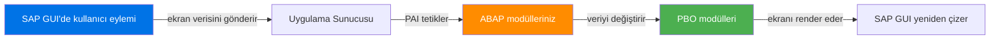
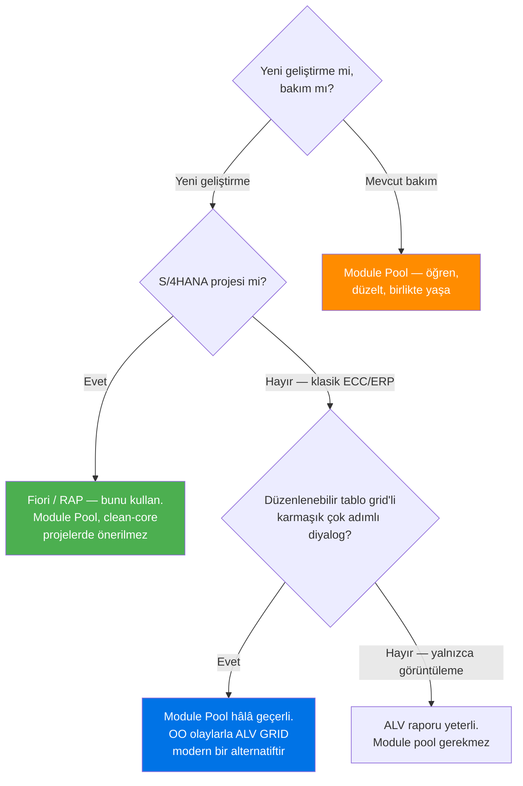

# Kısım 9: Module Pool (Dialog) Programlama

*SAP GUI'nin kendi olay güdümlü UI framework'ü var — WinForms'dan daha eski, ama tam olarak aynı fikirlere dayalı. Onu çıldırmadan okuyup bakımını yapmanın yolu budur.*

---

## ☕ Başlamadan önce: bunun nereye oturduğuna dair dürüst bir not

Module Pool programlama, **SAP'ın 1980'ler–2000'lerden kalma masaüstü UI teknolojisidir**. HTML yerine SAP GUI ekranlarını (bunlara "dynpro" denir) kullanır ve C# olayları ya da Python callback'leri yerine bir akış mantığı dilinde olayları tetikler. Büyük neredeyse her SAP kurulumunda binlerce bu tür program vardır — bir kısmı standart, birçoğu özel — ve bunlar bir gecede ortadan kalkmayacak.

Muhtemelen sıfırdan yeni bir module pool *tasarlamayacaksınız*. Ancak şunlar gibi biletler **elinize geçecek**:

- "Kullanıcı Ekran 200'de F5'e bastığında malzeme numarasını doğrula."
- "Ekran 100'deki tablo kontrolü yalnızca 10 satır gösteriyor — kaydırılabilir yap."
- "Bu özel diyaloga yeni bir alan ekle."

Bu biletler, akış mantığı modelini anlamayı gerektirir. Bu bölüm bunun içindir.

---

## 9.1 Dialog Program Nedir

### 1️⃣ Benzetme

WinForms veya Tkinter'ı düşünün: görsel bir editörde bir form tasarlıyorsunuz, olay işleyicileri bağlıyorsunuz (düğme tıklaması, alan değişikliği, form yüklenmesi) ve kullanıcı etkileşime girdiğinde framework işleyicilerinizi çağırıyor. SAP GUI diyalogları *tam olarak* bunun gibi çalışır — ekran tasarımcısı, PBO/PAI olayları, modül işleyicileri. Yalnızca çalışma zamanı farklıdır (SAP uygulama sunucusundadır, istemcide değil) ve söz dağarcığı farklıdır (Screen → Form, PBO → Load, PAI → ButtonClick).



### 2️⃣ Bunu zaten biliyorsun

```csharp
// WinForms benzetmesi
public partial class OrderForm : Form
{
    // PBO karşılığı — form yüklendiğinde / yeniden çizildiğinde tetiklenir
    protected override void OnLoad(EventArgs e)
    {
        base.OnLoad(e);
        txtMaterial.Text = _defaultMaterial;
        btnSave.Enabled  = false;         // UI durumunu ayarla
    }

    // PAI karşılığı — kullanıcı Kaydet'e tıkladığında tetiklenir
    private void btnSave_Click(object sender, EventArgs e)
    {
        string okCode = "SAVE";           // ABAP'ta bu OK_CODE alanıdır
        if (string.IsNullOrEmpty(txtMaterial.Text))
        {
            MessageBox.Show("Malzeme zorunludur");
            return;
        }
        SaveOrder(txtMaterial.Text);
        Close();
    }
}
```

```python
# Tkinter benzetmesi
import tkinter as tk

class OrderForm(tk.Frame):
    def __init__(self, master):
        super().__init__(master)
        self._build_ui()
        self._pbo()          # PBO — başlangıç durumunu ayarla

    def _pbo(self):          # Process Before Output
        self.mat_var.set("VARSAYILAN-MALZ")
        self.save_btn.config(state=tk.DISABLED)

    def _pai_save(self):     # Process After Input — Kaydet düğmesi
        if not self.mat_var.get():
            tk.messagebox.showerror("Hata", "Malzeme zorunludur")
            return
        self._save_order(self.mat_var.get())
        self.master.destroy()
```

### 3️⃣ ABAP'taki karşılığı

Bir **module pool** (aynı zamanda **dialog program** olarak da bilinir) şunlardan oluşur:

| Parça | Nerede yaşar | Ne yapar |
|---|---|---|
| ABAP programı | `SE38` (M tipi) | Global veriler, alt rutinler, modüller |
| Ekranlar (dynpro'lar) | `SE51` | Görsel düzen + **akış mantığı** |
| GUI Status | `SE41` | Menü çubukları, araç çubukları, fonksiyon tuşu atamaları |
| GUI Title | `SE41` | Her ekran için başlık çubuğu metni |

Hepsi aynı program adını paylaşır ve aynı transport'la birlikte seyahat eder.

> ⚠️ **C#/Python tuzağı:** Tek bir kaynak dosya yoktur. Module pool, tek bir program adı altında bir *nesne koleksiyonudur*. `SE80`'de (Repository Browser) bir dialog programa baktığınızda, ABAP include dosyalarını, ekran listesini, GUI durumlarını ve GUI başlıklarını aynı düğüme bağlı göreceksiniz.

---

## 9.2 Ekranlar, PBO ve PAI — Temel Döngü

### Ekran 100: Görsel Tasarımcı (SE51)

Her ekranın `SE51`'de düzenlediğiniz iki parçası vardır:

1. **Düzen (Layout)** — alanları, düğmeleri ve tablo kontrollerini sürükleyip bıraktığınız görsel çizici.
2. **Akış Mantığı (Flow Logic)** — PBO ve PAI'de hangi ABAP modüllerinin çağrılacağını bildiren mini bir dil.

```abap
" ── AKIŞ MANTIĞI (SE51'deki ekranın içinde yaşar, ABAP dosyanızda DEĞİL) ──

PROCESS BEFORE OUTPUT.
  MODULE status_0100.           " GUI durumunu ayarla, alanları doldur
  MODULE fill_material_data.    " bellekten ekran alanlarını doldur

PROCESS AFTER INPUT.
  MODULE user_command_0100.     " OK_CODE'u oku, ona göre dallan
```

Tipik bir ekran için tüm akış mantığı budur. Her `MODULE` ifadesi, program dosyanızdaki bir ABAP modülünü çağırır.

### ABAP programınızdaki modüller

```abap
*&---------------------------------------------------------------------*
*& Module Pool  ZSALES_ORDER_DIALOG
*& Tip          M (Dialog Program)
*&---------------------------------------------------------------------*
PROGRAM zsales_order_dialog.

" ── Global veriler ──────────────────────────────────────────────────
DATA: ok_code   TYPE sy-ucomm,       " geçerli fonksiyon kodu (düğme basımı)
      save_code TYPE sy-ucomm,
      gs_order  TYPE zorder_header.  " özel sipariş yapısı

" ── PBO Modülü: ekran gösterilmeden önce tetiklenir ─────────────────
MODULE status_0100 OUTPUT.
  " GUI durumunu (araç çubuğu/menü çubuğu) ve başlığı ayarla
  SET PF-STATUS 'MAIN_STATUS'.       " ad SE41'de tanımlanır
  SET TITLEBAR  'TITLE_ORDER'
    WITH gs_order-order_id.          " dinamik başlık metni
  CLEAR ok_code.
ENDMODULE.

MODULE fill_material_data OUTPUT.
  " Bellekten ekran alanlarına veri kopyala
  " (ekran alanları, global değişkenleriniz veya yapı bileşenlerinizle
  "  AYNI adlara sahiptir — ABAP bunları ada göre otomatik bağlar)
  MOVE-CORRESPONDING gs_order TO gs_order.   " adlar eşleşiyorsa genellikle no-op
ENDMODULE.

" ── PAI Modülü: kullanıcı bir şey yaptıktan sonra tetiklenir ────────
MODULE user_command_0100 INPUT.
  save_code = ok_code.          " CLEAR silmeden önce kaydet
  CLEAR ok_code.

  CASE save_code.
    WHEN 'SAVE' OR 'SJVE'.      " SE41 GUI durumundan fonksiyon kodları
      PERFORM validate_and_save.

    WHEN 'BACK' OR 'CLOS' OR 'EXIT'.
      LEAVE TO SCREEN 0.        " ekran 0 = diyaloğu bırak, çağırana dön

    WHEN 'DETAIL'.
      LEAVE TO SCREEN 200.      " detay ekranına git

    WHEN OTHERS.
      " bilinmeyen kodları yoksay
  ENDCASE.
ENDMODULE.
```

> 💡 **Ad bağlama hilesi:** SAP, ekran alanlarını ABAP değişkenlerine *ada göre* bağlar. Ekranınızda `GS_ORDER-MATERIAL` adında bir alan ve `material` bileşenine sahip `gs_order` global yapısı varsa, çalışma zamanı PBO'da (ekran ← ABAP) ve PAI'de (ABAP ← ekran) bunlar arasında otomatik olarak kopyalar. Basit durumlar için açık bir atama gerekmez. Kuralı öğrenene kadar bu sihir gibi görünür.

### Ekranlar arası gezinme

```abap
" Belirli bir ekran numarasına git
LEAVE TO SCREEN 200.

" Sonraki ekranı programatik olarak ayarla (PBO/PAI'den dönmeden önce)
SET SCREEN 200.   " ardından LEAVE SCREEN

" Tüm diyaloğu bırak ve çağırana dön
LEAVE TO SCREEN 0.

" Bir ekranı alt diyalog olarak çağır (popup benzeri; o ekran ayrılınca geri döner)
CALL SCREEN 300.
```

---

## 9.3 Ekran Elementleri, Tablo Kontrolleri, GUI Status ve OK_CODE

### Ekran elementleri

`SE51` Düzeni'nde elementleri özelliklerine göre yerleştirirsiniz:

| Element türü | ABAP karşılığı | Benzetme |
|---|---|---|
| Metin alanı (giriş) | Eşleşen adlı global değişken veya yapı bileşeni | `TextBox` |
| Metin (yalnızca çıktı) | Aynısı, ancak "Output Only" özelliği işaretli | `Label` |
| Düğme (Pushbutton) | PAI'de bir fonksiyon kodunu tetikler | `Button` |
| Onay kutusu (Checkbox) | `CHAR(1)` alan, `X` = işaretli | `CheckBox` |
| Radyo düğmesi | `CHAR(1)` alan grubu | `RadioButton` grubu |
| Tablo Kontrolü | Satır içi grid olarak görüntülenen internal tablo | `DataGridView` (temel) |
| Alt ekran (Subscreen) | Bu içine gömülü başka bir ekran | `UserControl` |

### Tablo kontrolleri

**Tablo kontrolü**, bir ekranda satır içi kaydırılabilir tablodur. Dialog programlar için ALV'nin öncülüdür.

```abap
" SE51 akış mantığında — tablo kontrolü için kaydırma işlemi
PROCESS BEFORE OUTPUT.
  MODULE status_0100.
  LOOP AT gt_items INTO gs_item        " gt_items = internal tablonuz
    WITH CONTROL tc_items              " TC_ITEMS = SE51'deki tablo kontrol adı
    CURSOR tc_items-current_line.
    MODULE fill_tc_line.               " her seferinde bir satır doldur
  ENDLOOP.

PROCESS AFTER INPUT.
  LOOP AT gt_items.
    MODULE read_tc_line.               " değiştirilen satırları geri oku
  ENDLOOP.
  MODULE user_command_0100.
```

```abap
" ABAP programında
MODULE fill_tc_line OUTPUT.
  " gs_item, LOOP AT tarafından zaten ayarlanmıştır — yalnızca hesaplanan alanları doldurun
  IF gs_item-quantity > 0.
    gs_item-total = gs_item-quantity * gs_item-unit_price.
  ENDIF.
  MODIFY gt_items FROM gs_item.
ENDMODULE.

MODULE read_tc_line INPUT.
  " Kullanıcının tablo kontrolüne yazdığı değişiklikleri topla
  IF tc_items-line_sel = 'X'.        " kullanıcı bu satırı seçti
    gs_item-selected = abap_true.
  ENDIF.
  MODIFY gt_items FROM gs_item
    INDEX tc_items-current_line.
ENDMODULE.
```

### GUI Status ve OK_CODE (SE41)

**GUI Status**, menü çubuğu + araç çubuğu + fonksiyon tuşu eşlemesidir. Onu program adınız altında `SE41`'de oluşturur/düzenlersiniz.

Her düğme ve menü öğesinin bir **fonksiyon kodu** vardır (en fazla 20 karakter, kural: `SAVE`, `BACK`, `CLOS` gibi 4 büyük harf). Kullanıcı bir düğmeye tıkladığında, SAP fonksiyon kodunu `OK_CODE` (veya `SY-UCOMM`) global alanına koyar ve PAI'yi tetikler.

```abap
" En iyi uygulama: PAI başında OK_CODE'u kopyala ve temizle
MODULE user_command_0100 INPUT.
  DATA(lv_code) = ok_code.    " kopyala
  CLEAR ok_code.              " temizlemek zorunlu — yoksa yeniden PBO'da yeniden tetiklenir

  CASE lv_code.
    WHEN 'SAVE'. ...
    WHEN 'BACK'. LEAVE TO SCREEN 0.
    WHEN 'EXIT'. LEAVE PROGRAM.
  ENDCASE.
ENDMODULE.
```

> ⚠️ **C#/Python tuzağı:** PAI modülünüzün başında `CLEAR ok_code`'u unutmak klasik bir hatadır. Temizlemezseniz, aynı fonksiyon kodu bir sonraki PBO/PAI döngüsünde yeniden tetiklenir ve çift kaydetmelere veya sonsuz döngülere yol açar. Önce temizleyin, bir kopyasını saklayın, kopya üzerinden dallanın.

### Bir rapordan veya transaction'dan module pool çağırma

```abap
" Herhangi bir ABAP programından diyalog ekranı çağırma:
CALL TRANSACTION 'ZSD_ORDER'   " START_NEW_TASK transaction'ını çağırır
  AND SKIP FIRST SCREEN.        " varsayılanlar ayarlıysa ilk ekranı atla

" Veya doğrudan:
SET SCREEN 100.
CALL SCREEN 100.                " geçerli programın 100 numaralı ekranına girer
```

Module pool'lar genellikle `SE93`'te oluşturulan ve program + ekran 100'e eşlenen bir **transaction kodu** aracılığıyla çağrılır.

---

## 9.4 Module Pool'u Ne Zaman Kullanmalı, Ne Zaman Fiori'ye Geçmeli

Dürüst olalım. İşte gerçek hayattaki karar matrisi:



**Dürüst özet:**

| Senaryo | Module Pool kullan? |
|---|---|
| Yeni S/4HANA geliştirme | Hayır — RAP/Fiori kullan |
| Klasik ECC — karmaşık düzenlenebilir form | Evet, veya düzenleme modlu ALV OO |
| Klasik ECC — çok adımlı sihirbaz UI | Evet |
| Mevcut dialog programın bakımı | Evet — başka seçeneğin yok |
| Basit veri görüntüleme | Hayır — ALV raporu kullan |
| ECC'de yeni geliştirme ama S/4'e gidilecek | Bütçe varsa Fiori özel uygulama; yoksa module pool |

> 🧭 **İş hayatında:** Bir ekibe katıldığınızda her yerde `CALL TRANSACTION 'ZXY...'` görürseniz, bunlar muhtemelen module pool'lardır. İşiniz şu olacak: akış mantığını anlayın, doğru PAI modülünü bulun, değişikliği yapın, test edin. İlk Fiori uygulamanızı yazmadan önce bunu onlarca kez yapacaksınız — ve bu iyidir. Beceri, standart SAP transaction'larını hata ayıklamaya bile doğrudan aktarılır.

---

## Gerçekçi Mini Module Pool — Uçtan Uca

Aşağıda, bakımını üstlenmeniz isteneceği türde — özel bir sipariş diyaloğunun — basitleştirilmiş ama yapısal olarak eksiksiz bir örneği bulunmaktadır.

```abap
*&---------------------------------------------------------------------*
*& Module Pool  ZSIMPLE_DIALOG
*& Ekranlar  : 100 (başlık), 200 (onay açılır penceresi)
*& Transaction: ZSD_SIMPLE (SE93'te oluşturulur)
*&---------------------------------------------------------------------*
PROGRAM zsimple_dialog.

TABLES: zmaterial_h.           " ekran alanı otomatik bağlama TABLES bildirimi kullanır

DATA: ok_code    TYPE sy-ucomm,
      gs_matl    TYPE zmaterial_h,
      gv_changed TYPE abap_bool.

"─────────────────────────────────────────────────────────────────────
" Ekran 100 — Ana Giriş Formu
" (SE51'deki akış mantığı bu modülleri çağırır)
"─────────────────────────────────────────────────────────────────────

MODULE init_screen_100 OUTPUT.
  " Yalnızca İLK yüklemede çağrılır (bir bayrakla kontrol edilir)
  IF gv_changed IS INITIAL.
    CLEAR gs_matl.
    gs_matl-plant = '1000'.    " varsayılan tesis
  ENDIF.
  SET PF-STATUS 'STATUS_100'.
  SET TITLEBAR  'TITLE_100'.
  CLEAR ok_code.
ENDMODULE.

MODULE user_cmd_100 INPUT.
  DATA(lv_code) = ok_code.
  CLEAR ok_code.

  CASE lv_code.
    WHEN 'SAVE'.
      PERFORM validate_input.
      IF sy-subrc = 0.
        PERFORM save_material.
        MESSAGE 'Malzeme başarıyla kaydedildi.' TYPE 'S'.
        LEAVE TO SCREEN 0.
      ENDIF.

    WHEN 'RESET'.
      CLEAR gs_matl.
      gv_changed = abap_false.

    WHEN 'BACK' OR 'EXIT' OR 'CLOS'.
      IF gv_changed = abap_true.
        CALL SCREEN 200.        " onay açılır penceresi
      ELSE.
        LEAVE TO SCREEN 0.
      ENDIF.
  ENDCASE.
ENDMODULE.

"─────────────────────────────────────────────────────────────────────
" Ekran 200 — Değişiklikleri İptal Açılır Penceresi
"─────────────────────────────────────────────────────────────────────

MODULE status_200 OUTPUT.
  SET PF-STATUS 'STATUS_200'.
  SET TITLEBAR  'TITLE_200'.
  CLEAR ok_code.
ENDMODULE.

MODULE user_cmd_200 INPUT.
  DATA(lv_code) = ok_code.
  CLEAR ok_code.
  CASE lv_code.
    WHEN 'YES'.
      LEAVE TO SCREEN 0.        " değişiklikleri iptal et ve çık
    WHEN 'NO'.
      LEAVE TO SCREEN 100.      " düzenlemeye geri dön
  ENDCASE.
ENDMODULE.

"─────────────────────────────────────────────────────────────────────
" Yardımcılar
"─────────────────────────────────────────────────────────────────────

FORM validate_input.
  IF gs_matl-matnr IS INITIAL.
    MESSAGE 'Malzeme numarası zorunludur' TYPE 'E'.
    sy-subrc = 4.
    RETURN.
  ENDIF.
  sy-subrc = 0.
ENDFORM.

FORM save_material.
  " gerçek kod ZMATERIAL_H'e INSERT/UPDATE yapardı
  gv_changed = abap_false.
ENDFORM.
```

> 💡 **`TABLES` ifadesi:** `TABLES: zmaterial_h.` satırı özel bir **tablo çalışma alanı** tanımlar — ekran alanlarıyla aynı adı paylaşan tek bir global yapıdır. ABAP'ın çalışma zamanı onu her PBO/PAI döngüsünde aynı adlı ekran alanlarıyla otomatik olarak senkronize eder. Bu eski ama her eski dialog programda göreceksiniz. Modern kodda açık `gs_matl` ve `MOVE-CORRESPONDING` kullanırsınız, ancak `TABLES` hâlâ geçerli ve yaygındır.

---

## 🧠 Özet

| Dialog kavramı | ABAP terimi | WinForms / Tkinter karşılığı |
|---|---|---|
| Görsel ekran tasarımcısı | `SE51` Layout Painter | Windows Forms Designer / Tk widget düzeni |
| Ekran gösterilmeden önce tetiklenir | `PBO` modülü | `Form.Load` / `__init__` + ilk çizim |
| Kullanıcı eyleminden sonra tetiklenir | `PAI` modülü | `Button.Click` / `command=` callback |
| Hangi düğmeye basıldı | `OK_CODE` / `SY-UCOMM` | `sender` cast'i + eylem dizisi |
| Araç çubuğu/menü tanımı | `SE41` GUI Status | `MenuStrip` / `Menu()` |
| Başka bir ekrana git | `LEAVE TO SCREEN n` | `form2.Show(); this.Hide()` |
| Diyaloğu kapat | `LEAVE TO SCREEN 0` | `this.Close()` |
| Satır içi düzenlenebilir grid | Tablo Kontrolü | `DataGridView` (temel) |

PBO = "ekranı doldur" ve PAI = "oku + tepki ver" kalıbını içselleştirdiğinizde akış mantığı kalıbı basittir. Gerisi yalnızca söz dağarcığıdır.

---

*[← İçindekiler](../content.md) | [← Önceki: Raporlar: Klasik ve ALV](08-reports-classical-and-alv.md) | [Sonraki: Smartforms & Adobe Forms →](10-smartforms-and-adobe-forms.md)*
