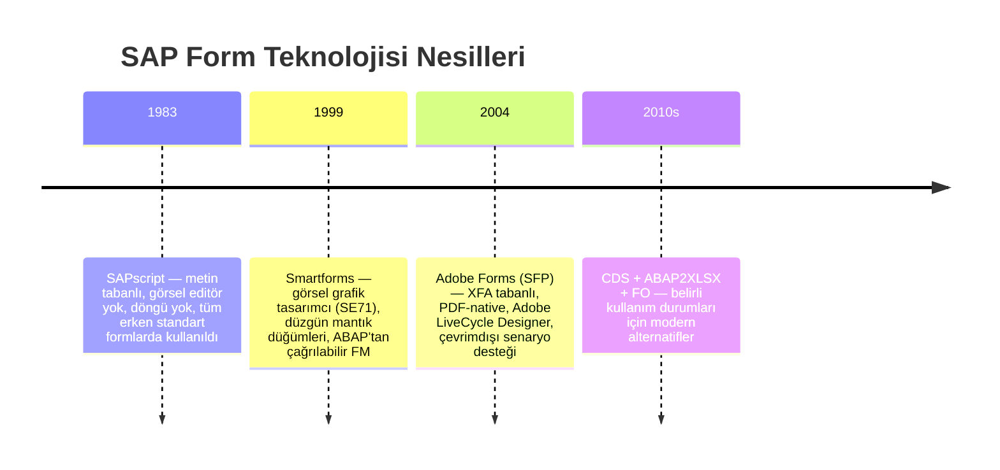
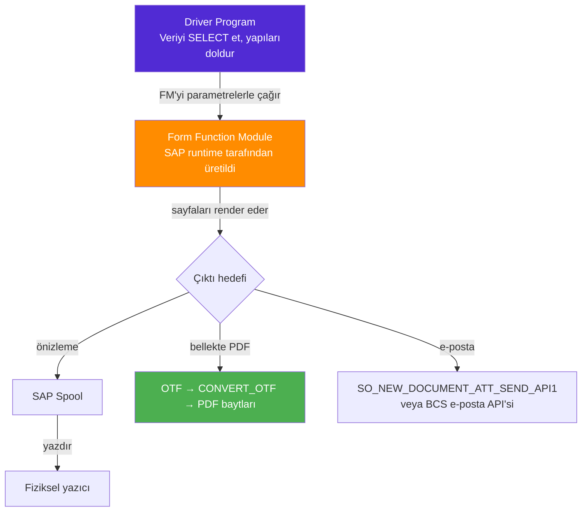
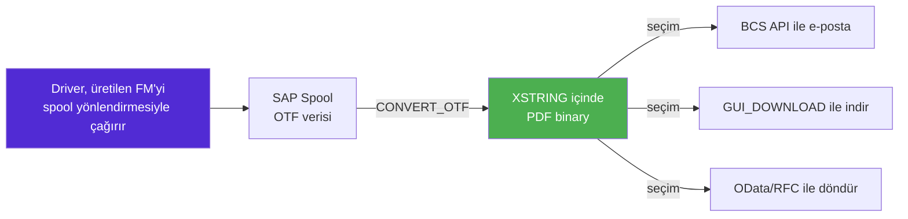
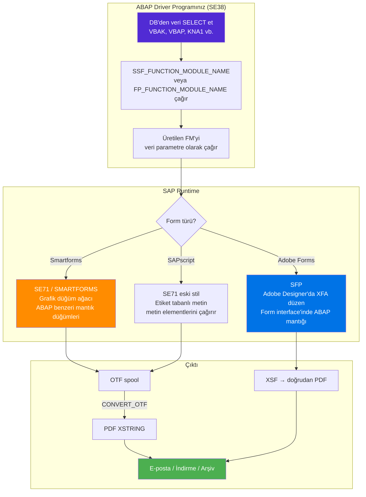

# Kısım 10: Smartforms & Adobe Forms

*SAP beklediğiniz şekilde yazdırmaz — nedenini anladığınızda "bu faturayı düzelt" türündeki biletlerin tüm bir kategorisi anlaşılır hale gelir.*

---

## ☕ SAP baskısı neden bu kadar farklı hissettiriyor?

.NET veya Python uygulamasında PDF oluşturmak, bir kütüphane çağırmak demektir — `PdfSharp`, `ReportLab`, `WeasyPrint`, her neyse — ve her pikseli siz kontrol edersiniz. SAP'ta yazdırma 1980'lerden beri var ve bir öncekinin sorunlarını çözen üç nesil araçtan geçerek evrimleşmiştir. SAP formlarını bakıma almak ya da birini değiştirmeye güvenilmek için bu üçünü de anlamanız gerekir.

Kısa özeti: SAP, **"veriyi kim getirir"** (driver program) ile **"onu kim düzenler"** (form) ayrımını yapar. Bozuk bir fatura gördüğünüzde ilk işiniz, hangi yarısının bozulduğunu bulmaktır.

---

## 10.1 SAP'ın Neden Bu Şekilde Yazdırdığı

### 1️⃣ Benzetme

SAP'ın yazdırma mimarisi, tam olarak bir **şablonlama motoru + controller** gibidir:

- **Controller** (`driver program`) veriyi seçer, işler, ardından şablonu çağırır.
- **Şablon** (`form`) veriyi parametre olarak alır ve tüm görsel işi yapar — metin, logolar, koşullu bölümler, kalem döngüleri.

Bunu daha önce yaptınız:

```csharp
// C# Razor: controller bir modeli view'a aktarır
public IActionResult PrintInvoice(int orderId)
{
    var model = _invoiceService.GetInvoice(orderId);   // driver mantığı
    return View("InvoiceTemplate", model);             // şablona aktar
}
```

```python
# Python Jinja2: betik veriyi şablona aktarır
from jinja2 import Environment, FileSystemLoader

env = Environment(loader=FileSystemLoader("templates"))
tmpl = env.get_template("invoice.html")
data = get_invoice_data(order_id)          # driver mantığı
pdf_html = tmpl.render(**data)             # şablona aktar
```

SAP tam olarak aynı ayrımı yapar — yalnızca her iki yarı için kendi araçlarıyla.

### 2️⃣ SAP'ın çalıştığı çıktı formatları

| Format | Nedir | Nereye gider |
|---|---|---|
| **OTF** (Output Text Format) | SAP'ın dahili sayfa açıklama dili | Spool → yazıcı / PDF dönüşümü |
| **PDF** | Adobe teknolojisi aracılığıyla standart PDF | E-posta eki, indirme, arşiv |
| **HTML** | Web tabanlı çıktı | Portal / tarayıcı görüntüleme |
| **XSF** | XML tabanlı akış (yalnızca Adobe Forms) | PDF render motoru |

OTF ile doğrudan nadiren ilgilenirsiniz, ancak biri "ABAP'tan PDF nasıl alırım?" diye sorduğunda `CONVERT_OTF` terimini duyacaksınız — bu fonksiyon OTF'yi bellekte PDF'ye dönüştürür.

> 🧭 **İş hayatında:** Kullanıcı "fatura iyi basılıyor ama PDF olarak e-posta gönderemiyoruz" dediğinde, yanıt neredeyse her zaman `CONVERT_OTF` veya `SSF_FUNCTION_MODULE_NAME` + `CONVERT_OTF_2_PDF` çağrısını içerir. Her ikisi de bölüm 10.4'te ele alınmaktadır.

---

## 10.2 Zaman Çizelgesi: SAPscript → Smartforms → Adobe Forms

### Üç nesil



### Hangisiyle ne zaman karşılaşacaksınız

| Teknoloji | T-kodu | Bugün hâlâ yeni? | Ne zaman görürsünüz |
|---|---|---|---|
| **SAPscript** | `SE71` | Neredeyse hiç | Eski standart formlar (eski gecikme mektupları, eski satın alma siparişleri) |
| **Smartforms** | `SMARTFORMS` | Greenfield için nadiren; ECC eski sistemlerde yaygın | Orta yaştaki çoğu özel form (2000–2015) |
| **Adobe Forms (SFP)** | `SFP` | Evet — S/4HANA'da PDF ağırlıklı çıktı için hâlâ standart | Yeni özel formlar, karmaşık düzen, çevrimdışı PDF |
| **ABAP2XLSX / ALV** | — | Evet | Excel çıktısı (baskı değil) |

> ⚠️ **C#/Python tuzağı:** Şablonlama kütüphanelerinizden farklı olarak, düzeni kontrol etmek için HTML/CSS *yazamazsınız*. SAPscript özel bir etiket söz dizimi kullanır. Smartforms görsel editörde "düğüm" ağacı kullanır. Adobe Forms, Adobe'nin XFA formatını kullanır (Adobe LiveCycle Designer'da düzenlenir, SE80/SFP'ye gömülüdür). Her birinin kendi öğrenme eğrisi vardır — ancak **driver program kalıbı** üçünde de aynıdır.

---

## 10.3 Driver Program + Form Kalıbı

Bu, her SAP yazdırma biletini çözülebilir kılan zihinsel modeldir. Bunu ezberleyin.



**Kilit içgörü:** Form aracı (Smartforms veya Adobe Forms), otomatik olarak bir ABAP **function module** üretir. Formu hiçbir zaman doğrudan adıyla çağırmazsınız — üretilen FM adını çalışma zamanından istersiniz, ardından o FM'yi çağırırsınız. Bu dolaylı yol, SAP'ın driver kodunuzu değiştirmeden FM'yi sürümleyip yeniden üretmesine olanak tanır.

### 3️⃣ ABAP driver kalıbı — Smartforms

```abap
*& Smartforms faturası için driver program (ZINVOICE_SF)
REPORT zdrive_smartforms_invoice.

PARAMETERS p_vbeln TYPE vbak-vbeln.   " satış sipariş numarası

START-OF-SELECTION.
  " 1. Veriyi seç (driver mantığı)
  DATA gs_header TYPE zsd_invoice_header.
  DATA gt_items  TYPE TABLE OF zsd_invoice_item.

  SELECT SINGLE * FROM vbak INTO CORRESPONDING FIELDS OF gs_header
    WHERE vbeln = p_vbeln.

  SELECT vbap~posnr vbap~matnr vbap~netwr vbap~menge vbap~meins
    FROM vbap INTO CORRESPONDING FIELDS OF TABLE gt_items
    WHERE vbeln = p_vbeln.

  " 2. Smartform'unuz için üretilen function module adını al
  DATA lv_fm_name TYPE rs38l_fnam.

  CALL FUNCTION 'SSF_FUNCTION_MODULE_NAME'
    EXPORTING
      formname           = 'ZINVOICE_SF'    " Smartforms adınız
    IMPORTING
      fm_name            = lv_fm_name
    EXCEPTIONS
      no_form            = 1
      no_function_module = 2
      OTHERS             = 3.

  IF sy-subrc <> 0.
    MESSAGE 'ZINVOICE_SF Smartforms bulunamadı veya üretilmedi.' TYPE 'E'.
    RETURN.
  ENDIF.

  " 3. Kontrol yapılarını oluştur (çıktı seçenekleri)
  DATA ls_control  TYPE ssfctrlop.
  DATA ls_composer TYPE ssfcompop.

  ls_control-no_dialog = abap_true.       " yazdırma iletişim kutusunu gizle
  ls_control-preview   = abap_false.      " ekran önizlemesi için TRUE yapın

  ls_composer-tdnoprev = abap_false.
  ls_composer-tddest   = 'LP01'.          " spool hedefi / yazıcı

  " 4. Üretilen FM'yi çağır — VERİNİZİ formun interface'ine parametre olarak geçirin
  CALL FUNCTION lv_fm_name
    EXPORTING
      control_parameters = ls_control
      output_parameters  = ls_composer
      p_header           = gs_header      " Smartforms interface'iyle eşleşir
      p_vbeln            = p_vbeln
    TABLES
      t_items            = gt_items
    EXCEPTIONS
      formatting_error   = 1
      internal_error     = 2
      send_error         = 3
      user_canceled      = 4
      OTHERS             = 5.

  IF sy-subrc <> 0.
    MESSAGE 'Fatura yazdırma hatası' TYPE 'E'.
  ENDIF.
```

> 💡 **Interface sözleşmesi:** Üretilen FM'ye geçirdiğiniz parametreler (`p_header`, `t_items` yukarıda), **Smartforms Interface sekmesinde tanımladığınızla tam olarak eşleşmelidir** (`SMARTFORMS` transaction'ında). Adlar veya tipler eşleşmezse, üretilen FM çağrısı başarısız olur. Bu uyumsuzluk, "form dün çalışıyordu, transport sonrası bugün bozuldu" durumlarının #1 nedenidir.

### Adobe Forms (SFP) karşılık driver'ı

Adobe Forms aynı kalıbı izler. Fark şudur: `SSF_FUNCTION_MODULE_NAME` yerine `FP_FUNCTION_MODULE_NAME` kullanırsınız.

```abap
" Adobe Form için FM adını al
DATA lv_fm_name TYPE funcname.

CALL FUNCTION 'FP_FUNCTION_MODULE_NAME'
  EXPORTING
    i_name     = 'ZINVOICE_ADF'     " Adobe Form adı (SFP)
  IMPORTING
    e_funcname = lv_fm_name
  EXCEPTIONS
    not_found  = 1
    OTHERS     = 2.

IF sy-subrc <> 0.
  MESSAGE 'Adobe Form ZINVOICE_ADF bulunamadı.' TYPE 'E'.
  RETURN.
ENDIF.

" PDF form işlemeyi aç
CALL FUNCTION 'FP_JOB_OPEN'
  CHANGING
    ie_outputparams = ls_fp_output
  EXCEPTIONS
    cancel          = 1
    usage_error     = 2
    OTHERS          = 3.

" Üretilen FM'yi çağır (Smartforms ile aynı kalıp)
CALL FUNCTION lv_fm_name
  EXPORTING
    /1bcdwb/docparams = ls_docparams
    p_header          = gs_header
    p_vbeln           = p_vbeln
  TABLES
    t_items           = gt_items
  EXCEPTIONS
    usage_error       = 1
    OTHERS            = 2.

" Job'ı kapat — bu PDF'i sonlandırır
CALL FUNCTION 'FP_JOB_CLOSE'
  IMPORTING
    e_result    = ls_result
  EXCEPTIONS
    usage_error = 1
    OTHERS      = 2.
```

---

## 10.4 ABAP'tan PDF Oluşturma — OTF Yolu

Bazen PDF baytlarını bellekte tutmanız gerekir — e-posta göndermek, arşivlemek veya bir RFC/OData servisi aracılığıyla döndürmek için. Klasik yol: OTF formatında spool'a yazdır, ardından `CONVERT_OTF` ile dönüştür.

### Zihinsel model



### Bellekte PDF baytları alma

```abap
*& Smartforms spool job'ını bellekte PDF baytlarına dönüştürür
FORM get_pdf_from_smartforms
  IMPORTING  iv_vbeln   TYPE vbak-vbeln
  EXPORTING  ev_pdf_xstr TYPE xstring.

  " ── 1. Yakalama ile spool'a yazdır ─────────────────────────────
  DATA: ls_control  TYPE ssfctrlop,
        ls_composer TYPE ssfcompop,
        ls_job_info TYPE ssfcrescl,
        lt_otf      TYPE itcotf,            " OTF tablosu
        lt_pdf_tab  TYPE TABLE OF tline.    " ham PDF satırları

  ls_control-no_dialog    = abap_true.
  ls_control-getotf       = abap_true.      " OTF'yi yakala, spool'a yazma
  ls_composer-tdnoprev    = abap_true.

  " ── 2. FM adını al ve çağır (öncekiyle aynı) ────────────────────
  DATA lv_fm_name TYPE rs38l_fnam.
  CALL FUNCTION 'SSF_FUNCTION_MODULE_NAME'
    EXPORTING formname = 'ZINVOICE_SF'
    IMPORTING fm_name  = lv_fm_name.

  " (lv_fm_name'i verinizle buraya çağırın — bölüm 10.3 ile aynı)
  " ... yer tasarrufu için kısaltıldı ...
  " Çağrıdan sonra OTF verisi ls_job_info-otfdata içindedir

  " ── 3. OTF → PDF dönüştür ───────────────────────────────────────
  DATA: lt_pdf_lines TYPE TABLE OF tline,
        lv_pdf_size  TYPE i.

  CALL FUNCTION 'CONVERT_OTF'
    EXPORTING
      format                = 'PDF'
    IMPORTING
      bin_filesize          = lv_pdf_size
    TABLES
      otf                   = lt_otf        " job_info'dan OTF satırları
      doctab_archive        = lt_pdf_lines  " çıktı: TLINE parçaları halinde PDF
    EXCEPTIONS
      err_max_linewidth     = 1
      err_format            = 2
      err_conv_not_possible = 3
      OTHERS                = 4.

  IF sy-subrc <> 0.
    RETURN.
  ENDIF.

  " ── 4. TLINE tablosunu tek bir XSTRING'e birleştir ───────────────
  DATA lv_pdf_str TYPE string.
  LOOP AT lt_pdf_lines INTO DATA(ls_line).
    CONCATENATE lv_pdf_str ls_line-tdline INTO lv_pdf_str.
  ENDLOOP.
  ev_pdf_xstr = lv_pdf_str.   " üretimde doğru binary birleştirme kullanın
ENDFORM.
```

> ⚠️ **C#/Python tuzağı:** `CONVERT_OTF`, her biri 132 karakter olan parçalar halinde `TABLE OF TLINE` döndürür. Bunları tek bir binary'ye (`XSTRING`) birleştirmeniz gerekir. Temiz yapmak için `SCMS_BINARY_TO_XSTRING` yardımcı fonksiyonunu veya `CONCATENATE` ile bir döngüyü kullanın. Çevrimiçi örneklerin çoğu bu adımı atlar ve PDF'lerinin neden bozuk olduğunu merak eder.

### Adobe Forms ile doğrudan PDF alma

Adobe Forms, PDF'yi `XSTRING` olarak daha temiz döndürebilir:

```abap
" E-posta / bellek çıktı seçeneğiyle FP_JOB_OPEN
DATA ls_fp_output TYPE sfpoutputparams.
ls_fp_output-nodialog  = abap_true.
ls_fp_output-dest      = ' '.      " boş = bellek, yazıcı değil

CALL FUNCTION 'FP_JOB_OPEN'
  CHANGING  ie_outputparams = ls_fp_output.

" ... üretilen FM'yi çağır ...

DATA ls_result TYPE sfpjoboutput.
CALL FUNCTION 'FP_JOB_CLOSE'
  IMPORTING e_result = ls_result.

" ls_result-pdf, XSTRING PDF'yi doğrudan içerir — CONVERT_OTF dansı gerekmez
DATA(lv_pdf) = ls_result-pdf.
```

> 💡 **Adobe Forms'un yeni geliştirmeler için tercih edilmesinin nedeni budur:** `FP_JOB_CLOSE`'dan OTF dansı olmadan temiz bir `XSTRING` PDF alırsınız. E-posta/indirme senaryolarında kullanılacak yığın budur.

---

## Hepsini Bir Araya Getirmek — Tam Zihinsel Harita



### Hızlı referans: hangi FM ne yapar

| Function module | Amaç |
|---|---|
| `SSF_FUNCTION_MODULE_NAME` | Smartforms için üretilen FM adını al |
| `FP_FUNCTION_MODULE_NAME` | Adobe Form için üretilen FM adını al |
| `FP_JOB_OPEN` | Adobe Forms yazdırma job'ını başlat |
| `FP_JOB_CLOSE` | Adobe job'ı kapat, PDF baytlarını topla |
| `CONVERT_OTF` | OTF spool verisini PDF'ye (veya başka formata) dönüştür |
| `SO_NEW_DOCUMENT_ATT_SEND_API1` | Eki olan eski e-posta (XSTRING) |
| `GUI_DOWNLOAD` | Baytları kullanıcının yerel bilgisayarına kaydet |

> 🧭 **İş hayatında:** En yaygın bilet kalıbı şudur: "Bu faturayı teslimat tarihini de gösterecek şekilde genişlet." İş akışınız: (1) Formu `SMARTFORMS` veya `SFP`'de açın, kalem döngüsü düğümünü bulun, yeni alanı oraya ekleyin. (2) İhtiyacınız olan alanın (`FLPDAT` veya her ne ise) interface yapısında zaten olup olmadığını kontrol edin — yoksa Interface sekmesine ekleyin. (3) Driver'ı bu alanı da seçip geçirecek şekilde güncelleyin. (4) Yeniden üretin ve test edin. Form ve driver senkronize kalmalıdır — tek zor nokta budur.

---

## Minimal Smartforms İzleme Kılavuzu (SE80'de Ne Yaparsınız)

İlk haftanızda sıfırdan Smartforms oluşturmayacaksınız, ancak bir tanesinde *gezineceksiniz*. `SMARTFORMS` transaction'ında göreceğiniz ağaç yapısı budur:

```
ZINVOICE_SF (Smartform)
├── Interface
│   ├── Import Parameters
│   │   ├── P_VBELN   TYPE VBAK-VBELN
│   │   └── P_HEADER  TYPE ZSD_INVOICE_HEADER
│   └── Tables
│       └── T_ITEMS   TYPE TABLE OF ZSD_INVOICE_ITEM
├── Global Settings
│   ├── Form Interface (yukarıdakinin diğer adı)
│   └── Global Definitions (dahili çalışma alanları)
└── Pages and Windows
    ├── FIRST (sayfa)
    │   ├── HEADER_WINDOW
    │   │   └── Metin düğümü: şirket adı, logo grafiği
    │   ├── ADDRESS_WINDOW
    │   │   └── Metin düğümü: &P_HEADER-NAME1&, &P_HEADER-CITY&
    │   └── MAIN_WINDOW
    │       ├── Metin düğümü: başlık (sütun başlıkları)
    │       ├── LOOP düğümü: LOOP AT T_ITEMS INTO WA_ITEM
    │       │   └── Metin düğümü: &WA_ITEM-POSNR&  &WA_ITEM-MATNR&  &WA_ITEM-NETWR&
    │       └── Metin düğümü: toplamlar
    └── NEXT (sayfa — taşma)
        └── MAIN_WINDOW (döngünün devamı)
```

Metin düğümlerindeki `&alan_adı&` söz dizimi, Smartforms'un değişken değerlerini nasıl yerine koyduğudur — Jinja2'deki `{{variable}}` veya Razor'daki `@Model.AlanAdı` gibi.

> ⚠️ **C#/Python tuzağı:** Smartforms ikamesi, derleme zamanında değil, *render zamanında* spool motoru tarafından yapılır. `&WA_ITEM-NETWRR&` içindeki bir yazım hatası söz dizimi hatasına neden olmaz — yalnızca boş yazdırır. Alan adlarınızın Interface sekmesinde tanımladığınız yapılarla eşleştiğini her zaman kontrol edin.

---

## 🧠 Özet

| Kavram | SAP terimi | Benzetme |
|---|---|---|
| Veriyi getirip formu çağıran kod | Driver program | MVC Controller / Jinja2 render betiği |
| Görsel düzen tanımı | Smartform (SE71) / Adobe Form (SFP) | Razor View / Jinja2 şablonu |
| Runtime tarafından üretilen sarmalayıcı | Üretilen function module | Derlenmiş şablon sınıfı |
| FM adını alma yöntemi | `SSF_FUNCTION_MODULE_NAME` / `FP_FUNCTION_MODULE_NAME` | Şablon motoru `get_template()` |
| SAP'ın dahili sayfa açıklama formatı | OTF | Postscript / ara format |
| OTF → PDF dönüşümü | `CONVERT_OTF` | `WeasyPrint.write_pdf()` |
| Adobe Forms native PDF çıktısı | `FP_JOB_CLOSE` → `e_result-pdf` | `ReportLab.output()` |
| Form metninde alan ikamesi | `&ALAN_ADI&` | `{{variable}}` / `@Model.Alan` |

Driver-form ayrımı, tüm SAP yazdırma işini kilit açan içgörüdür. Hangi yarıya bakacağınızı bildikten sonra — veri seçimi (driver) veya düzen/alan adları (form) — bozuk bir faturayı hata ayıklamak ürkütücü olmaktan çıkar, mekanik bir hale gelir.

---

*[← İçindekiler](../content.md) | [← Önceki: Module Pool (Dialog) Programlama](09-module-pool-programming.md) | [Sonraki: ABAP Objects: OOP →](11-abap-oop.md)*
