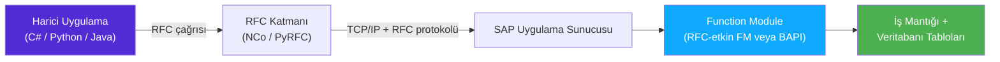

# Kısım 12: Function Module, RFC & BAPI

*SAP'ın özgün "API katmanı" — sınıflardan daha eski, hâlâ her yerde ve C#/.NET veya Python uygulamanızla SAP arka ucu arasındaki geçit.*

---

## ☕ Sahneyi hazırlamak

ABAP'ın sınıfları olmadan önce **function module**'ları vardı — **function group** adı verilen kaplarda yaşayan, adlandırılmış, çağrılabilir mantık birimleri. Bir function group'u, bazı özel durumu paylaşan public static metodlarla dolu static bir C# sınıfı olarak düşünebilirsiniz.

Function module'ları gerçek dünyadaki SAP sistemlerinde hâlâ her yerdedir. Bunları okuyacak, hata ayıklayacak, çağıracak ve zaman zaman yazacaksınız. Daha da önemlisi, **BAPI**'ler — SAP'ın resmi iş API'leri — stable bir interface'e sahip function module'lardır. Ve **RFC** (Remote Function Call), C# veya Python kodunun bu function module'ları ağ üzerinden çağırmasını sağlayan mekanizmadır.

Zincir şöyle görünür:



Tam resmi katman katman oluşturalım.

---

## 12.1 Function Module'lar ve Function Group'lar

### 1️⃣ Benzetme

Bir **function group** bir kaptır — static bir sınıf veya Python modülü gibi. Bir **function module**, o kap içindeki adlandırılmış bir fonksiyondur. Aynı gruptaki tüm function module'lar özel bir veri alanını paylaşır (grubun "global verisi" denir) — yani FM_A bir değişken ayarlarsa, aynı gruptaki FM_B onu okuyabilir. Durum bilgisi olan FM'ler çağrılar arasında verilerini bu sayede korur.

Function module'ları **SE37** (işlem kodu) içinde oluşturur ve görüntülersiniz. Komut çubuğuna `SE37` yazın, `BAPI_ACC_DOCUMENT_POST` gibi bir FM adı girin ve tam interface'i göreceksiniz.

### 2️⃣ Bunu zaten biliyorsun

```csharp
// C# zihinsel model: özel durumu paylaşan metodlarla dolu static bir sınıf
public static class OrderFunctions          // ← bu "function group"
{
    private static string _currentUser;     // ← grubun paylaşılan "global verisi"

    public static void SetUser(string user) { _currentUser = user; }

    public static Order GetOrder(string orderId) { /* ... */ }
    public static void SaveOrder(Order order)    { /* ... */ }
}
```

```python
# Python zihinsel modeli: modül düzeyi durumlu bir modül
# dosya: order_functions.py     ← bu "function group"
_current_user = None           # ← paylaşılan durum

def set_user(user: str):   global _current_user; _current_user = user
def get_order(order_id: str): ...
def save_order(order: dict):  ...
```

### 3️⃣ ABAP'taki karşılığı

```abap
" Function group tanımını elle yazmıyorsunuz — SE37/ADT'de oluşturuyorsunuz
" ve SAP kalıpları oluşturuyor. Ama kavramsal olarak şöyle görünür:

FUNCTION-POOL zgp_order_utils.   " Function group bildirimi (özel bir include içinde)

" Paylaşılan veri — bu gruptaki tüm FM'ler tarafından erişilebilir
DATA gv_current_user TYPE uname.

" ---- FUNCTION ZFM_SET_USER -------------------------------------------------
FUNCTION zfm_set_user.
*"----------------------------------------------------------------------
*"*"Local Interface:
*"  IMPORTING
*"     VALUE(IV_USER) TYPE UNAME
*"----------------------------------------------------------------------
  gv_current_user = iv_user.
ENDFUNCTION.

" ---- FUNCTION ZFM_GET_ORDER ------------------------------------------------
FUNCTION zfm_get_order.
*"----------------------------------------------------------------------
*"*"Local Interface:
*"  IMPORTING
*"     VALUE(IV_ORDER_ID) TYPE VBELN
*"  EXPORTING
*"     VALUE(ES_ORDER)    TYPE VBAK
*"  EXCEPTIONS
*"     NOT_FOUND = 1
*"     OTHERS    = 2
*"----------------------------------------------------------------------
  SELECT SINGLE * FROM vbak INTO es_order
    WHERE vbeln = iv_order_id.
  IF sy-subrc <> 0.
    RAISE not_found.
  ENDIF.
ENDFUNCTION.
```

> ⚠️ **C#/Python tuzağı:** Fonksiyonun ortasındaki `*"----------------------------------------------------------------------` yorum bloğu, SAP GUI'nin otomatik oluşturduğu parametre belgesidir. Bunu silmeyin. ADT bunu daha temiz gösterir ama klasik SE37'de göreceksiniz.

> 🧭 **İş hayatında:** SE37'de bir function module'ü doğrudan test etmek için `F8`'e basın — giriş parametrelerini doldurun ve çalıştırın. Bu, ABAP kodundan çağırmadan önce bir FM'nin ne yaptığını anlamanın en hızlı yoludur. Bunu sürekli kullanırsınız.

---

## 12.2 IMPORTING / EXPORTING / CHANGING / TABLES Parametreleri ve EXCEPTIONS

### 1️⃣ Benzetme

Function module'larının dört tür parametresi ve bir exception listesi vardır. `IMPORTING` ve `EXPORTING`'i normal değer-ile-geçirme girdi/çıktı olarak düşünün. `CHANGING` referansla geçirmedir (okuma *ve* yazma). `TABLES`, OOP öncesi ABAP'tan gelen internal tablo parametresidir — eski FM'lerde ve tüm BAPI'lerde görürsünüz.

### 2️⃣ Bunu zaten biliyorsun

```csharp
// C# ref/out benzetmesi
public void ProcessOrder(
    string orderId,             // IMPORTING (giriş)
    out Order result,           // EXPORTING (çıkış)
    ref decimal totalAmount,    // CHANGING (giriş+çıkış)
    List<OrderItem> items)      // TABLES (tablo parametresi)
{ ... }
```

```python
# Python — her şey zaten referansla ama kavramsal olarak:
def process_order(
    order_id: str,              # IMPORTING
    items: list[dict]           # TABLES
) -> tuple[dict, Decimal]:      # EXPORTING (tuple olarak döndürülür)
    ...
```

### 3️⃣ ABAP'taki karşılığı

```abap
FUNCTION zfm_process_order.
*"----------------------------------------------------------------------
*"*"Local Interface:
*"  IMPORTING
*"     VALUE(IV_ORDER_ID)    TYPE VBELN        " giriş, değerle geçirilir
*"     VALUE(IV_MODE)        TYPE CHAR1 DEFAULT 'A'   " varsayılanla isteğe bağlı
*"  EXPORTING
*"     VALUE(EV_DOC_NUMBER)  TYPE VBELN        " çıkış, yalnızca yazılır
*"  CHANGING
*"     VALUE(CV_TOTAL_AMOUNT) TYPE WRBTR       " giriş VE çıkış
*"  TABLES
*"     IT_ITEMS              STRUCTURE VBAP    " internal tablo (eski stil)
*"  EXCEPTIONS
*"     ORDER_NOT_FOUND = 1
*"     INVALID_AMOUNT  = 2
*"     OTHERS          = 3
*"----------------------------------------------------------------------

  DATA ls_header TYPE vbak.

  " Sipariş başlığını oku
  SELECT SINGLE * FROM vbak INTO ls_header
    WHERE vbeln = iv_order_id.

  IF sy-subrc <> 0.
    RAISE order_not_found.     " çağıranda sy-subrc = 1 olur
  ENDIF.

  " Changing parametreyi güncelle
  cv_total_amount = cv_total_amount + ls_header-netwr.

  ev_doc_number = ls_header-vbeln.

ENDFUNCTION.
```

**Bir function module çağırma:**

```abap
DATA: lv_doc_number  TYPE vbeln,
      lv_total       TYPE wrbtr VALUE '0.00',
      lt_items       TYPE TABLE OF vbap.

CALL FUNCTION 'ZFM_PROCESS_ORDER'
  EXPORTING
    iv_order_id      = '0000000042'
    iv_mode          = 'A'
  IMPORTING
    ev_doc_number    = lv_doc_number
  CHANGING
    cv_total_amount  = lv_total
  TABLES
    it_items         = lt_items
  EXCEPTIONS
    order_not_found  = 1
    invalid_amount   = 2
    OTHERS           = 3.

IF sy-subrc <> 0.
  WRITE: / |FM çağrısı başarısız, sy-subrc = { sy-subrc }|.
ELSE.
  WRITE: / |Belge: { lv_doc_number }, Toplam: { lv_total }|.
ENDIF.
```

> 💡 **sy-subrc:** Hemen hemen her ABAP işleminden sonra — `SELECT`, `CALL FUNCTION`, `READ TABLE`, `OPEN DATASET` — `sy-subrc`'yi kontrol edin. Sıfır başarı anlamına gelir. Sıfır dışı bir şeylerin yanlış gittiği anlamına gelir. ABAP'ın evrensel durum kodudur. `Environment.ExitCode` ile bir veritabanı dönüş kodunun birleşimi olarak düşünebilirsiniz.

---

## 12.3 RFC — Remote Function Call

### 1️⃣ Benzetme

RFC, SAP'ın kendi RPC protokolüdür — 1990'lardan kalma ve tescilli ama gRPC gibi. RFC etkin bir function module, SE37'de bir onay kutusu işaretlenmiş ("Remote-enabled module") bir function module'dür. Bu onay kutusu, onu harici programlardan çağrılabilir yapar — diğer SAP sistemleri, C# uygulamaları, Python scriptleri, Java.

### 2️⃣ ABAP'ta RFC etkin FM (onu "RFC" yapan şey)

SE37'de function module'ü açın → *Attributes* sekmesi. "Processing Type" açılır menüsü şunları seçmenize olanak tanır:

| Tür | Anlamı |
|------|---------|
| Normal Function Module | Uzaktan çağrılamaz |
| Remote-Enabled Module | Her yerden RFC aracılığıyla çağrılabilir |
| Update Module | LUW'da (veritabanı işlemi) asenkron olarak çağrılır |
| Immediate Start, No Restart | Arka plan RFC varyantı |

RFC etkin bir FM yazarken tüm parametreler **değerle geçirilmeli** (referansla değil), çünkü verinin ağ üzerinden serileştirilmesi gerekir. `TABLES` parametreleri hâlâ çalışır. RFC için `CHANGING` çalışmaz.

```abap
FUNCTION zfm_get_material_rfc.
*"----------------------------------------------------------------------
*"*"Remote-Enabled Module — tüm parametreler DEĞERLE GEÇİRİLİR
*"  IMPORTING
*"     VALUE(IV_MATNR)    TYPE MATNR
*"  EXPORTING
*"     VALUE(ES_MATERIAL) TYPE MARA
*"  EXCEPTIONS
*"     MATERIAL_NOT_FOUND = 1
*"----------------------------------------------------------------------

  SELECT SINGLE * FROM mara INTO es_material
    WHERE matnr = iv_matnr.

  IF sy-subrc <> 0.
    RAISE material_not_found.
  ENDIF.

ENDFUNCTION.
```

> ⚠️ **C#/Python tuzağı:** RFC parametre adları 30 karakter uzunluk sınırına sahiptir. Tüm tipler düz olmalıdır (eski RFC'de yapılar içinde iç içe yapılar/tablolar olmaz — daha yeni `deep` RFC bunu gevşetir). Interface'iniz bir tablo döndürüyorsa, `EXPORTING` içinde internal tablo değil `TABLES` parametresi kullanın.

---

## 12.4 BAPI'ler — SAP'ın Resmi İş API'leri

### 1️⃣ Benzetme

Bir **BAPI** (Business Application Programming Interface), SAP'ın iş mantığına *stable, desteklenen, nesne yönelimli* bir API olarak belirlediği bir function module'dür. SAP, her büyük iş süreci için yüzlerce BAPI sağlar — sipariş oluşturma, belge deftere işleme, müşteri ana verisi okuma.

BAPI'ler:
- **RFC etkin** — C#, Python, diğer SAP sistemlerinden çağrılabilir.
- **Tasarım açısından nesne yönelimli** — her BAPI bir İş Nesnesine karşılık gelir (**SWO1**'de görülebilir), örneğin `BUS2032` bir Satış Siparişidir.
- **Stabil** — SAP, sürümler arasında interface'i bozmaz (doğrudan dokunmamanız gereken dahili function module'lar veya veritabanı tabloları aksine).
- **İşlemsel** — genellikle verileri kendileri commit etmez. Bir yazma BAPI'sinin ardından `BAPI_TRANSACTION_COMMIT` çağırmanız gerekir. Bu kasıtlıdır — birden fazla BAPI'yi sırayla (başlık deftere işle, kalemler deftere işle, takip belgesi tetikle) çağırıp hepsini tek seferde commit etmenizi sağlar.

### 2️⃣ Neden doğrudan veritabanına yazmıyoruz?

```csharp
// Cazip ama SAP'ta YANLIŞ
dbContext.SalesOrders.Add(new SalesOrder { ... });
dbContext.SaveChanges();
```

```abap
" Cazip ama SAP'ta YANLIŞ
INSERT INTO vbak VALUES ls_header.   " Bunu asla yapmayın!
```

SAP'ın tabloları karmaşık karşılıklı bağımlılıklara sahiptir. Bir satış siparişi `VBAK`, `VBAP`, `VBEP`, `VBUK`, `VBUP`, `LIPS`, muhtemelen `LIKP`'ye dokunur ve FI'da takip belgelerini tetikler. Bir tabloya doğrudan yazmak sessizce veriyi bozar. **İş işlemleri için her zaman BAPI'leri veya SAP'ın kendi function module'larını kullanın.**

### 3️⃣ Doğru BAPI'yi bulmak

- SE37'de `BAPI_*` arayın — yüzlerce sonuç gelir.
- **SWO1**'de İş Nesnelerine iş süreci alanına göre göz atın.
- `BAPI satış siparişi oluştur SAP` Google araması yapın — topluluk yaygın olanları kapsamlı biçimde belgelemiştir.
- **SE37**'de bir BAPI'yi kod yazmadan önce interaktif olarak test edin — parametreleri doldurun, F8'e basın, RETURN tablosunu kontrol edin.

Sık karşılaşacağınız BAPI'ler:

| BAPI | Ne yapar |
|------|-------------|
| `BAPI_ACC_DOCUMENT_POST` | Finansal (FI) belge deftere işler |
| `BAPI_SALESORDER_CREATEFROMDAT2` | Satış siparişi oluşturur |
| `BAPI_PO_CREATE1` | Satın alma siparişi oluşturur |
| `BAPI_GOODSMVT_CREATE` | Mal hareketi (mal girişi, çıkışı) |
| `BAPI_CUSTOMER_CREATEFROMDATA1` | Müşteri ana verisi oluşturur |
| `BAPI_TRANSACTION_COMMIT` | Mevcut LUW'ı commit eder (yazma BAPI'lerinden sonra her zaman çağırın!) |
| `BAPI_TRANSACTION_ROLLBACK` | Mevcut LUW'ı geri alır |

> 🧭 **İş hayatında:** "Bir Google Formu gönderildiğinde sistem otomatik olarak PO oluşturabilir mi?" Cevap: Python Cloud Function'dan RFC aracılığıyla `BAPI_PO_CREATE1` çağırın. Bu kalıbı öğrendikten sonra hemen hemen her SAP entegrasyonunu kurabilirsiniz.

---

## 12.5 SAP'ı C# ve Python'dan Çağırmak

### SAP Connector for .NET (NCo)

SAP, C#'tan RFC/BAPI çağırmak için bir .NET kütüphanesi dağıtır — **SAP Connector for .NET** (NCo). SAP Support Portal'dan indirin (ücretsiz, S-kullanıcısı gerektirir). NuGet paketini ekleyin veya DLL'e başvurun.

```csharp
// C# — SAP NCo aracılığıyla BAPI_SALESORDER_CREATEFROMDAT2 çağırma
using SAP.Middleware.Connector;

// 1. RFC hedefini yapılandırın (genellikle app.config / kod içinde)
RfcConfigParameters config = new RfcConfigParameters();
config[RfcConfigParameters.Name]     = "SAP_PROD";
config[RfcConfigParameters.AppServerHost] = "192.168.1.10";
config[RfcConfigParameters.SystemNumber]  = "00";
config[RfcConfigParameters.Client]        = "100";
config[RfcConfigParameters.User]          = "DEVELOPER";
config[RfcConfigParameters.Password]      = "secret";
config[RfcConfigParameters.Language]      = "EN";

RfcDestination destination = RfcDestinationManager.GetDestination(config);

// 2. Fonksiyona bir tanıtıcı alın
IRfcFunction bapi = destination.Repository.CreateFunction("BAPI_SALESORDER_CREATEFROMDAT2");

// 3. Başlık yapısını doldurun
IRfcStructure header = bapi.GetStructure("ORDER_HEADER_IN");
header["DOC_TYPE"]    = "TA";
header["SALES_ORG"]   = "1000";
header["DISTR_CHAN"]   = "10";
header["DIVISION"]     = "00";
header["PURCH_NO_C"]   = "PO-2024-001";

// 4. İş ortağı (müşteri) doldurun
IRfcTable partners = bapi.GetTable("ORDER_PARTNERS");
partners.Append();
partners["PARTN_ROLE"] = "AG";   // AG = Satışı yapılan taraf
partners["PARTN_NUMB"] = "0000001000";

// 5. Kalemleri doldurun
IRfcTable items = bapi.GetTable("ORDER_ITEMS_IN");
items.Append();
items["ITM_NUMBER"]   = "000010";
items["MATERIAL"]     = "TG11";
items["PLANT"]        = "1000";
items["TARGET_QTY"]   = 5;

// 6. Çalıştırın
bapi.Invoke(destination);

// 7. Sonuçları okuyun
IRfcTable returnTable = bapi.GetTable("RETURN");
string salesOrder = bapi.GetString("SALESDOCUMENT");

foreach (IRfcStructure row in returnTable)
{
    if (row.GetString("TYPE") == "E" || row.GetString("TYPE") == "A")
        Console.Error.WriteLine($"Hata: {row.GetString("MESSAGE")}");
}

if (!string.IsNullOrEmpty(salesOrder))
{
    // 8. COMMIT — yazma BAPI'lerinden sonra zorunlu
    IRfcFunction commit = destination.Repository.CreateFunction("BAPI_TRANSACTION_COMMIT");
    commit["WAIT"] = "X";
    commit.Invoke(destination);
    Console.WriteLine($"Satış siparişi oluşturuldu: {salesOrder}");
}
```

### PyRFC (Python)

**PyRFC**, aynı SAP RFC SDK'sı etrafındaki Python sarmalayıcısıdır. `pip install pyrfc` ile yükleyin (SAP RFC SDK yerel kütüphaneleri gerektirir).

```python
# Python — aynı BAPI'yi pyrfc ile çağırma
from pyrfc import Connection, ABAPApplicationError

# 1. Bağlanın
conn = Connection(
    ashost='192.168.1.10',
    sysnr='00',
    client='100',
    user='DEVELOPER',
    passwd='secret',
    lang='EN'
)

# 2. BAPI çağırın — tüm parametreler Python dict / list olarak
result = conn.call(
    'BAPI_SALESORDER_CREATEFROMDAT2',
    ORDER_HEADER_IN={
        'DOC_TYPE':  'TA',
        'SALES_ORG': '1000',
        'DISTR_CHAN': '10',
        'DIVISION':  '00',
        'PURCH_NO_C': 'PO-2024-001',
    },
    ORDER_PARTNERS=[
        {'PARTN_ROLE': 'AG', 'PARTN_NUMB': '0000001000'},
    ],
    ORDER_ITEMS_IN=[
        {'ITM_NUMBER': '000010', 'MATERIAL': 'TG11', 'PLANT': '1000', 'TARGET_QTY': '5'},
    ],
)

sales_doc = result.get('SALESDOCUMENT', '').strip()
return_msgs = result.get('RETURN', [])

# 3. Hataları kontrol edin
errors = [r for r in return_msgs if r.get('TYPE') in ('E', 'A')]
if errors:
    for e in errors:
        print(f"SAP Hatası: {e['MESSAGE']}")
else:
    # 4. Commit
    conn.call('BAPI_TRANSACTION_COMMIT', WAIT='X')
    print(f"Satış siparişi oluşturuldu: {sales_doc}")

conn.close()
```

> ⚠️ **C#/Python tuzağı:** Commit'ten önce her zaman `RETURN` tablosunu kontrol edin. BAPI'ler iş hataları için exception fırlatmaz — `TYPE = 'E'` ile `RETURN` tablosuna hata mesajları koyarlar. Commit yapılmayan başarılı bir çağrı tamamen sessizdir — veri hiç yazılmaz. Bunu Kısım 13'te derinlemesine ele alıyoruz.

> 🧭 **İş hayatında:** "Bu Excel dosyasındaki her satır için SAP'ta PO oluşturan bir Python scripti yazar mısın?" — ilk altı ayınız içinde bu isteği alacaksınız. Cevap: pandas Excel'i okur, döngü kurarsınız, her satır için PyRFC aracılığıyla `BAPI_PO_CREATE1` çağırırsınız. Mimarinin tamamı budur.

---

## 🧠 Özet

- **Function module'lar** **function group**'larda (SE37) yaşar. `IMPORTING`, `EXPORTING`, `CHANGING`, `TABLES` parametrelerine ve `sy-subrc` aracılığıyla kontrol edilen sayısal `EXCEPTIONS` listesine sahiptirler.
- **RFC etkin FM'ler** ağ üzerinden çağrılabilir — tüm parametreler değerle geçirilmeli.
- **BAPI'ler**, iş işlemleri için SAP onaylı, stabil, RFC etkin function module'lardır. İş tablolarına asla doğrudan yazmayın — BAPI kullanın.
- **Herhangi bir yazma BAPI'sinden sonra** verileri gerçekten kalıcı kılmak için `BAPI_TRANSACTION_COMMIT` (`WAIT = 'X'` ile) çağırmanız zorunludur.
- **C# / NCo** ve **Python / PyRFC**'nin her ikisi de function module'ları yerel veri yapılarıyla eşler. Kalıp her zaman aynıdır: bağlan → çağır → RETURN'ü kontrol et → commit.

---

*[← İçindekiler](../content.md) | [← Önceki: ABAP Objects: OOP](11-abap-oop.md) | [Sonraki: Uygulamalı: BAPI_ACC_DOCUMENT_POST →](13-handson-bapi-acc-document-post.md)*
