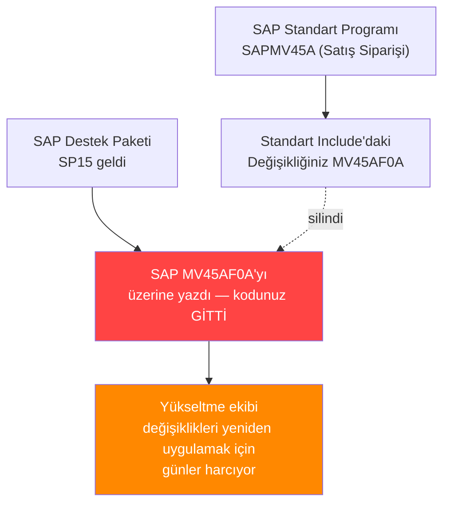
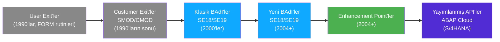
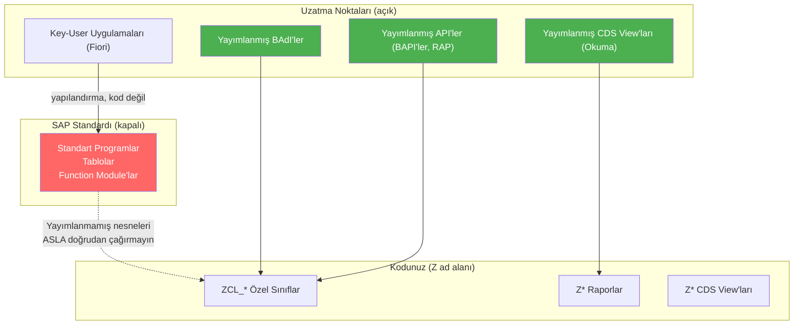

# Kısım 14: Standart SAP'ı Geliştirmek (Doğru Yoldan)

*SAP standart programını asla, hiçbir zaman doğrudan değiştirmeyeceksiniz. Bunun yerine ne yapacağınız — ve kuralların neden var olduğu.*

---

## ☕ Temel kural

Bir SAP şirketinde ilk günü, biri size şunu söyleyecektir: **"Standarda asla dokunma."** Dini gibi gelir. Gayet mantıklı bir açıklaması var.

SAP güncellemeler gönderir (Destek Paketleri, Enhancement Package'ları, büyük sürümler). SAP sistemi yükselttiğinde, standart programları, function module'ları ve include'ları üzerine yazar. Bir standart include'u doğrudan düzenlediyseniz, değişikliğiniz bir sonraki transport sonrasında sessizce siliniyor. Daha da kötüsü: SAP, standart nesnelerin çoğunu siz **erişim anahtarı** almadan değiştirmenize izin vermez — SAP'ın "sizi uyardık" dediği tek seferlik bir kilit açma kodu. Sistem, sizi kendinizden koruyacak şekilde tasarlanmıştır.

Peki davranışı nasıl özelleştirirsiniz? SAP katmanlı bir uzantı noktaları seti sunar — kasıtlı olarak kanca bıraktığı yerler. Bunu, 40 yıl boyunca geliştirilmiş en ayrıntılı middleware/event sistemi olarak düşünebilirsiniz.

---

## 14.1 Standart Kodu Neden Değiştirmemelisiniz?

### Yükseltme problemi



Kodunuzu kaybetmeseniz bile (bazı sistemler değişiklikleri takip eder), her SAP yükseltmesi bir **değişiklik düzenlemesi** gerektirir — değişikliklerinizi yeni standart sürüme yeniden uygulamak için manuel bir diff. Yoğun şekilde değiştirilmiş bir nesne üzerinde tek bir değişiklik günler alabilir.

### Clean core problemi (S/4HANA)

S/4HANA'da SAP daha da ileri gitti. **ABAP Cloud** ve **clean core** politikalarını tanıttılar. Daha önce değiştirilebilir olan standart kod artık **sistem ad alanında** ve değişiklik tamamen engellenmiştir. Tek yasal uzantı noktaları **yayımlanmış API'ler** ve SAP'ın yayımladığı uzatma mekanizmalarıdır. Sisteminizde değişiklikler varsa, S/4HANA geçiş maliyetiniz önemli ölçüde artar.

> 🧭 **İş hayatında:** "Satış siparişi ekranındaki bu alanı hızlıca değiştirebilir misin?" — bu istek bir iş analistinden gelecektir. Doğru cevap şudur: "Bunun için doğru BAdI veya user exit'i bulalım, standart kodu değil."

---

## 14.2 Enhancement Spektrumu

SAP'ın uzatma mekanizmaları 30 yıl boyunca gelişti. Hepsini bilmeniz gerekir çünkü gerçek sistemlerde hepsine rastlarsınız.



### User Exit'ler (Klasik, büyük ölçüde eski)

SAP, standart programların içine `CALL CUSTOMER-FUNCTION '001'` gibi boş `FORM` altyordam çağrıları ekledi. Bu boş rutinleri doldurmak için belirli bir include'a kod eklersiniz. Bunlar program başına sabit kodlanmıştır ve sayıları azdır.

```abap
" Standart koddaki örnek user exit (bunu YAZMAZSANIZ da GÖRÜRSÜNÜZ):
CALL CUSTOMER-FUNCTION '001'
  EXPORTING ...
  IMPORTING ....
```

### Customer Exit'ler — SMOD / CMOD

User exit'lerin organize edilmiş versiyonu. SAP, bir iş süreci için exit'leri bir **enhancement**'ta gruplar (**SMOD**'da görülebilir — SAP Değişiklikleri). Bunları bir **proje**te etkinleştirirsiniz (**CMOD**'da görülebilir — Müşteri Değişiklikleri).

- **SMOD**: Bir fonksiyon alanı için mevcut customer exit'lere göz atın.
- **CMOD**: Bir proje oluşturun, exit'leri ona atayın, oluşturulan include'a kodunuzu yazın.

Bu, birçok eski sistemin hâlâ özelleştirildiği yoldur. Bu kodu sürekli okuyacaksınız.

### Klasik BAdI'ler (Business Add-In) — SE18/SE19

BAdI, **Business Add-In** anlamına gelir. Bunlar, SAP tarafından tanımlanan nesne yönelimli uzatma noktalarıdır. Her BAdI şunlara sahiptir:
- Bir **tanım** (**SE18**'de görülebilir): uygulamanızın karşılaması gereken interface.
- Bir veya daha fazla **uygulama** (**SE19**'da veya ADT'de oluşturulur): interface'i uygulayan özel sınıfınız.

Klasik BAdI'ler (2004 öncesi) istemci başına yalnızca bir aktif uygulamaya sahip olabilirdi. "Yeni" BAdI'ler (2004 sonrası, Enhancement Spot'larına dayalı) birden fazla uygulamaya sahip olabilir; hangisinin çalışacağına karar vermek için bir filtre mekanizması vardır.

### Enhancement Point'ler (Örtük ve Açık)

SAP, her standart programa **örtük enhancement spot'ları** ekledi — her form, function module ve metodun başında ve sonunda görünmez kancalar. Standart kaynağa dokunmadan kod enjekte edebilirsiniz.

**Açık enhancement point'ler**, SAP'ın yaygın uzatma senaryoları için kasıtlı olarak eklediği adlandırılmış yer tutuculardır.

**Enhancement Framework** aracılığıyla kod eklersiniz — SE80'de standart bir programı düzenleyin, Enhancement → Create Enhancement'a gidin. Onu değiştirmeden standartla "yan yana yaşayan" kod yazıyorsunuz.

### Bildiğiniz desenlerle karşılaştırma

```text
C#/.NET / Python kavramı              SAP karşılığı
──────────────────────────────────    ──────────────────────────────
Event handler'lar / pub-sub          BAdI uygulamaları
Middleware pipeline (ASP.NET)        Enhancement spot'ları (önce/sonra kancalar)
Dependency Injection / IoC           BAdI (SAP çalışma zamanında sınıfınızı enjekte eder)
Strateji deseni                      Birden fazla uygulama + filtreli BAdI
Python monkey-patching (kötü yol)    Doğrudan değiştirme (ASLA yapmayın)
Open/Closed Prensibi                 Enhancement Framework — uzatmaya açık,
                                     değişikliğe kapalı
```

> 💡 **Mimari içgörü:** BAdI'ler, SAP'ın **Open/Closed Prensibi** uygulamasıdır — SOLID'den bildiğiniz aynı tasarım prensibi. Standart kod değişikliğe kapalıdır; BAdI uygulamanız açık uzatma noktasıdır. Bu şekilde düşünürseniz, tüm sistem mükemmel anlam kazanır.

---

## 14.3 Doğru Exit veya BAdI'yi Bulmak

Doğru uzatma noktasını bulmak çoğu zaman en zor kısımdır. İşte denenmiş teknikler:

### Yöntem 1: Standart işlemi hata ayıklayın

1. Geliştirmek istediğiniz işlemi açın (örn. `VA01` — Satış Siparişi Oluştur).
2. SE38/ADT'de ana programda (`SAPMV45A`) bir kesme noktası belirleyin.
3. İşlemi çalıştırın. Kesme noktasına ulaştığında **hata ayıklayıcıyı** kullanarak adım adım ilerleyin.
4. `CALL CUSTOMER-FUNCTION` çağrılarına, BAdI metodlarına (`GET BADI` / `CALL BADI` aracılığıyla) veya enhancement spot'larına dikkat edin.

### Yöntem 2: İş Nesnesi üzerinde Nerede Kullanıldı

1. **SWO1**'de iş nesnesini bulun (örn. `BUS2032` = Satış Siparişi).
2. BAdI'lerine göz atın — orada belgelenmiştir.

### Yöntem 3: SAP Belgeleri / Notları

[SAP Help Portal](https://help.sap.com) veya SAP Notlarında işlem + "user exit" veya "BAdI" arayın. Popüler işlemlerin (VA01, ME21N, FB60) SAP belgeleri mevcut tüm uzatma noktalarını listeler.

### Yöntem 4: SMOD/SE18 Arama

**SMOD**'da bir bileşen için exit'leri bulmak üzere aramayı kullanın (örn. `SD` modülü). **SE18**'de paket veya alana göre BAdI arayın.

### Yöntem 5: SE38'de Enhancement Spot

Standart programı SE38'de açın → Utilities → Find Enhancement Spots. Bu, o programda mevcut her enhancement spot'u listeler.

> 🧭 **İş hayatında:** Hata ayıklayıcı yöntemi (Yöntem 1), kod akışında tam olarak nerede bir kanca olduğunu bulmak için en güvenilir yöntemdir. İşlem boyunca adım adım ilerleyin; `GET BADI lo_badi FILTERS ...` ardından `CALL BADI lo_badi->some_method` gördüğünüzde, uzatma noktanızı bulmuşsunuzdur.

---

## 14.4 BAdI Adım Adım Uygulamak (SE19)

Somut bir örnek uygulayalım: `BADI_SALESORDER_CHANGE` BAdI'sini kullanarak satış siparişi oluşturmaya özel bir doğrulama eklemek (standart sistemlerde mevcuttur).

### Adım 1: BAdI tanımını anlamak için SE18'i açın

1. Komut alanına `SE18` yazın.
2. `BADI_SALESORDER_CHANGE` girin, Display'e basın.
3. Interface'i görürsünüz: `IF_EX_BADI_SALESORDER_CHANGE` — `PROCESS_ITEM`, `PROCESS_HEADER` gibi metodlarla.
4. Metot imzasına bakın — hangi parametrelerin mevcut olduğunu not edin (SAP'ın size hangi verileri ileteceği).

### Adım 2: SE19'da uygulamayı oluşturun

1. Komut alanına `SE19` yazın.
2. "Create Implementation" seçin — BAdI adını girin: `BADI_SALESORDER_CHANGE`.
3. Uygulamanıza bir ad verin: `ZBADI_SO_CUSTOM_VALIDATION`.
4. SAP, BAdI interface'ini uygulayan `ZCL_IM_SO_CUSTOM_VALIDATION` sınıfını oluşturur.
5. Açmak için sınıfa çift tıklayın — her interface metodu için stub metodları göreceksiniz.

### Adım 3: Uygulamanızı yazın

```abap
"------------------------------------------------------------------
" ZCL_IM_SO_CUSTOM_VALIDATION
" BADI_SALESORDER_CHANGE için BAdI uygulaması
" (SE19 bu sınıfı oluşturur; siz metodları doldurursunuz)
"------------------------------------------------------------------
CLASS zcl_im_so_custom_validation DEFINITION
  PUBLIC FINAL
  CREATE PUBLIC.

  PUBLIC SECTION.
    INTERFACES if_ex_badi_salesorder_change.  " SAP tarafından oluşturulan interface

ENDCLASS.

CLASS zcl_im_so_custom_validation IMPLEMENTATION.

  " Satış siparişi başlığı işlemi sırasında SAP tarafından çağrılır
  METHOD if_ex_badi_salesorder_change~process_header.
    " im_header satış siparişi başlık yapısıdır (SAP tarafından iletilir)
    " cx_messages hata mesajları içindir (hata göstermek için buraya yazın)

    " Özel kural: satın alma siparişi referansı olmayan satış siparişlerini engelle
    IF im_header-purch_no_c IS INITIAL.
      " Hata mesajı ekle — SAP bunu görüntüler ve kaydetmeyi engeller
      DATA(ls_msg) = VALUE bapiret2(
        type    = 'E'
        id      = 'Z_CUSTOM_MSGS'   " özel mesaj sınıfınız
        number  = '001'
        message = 'Bu sipariş türü için satın alma siparişi numarası zorunludur'
      ).
      APPEND ls_msg TO ch_messages.
    ENDIF.

  ENDMETHOD.

  " Her satır kalemi için çağrılır
  METHOD if_ex_badi_salesorder_change~process_item.
    " Özel kural: üretim sisteminde TEST ile başlayan malzemeleri engelle
    IF sy-mandt = '100' AND im_item-material(4) = 'TEST'.
      DATA(ls_msg) = VALUE bapiret2(
        type    = 'E'
        id      = 'Z_CUSTOM_MSGS'
        number  = '002'
        message = 'TEST malzemeleri üretim sisteminde kullanılamaz'
      ).
      APPEND ls_msg TO ch_messages.
    ENDIF.
  ENDMETHOD.

ENDCLASS.
```

### Adım 4: Etkinleştirin ve test edin

1. SE19'da uygulamayı etkinleştirin (yeşil onay işareti simgesi).
2. `VA01`'i açın (Satış Siparişi Oluştur).
3. PO numarası olmadan kaydetmeyi deneyin — hata mesajınız görünmeli.

> ⚠️ **C#/Python tuzağı:** BAdI uygulaması bir *sınıftır*, ama SAP onu sizin için örneklendirir — asla `NEW zcl_im_...` yazmazsınız. SAP'ın çalışma zamanı, aktif uygulamaları bulmak için `GET BADI` ve onları çağırmak için `CALL BADI` kullanır. Sınıfınızın, bazıları boş stub olsa bile, interface'in tüm metodlarını uygulaması gerekir.

### ADT'de (modern yol)

ABAP Development Tools'ta (Eclipse) paketinize sağ tıklayın → New → Other ABAP Repository Object → Business Add-In Implementation. Sihirbaz sizi SE19 ile aynı adımlardan geçirir ama daha güzel bir kullanıcı arayüzüyle. Elde edilen nesne aynıdır.

---

## 14.5 S/4HANA'da Clean Core: Yayımlanmış API'ler ve Genişletilebilirlik

### "Clean Core" ne demek?

S/4HANA, **SAP standardı** ve **müşteri kodu** arasında resmi bir ayrım getirdi. Amaç: müşteri kodunun yalnızca SAP'ın stabil kalmasını garanti ettiği interface'lere dokunmasını sağlayarak yükseltmeleri neredeyse sıfır çabayla yapmak.



### İki katmanlı genişletilebilirlik

| Katman | Kim | Araç | Ne yapabilirsiniz |
|------|-----|------|----------------|
| **Key-User genişletilebilirliği** | Fonksiyonel danışmanlar, güç kullanıcılar | Fiori uygulamaları (BAdI Builder, Özel Alanlar ve Mantık, Özel CDS) | Kodsuz / düşük kodlu: özel alanlar, basit mantık ekleyin |
| **Geliştirici genişletilebilirliği** | ABAP geliştiriciler | ADT, SE19, Enhancement Framework | Tam kod: BAdI uygulamaları, yayımlanmış API çağrıları, özel CDS view'ları |

### ABAP Test Cockpit (ATC) ve Yayımlanmış API'ler

ABAP Cloud'da (ve giderek artan ölçüde standart S/4HANA'da), **ABAP Test Cockpit** kodunuzu clean-core kurallarına karşı denetler:
- Yayımlanmamış tablolara veya function module'lara erişiyor musunuz?
- Kullanımdan kaldırılmış sözdizimi kullanıyor musunuz?
- Müşteri kullanımı için yayımlanmamış SAP dahili nesnelerini çağırıyor musunuz?

Bir nesne, nesnenin özellikler iletişim kutusunda yayım durumu `Released` ise "yayımlanmıştır" (ADT'de sağ tıklayın → Properties → API Status). Yaygın yayımlanmış nesneler:
- `CL_BCS_*` — Business Communication Services (e-posta gönderme)
- `CL_SALV_*` — ALV Grid OO sınıfları
- BAPI'ler — tanımı gereği tüm BAPI'ler yayımlanmıştır
- `@AccessControl.authorizationCheck: #NOT_REQUIRED` açıklamalı CDS view'ları (değişir)

> 🧭 **İş hayatında:** Bir S/4HANA projesine katıldığınızda şunu sorun: "Clean core'da mıyız?" Evetse, transport öncesinde kodunuzda ATC denetimleri çalıştırın. ATC denetimi "Yayımlanmamış Nesne Kullanımı" şeklinde kırmızı gösteriyorsa, yayımlanmış bir alternatif bulmanız gerekir. Yayımlanmış API alternatiflerini bulma becerisi, modern ABAP geliştiricileri eski düzey olanlardan ayıran şeydir.

### Dürüst olalım: değişim gerçek ve devam ediyor

Klasik geliştirme teknikleri — CMOD, user exit'ler, klasik BAdI'ler — ECC ve eski S/4HANA sistemlerinde hâlâ çalışır. Pek çok canlı sistem bunları kapsamlı biçimde kullanır. Bunları bilmeniz zorunludur.

Ancak S/4HANA'da yeni geliştirme için yön açıktır: yayımlanmış BAdI'ler, yayımlanmış API'ler, RAP iş nesneleri (Kısım 35), mümkün olan her yerde key-user genişletilebilirliği. Bu alışkanlıkları ne kadar erken edinirseniz, o kadar değerli olursunuz.

---

## 🧠 Özet

- **SAP standart kodunu asla doğrudan değiştirmeyin** — yükseltmeler değişikliklerinizi siler ve S/4HANA geçiş maliyeti fırlar.
- Extension spektrumu: User Exit'ler → Customer Exit'ler (SMOD/CMOD) → Klasik BAdI'ler → Yeni BAdI'ler (SE18/SE19) → Enhancement Point'ler. Hepsine rastlarsınız.
- **BAdI'ler SAP'ın DI / Open-Closed mekanizmasıdır** — SAP çalışma zamanında uygulama sınıfınızı enjekte eder. Sınıfı siz yazarsınız; SAP örneklendirir.
- **Doğru exit'i bulun**: işlemi hata ayıklayın, SMOD/SE18 kullanın, SAP belgelerini okuyun veya SE38'de Enhancement Spots listesini kontrol edin.
- **SE18** = BAdI tanımlarını görüntüleyin. **SE19** = uygulamanızı oluşturun.
- **Clean Core / S/4HANA**: yalnızca yayımlanmış API'ler ve uzatma noktaları kullanın. ATC denetimleri bunu zorlar. İki katman: key-user (kodsuz) ve geliştirici (BAdI, RAP, yayımlanmış API'ler).

---

*[← İçindekiler](../content.md) | [← Önceki: Uygulamalı: BAPI_ACC_DOCUMENT_POST](13-handson-bapi-acc-document-post.md) | [Sonraki: Veri Göçü: BDC & LSMW →](15-data-migration-lsmw-bdc.md)*
